# Rx Intestin Subțire (Tranzit Intestinal) — Pa or Incidență Antero-Posterioară (AP) (Merrill)

  📷 Radiografie Convențională (Rx)
  <strong>Actualizat:</strong> 2026-09-16
  <strong>Autor:</strong> Referință Merrill

---

-   __1. Rezumat Clinic & Indicații__

    ---

    === "Indicații Clinice"

        - Conform reperelor anatomice standard din tratat

    === "Ghid Național IRIS"

        !!! info "Referință Primară: Ghidul Național IRIS (Ordinul MS 1342/2012)"
            - **Capitol Ghid IRIS:** *Ghidul Național IRIS*
            - **Grad de Recomandare:** **De verificat pe indicație; fără grad atribuit automat**
            - **Nivel de Iradiere Estimată:** `De verificat pentru examinarea și populația selectate`

            [:octicons-search-16: Deschide Ghidul IRIS](../../iris.md){ .md-button .md-button--primary } [:material-open-in-new: Aplicația Oficială PWA](https://radiologie-pediatrica.ro/iris/){ .md-button target="_blank" rel="noopener" }
-   __2. Poziționare & Centrare Fascicul__

    ---

    - **Poziție Pacient:** se așază pacientul în Decubit ventral sau Decubit dorsal poziție.; se ajustează pacient astfel încât MSP este centrat pe grila. pentru sthenic pacient, se centrează receptorul de imagine la nivelul L2 pentru imagini taken within 30 minutes after contrast medium este administered (Fig. 15.82). pentru delayed imagini, se centrează receptorul de imagine la nivelul crestele iliace. se efectuează ecranarea gonadelor cu șorț plumbat.
    - **Punct de Centrare Fascicul:** perpendicular pe midpoint de receptorul de imagine (L2) pentru early imagini sau la nivelul crestele iliace pentru delayed sequence expuneri.
    - **Distanță Focar-Film (DFF / SID):** Nespecificat în fragmentul extras; de verificat în sursă
    - **Comandă Respiratorie:** Apnee la sfârșitul expirului complet unless otherwise requested.

-   __3. Parametri Tehnici Expunere__

    ---

    | Parametru Tehnic | Valoare Configurare Generator / Tub |
    |:-----------------|:-------------------------------------|
    | **Tensiune Tub (kV)** | DE CONFIGURAT PE APARAT |
    | **Sarcină / Produs Curent-Timp (mAs)** | DE CONFIGURAT PE APARAT |
    | **Distanță Focar-Film (DFF / SID)** | Nespecificat în fragmentul extras; de verificat în sursă |
    | **Grilă Antidifuzoare (Bucky)** | DE CONFIGURAT PE APARAT |
    | **Dimensiune Focar** | DE CONFIGURAT PE APARAT |
    | **Camere de Ionizare AEC** | DE CONFIGURAT PE APARAT |
    | **Colimare Fascicul** | se ajustează câmp de iradiere la fără larger than 14 × 17 inches (35 × 43 cm). Pentru pacienți de talie redusă, se colimează la 2.5 cm de conturul tegumentar de abdomenul flanks. Se plasează markerul de lateralitate în câmpul colimat. |
    | **Filtrare Tub** | DE CONFIGURAT PE APARAT |

-   __4. Criterii de Calitate & Reușită Imagine__

    ---

    - Criterii radiologice de calitate imaginii:
    - Colimare adecvată vizibilă și prezența markerului de lateralitate (D/S) plasat clear de anatomy de interest
    - Entire intestin subțire pe fiecare imagine
    - Stomach pe initial imagini
    - Time marker
    - coloană vertebrală centrat pe imagine
    - Absența rotației anatomice (simetrie bilaterală perfectă) de pacientul
    - Penetration de contrast medium
    - Complete examination when barium reaches cecum

-   __5. Protecție Radiologică (ALARA)__

    ---

    - Nespecificat în fragmentul extras; de verificat în sursă

!!! note "Observații Clinice & Tehnice"
    Conform reperelor anatomice standard din tratat

### 🖼️ Imagini

<figure class="protocol-image-card" markdown>

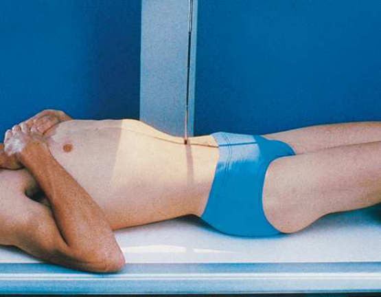

<figcaption><strong>Merrill — pagina PDF 1130, imaginea 1</strong> — Imagine din fragmentul sursă; asocierea necesită revizie.</figcaption>

</figure>

<figure class="protocol-image-card" markdown>

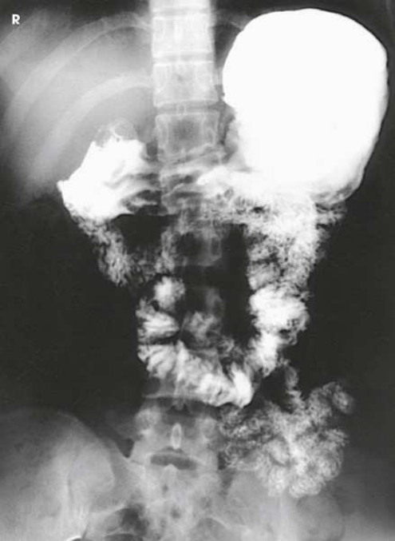

<figcaption><strong>Merrill — pagina PDF 1131, imaginea 2</strong> — Imagine din fragmentul sursă; asocierea necesită revizie.</figcaption>

</figure>

<figure class="protocol-image-card" markdown>

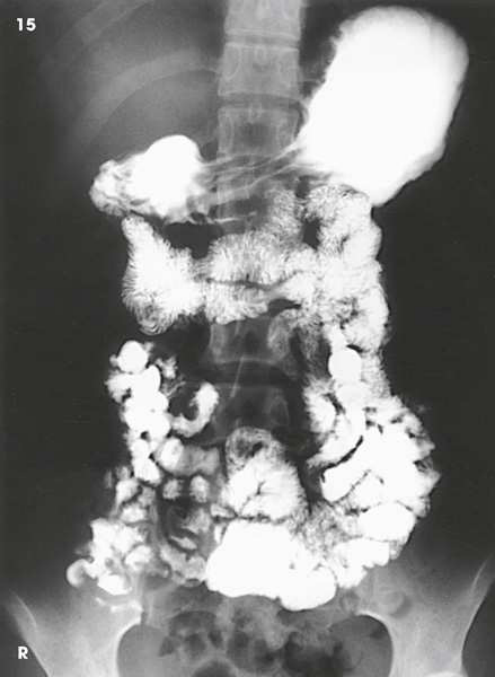

<figcaption><strong>Merrill — pagina PDF 1132, imaginea 3</strong> — Imagine din fragmentul sursă; asocierea necesită revizie.</figcaption>

</figure>

<figure class="protocol-image-card" markdown>

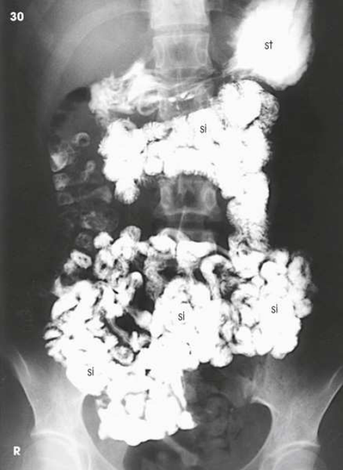

<figcaption><strong>Merrill — pagina PDF 1133, imaginea 4</strong> — Imagine din fragmentul sursă; asocierea necesită revizie.</figcaption>

</figure>

<figure class="protocol-image-card" markdown>

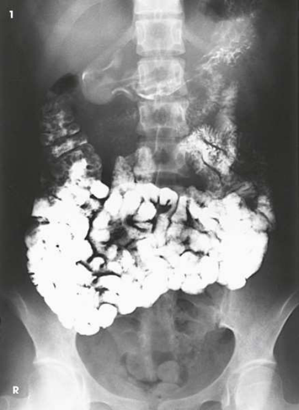

<figcaption><strong>Merrill — pagina PDF 1134, imaginea 5</strong> — Imagine din fragmentul sursă; asocierea necesită revizie.</figcaption>

</figure>

<figure class="protocol-image-card" markdown>

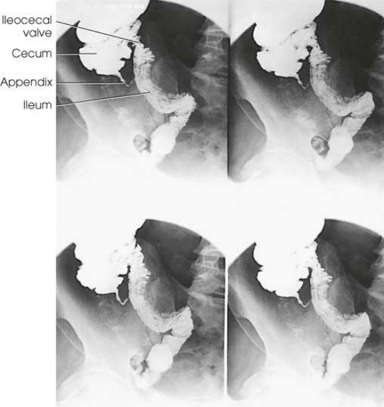

<figcaption><strong>Merrill — pagina PDF 1135, imaginea 6</strong> — Imagine din fragmentul sursă; asocierea necesită revizie.</figcaption>

</figure>

<figure class="protocol-image-card" markdown>

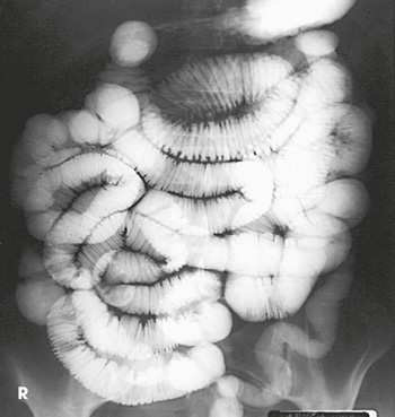

<figcaption><strong>Merrill — pagina PDF 1136, imaginea 7</strong> — Imagine din fragmentul sursă; asocierea necesită revizie.</figcaption>

</figure>

<figure class="protocol-image-card" markdown>

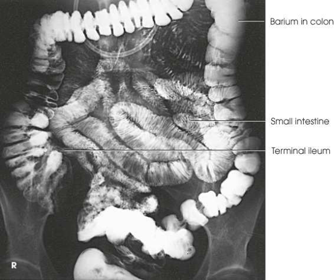

<figcaption><strong>Merrill — pagina PDF 1136, imaginea 8</strong> — Imagine din fragmentul sursă; asocierea necesită revizie.</figcaption>

</figure>

<figure class="protocol-image-card" markdown>

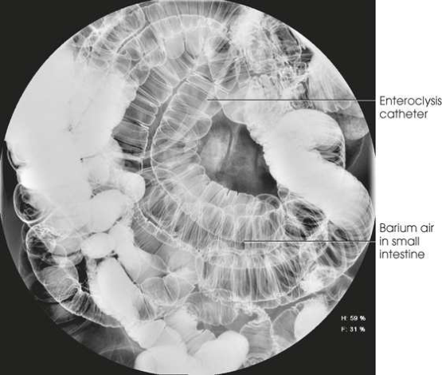

<figcaption><strong>Merrill — pagina PDF 1137, imaginea 9</strong> — Imagine din fragmentul sursă; asocierea necesită revizie.</figcaption>

</figure>

<figure class="protocol-image-card" markdown>

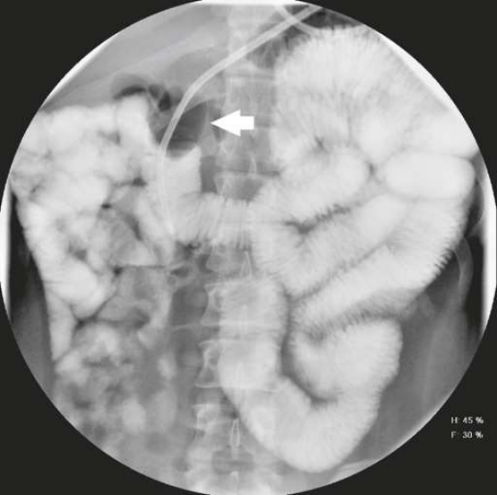

<figcaption><strong>Merrill — pagina PDF 1138, imaginea 10</strong> — Imagine din fragmentul sursă; asocierea necesită revizie.</figcaption>

</figure>

<figure class="protocol-image-card" markdown>

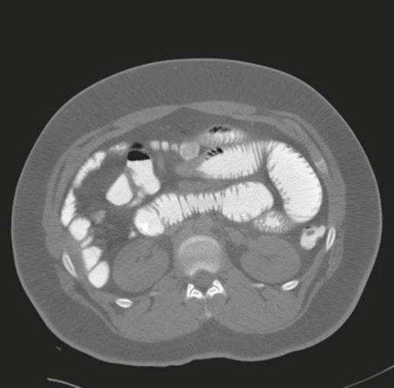

<figcaption><strong>Merrill — pagina PDF 1139, imaginea 11</strong> — Imagine din fragmentul sursă; asocierea necesită revizie.</figcaption>

</figure>

<figure class="protocol-image-card" markdown>

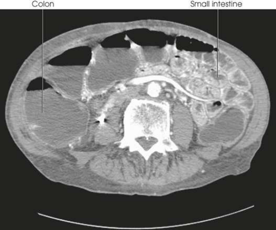

<figcaption><strong>Merrill — pagina PDF 1139, imaginea 12</strong> — Imagine din fragmentul sursă; asocierea necesită revizie.</figcaption>

</figure>

<figure class="protocol-image-card" markdown>

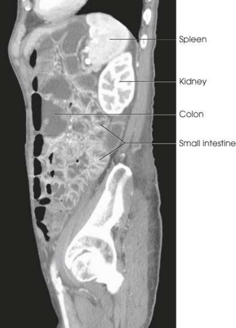

<figcaption><strong>Merrill — pagina PDF 1140, imaginea 13</strong> — Imagine din fragmentul sursă; asocierea necesită revizie.</figcaption>

</figure>

=== "Ghid Rapid de Execuție"

    1. **Identificarea și verificarea pacientului:** verificare identitate, zonă de examinat, consimțământ conform procedurii și evaluarea posibilității unei sarcini, când este relevantă.
    2. **Pregătire:** îndepărtarea oricăror obiecte radiopace (bijuterii, agrafe, fermoare, proteze, pansamente dense).
    3. **Poziționare precisă:** alinierea receptorului de imagine și a tubului la distanța prescrisă (Nespecificat în fragmentul extras; de verificat în sursă).
    4. **Colimare strictă:** adaptarea fasciculului strict la regiunea de diagnostic pentru scăderea iradierii și reducerea radiației difuze.
    5. **Radioprotecție:** verificarea [politicii RX](../radioprotectie.md), cu măsuri distincte pentru pacient, personal și însoțitor.

## Surse de documentare

- [Merrill’s Atlas, 15. Digestive System: Salivary Glands, Alimentary Canal, And Biliary System, pagini PDF 1129–1140](../../assets/protocols/sources/a56d45c16829_Merrills_Atlas_of_Radiographic_Positioning__Procedures_3Vol_Set.pdf#page=1129)

## Fragmente sursă traduse (referință tehnică)

### anatomy

intestin subțire progressively filling until barium reaches ileocecal valve (Figs. 15.83–15.86). When barium has reached ileocecal region,
fluoroscopy poate fie performed, și compression radiographic imagini poate fie obtained (Fig. 15.87). examination este usually completed when
barium este visualized în cecum, typically within about 2 hours pentru pacient cu normal intestinal motility.

### collimation

• se ajustează câmp de iradiere la fără larger than 14 × 17 inches (35 × 43 cm). Pentru pacienți de talie redusă, se colimează la 2.5 cm de conturul tegumentar
de abdomenul flanks. Se plasează markerul de lateralitate în câmpul colimat.

### cr

• perpendicular pe midpoint de receptorul de imagine (L2) pentru early imagini sau la nivelul crestele iliace pentru delayed sequence expuneri.

### criteria

Criterii radiologice de calitate imaginii:
• Colimare adecvată vizibilă și prezența markerului de lateralitate (D/S) plasat clear de anatomy de interest
• Entire intestin subțire pe fiecare imagine
• Stomach pe initial imagini
• Time marker
• coloană vertebrală centrat pe imagine
• Absența rotației anatomice (simetrie bilaterală perfectă) de pacientul
• Penetration de contrast medium
• Complete examination when barium reaches cecum

### part_pos

• se ajustează pacient astfel încât MSP este centrat pe grila.
• pentru sthenic pacient, se centrează receptorul de imagine la nivelul L2 pentru imagini taken within 30 minutes after contrast medium este administered
(Fig. 15.82).
• pentru delayed imagini, se centrează receptorul de imagine la nivelul crestele iliace.
• se efectuează ecranarea gonadelor cu șorț plumbat.

### patient_pos

• se așază pacientul în decubit ventral sau decubit dorsal.

### respiration

Apnee la sfârșitul expirului complet unless otherwise requested.

### tech

poziționat prin manufacturer sau department protocol pentru corect anatomy display orientation; raza centrală plate: 14 × 17 inches (35 ×
43 cm) longitudinal.

