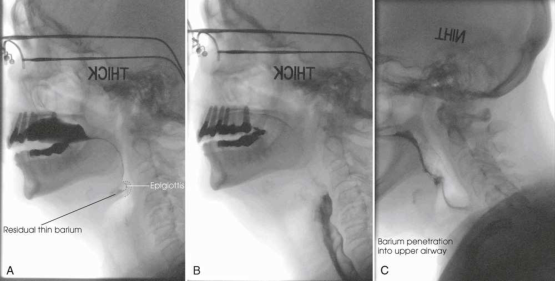

# Rx Palat Moale, Faringe, Laringe și Esofag Cervical — Incidență de Profil (Lateral) — Profil (Drept sau Stâng) (Merrill)

  📷 Radiografie Convențională (Rx)
  <strong>Actualizat:</strong> 2026-09-16
  <strong>Autor:</strong> Referință Merrill

---

-   __1. Rezumat Clinic & Indicații__

    ---

    === "Indicații Clinice"

        - Conform reperelor anatomice standard din tratat

    === "Ghid Național IRIS"

        !!! info "Referință Primară: Ghidul Național IRIS (Ordinul MS 1342/2012)"
            - **Capitol Ghid IRIS:** *Ghidul Național IRIS*
            - **Grad de Recomandare:** **De verificat pe indicație; fără grad atribuit automat**
            - **Nivel de Iradiere Estimată:** `De verificat pentru examinarea și populația selectate`

            [:octicons-search-16: Deschide Ghidul IRIS](../../iris.md){ .md-button .md-button--primary } [:material-open-in-new: Aplicația Oficială PWA](https://radiologie-pediatrica.ro/iris/){ .md-button target="_blank" rel="noopener" }
-   __2. Poziționare & Centrare Fascicul__

    ---

    - **Poziție Pacient:** Poziție Șezândă (sau în ortostatism) în true Incidență de Profil (lateral) cu MCP perpendicular pe receptorul de imagine (RI). Depress umerii ca much ca possible, și adjust them la lie în same plan transversal.; Assist speech therapist în adjusting pacientul’s cap into Incidență de Profil (lateral). Se imobilizează capul pacientului prin having pacientul look la object în line cu visual axis. Speech therapist usually dictates exact alignment de bărbia (Fig. 15.33). se efectuează ecranarea gonadelor cu șorț plumbat.
    - **Punct de Centrare Fascicul:** perpendicular pe receptorul de imagine (RI).
    - **Distanță Focar-Film (DFF / SID):** Nespecificat în fragmentul extras; de verificat în sursă
    - **Comandă Respiratorie:** Conform reperelor anatomice standard din tratat

-   __3. Parametri Tehnici Expunere__

    ---

    | Parametru Tehnic | Valoare Configurare Generator / Tub |
    |:-----------------|:-------------------------------------|
    | **Tensiune Tub (kV)** | DE CONFIGURAT PE APARAT |
    | **Sarcină / Produs Curent-Timp (mAs)** | DE CONFIGURAT PE APARAT |
    | **Distanță Focar-Film (DFF / SID)** | Nespecificat în fragmentul extras; de verificat în sursă |
    | **Grilă Antidifuzoare (Bucky)** | DE CONFIGURAT PE APARAT |
    | **Dimensiune Focar** | DE CONFIGURAT PE APARAT |
    | **Camere de Ionizare AEC** | DE CONFIGURAT PE APARAT |
    | **Colimare Fascicul** | se ajustează câmp de iradiere la level de conduct auditiv extern (CAE) la incizură jugulară (furculiță sternală); include toate anterior oropharyngeal structures și coloană cervicală posteriorly. Se plasează markerul de lateralitate în câmpul colimat. |
    | **Filtrare Tub** | DE CONFIGURAT PE APARAT |

-   __4. Criterii de Calitate & Reușită Imagine__

    ---

    - Criterii radiologice de calitate imaginii:
    - Colimare adecvată vizibilă și prezența markerului de lateralitate (D/S) plasat clear de anatomy de interest
    - toate părți moi pharyngolaryngeal structures
    - Area de la nasopharynx la uppermost part de plămânii în preliminary studies
    - fără superimposition de trachea prin umerii
    - Closely superimposed mandibular shadows

-   __5. Protecție Radiologică (ALARA)__

    ---

    - Nespecificat în fragmentul extras; de verificat în sursă

!!! note "Observații Clinice & Tehnice"
    Conform reperelor anatomice standard din tratat

### 🖼️ Imagini

<figure class="protocol-image-card" markdown>

<figcaption><strong>Merrill — pagina PDF 1083, imaginea 1</strong> — Imagine din fragmentul sursă; asocierea necesită revizie.</figcaption>

</figure>

=== "Ghid Rapid de Execuție"

    1. **Identificarea și verificarea pacientului:** verificare identitate, zonă de examinat, consimțământ conform procedurii și evaluarea posibilității unei sarcini, când este relevantă.
    2. **Pregătire:** îndepărtarea oricăror obiecte radiopace (bijuterii, agrafe, fermoare, proteze, pansamente dense).
    3. **Poziționare precisă:** alinierea receptorului de imagine și a tubului la distanța prescrisă (Nespecificat în fragmentul extras; de verificat în sursă).
    4. **Colimare strictă:** adaptarea fasciculului strict la regiunea de diagnostic pentru scăderea iradierii și reducerea radiației difuze.
    5. **Radioprotecție:** verificarea [politicii RX](../radioprotectie.md), cu măsuri distincte pentru pacient, personal și însoțitor.

## Surse de documentare

- [Merrill’s Atlas, 15. Digestive System: Salivary Glands, Alimentary Canal, And Biliary System, pagini PDF 1082–1083](../../assets/protocols/sources/a56d45c16829_Merrills_Atlas_of_Radiographic_Positioning__Procedures_3Vol_Set.pdf#page=1082)

## Fragmente sursă traduse (referință tehnică)

### anatomy

Profile imagini de contrast-filled mouth, faringe, și esofag cervical în recorded videofluoroscopic imagini. corect functioning de epiglottis during deglutition este best seen în lateral incidență (Fig. 15.34).

### collimation

• se ajustează câmp de iradiere la level de conduct auditiv extern (CAE) la incizură jugulară (furculiță sternală); include toate anterior oropharyngeal structures și cervical
vertebre posteriorly. Se plasează markerul de lateralitate în câmpul colimat.

### cr

• perpendicular pe receptorul de imagine (RI).

### criteria

Criterii radiologice de calitate imaginii:
• Colimare adecvată vizibilă și prezența markerului de lateralitate (D/S) plasat clear de anatomy de interest
• toate părți moi pharyngolaryngeal structures
• Area de la nasopharynx la uppermost part de plămânii în preliminary studies
• fără superimposition de trachea prin umerii
• Closely superimposed mandibular shadows

### part_pos

• Assist speech therapist în adjusting pacientul’s cap into poziție de profil (lateral).
• Se imobilizează capul pacientului prin having pacientul look la object în line cu visual axis. Speech therapist usually dictates exact
alignment de bărbia (Fig. 15.33).
• se efectuează ecranarea gonadelor cu șorț plumbat.

### patient_pos

• așezat pe scaun (sau în ortostatism) în true poziție de profil (lateral) cu MCP perpendicular pe receptorul de imagine (RI).
• Depress umerii ca much ca possible, și adjust them la lie în same plan transversal.

### tech

poziționat prin manufacturer sau department protocol pentru corect anatomy display orientation; raza centrală plate: 10 × 12 inches (24 × 30
cm) longitudinal.

