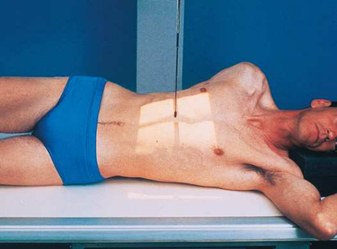
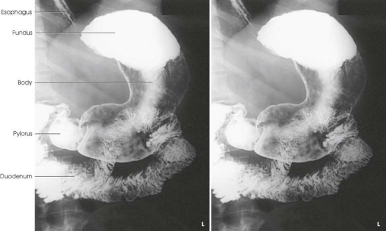

# Rx Stomac și Duoden (Tranzit Baritat) — Oblică Antero-Posterioară (AP) — Oblică Posterioară Stângă (OPS / LPO) (Merrill)

  📷 Radiografie Convențională (Rx)
  <strong>Actualizat:</strong> 2026-09-16
  <strong>Autor:</strong> Referință Merrill

---

-   __1. Rezumat Clinic & Indicații__

    ---

    === "Indicații Clinice"

        - Conform reperelor anatomice standard din tratat

    === "Ghid Național IRIS"

        !!! info "Referință Primară: Ghidul Național IRIS (Ordinul MS 1342/2012)"
            - **Capitol Ghid IRIS:** *Ghidul Național IRIS*
            - **Grad de Recomandare:** **De verificat pe indicație; fără grad atribuit automat**
            - **Nivel de Iradiere Estimată:** `De verificat pentru examinarea și populația selectate`

            [:octicons-search-16: Deschide Ghidul IRIS](../../iris.md){ .md-button .md-button--primary } [:material-open-in-new: Aplicația Oficială PWA](https://radiologie-pediatrica.ro/iris/){ .md-button target="_blank" rel="noopener" }
-   __2. Poziționare & Centrare Fascicul__

    ---

    - **Poziție Pacient:** se așază pacientul în Decubit dorsal poziție.; Se instruiește pacientul să abduct stâng braț și place Mână near capul, sau place extins braț alongside corp. Place drept braț alongside corp sau across upper Torace, ca preferred. Se instruiește pacientul să turn spre stâng, resting pe stâng posterior corp surface. se flectează pacient’s drept Genunchi, și se rotește Genunchi spre stâng pentru support. Place positioning sponge pe / sprijinit de pacient’s ridicat back pentru imobilizare. se ajustează pacient’s poziție so that plan sagital passing approximately midway între vertebre și stâng lateral margin de abdomenul este centrat pe receptorul de imagine. se ajustează center de receptorul de imagine la nivelul corp de stomach. Centering trebuie să fie ajustat la point midway între apendice xifoid și lower margin de Coaste (Grilaj Costal) (Fig. 15.70). grade de rotație required la show stomach best depends pe pacientul’s corp habitus. average angle de 45 grade trebuie să fie suficient pentru sthenic pacient, but grade de angulation poate vary de la 30 la 60 grade. se efectuează ecranarea gonadelor cu șorț plumbat.
    - **Punct de Centrare Fascicul:** perpendicular pe centrul receptorului de imagine.
    - **Distanță Focar-Film (DFF / SID):** Nespecificat în fragmentul extras; de verificat în sursă
    - **Comandă Respiratorie:** Apnee la sfârșitul expirului complet unless otherwise instructed.

-   __3. Parametri Tehnici Expunere__

    ---

    | Parametru Tehnic | Valoare Configurare Generator / Tub |
    |:-----------------|:-------------------------------------|
    | **Tensiune Tub (kV)** | DE CONFIGURAT PE APARAT |
    | **Sarcină / Produs Curent-Timp (mAs)** | DE CONFIGURAT PE APARAT |
    | **Distanță Focar-Film (DFF / SID)** | Nespecificat în fragmentul extras; de verificat în sursă |
    | **Grilă Antidifuzoare (Bucky)** | DE CONFIGURAT PE APARAT |
    | **Dimensiune Focar** | DE CONFIGURAT PE APARAT |
    | **Camere de Ionizare AEC** | DE CONFIGURAT PE APARAT |
    | **Colimare Fascicul** | se ajustează câmp de iradiere la fără larger than 10 × 12 inches (24 × 30 cm) pentru smaller pacienți și 11 × 14 inches (28 × 35 cm) pentru larger pacienți. Se plasează markerul de lateralitate în câmpul colimat. |
    | **Filtrare Tub** | DE CONFIGURAT PE APARAT |

-   __4. Criterii de Calitate & Reușită Imagine__

    ---

    - Criterii radiologice de calitate imaginii:
    - Colimare adecvată vizibilă și prezența markerului de lateralitate (D/S) plasat clear de anatomy de interest
    - Entire stomach și duodenal loop
    - Fundic portion de stomach
    - fără superimposition de pylorus și duodenal bulb
    - corp de stomach centrat pe imagine
    - Penetration de contrast medium
    - Surrounding anatomy
    - corp și pyloric antrum cu double-contrast visualization

-   __5. Protecție Radiologică (ALARA)__

    ---

    - Nespecificat în fragmentul extras; de verificat în sursă

!!! note "Observații Clinice & Tehnice"
    Conform reperelor anatomice standard din tratat

### 🖼️ Imagini

<figure class="protocol-image-card" markdown>

<figcaption><strong>Merrill — pagina PDF 1118, imaginea 1</strong> — Imagine din fragmentul sursă; asocierea necesită revizie.</figcaption>

</figure>

<figure class="protocol-image-card" markdown>

<figcaption><strong>Merrill — pagina PDF 1119, imaginea 2</strong> — Imagine din fragmentul sursă; asocierea necesită revizie.</figcaption>

</figure>

=== "Ghid Rapid de Execuție"

    1. **Identificarea și verificarea pacientului:** verificare identitate, zonă de examinat, consimțământ conform procedurii și evaluarea posibilității unei sarcini, când este relevantă.
    2. **Pregătire:** îndepărtarea oricăror obiecte radiopace (bijuterii, agrafe, fermoare, proteze, pansamente dense).
    3. **Poziționare precisă:** alinierea receptorului de imagine și a tubului la distanța prescrisă (Nespecificat în fragmentul extras; de verificat în sursă).
    4. **Colimare strictă:** adaptarea fasciculului strict la regiunea de diagnostic pentru scăderea iradierii și reducerea radiației difuze.
    5. **Radioprotecție:** verificarea [politicii RX](../radioprotectie.md), cu măsuri distincte pentru pacient, personal și însoțitor.

## Surse de documentare

- [Merrill’s Atlas, 15. Digestive System: Salivary Glands, Alimentary Canal, And Biliary System, pagini PDF 1117–1119](../../assets/protocols/sources/a56d45c16829_Merrills_Atlas_of_Radiographic_Positioning__Procedures_3Vol_Set.pdf#page=1117)

## Fragmente sursă traduse (referință tehnică)

### anatomy

fundic portion de stomach (Fig. 15.71). Because de efect de gravity, pyloric canal și duodenal bulb sunt nu ca filled cu
barium ca they sunt în opposite și complementary poziție (poziție oblică anterioară dreaptă (OAD / RAO); see Figs. 15.67 la 15.69).

### collimation

• se ajustează câmp de iradiere la fără larger than 10 × 12 inches (24 × 30 cm) pentru smaller pacienți și 11 × 14 inches (28 × 35 cm) pentru larger
pacienți. Se plasează markerul de lateralitate în câmpul colimat.

### cr

• perpendicular pe centrul receptorului de imagine.

### criteria

Criterii radiologice de calitate imaginii:
• Colimare adecvată vizibilă și prezența markerului de lateralitate (D/S) plasat clear de anatomy de interest
• Entire stomach și duodenal loop
• Fundic portion de stomach
• fără superimposition de pylorus și duodenal bulb
• corp de stomach centrat pe imagine
• Penetration de contrast medium
• Surrounding anatomy
• corp și pyloric antrum cu double-contrast visualization

### part_pos

• Se instruiește pacientul să abduct stâng braț și place mână near capul, sau place extins braț alongside corp.
• Place drept braț alongside corp sau across upper chest, ca preferred.
• Se instruiește pacientul să turn spre stâng, resting pe stâng posterior corp surface.
• se flectează pacient’s drept genunchi, și se rotește genunchi spre stâng pentru support.
• Place positioning sponge pe / sprijinit de pacient’s ridicat back pentru imobilizare.
• se ajustează pacient’s poziție so that plan sagital passing approximately midway între vertebre și stâng lateral margin de
abdomenul este centrat pe receptorul de imagine.
• se ajustează center de receptorul de imagine la nivelul corp de stomach. Centering trebuie să fie ajustat la point midway între
apendice xifoid și lower margin de coaste (Fig. 15.70).
• grade de rotație required la show stomach best depends pe pacientul’s corp habitus. average angle de 45 grade trebuie să
fie suficient pentru sthenic pacient, but grade de angulation poate vary de la 30 la 60 grade.
• se efectuează ecranarea gonadelor cu șorț plumbat.

### patient_pos

• se așază pacientul în decubit dorsal.

### respiration

Apnee la sfârșitul expirului complet unless otherwise instructed.

### tech

poziționat prin manufacturer sau department protocol pentru corect anatomy display orientation; raza centrală plate: 10 × 12 inches (24 ×
30 cm) sau 14 × 17 inches (35 × 43 cm) longitudinal.

