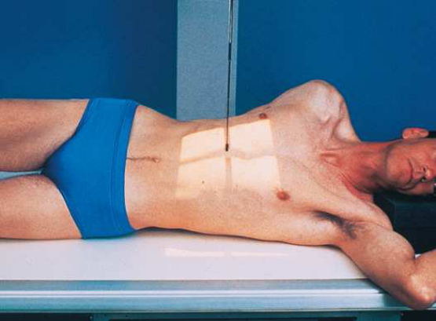
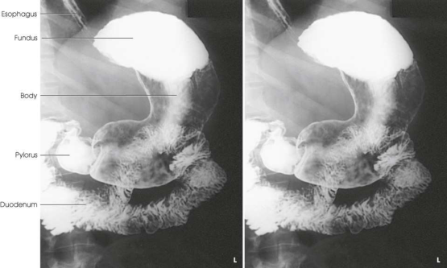

# Rx Stomac și Duoden (Tranzit Baritat) — Oblică Antero-Posterioară (AP) — Oblică Posterioară Stângă (OPS / LPO) (Merrill)

  📷 Radiografie Convențională (Rx)
  <strong>Actualizat:</strong> 2026-09-16
  <strong>Autor:</strong> Referință Merrill

---

-   __1. Rezumat Clinic & Indicații__

    ---

    === "Indicații Clinice"

        - Conform reperelor anatomice standard din tratat

    === "Ghid Național IRIS"

        !!! info "Referință Primară: Ghidul Național IRIS (Ordinul MS 1342/2012)"
            - **Capitol Ghid IRIS:** *Aparat digestiv & Abdomen*
            - **Grad de Recomandare:** **Grad B**
            - **Nivel de Iradiere Estimată:** `Clasa 2 (Foarte mică ~ 0.7 - 1.2 mSv)`

            [:octicons-search-16: Deschide Ghidul IRIS](../../iris.md){ .md-button .md-button--primary } [:material-open-in-new: Aplicația Oficială PWA](https://radiologie-pediatrica.ro/iris/){ .md-button target="_blank" rel="noopener" }

-   __2. Poziționare & Centrare Fascicul__

    ---

    - **Poziție Pacient:** Se așază pacientul în decubit dorsal.; Se instruiește pacientul să efectueze abducția brațului stâng și să așeze mâna lângă cap sau să așeze brațul întins pe lângă corp. Așezați brațul drept pe lângă corp sau peste partea superioară a toracelui, după preferință. Se instruiește pacientul să se întoarcă spre stânga, sprijinindu-se pe suprafața posterioară stângă a corpului. Se flectează genunchiul drept al pacientului și se rotește spre stânga pentru sprijin. Așezați un burete de poziționare pe / sprijinit de partea ridicată a spatelui pacientului, pentru imobilizare. Se ajustează poziția pacientului astfel încât planul sagital care trece aproximativ la jumătatea distanței dintre vertebre și marginea laterală stângă a abdomenului să fie centrat pe receptorul de imagine. Se ajustează centrul receptorului de imagine la nivelul corpului stomacului. Centrarea trebuie ajustată la punctul situat la jumătatea distanței dintre apendicele xifoid și marginea inferioară a coastelor (grilajului costal) (Fig. 15.70). Gradul de rotație necesar pentru a evidenția cât mai bine stomacul depinde de constituția corporală a pacientului. Un unghi mediu de 45 grade ar trebui să fie suficient pentru pacientul normostenic, dar angulația poate varia de la 30 la 60 grade. Se efectuează ecranarea gonadelor cu șorț plumbat.
    - **Punct de Centrare Fascicul:** perpendicular pe centrul receptorului de imagine.
    - **Distanță Focar-Film (DFF / SID):** Nespecificat în fragmentul extras; de verificat în sursă
    - **Comandă Respiratorie:** Apnee la sfârșitul expirului complet, dacă nu se indică altfel.

-   __3. Parametri Tehnici Expunere__

    ---

    | Parametru Tehnic | Valoare Configurare Generator / Tub |
    |:-----------------|:-------------------------------------|
    | **Tensiune Tub (kV)** | DE CONFIGURAT PE APARAT |
    | **Sarcină / Produs Curent-Timp (mAs)** | DE CONFIGURAT PE APARAT |
    | **Distanță Focar-Film (DFF / SID)** | Nespecificat în fragmentul extras; de verificat în sursă |
    | **Grilă Antidifuzoare (Bucky)** | DE CONFIGURAT PE APARAT |
    | **Dimensiune Focar** | DE CONFIGURAT PE APARAT |
    | **Camere de Ionizare AEC** | DE CONFIGURAT PE APARAT |
    | **Colimare Fascicul** | Se ajustează câmpul de iradiere astfel încât să nu depășească 10 × 12 țoli (24 × 30 cm) pentru pacienții de talie mai mică și 11 × 14 țoli (28 × 35 cm) pentru pacienții de talie mai mare. Se plasează markerul de lateralitate în câmpul colimat. |
    | **Filtrare Tub** | DE CONFIGURAT PE APARAT |

-   __4. Criterii de Calitate & Reușită Imagine__

    ---

    - Criterii radiologice de calitate a imaginii:
    - Colimare adecvată vizibilă și prezența markerului de lateralitate (D/S) plasat în afara structurilor anatomice de interes
    - Întregul stomac și ansa duodenală
    - Porțiunea fundică a stomacului
    - Fără suprapunerea pilorului și a bulbului duodenal
    - Corpul stomacului centrat pe imagine
    - Penetrarea substanței de contrast
    - Structurile anatomice învecinate
    - Corpul și antrul piloric vizualizate în dublu contrast

-   __5. Protecție Radiologică (ALARA)__

    ---

    - Nespecificat în fragmentul extras; de verificat în sursă

!!! note "Observații Clinice & Tehnice"
    Conform reperelor anatomice standard din tratat

### 🖼️ Imagini

<figure class="protocol-image-card" markdown>

<figcaption><strong>Merrill — pagina 1118, imaginea 1</strong> — Imagine din fragmentul sursă; asocierea necesită revizie.</figcaption>

</figure>

<figure class="protocol-image-card" markdown>

<figcaption><strong>Merrill — pagina 1119, imaginea 2</strong> — Imagine din fragmentul sursă; asocierea necesită revizie.</figcaption>

</figure>

=== "Ghid Rapid de Execuție"

    1. **Identificarea și verificarea pacientului:** verificare identitate, zonă de examinat, consimțământ conform procedurii și evaluarea posibilității unei sarcini, când este relevantă.
    2. **Pregătire:** îndepărtarea oricăror obiecte radiopace (bijuterii, agrafe, fermoare, proteze, pansamente dense).
    3. **Poziționare precisă:** alinierea receptorului de imagine și a tubului la distanța prescrisă (Nespecificat în fragmentul extras; de verificat în sursă).
    4. **Colimare strictă:** adaptarea fasciculului strict la regiunea de diagnostic pentru scăderea iradierii și reducerea radiației difuze.
    5. **Radioprotecție:** verificarea [politicii RX](../radioprotectie.md), cu măsuri distincte pentru pacient, personal și însoțitor.

## Surse de documentare

- [Merrill’s Atlas, 15. Digestive System: Salivary Glands, Alimentary Canal, And Biliary System, pagini 1117–1119](https://books.google.com/books/about/Merrill_s_Atlas_of_Radiographic_Position.html?id=BM0lEQAAQBAJ)
