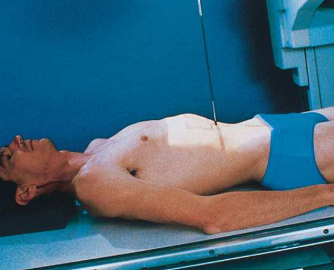
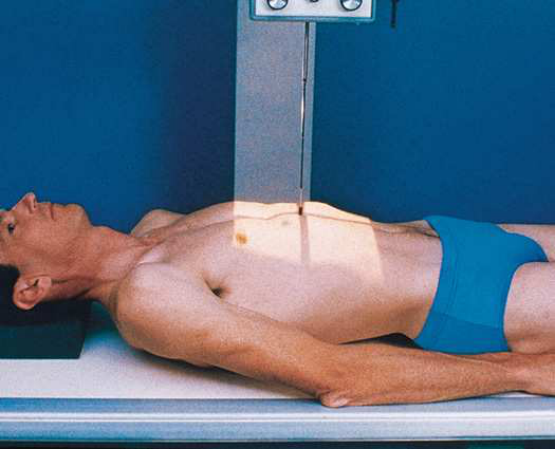
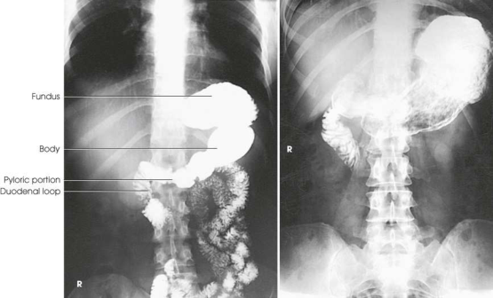
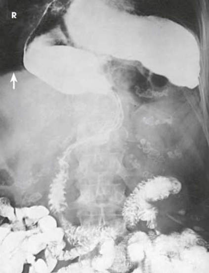

# Rx Stomac și Duoden (Tranzit Baritat) — Incidență Antero-Posterioară (AP) (Merrill)

  📷 Radiografie Convențională (Rx)
  <strong>Actualizat:</strong> 2026-09-16
  <strong>Autor:</strong> Referință Merrill

---

-   __1. Rezumat Clinic & Indicații__

    ---

    === "Indicații Clinice"

        - Conform reperelor anatomice standard din tratat

    === "Ghid Național IRIS"

        !!! info "Referință Primară: Ghidul Național IRIS (Ordinul MS 1342/2012)"
            - **Capitol Ghid IRIS:** *Ghidul Național IRIS*
            - **Grad de Recomandare:** **De verificat pe indicație; fără grad atribuit automat**
            - **Nivel de Iradiere Estimată:** `De verificat pentru examinarea și populația selectate`

            [:octicons-search-16: Deschide Ghidul IRIS](../../iris.md){ .md-button .md-button--primary } [:material-open-in-new: Aplicația Oficială PWA](https://radiologie-pediatrica.ro/iris/){ .md-button target="_blank" rel="noopener" }
-   __2. Poziționare & Centrare Fascicul__

    ---

    - **Poziție Pacient:** se așază pacientul în Decubit dorsal poziție. stomach moves superiorly și la stâng în this poziție, și, except în thin pacienți, its pyloric end este ridicat astfel încât barium flows into și fills its cardiac sau fundic portions sau ambele. Filling de fundus displaces gas bubble into pyloric end de stomach, where it allows double-contrast delineation de posterior perete lesions when single- contrast examination este performed. If pacientul este thin, intestinal loops do nu move superior enough la tilt stomach pentru fundic filling. Rotating pacientul’s corp spre stâng sau angling capul end de masa de examinare downward este necessary. Tilt masa de examinare la full sau partial Trendelenburg angulation la show diaphragmatic herniations (Fig. 15.75). în Trendelenburg poziție, involved organ sau organs, which poate appear la fie normally located în toate other corp poziții, shift upward și protrude through hernial orifice (most commonly through esophageal hiatus).; se ajustează poziție de pacientul astfel încât linia mediană grilă coincides (1) cu linia mediană corp when a 14- × 17-inches (35 × 43-cm) expunere field (sau raza centrală plate) este used (see Fig. 15.75) sau (2) cu plan sagital passing midway între midline și stâng lateral margin de abdomenul when a 10- × 12-inch (24 × 30-cm) expunere field (sau raza centrală plate) este used (Fig. 15.76). Longitudinal centering de larger expunere field depends pe extent de hernial protrusion into thorax și este determined during fluoroscopy. pentru stomac și duoden, se centrează 10- × 12-inch (24- × 30-cm) expunere field/receptorul de imagine la level midway între apendice xifoid și lower rib margin (approximately L1-L2). pentru 14- × 17-inch (35- × 43-cm) expunere field/receptorul de imagine, center it la same level și adjust up sau down slightly, depending pe whether cupole diafragmatice sau intestin subțire needs la fie seen. se efectuează ecranarea gonadelor cu șorț plumbat.
    - **Punct de Centrare Fascicul:** perpendicular pe centrul receptorului de imagine.
    - **Distanță Focar-Film (DFF / SID):** Nespecificat în fragmentul extras; de verificat în sursă
    - **Comandă Respiratorie:** Apnee la sfârșitul expirului complet unless otherwise requested.

-   __3. Parametri Tehnici Expunere__

    ---

    | Parametru Tehnic | Valoare Configurare Generator / Tub |
    |:-----------------|:-------------------------------------|
    | **Tensiune Tub (kV)** | DE CONFIGURAT PE APARAT |
    | **Sarcină / Produs Curent-Timp (mAs)** | DE CONFIGURAT PE APARAT |
    | **Distanță Focar-Film (DFF / SID)** | Nespecificat în fragmentul extras; de verificat în sursă |
    | **Grilă Antidifuzoare (Bucky)** | DE CONFIGURAT PE APARAT |
    | **Dimensiune Focar** | DE CONFIGURAT PE APARAT |
    | **Camere de Ionizare AEC** | DE CONFIGURAT PE APARAT |
    | **Colimare Fascicul** | se ajustează câmp de iradiere la fără larger than 10 × 12 inches (24 × 30 cm) when stomach alone este de interest; fără larger than 14 × 17 inches (35 × 43 cm) when intestin subțire este la fie included. Se plasează markerul de lateralitate în câmpul colimat. |
    | **Filtrare Tub** | DE CONFIGURAT PE APARAT |

-   __4. Criterii de Calitate & Reușită Imagine__

    ---

    - Criterii radiologice de calitate imaginii:
    - Colimare adecvată vizibilă și prezența markerului de lateralitate (D/S) plasat clear de anatomy de interest
    - Entire stomach și duodenal loop
    - Double-contrast visualization de gastric corp, pylorus, și duodenal bulb
    - Retrogastric portion de duodenum și jejunum
    - Lower câmpuri pulmonare pe 14- × 17-inch (35- × 43-cm) imagini la show diaphragmatic hernias
    - Stomach centrat la nivelul level de pylorus pe 10- × 12-inch (24- × 30-cm) imagini
    - Absența rotației anatomice (simetrie bilaterală perfectă) de pacientul
    - Penetration contrast medium
    - Surrounding soft tissues

-   __5. Protecție Radiologică (ALARA)__

    ---

    - Nespecificat în fragmentul extras; de verificat în sursă

!!! note "Observații Clinice & Tehnice"
    Valsalva maneuver poate fie used în conjunction cu sau ca alternative la Trendelenburg poziție.

### 🖼️ Imagini

<figure class="protocol-image-card" markdown>

<figcaption><strong>Merrill — pagina PDF 1123, imaginea 1</strong> — Imagine din fragmentul sursă; asocierea necesită revizie.</figcaption>

</figure>

<figure class="protocol-image-card" markdown>

<figcaption><strong>Merrill — pagina PDF 1124, imaginea 2</strong> — Imagine din fragmentul sursă; asocierea necesită revizie.</figcaption>

</figure>

<figure class="protocol-image-card" markdown>

<figcaption><strong>Merrill — pagina PDF 1124, imaginea 3</strong> — Imagine din fragmentul sursă; asocierea necesită revizie.</figcaption>

</figure>

<figure class="protocol-image-card" markdown>

<figcaption><strong>Merrill — pagina PDF 1125, imaginea 4</strong> — Imagine din fragmentul sursă; asocierea necesită revizie.</figcaption>

</figure>

=== "Ghid Rapid de Execuție"

    1. **Identificarea și verificarea pacientului:** verificare identitate, zonă de examinat, consimțământ conform procedurii și evaluarea posibilității unei sarcini, când este relevantă.
    2. **Pregătire:** îndepărtarea oricăror obiecte radiopace (bijuterii, agrafe, fermoare, proteze, pansamente dense).
    3. **Poziționare precisă:** alinierea receptorului de imagine și a tubului la distanța prescrisă (Nespecificat în fragmentul extras; de verificat în sursă).
    4. **Colimare strictă:** adaptarea fasciculului strict la regiunea de diagnostic pentru scăderea iradierii și reducerea radiației difuze.
    5. **Radioprotecție:** verificarea [politicii RX](../radioprotectie.md), cu măsuri distincte pentru pacient, personal și însoțitor.

## Surse de documentare

- [Merrill’s Atlas, 15. Digestive System: Salivary Glands, Alimentary Canal, And Biliary System, pagini PDF 1122–1125](../../assets/protocols/sources/a56d45c16829_Merrills_Atlas_of_Radiographic_Positioning__Procedures_3Vol_Set.pdf#page=1122)

## Fragmente sursă traduse (referință tehnică)

### anatomy

Stomach
well-filled fundic portion și usually double-contrast delineation de corp, pyloric portion, și duodenum (Fig. 15.77). Because de elevation și superior displacement de stomach, this incidență afords best AP incidență de retrogastric portion de duodenum
și jejunum.
cupole diafragmatice
AP incidență de abdominothoracic region shows organ sau organs involved în, și location și extent de, orice gross hernial
protrusion through cupole diafragmatice (Figs. 15.78 și 15.79).

### collimation

• se ajustează câmp de iradiere la fără larger than 10 × 12 inches (24 × 30 cm) when stomach alone este de interest; fără larger than 14 × 17 inches
(35 × 43 cm) when intestin subțire este la fie included. Se plasează markerul de lateralitate în câmpul colimat.

### cr

• perpendicular pe centrul receptorului de imagine.

### criteria

Criterii radiologice de calitate imaginii:
• Colimare adecvată vizibilă și prezența markerului de lateralitate (D/S) plasat clear de anatomy de interest
• Entire stomach și duodenal loop
• Double-contrast visualization de gastric corp, pylorus, și duodenal bulb
• Retrogastric portion de duodenum și jejunum
• Lower câmpuri pulmonare pe 14- × 17-inch (35- × 43-cm) imagini la show diaphragmatic hernias
• Stomach centrat la nivelul level de pylorus pe 10- × 12-inch (24- × 30-cm) imagini
• Absența rotației anatomice (simetrie bilaterală perfectă) de pacientul
• Penetration contrast medium
• Surrounding soft tissues

### notes

Valsalva maneuver poate fie used în conjunction cu sau ca alternative la Trendelenburg poziție.

### part_pos

• se ajustează poziție de pacientul astfel încât linia mediană grilă coincides (1) cu linia mediană corp when a 14-
• × 17-inches (35 × 43-cm) expunere field (sau raza centrală plate) este used (see Fig. 15.75) sau (2) cu plan sagital passing midway între
midline și stâng lateral margin de abdomenul when a 10- × 12-inch (24 × 30-cm) expunere field (sau raza centrală plate) este used (Fig. 15.76).
Longitudinal centering de larger expunere field depends pe extent de hernial protrusion into thorax și este determined
during fluoroscopy.
• pentru stomac și duoden, se centrează 10- × 12-inch (24- × 30-cm) expunere field/receptorul de imagine la level midway între apendice xifoid
și lower rib margin (approximately L1-L2). pentru 14- × 17-inch (35- × 43-cm) expunere field/receptorul de imagine, center it la same level și
adjust up sau down slightly, depending pe whether cupole diafragmatice sau intestin subțire needs la fie seen.
• se efectuează ecranarea gonadelor cu șorț plumbat.

### patient_pos

• se așază pacientul în decubit dorsal. stomach moves superiorly și la stâng în this poziție, și, except în thin pacienți, its
pyloric end este ridicat astfel încât barium flows into și fills its cardiac sau fundic portions sau ambele. Filling de fundus displaces gas bubble into pyloric end de stomach, where it allows double-contrast delineation de posterior perete lesions when single-
contrast examination este performed. If pacientul este thin, intestinal loops do nu move superior enough la tilt stomach pentru
fundic filling. Rotating pacientul’s corp spre stâng sau angling capul end de masa de examinare downward este necessary.
• Tilt masa de examinare la full sau partial Trendelenburg angulation la show diaphragmatic herniations (Fig. 15.75). în Trendelenburg poziție,
involved organ sau organs, which poate appear la fie normally located în toate other corp poziții, shift upward și protrude through
hernial orifice (most commonly through esophageal hiatus).

### respiration

Apnee la sfârșitul expirului complet unless otherwise requested.

### tech

poziționat prin manufacturer sau department protocol pentru corect anatomy display orientation; raza centrală plate: 10 × 12 inches (24 ×
30 cm) pentru small hiatal hernias; 14 × 17 inches (35 × 43 cm) longitudinal pentru large diaphragmatic herniations sau pentru stomach și intestin subțire.

