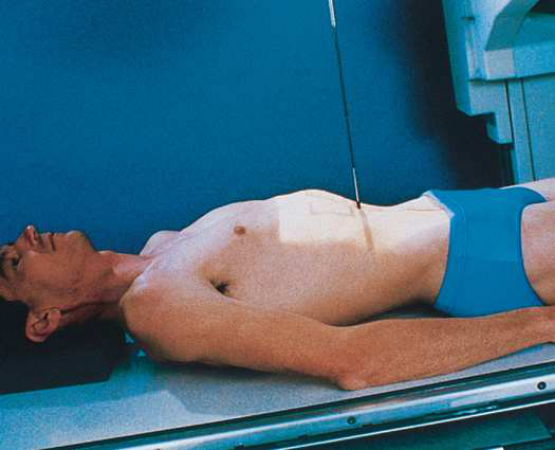
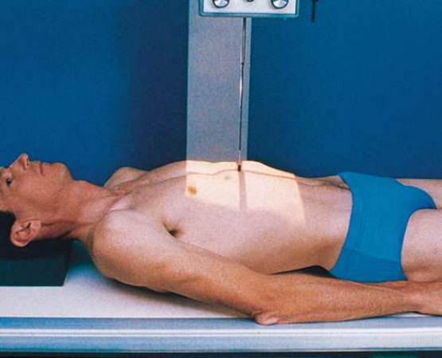
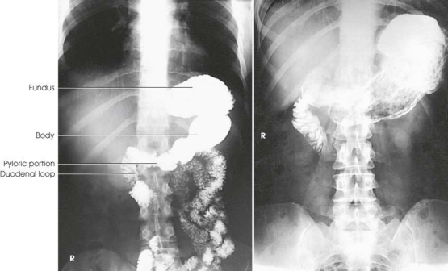
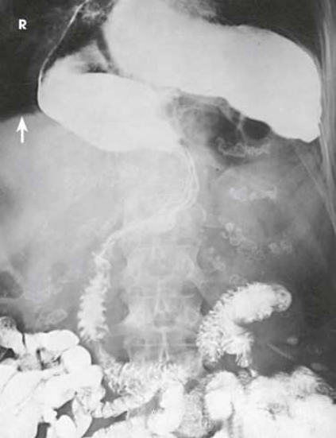

# Rx Stomac și Duoden (Tranzit Baritat) — Incidență Antero-Posterioară (AP) (Merrill)

  📷 Radiografie Convențională (Rx)
  <strong>Actualizat:</strong> 2026-09-16
  <strong>Autor:</strong> Referință Merrill

---

-   __1. Rezumat Clinic & Indicații__

    ---

    === "Indicații Clinice"

        - Conform reperelor anatomice standard din tratat

    === "Ghid Național IRIS"

        !!! info "Referință Primară: Ghidul Național IRIS (Ordinul MS 1342/2012)"
            - **Capitol Ghid IRIS:** *Ghidul Național IRIS*
            - **Grad de Recomandare:** **De verificat pe indicație; fără grad atribuit automat**
            - **Nivel de Iradiere Estimată:** `De verificat pentru examinarea și populația selectate`

            [:octicons-search-16: Deschide Ghidul IRIS](../../iris.md){ .md-button .md-button--primary } [:material-open-in-new: Aplicația Oficială PWA](https://radiologie-pediatrica.ro/iris/){ .md-button target="_blank" rel="noopener" }
-   __2. Poziționare & Centrare Fascicul__

    ---

    - **Poziție Pacient:** Se așază pacientul în decubit dorsal. În această poziție, stomacul se deplasează superior și spre stânga și, cu excepția pacienților slabi, extremitatea sa pilorică se ridică, astfel încât bariul pătrunde și umple porțiunea cardială sau fundică ori ambele. Umplerea fundului gastric deplasează bula de gaz în extremitatea pilorică a stomacului, unde permite delimitarea în dublu contrast a leziunilor peretelui posterior atunci când se efectuează o examinare cu contrast unic. Dacă pacientul este slab, ansele intestinale nu se deplasează suficient de mult superior pentru a înclina stomacul în vederea umplerii fundului gastric. Este necesară rotirea corpului pacientului spre stânga sau înclinarea în jos a capătului mesei de examinare aflat la capul pacientului. Se înclină masa de examinare în poziție Trendelenburg completă sau parțială pentru a evidenția hernierile diafragmatice (Fig. 15.75). În poziția Trendelenburg, organul sau organele implicate, care pot părea situate normal în toate celelalte poziții ale corpului, se deplasează în sus și protruzionează prin orificiul herniar (cel mai frecvent prin hiatusul esofagian).; Se ajustează poziția pacientului astfel încât linia mediană a grilei să coincidă (1) cu linia mediană a corpului când se utilizează un câmp de expunere de 14- × 17-țoli (35 × 43-cm) (sau placa pentru raza centrală) (vezi Fig. 15.75) sau (2) cu planul sagital care trece la jumătatea distanței dintre linia mediană și marginea laterală stângă a abdomenului când se utilizează un câmp de expunere de 10- × 12-țoli (24 × 30-cm) (sau placa pentru raza centrală) (Fig. 15.76). Centrarea longitudinală a câmpului de expunere mai mare depinde de extinderea protruziei herniare în torace și se stabilește în timpul fluoroscopiei. Pentru stomac și duoden, se centrează câmpul de expunere/receptorul de imagine de 10- × 12-țoli (24- × 30-cm) la jumătatea distanței dintre apendicele xifoid și marginea costală inferioară (aproximativ L1-L2). Câmpul de expunere/receptorul de imagine de 14- × 17-țoli (35- × 43-cm) se centrează la același nivel și se ajustează ușor în sus sau în jos, în funcție de necesitatea vizualizării cupolelor diafragmatice sau a intestinului subțire. se efectuează ecranarea gonadelor cu șorț plumbat.
    - **Punct de Centrare Fascicul:** perpendicular pe centrul receptorului de imagine.
    - **Distanță Focar-Film (DFF / SID):** Nespecificat în fragmentul extras; de verificat în sursă
    - **Comandă Respiratorie:** Apnee la sfârșitul expirului complet, dacă nu se solicită altfel.

-   __3. Parametri Tehnici Expunere__

    ---

    | Parametru Tehnic | Valoare Configurare Generator / Tub |
    |:-----------------|:-------------------------------------|
    | **Tensiune Tub (kV)** | DE CONFIGURAT PE APARAT |
    | **Sarcină / Produs Curent-Timp (mAs)** | DE CONFIGURAT PE APARAT |
    | **Distanță Focar-Film (DFF / SID)** | Nespecificat în fragmentul extras; de verificat în sursă |
    | **Grilă Antidifuzoare (Bucky)** | DE CONFIGURAT PE APARAT |
    | **Dimensiune Focar** | DE CONFIGURAT PE APARAT |
    | **Camere de Ionizare AEC** | DE CONFIGURAT PE APARAT |
    | **Colimare Fascicul** | Se ajustează câmpul de iradiere astfel încât să nu depășească 10 × 12 țoli (24 × 30 cm) când numai stomacul prezintă interes; să nu depășească 14 × 17 țoli (35 × 43 cm) când trebuie inclus intestinul subțire. Se plasează markerul de lateralitate în câmpul colimat. |
    | **Filtrare Tub** | DE CONFIGURAT PE APARAT |

-   __4. Criterii de Calitate & Reușită Imagine__

    ---

    - Criterii radiologice de calitate a imaginii:
    - Colimare adecvată vizibilă și prezența markerului de lateralitate (D/S) plasat în afara structurilor anatomice de interes
    - Întregul stomac și ansa duodenală
    - Vizualizarea în dublu contrast a corpului gastric, a pilorului și a bulbului duodenal
    - Porțiunea retrogastrică a duodenului și a jejunului
    - Porțiunile inferioare ale câmpurilor pulmonare pe imaginile de 14- × 17-țoli (35- × 43-cm), pentru evidențierea herniilor diafragmatice
    - Stomacul centrat la nivelul pilorului pe imaginile de 10- × 12-țoli (24- × 30-cm)
    - Absența rotației anatomice a pacientului (simetrie bilaterală perfectă)
    - Penetrarea substanței de contrast
    - Țesuturile moi învecinate

-   __5. Protecție Radiologică (ALARA)__

    ---

    - Nespecificat în fragmentul extras; de verificat în sursă

!!! note "Observații Clinice & Tehnice"
    Manevra Valsalva poate fi utilizată împreună cu poziția Trendelenburg sau ca alternativă la aceasta.

### 🖼️ Imagini

<figure class="protocol-image-card" markdown>

<figcaption><strong>Merrill — pagina 1123, imaginea 1</strong> — Imagine din fragmentul sursă; asocierea necesită revizie.</figcaption>

</figure>

<figure class="protocol-image-card" markdown>

<figcaption><strong>Merrill — pagina 1124, imaginea 2</strong> — Imagine din fragmentul sursă; asocierea necesită revizie.</figcaption>

</figure>

<figure class="protocol-image-card" markdown>

<figcaption><strong>Merrill — pagina 1124, imaginea 3</strong> — Imagine din fragmentul sursă; asocierea necesită revizie.</figcaption>

</figure>

<figure class="protocol-image-card" markdown>

<figcaption><strong>Merrill — pagina 1125, imaginea 4</strong> — Imagine din fragmentul sursă; asocierea necesită revizie.</figcaption>

</figure>

=== "Ghid Rapid de Execuție"

    1. **Identificarea și verificarea pacientului:** verificare identitate, zonă de examinat, consimțământ conform procedurii și evaluarea posibilității unei sarcini, când este relevantă.
    2. **Pregătire:** îndepărtarea oricăror obiecte radiopace (bijuterii, agrafe, fermoare, proteze, pansamente dense).
    3. **Poziționare precisă:** alinierea receptorului de imagine și a tubului la distanța prescrisă (Nespecificat în fragmentul extras; de verificat în sursă).
    4. **Colimare strictă:** adaptarea fasciculului strict la regiunea de diagnostic pentru scăderea iradierii și reducerea radiației difuze.
    5. **Radioprotecție:** verificarea [politicii RX](../radioprotectie.md), cu măsuri distincte pentru pacient, personal și însoțitor.

## Surse de documentare

- [Merrill’s Atlas, 15. Digestive System: Salivary Glands, Alimentary Canal, And Biliary System, pagini 1122–1125](https://books.google.com/books/about/Merrill_s_Atlas_of_Radiographic_Position.html?id=BM0lEQAAQBAJ)

## Fragmente sursă traduse (referință tehnică)

### anatomie

Stomac
Porțiunea fundică bine umplută și, de obicei, delimitarea în dublu contrast a corpului, a porțiunii pilorice și a duodenului (Fig. 15.77). Datorită ridicării și deplasării superioare a stomacului, această incidență oferă cea mai bună vizualizare AP a porțiunii retrogastrice a duodenului și a jejunului.
cupole diafragmatice
Incidența AP a regiunii abdominotoracice evidențiază organul sau organele implicate, precum și localizarea și extinderea oricărei protruzii herniare mari prin cupolele diafragmatice (Fig. 15.78 și 15.79).

### colimare

• Se ajustează câmpul de iradiere astfel încât să nu depășească 10 × 12 țoli (24 × 30 cm) când numai stomacul prezintă interes; să nu depășească 14 × 17 țoli (35 × 43 cm) când trebuie inclus intestinul subțire. Se plasează markerul de lateralitate în câmpul colimat.

### raza centrală

• perpendicular pe centrul receptorului de imagine.

### criterii

Criterii radiologice de calitate a imaginii:
• Colimare adecvată vizibilă și prezența markerului de lateralitate (D/S) plasat în afara structurilor anatomice de interes
• Întregul stomac și ansa duodenală
• Vizualizarea în dublu contrast a corpului gastric, a pilorului și a bulbului duodenal
• Porțiunea retrogastrică a duodenului și a jejunului
• Porțiunile inferioare ale câmpurilor pulmonare pe imaginile de 14- × 17-țoli (35- × 43-cm), pentru evidențierea herniilor diafragmatice
• Stomacul centrat la nivelul pilorului pe imaginile de 10- × 12-țoli (24- × 30-cm)
• Absența rotației anatomice a pacientului (simetrie bilaterală perfectă)
• Penetrarea substanței de contrast
• Țesuturile moi învecinate

### note

Manevra Valsalva poate fi utilizată împreună cu poziția Trendelenburg sau ca alternativă la aceasta.

### part_pos

• Se ajustează poziția pacientului astfel încât linia mediană a grilei să coincidă (1) cu linia mediană a corpului când se utilizează un câmp de expunere de 14-
• × 17-țoli (35 × 43-cm) (sau placa pentru raza centrală) (vezi Fig. 15.75) sau (2) cu planul sagital care trece la jumătatea distanței dintre linia mediană și marginea laterală stângă a abdomenului când se utilizează un câmp de expunere de 10- × 12-țoli (24 × 30-cm) (sau placa pentru raza centrală) (Fig. 15.76).
Centrarea longitudinală a câmpului de expunere mai mare depinde de extinderea protruziei herniare în torace și se stabilește în timpul fluoroscopiei.
• Pentru stomac și duoden, se centrează câmpul de expunere/receptorul de imagine de 10- × 12-țoli (24- × 30-cm) la jumătatea distanței dintre apendicele xifoid și marginea costală inferioară (aproximativ L1-L2). Câmpul de expunere/receptorul de imagine de 14- × 17-țoli (35- × 43-cm) se centrează la același nivel și se ajustează ușor în sus sau în jos, în funcție de necesitatea vizualizării cupolelor diafragmatice sau a intestinului subțire.
• se efectuează ecranarea gonadelor cu șorț plumbat.

### patient_pos

• se așază pacientul în decubit dorsal. În această poziție, stomacul se deplasează superior și spre stânga și, cu excepția pacienților slabi, extremitatea sa pilorică se ridică, astfel încât bariul pătrunde și umple porțiunea cardială sau fundică ori ambele. Umplerea fundului gastric deplasează bula de gaz în extremitatea pilorică a stomacului, unde permite delimitarea în dublu contrast a leziunilor peretelui posterior atunci când se efectuează o examinare cu contrast unic. Dacă pacientul este slab, ansele intestinale nu se deplasează suficient de mult superior pentru a înclina stomacul în vederea umplerii fundului gastric. Este necesară rotirea corpului pacientului spre stânga sau înclinarea în jos a capătului mesei de examinare aflat la capul pacientului.
• Se înclină masa de examinare în poziție Trendelenburg completă sau parțială pentru a evidenția hernierile diafragmatice (Fig. 15.75). În poziția Trendelenburg, organul sau organele implicate, care pot părea situate normal în toate celelalte poziții ale corpului, se deplasează în sus și protruzionează prin orificiul herniar (cel mai frecvent prin hiatusul esofagian).

### respirație

Apnee la sfârșitul expirului complet, dacă nu se solicită altfel.

### tehnică

Poziționat conform indicațiilor producătorului sau protocolului departamentului pentru orientarea corectă a afișării structurilor anatomice; placa pentru raza centrală: 10 × 12 țoli (24 × 30 cm) pentru herniile hiatale mici; 14 × 17 țoli (35 × 43 cm), longitudinal, pentru hernierile diafragmatice mari sau pentru stomac și intestinul subțire.

