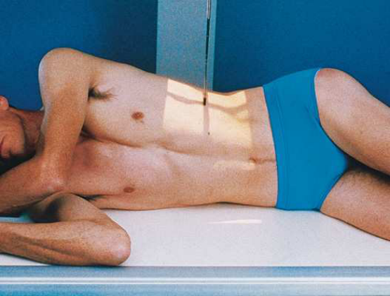
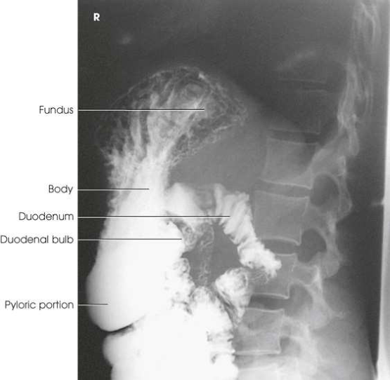
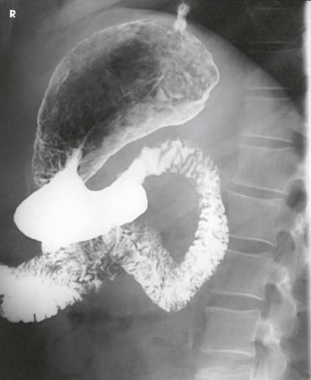

# Rx Stomac și Duoden (Tranzit Baritat) — Incidență de Profil (Lateral) — Profil Drept (Merrill)

  📷 Radiografie Convențională (Rx)
  <strong>Actualizat:</strong> 2026-09-16
  <strong>Autor:</strong> Referință Merrill

---

-   __1. Rezumat Clinic & Indicații__

    ---

    === "Indicații Clinice"

        - Conform reperelor anatomice standard din tratat

    === "Ghid Național IRIS"

        !!! info "Referință Primară: Ghidul Național IRIS (Ordinul MS 1342/2012)"
            - **Capitol Ghid IRIS:** *Ghidul Național IRIS*
            - **Grad de Recomandare:** **De verificat pe indicație; fără grad atribuit automat**
            - **Nivel de Iradiere Estimată:** `De verificat pentru examinarea și populația selectate`

            [:octicons-search-16: Deschide Ghidul IRIS](../../iris.md){ .md-button .md-button--primary } [:material-open-in-new: Aplicația Oficială PWA](https://radiologie-pediatrica.ro/iris/){ .md-button target="_blank" rel="noopener" }
-   __2. Poziționare & Centrare Fascicul__

    ---

    - **Poziție Pacient:** se așază pacientul în ortostatism leͥ Incidență de Profil (lateral) la show stâng retrogastric space și în Decubit drept Incidență de Profil (lateral) la show drept retrogastric space, duodenal loop, și duodenojejunal junction.; cu pacientul în ortostatism sau Decubit poziție, se ajustează corp so that plane passing midway între plan mediocoronal și anterior surface de abdomenul coincides cu linia mediană grilă. se centrează receptorul de imagine la nivelul L1-L2 pentru Decubit poziție (about 1 la 2 inches [2.5 la 5 cm] above lower rib margin) și la L3 pentru ortostatism. se ajustează corp în true Incidență de Profil (lateral) (Fig. 15.72). se efectuează ecranarea gonadelor cu șorț plumbat.
    - **Punct de Centrare Fascicul:** perpendicular pe centrul receptorului de imagine
    - **Distanță Focar-Film (DFF / SID):** Nespecificat în fragmentul extras; de verificat în sursă
    - **Comandă Respiratorie:** Apnee la sfârșitul expirului complet unless otherwise requested.

-   __3. Parametri Tehnici Expunere__

    ---

    | Parametru Tehnic | Valoare Configurare Generator / Tub |
    |:-----------------|:-------------------------------------|
    | **Tensiune Tub (kV)** | DE CONFIGURAT PE APARAT |
    | **Sarcină / Produs Curent-Timp (mAs)** | DE CONFIGURAT PE APARAT |
    | **Distanță Focar-Film (DFF / SID)** | Nespecificat în fragmentul extras; de verificat în sursă |
    | **Grilă Antidifuzoare (Bucky)** | DE CONFIGURAT PE APARAT |
    | **Dimensiune Focar** | DE CONFIGURAT PE APARAT |
    | **Camere de Ionizare AEC** | DE CONFIGURAT PE APARAT |
    | **Colimare Fascicul** | se ajustează câmp de iradiere la fără larger than 10 × 12 inches (24 × 30 cm) pentru smaller pacienți și fără larger than 11 × 14 inches (28 × 35 cm) pentru larger pacienți. Se plasează markerul de lateralitate în câmpul colimat. |
    | **Filtrare Tub** | DE CONFIGURAT PE APARAT |

-   __4. Criterii de Calitate & Reușită Imagine__

    ---

    - Criterii radiologice de calitate imaginii:
    - Colimare adecvată vizibilă și prezența markerului de lateralitate (D/S) plasat clear de anatomy de interest
    - Entire stomach și duodenal loop
    - Absența rotației anatomice (simetrie bilaterală perfectă) de pacientul, ca vizualizat prin vertebre
    - Stomach centrat la nivelul level de pylorus
    - Penetration de contrast medium
    - Surrounding anatomy

-   __5. Protecție Radiologică (ALARA)__

    ---

    - Nespecificat în fragmentul extras; de verificat în sursă

!!! note "Observații Clinice & Tehnice"
    Conform reperelor anatomice standard din tratat

### 🖼️ Imagini

<figure class="protocol-image-card" markdown>

<figcaption><strong>Merrill — pagina PDF 1120, imaginea 1</strong> — Imagine din fragmentul sursă; asocierea necesită revizie.</figcaption>

</figure>

<figure class="protocol-image-card" markdown>

<figcaption><strong>Merrill — pagina PDF 1121, imaginea 2</strong> — Imagine din fragmentul sursă; asocierea necesită revizie.</figcaption>

</figure>

<figure class="protocol-image-card" markdown>

<figcaption><strong>Merrill — pagina PDF 1122, imaginea 3</strong> — Imagine din fragmentul sursă; asocierea necesită revizie.</figcaption>

</figure>

=== "Ghid Rapid de Execuție"

    1. **Identificarea și verificarea pacientului:** verificare identitate, zonă de examinat, consimțământ conform procedurii și evaluarea posibilității unei sarcini, când este relevantă.
    2. **Pregătire:** îndepărtarea oricăror obiecte radiopace (bijuterii, agrafe, fermoare, proteze, pansamente dense).
    3. **Poziționare precisă:** alinierea receptorului de imagine și a tubului la distanța prescrisă (Nespecificat în fragmentul extras; de verificat în sursă).
    4. **Colimare strictă:** adaptarea fasciculului strict la regiunea de diagnostic pentru scăderea iradierii și reducerea radiației difuze.
    5. **Radioprotecție:** verificarea [politicii RX](../radioprotectie.md), cu măsuri distincte pentru pacient, personal și însoțitor.

## Surse de documentare

- [Merrill’s Atlas, 15. Digestive System: Salivary Glands, Alimentary Canal, And Biliary System, pagini PDF 1119–1122](../../assets/protocols/sources/a56d45c16829_Merrills_Atlas_of_Radiographic_Positioning__Procedures_3Vol_Set.pdf#page=1119)

## Fragmente sursă traduse (referință tehnică)

### anatomy

anterior și posterior aspects de stomach, pyloric canal, și duodenal bulb (Figs. 15.73 și 15.74). drept lateral incidență
commonly afords best imagine de pyloric canal și duodenal bulb în pacienți cu hypersthenic habitus.

### collimation

• se ajustează câmp de iradiere la fără larger than 10 × 12 inches (24 × 30 cm) pentru smaller pacienți și fără larger than 11 × 14 inches (28 × 35 cm)
pentru larger pacienți. Se plasează markerul de lateralitate în câmpul colimat.

### cr

• perpendicular pe centrul receptorului de imagine

### criteria

Criterii radiologice de calitate imaginii:
• Colimare adecvată vizibilă și prezența markerului de lateralitate (D/S) plasat clear de anatomy de interest
• Entire stomach și duodenal loop
• Absența rotației anatomice (simetrie bilaterală perfectă) de pacientul, ca vizualizat prin vertebre
• Stomach centrat la nivelul level de pylorus
• Penetration de contrast medium
• Surrounding anatomy

### part_pos

• cu pacientul în ortostatism sau recumbent poziție, se ajustează corp so that plane passing midway între plan mediocoronal
și anterior surface de abdomenul coincides cu linia mediană grilă.
• se centrează receptorul de imagine la nivelul L1-L2 pentru recumbent poziție (about 1 la 2 inches [2.5 la 5 cm] above lower rib margin) și la L3
pentru ortostatism.
• se ajustează corp în true poziție de profil (lateral) (Fig. 15.72).
• se efectuează ecranarea gonadelor cu șorț plumbat.

### patient_pos

• se așază pacientul în ortostatism leͥ poziție de profil (lateral) la show stâng retrogastric space și în recumbent drept poziție de profil (lateral) la show drept retrogastric space, duodenal loop, și duodenojejunal junction.

### respiration

Apnee la sfârșitul expirului complet unless otherwise requested.

### tech

poziționat prin manufacturer sau department protocol pentru corect anatomy display orientation; raza centrală plate: 10 × 12 inches (24 ×
30 cm) sau 14 × 17 inches (35 × 43 cm) longitudinal.

