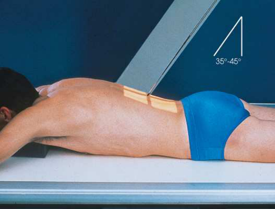
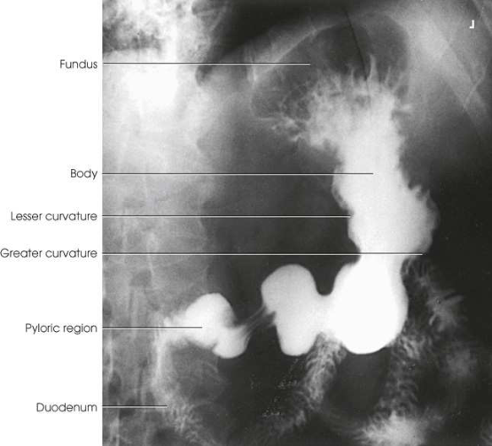

# Rx Stomac și Duoden (Tranzit Baritat) — Incidență PA Axială (Merrill)

  📷 Radiografie Convențională (Rx)
  <strong>Actualizat:</strong> 2026-09-16
  <strong>Autor:</strong> Referință Merrill

---

-   __1. Rezumat Clinic & Indicații__

    ---

    === "Indicații Clinice"

        - Conform reperelor anatomice standard din tratat

    === "Ghid Național IRIS"

        !!! info "Referință Primară: Ghidul Național IRIS (Ordinul MS 1342/2012)"
            - **Capitol Ghid IRIS:** *Ghidul Național IRIS*
            - **Grad de Recomandare:** **De verificat pe indicație; fără grad atribuit automat**
            - **Nivel de Iradiere Estimată:** `De verificat pentru examinarea și populația selectate`

            [:octicons-search-16: Deschide Ghidul IRIS](../../iris.md){ .md-button .md-button--primary } [:material-open-in-new: Aplicația Oficială PWA](https://radiologie-pediatrica.ro/iris/){ .md-button target="_blank" rel="noopener" }
-   __2. Poziționare & Centrare Fascicul__

    ---

    - **Poziție Pacient:** se așază pacientul în Decubit ventral poziție.; se ajustează pacient’s corp astfel încât MSP este centrat pe grila. pentru sthenic pacient, se centrează receptorul de imagine la nivelul L2 (Fig. 15.65), la about 1 la 2 inches (2.5 la 5 cm) above lower rib margin; center it higher pentru hypersthenic pacient și lower pentru asthenic pacient. se efectuează ecranarea gonadelor cu șorț plumbat.
    - **Punct de Centrare Fascicul:** Orientat spre punctul central al receptorului de imagine la un unghi de 35 la 45 grade cranial. Gugliantini 10 recommended cephalic angulation de 20 la 25 grade la show stomach în infants.
    - **Distanță Focar-Film (DFF / SID):** Nespecificat în fragmentul extras; de verificat în sursă
    - **Comandă Respiratorie:** Apnee pe durata expunerii la end de expiration unless otherwise requested.

-   __3. Parametri Tehnici Expunere__

    ---

    | Parametru Tehnic | Valoare Configurare Generator / Tub |
    |:-----------------|:-------------------------------------|
    | **Tensiune Tub (kV)** | DE CONFIGURAT PE APARAT |
    | **Sarcină / Produs Curent-Timp (mAs)** | DE CONFIGURAT PE APARAT |
    | **Distanță Focar-Film (DFF / SID)** | Nespecificat în fragmentul extras; de verificat în sursă |
    | **Grilă Antidifuzoare (Bucky)** | DE CONFIGURAT PE APARAT |
    | **Dimensiune Focar** | DE CONFIGURAT PE APARAT |
    | **Camere de Ionizare AEC** | DE CONFIGURAT PE APARAT |
    | **Colimare Fascicul** | se ajustează câmp de iradiere la fie fără larger than 14 × 17 inches (35 × 43 cm). Se plasează markerul de lateralitate în câmpul colimat. |
    | **Filtrare Tub** | DE CONFIGURAT PE APARAT |

-   __4. Criterii de Calitate & Reușită Imagine__

    ---

    - following trebuie să clearly fie seen:
    - Colimare adecvată vizibilă și prezența markerului de lateralitate (D/S) plasat clear de anatomy de interest
    - Entire stomach și proximal duodenum
    - Stomach centrat la nivelul level de pylorus
    - Penetration de contrast medium
    - Surrounding anatomy

-   __5. Protecție Radiologică (ALARA)__

    ---

    - Nespecificat în fragmentul extras; de verificat în sursă

!!! note "Observații Clinice & Tehnice"
    Conform reperelor anatomice standard din tratat

### 🖼️ Imagini

<figure class="protocol-image-card" markdown>

<figcaption><strong>Merrill — pagina PDF 1113, imaginea 1</strong> — Imagine din fragmentul sursă; asocierea necesită revizie.</figcaption>

</figure>

<figure class="protocol-image-card" markdown>

<figcaption><strong>Merrill — pagina PDF 1114, imaginea 2</strong> — Imagine din fragmentul sursă; asocierea necesită revizie.</figcaption>

</figure>

=== "Ghid Rapid de Execuție"

    1. **Identificarea și verificarea pacientului:** verificare identitate, zonă de examinat, consimțământ conform procedurii și evaluarea posibilității unei sarcini, când este relevantă.
    2. **Pregătire:** îndepărtarea oricăror obiecte radiopace (bijuterii, agrafe, fermoare, proteze, pansamente dense).
    3. **Poziționare precisă:** alinierea receptorului de imagine și a tubului la distanța prescrisă (Nespecificat în fragmentul extras; de verificat în sursă).
    4. **Colimare strictă:** adaptarea fasciculului strict la regiunea de diagnostic pentru scăderea iradierii și reducerea radiației difuze.
    5. **Radioprotecție:** verificarea [politicii RX](../radioprotectie.md), cu măsuri distincte pentru pacient, personal și însoțitor.

## Surse de documentare

- [Merrill’s Atlas, 15. Digestive System: Salivary Glands, Alimentary Canal, And Biliary System, pagini PDF 1112–1114](../../assets/protocols/sources/a56d45c16829_Merrills_Atlas_of_Radiographic_Positioning__Procedures_3Vol_Set.pdf#page=1112)

## Fragmente sursă traduse (referință tehnică)

### anatomy

Gordon 11 developed PA axial incidență la “open up” high, orizontal (hypersthenic-type) stomach la show greater și lesser
curvatures, antral portion de stomach, pyloric canal, și duodenal bulb. resultant imagine gives hypersthenic stomach much
same configuration ca average sthenic type de stomach (Fig. 15.66).

### collimation

• se ajustează câmp de iradiere la fie fără larger than 14 × 17 inches (35 × 43 cm). Se plasează markerul de lateralitate în câmpul colimat.

### cr

• Orientat spre punctul central al receptorului de imagine la un unghi de 35 la 45 grade cranial. Gugliantini 10 recommended cephalic angulation de 20 la 25
grade la show stomach în infants.

### criteria

following trebuie să clearly fie seen:
• Colimare adecvată vizibilă și prezența markerului de lateralitate (D/S) plasat clear de anatomy de interest
• Entire stomach și proximal duodenum
• Stomach centrat la nivelul level de pylorus
• Penetration de contrast medium
• Surrounding anatomy

### part_pos

• se ajustează pacient’s corp astfel încât MSP este centrat pe grila.
• pentru sthenic pacient, se centrează receptorul de imagine la nivelul L2 (Fig. 15.65), la about 1 la 2 inches (2.5 la 5 cm) above lower rib margin; center it
higher pentru hypersthenic pacient și lower pentru asthenic pacient.
• se efectuează ecranarea gonadelor cu șorț plumbat.

### patient_pos

• se așază pacientul în decubit ventral.

### respiration

Apnee pe durata expunerii la end de expiration unless otherwise requested.

### tech

poziționat prin manufacturer sau department protocol pentru corect anatomy display orientation; raza centrală plate: 10 × 12 inches (24 ×
30 cm) sau 14 × 17 inches (35 × 43 cm) longitudinal.

