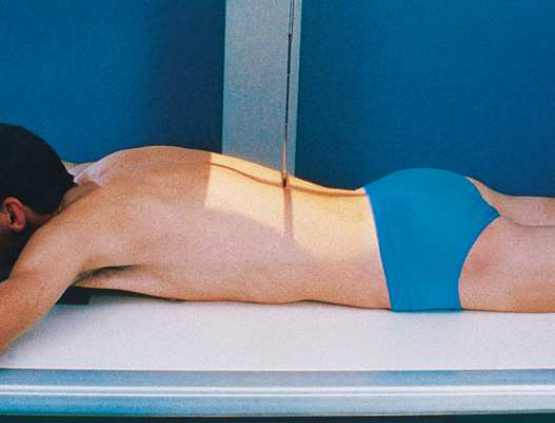
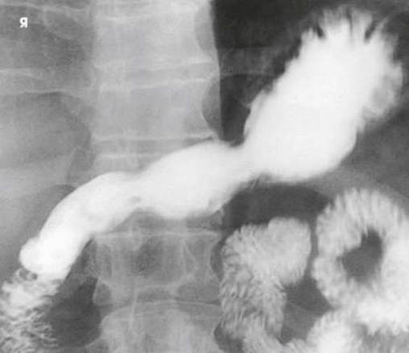
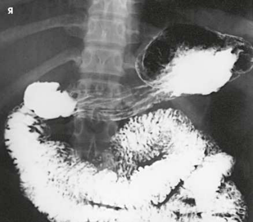
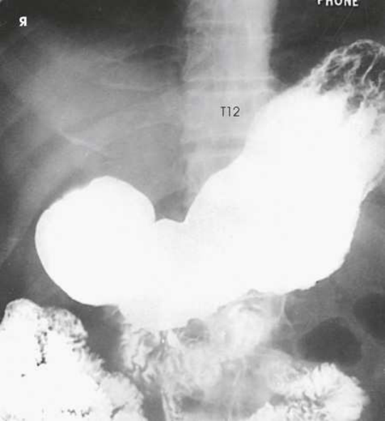
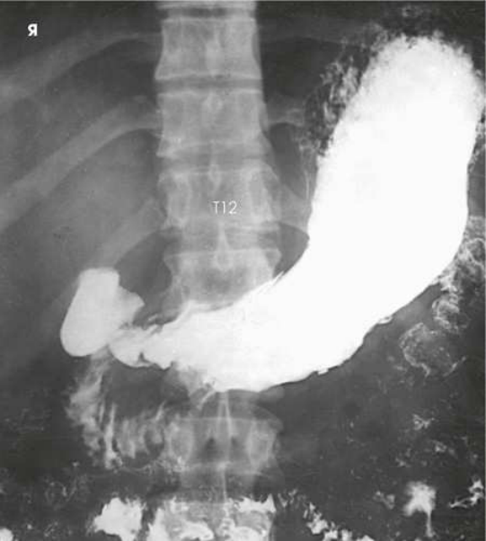
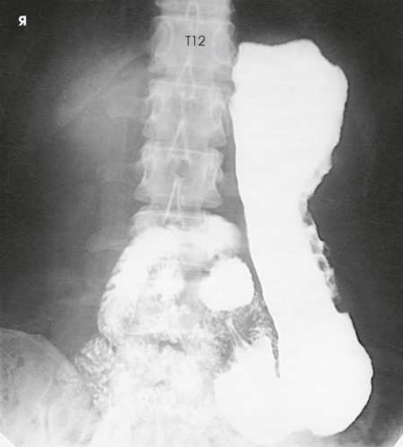
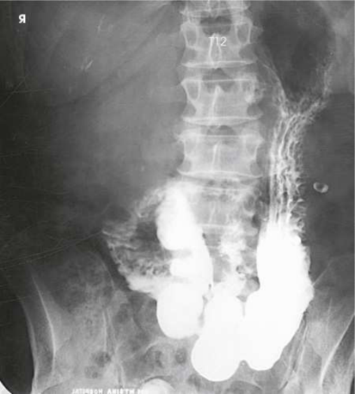

# Rx Stomac și Duoden (Tranzit Baritat) — Incidență Postero-Anterioară (PA) (Merrill)

  📷 Radiografie Convențională (Rx)
  <strong>Actualizat:</strong> 2026-09-16
  <strong>Autor:</strong> Referință Merrill

---

-   __1. Rezumat Clinic & Indicații__

    ---

    === "Indicații Clinice"

        - Conform reperelor anatomice standard din tratat

    === "Ghid Național IRIS"

        !!! info "Referință Primară: Ghidul Național IRIS (Ordinul MS 1342/2012)"
            - **Capitol Ghid IRIS:** *Ghidul Național IRIS*
            - **Grad de Recomandare:** **De verificat pe indicație; fără grad atribuit automat**
            - **Nivel de Iradiere Estimată:** `De verificat pentru examinarea și populația selectate`

            [:octicons-search-16: Deschide Ghidul IRIS](../../iris.md){ .md-button .md-button--primary } [:material-open-in-new: Aplicația Oficială PWA](https://radiologie-pediatrica.ro/iris/){ .md-button target="_blank" rel="noopener" }
-   __2. Poziționare & Centrare Fascicul__

    ---

    - **Poziție Pacient:** pentru radiographic studies de stomac și duoden, se așază pacientul în Decubit poziție. ortostatism este sometimes used la show relative poziție de stomach. When adjusting thin pacienți în Decubit ventral poziție, support weight de corp pe pillows sau other suitable pads poziționat under thorax și Bazin (bazin (pelvis)). This adjustment keeps stomach sau duodenum de la pressing pe / sprijinit de vertebre, cu resultant pressure- filling defects.; se ajustează pacient’s poziție Decubit sau în ortostatism astfel încât linia mediană grilă coincides cu plan sagital passing halfway între coloană vertebrală și stâng lateral margine de abdomenul (Fig. 15.58). se centrează receptorul de imagine about 1 la 2 inches (2.5 la 5 cm) above lower rib margin la nivelul L1-L2 when pacientul este Decubit ventral (Figs. 15.59 și 15.60). pentru în ortostatism imagini, se centrează receptorul de imagine 3 la 6 inches (7.6 la 15 cm) lower than L1-L2. greatest visceral movement între Decubit ventral și în ortostatism poziții occurs în asthenic pacienți. se efectuează ecranarea gonadelor cu șorț plumbat.
    - **Punct de Centrare Fascicul:** perpendicular pe centrul receptorului de imagine.
    - **Distanță Focar-Film (DFF / SID):** Nespecificat în fragmentul extras; de verificat în sursă
    - **Comandă Respiratorie:** Apnee la sfârșitul expirului complet unless otherwise requested.

-   __3. Parametri Tehnici Expunere__

    ---

    | Parametru Tehnic | Valoare Configurare Generator / Tub |
    |:-----------------|:-------------------------------------|
    | **Tensiune Tub (kV)** | DE CONFIGURAT PE APARAT |
    | **Sarcină / Produs Curent-Timp (mAs)** | DE CONFIGURAT PE APARAT |
    | **Distanță Focar-Film (DFF / SID)** | Nespecificat în fragmentul extras; de verificat în sursă |
    | **Grilă Antidifuzoare (Bucky)** | DE CONFIGURAT PE APARAT |
    | **Dimensiune Focar** | DE CONFIGURAT PE APARAT |
    | **Camere de Ionizare AEC** | DE CONFIGURAT PE APARAT |
    | **Colimare Fascicul** | se ajustează câmp de iradiere la fără larger than 10 × 12 inches (24 × 30 cm) pentru smaller pacienți sau 11 × 14 inches (28 × 35 cm) pentru larger pacienți. Se plasează markerul de lateralitate în câmpul colimat. |
    | **Filtrare Tub** | DE CONFIGURAT PE APARAT |

-   __4. Criterii de Calitate & Reușită Imagine__

    ---

    - Criterii radiologice de calitate imaginii:
    - Colimare adecvată vizibilă și prezența markerului de lateralitate (D/S) plasat clear de anatomy de interest
    - Entire stomach și duodenal loop
    - Stomach centrat la nivelul level de pylorus
    - Absența rotației anatomice (simetrie bilaterală perfectă) de pacientul
    - Penetration de contrast medium
    - Surrounding anatomy

-   __5. Protecție Radiologică (ALARA)__

    ---

    - Nespecificat în fragmentul extras; de verificat în sursă

!!! note "Observații Clinice & Tehnice"
    A 14- × 17-inch (35- × 43-cm) expunere field este often used when distal esophagus sau intestin subțire este la fie visualized along cu stomach.

### 🖼️ Imagini

<figure class="protocol-image-card" markdown>

<figcaption><strong>Merrill — pagina PDF 1107, imaginea 1</strong> — Imagine din fragmentul sursă; asocierea necesită revizie.</figcaption>

</figure>

<figure class="protocol-image-card" markdown>

<figcaption><strong>Merrill — pagina PDF 1107, imaginea 2</strong> — Imagine din fragmentul sursă; asocierea necesită revizie.</figcaption>

</figure>

<figure class="protocol-image-card" markdown>

<figcaption><strong>Merrill — pagina PDF 1108, imaginea 3</strong> — Imagine din fragmentul sursă; asocierea necesită revizie.</figcaption>

</figure>

<figure class="protocol-image-card" markdown>

<figcaption><strong>Merrill — pagina PDF 1109, imaginea 4</strong> — Imagine din fragmentul sursă; asocierea necesită revizie.</figcaption>

</figure>

<figure class="protocol-image-card" markdown>

<figcaption><strong>Merrill — pagina PDF 1110, imaginea 5</strong> — Imagine din fragmentul sursă; asocierea necesită revizie.</figcaption>

</figure>

<figure class="protocol-image-card" markdown>

<figcaption><strong>Merrill — pagina PDF 1111, imaginea 6</strong> — Imagine din fragmentul sursă; asocierea necesită revizie.</figcaption>

</figure>

<figure class="protocol-image-card" markdown>

<figcaption><strong>Merrill — pagina PDF 1112, imaginea 7</strong> — Imagine din fragmentul sursă; asocierea necesită revizie.</figcaption>

</figure>

=== "Ghid Rapid de Execuție"

    1. **Identificarea și verificarea pacientului:** verificare identitate, zonă de examinat, consimțământ conform procedurii și evaluarea posibilității unei sarcini, când este relevantă.
    2. **Pregătire:** îndepărtarea oricăror obiecte radiopace (bijuterii, agrafe, fermoare, proteze, pansamente dense).
    3. **Poziționare precisă:** alinierea receptorului de imagine și a tubului la distanța prescrisă (Nespecificat în fragmentul extras; de verificat în sursă).
    4. **Colimare strictă:** adaptarea fasciculului strict la regiunea de diagnostic pentru scăderea iradierii și reducerea radiației difuze.
    5. **Radioprotecție:** verificarea [politicii RX](../radioprotectie.md), cu măsuri distincte pentru pacient, personal și însoțitor.

## Surse de documentare

- [Merrill’s Atlas, 15. Digestive System: Salivary Glands, Alimentary Canal, And Biliary System, pagini PDF 1106–1112](../../assets/protocols/sources/a56d45c16829_Merrills_Atlas_of_Radiographic_Positioning__Procedures_3Vol_Set.pdf#page=1106)

## Fragmente sursă traduse (referință tehnică)

### anatomy

PA incidență de contour de barium-filled stomach și duodenal bulb este vizualizat. ortostatism shows size, shape, și relative
poziție de filled stomach, but it does nu adequately show unfilled fundic portion de organ. în decubit ventral, stomach moves
superiorly 1
la 4 inches (3.8 la 10 cm) according la pacientul’s corp habitus (Figs. 15.61–15.64). la same time, stomach spreads horizontally, cu comparable decrease în its length. (Note that fundus usually fills în asthenic pacienți.)
pyloric canal și duodenal bulb sunt well vizualizat în pacienți cu asthenic sau hyposthenic habitus. These structures sunt often
partially obscured în pacienți cu sthenic habitus și, except în PA axial incidență, sunt completely obscured prin prepyloric portion de
stomach în pacienți cu hypersthenic habitus.

### collimation

• se ajustează câmp de iradiere la fără larger than 10 × 12 inches (24 × 30 cm) pentru smaller pacienți sau 11 × 14 inches (28 × 35 cm) pentru larger
pacienți. Se plasează markerul de lateralitate în câmpul colimat.

### cr

• perpendicular pe centrul receptorului de imagine.

### criteria

Criterii radiologice de calitate imaginii:
• Colimare adecvată vizibilă și prezența markerului de lateralitate (D/S) plasat clear de anatomy de interest
• Entire stomach și duodenal loop
• Stomach centrat la nivelul level de pylorus
• Absența rotației anatomice (simetrie bilaterală perfectă) de pacientul
• Penetration de contrast medium
• Surrounding anatomy

### notes

A 14- × 17-inch (35- × 43-cm) expunere field este often used when distal esophagus sau intestin subțire este la fie visualized along cu
stomach.

### part_pos

• se ajustează pacient’s poziție recumbent sau în ortostatism astfel încât linia mediană grilă coincides cu plan sagital passing halfway
între coloană vertebrală și stâng lateral margine de abdomenul (Fig. 15.58).
• se centrează receptorul de imagine about 1 la 2 inches (2.5 la 5 cm) above lower rib margin la nivelul L1-L2 when pacientul este în decubit ventral (Figs. 15.59 și
15.60).
• pentru în ortostatism imagini, se centrează receptorul de imagine 3 la 6 inches (7.6 la 15 cm) lower than L1-L2. greatest visceral movement între în decubit ventral și
în ortostatism poziții occurs în asthenic pacienți.
• se efectuează ecranarea gonadelor cu șorț plumbat.

### patient_pos

• pentru radiographic studies de stomac și duoden, se așază pacientul în recumbent poziție. ortostatism este sometimes
used la show relative poziție de stomach.
• When adjusting thin pacienți în decubit ventral, support weight de corp pe pillows sau other suitable pads poziționat under
thorax și bazin (pelvis). This adjustment keeps stomach sau duodenum de la pressing pe / sprijinit de vertebre, cu resultant pressure-
filling defects.

### respiration

Apnee la sfârșitul expirului complet unless otherwise requested.

### tech

poziționat prin manufacturer sau department protocol pentru corect anatomy display orientation; raza centrală plate: 10 × 12 inches (24 ×
30 cm) sau 14 × 17 inches (35 × 43 cm) longitudinal.

