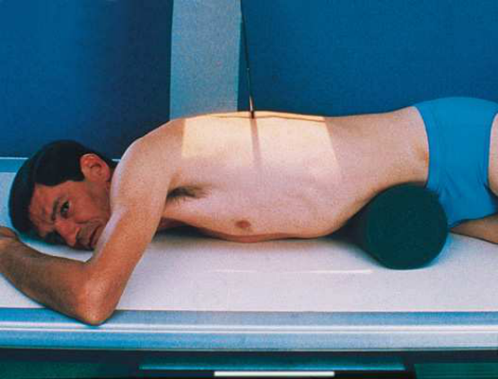
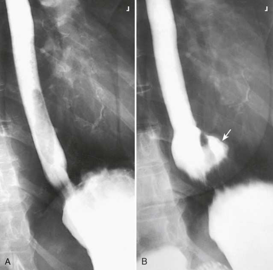

# Rx Stomac Proximal și Esofag Distal — Oblică Postero-Anterioară (PA) — Metoda Wolf (Hernie Hiatala) Oblică Anterioară Dreaptă (OAD / RAO) (Merrill)

  📷 Radiografie Convențională (Rx)
  <strong>Actualizat:</strong> 2026-09-16
  <strong>Autor:</strong> Referință Merrill

---

-   __1. Rezumat Clinic & Indicații__

    ---

    === "Indicații Clinice"

        - Conform reperelor anatomice standard din tratat

    === "Ghid Național IRIS"

        !!! info "Referință Primară: Ghidul Național IRIS (Ordinul MS 1342/2012)"
            - **Capitol Ghid IRIS:** *Ghidul Național IRIS*
            - **Grad de Recomandare:** **De verificat pe indicație; fără grad atribuit automat**
            - **Nivel de Iradiere Estimată:** `De verificat pentru examinarea și populația selectate`

            [:octicons-search-16: Deschide Ghidul IRIS](../../iris.md){ .md-button .md-button--primary } [:material-open-in-new: Aplicația Oficială PWA](https://radiologie-pediatrica.ro/iris/){ .md-button target="_blank" rel="noopener" }
-   __2. Poziționare & Centrare Fascicul__

    ---

    - **Poziție Pacient:** se așază pacientul în Decubit ventral poziție pe masa radiologică.; Se instruiește pacientul să assume modified Genunchi-Torace poziție during placement de compression device. Place compression device horizontally under abdomenul și just below costal margin. se ajustează pacient în a 40- la 45-grade poziție oblică anterioară dreaptă (OAD / RAO), cu thorax centrat pe linia mediană grilă. Se instruiește pacientul să ingest barium suspension în rapid, continuous swallows. la allow pentru complete filling de esophagus, Se declanșează expunerea during third sau fourth swallow. se efectuează ecranarea gonadelor cu șorț plumbat.
    - **Punct de Centrare Fascicul:** perpendicular pe axa longitudinală de pacientul’s back și centrat la nivelul level de T6 sau T7. This poziție usually results în 10- la 20- grade caudal angulation de raza centrală.
    - **Distanță Focar-Film (DFF / SID):** Nespecificat în fragmentul extras; de verificat în sursă
    - **Comandă Respiratorie:** Apnee la sfârșitul expirului complet.

-   __3. Parametri Tehnici Expunere__

    ---

    | Parametru Tehnic | Valoare Configurare Generator / Tub |
    |:-----------------|:-------------------------------------|
    | **Tensiune Tub (kV)** | DE CONFIGURAT PE APARAT |
    | **Sarcină / Produs Curent-Timp (mAs)** | DE CONFIGURAT PE APARAT |
    | **Distanță Focar-Film (DFF / SID)** | Nespecificat în fragmentul extras; de verificat în sursă |
    | **Grilă Antidifuzoare (Bucky)** | DE CONFIGURAT PE APARAT |
    | **Dimensiune Focar** | DE CONFIGURAT PE APARAT |
    | **Camere de Ionizare AEC** | DE CONFIGURAT PE APARAT |
    | **Colimare Fascicul** | se ajustează câmp de iradiere la fără larger than 14 × 17 inches (35 × 43 cm). Se plasează markerul de lateralitate în câmpul colimat. |
    | **Filtrare Tub** | DE CONFIGURAT PE APARAT |

-   __4. Criterii de Calitate & Reușită Imagine__

    ---

    - Criterii radiologice de calitate imaginii:
    - Colimare adecvată vizibilă și prezența markerului de lateralitate (D/S) plasat clear de anatomy de interest
    - Middle sau distal aspects de esophagus și upper aspect de stomach
    - Esophagus vizibil între coloană vertebrală și cordul
    - Penetration de contrast medium
    - Surrounding anatomy

-   __5. Protecție Radiologică (ALARA)__

    ---

    - Nespecificat în fragmentul extras; de verificat în sursă

!!! note "Observații Clinice & Tehnice"
    Valsalva maneuver also increases intra-abdominal pressure și poate fie used instead de Wolf method.

### 🖼️ Imagini

<figure class="protocol-image-card" markdown>

<figcaption><strong>Merrill — pagina PDF 1127, imaginea 1</strong> — Imagine din fragmentul sursă; asocierea necesită revizie.</figcaption>

</figure>

<figure class="protocol-image-card" markdown>

<figcaption><strong>Merrill — pagina PDF 1128, imaginea 2</strong> — Imagine din fragmentul sursă; asocierea necesită revizie.</figcaption>

</figure>

=== "Ghid Rapid de Execuție"

    1. **Identificarea și verificarea pacientului:** verificare identitate, zonă de examinat, consimțământ conform procedurii și evaluarea posibilității unei sarcini, când este relevantă.
    2. **Pregătire:** îndepărtarea oricăror obiecte radiopace (bijuterii, agrafe, fermoare, proteze, pansamente dense).
    3. **Poziționare precisă:** alinierea receptorului de imagine și a tubului la distanța prescrisă (Nespecificat în fragmentul extras; de verificat în sursă).
    4. **Colimare strictă:** adaptarea fasciculului strict la regiunea de diagnostic pentru scăderea iradierii și reducerea radiației difuze.
    5. **Radioprotecție:** verificarea [politicii RX](../radioprotectie.md), cu măsuri distincte pentru pacient, personal și însoțitor.

## Surse de documentare

- [Merrill’s Atlas, 15. Digestive System: Salivary Glands, Alimentary Canal, And Biliary System, pagini PDF 1126–1128](../../assets/protocols/sources/a56d45c16829_Merrills_Atlas_of_Radiographic_Positioning__Procedures_3Vol_Set.pdf#page=1126)

## Fragmente sursă traduse (referință tehnică)

### anatomy

relationship de stomach la cupole diafragmatice și este useful în diagnosing hiatal hernia (Fig. 15.81).

### collimation

• se ajustează câmp de iradiere la fără larger than 14 × 17 inches (35 × 43 cm). Se plasează markerul de lateralitate în câmpul colimat.

### cr

• perpendicular pe axa longitudinală de pacientul’s back și centrat la nivelul level de T6 sau T7. This poziție usually results în 10- la 20-
grade caudal angulation de raza centrală.

### criteria

Criterii radiologice de calitate imaginii:
• Colimare adecvată vizibilă și prezența markerului de lateralitate (D/S) plasat clear de anatomy de interest
• Middle sau distal aspects de esophagus și upper aspect de stomach
• Esophagus vizibil între coloană vertebrală și cordul
• Penetration de contrast medium
• Surrounding anatomy

### notes

Valsalva maneuver also increases intra-abdominal pressure și poate fie used instead de Wolf method.

### part_pos

• Se instruiește pacientul să assume modified genunchi-chest poziție during placement de compression device.
• Place compression device horizontally under abdomenul și just below costal margin.
• se ajustează pacient în a 40- la 45-grade poziție oblică anterioară dreaptă (OAD / RAO), cu thorax centrat pe linia mediană grilă.
• Se instruiește pacientul să ingest barium suspension în rapid, continuous swallows.
• la allow pentru complete filling de esophagus, Se declanșează expunerea during third sau fourth swallow.
• se efectuează ecranarea gonadelor cu șorț plumbat.

### patient_pos

• se așază pacientul în decubit ventral pe masa radiologică.

### respiration

Apnee la sfârșitul expirului complet.

### tech

poziționat prin manufacturer sau department protocol pentru corect anatomy display orientation; raza centrală plate: 14 × 17 inches (35 ×
43 cm) longitudinal.
Wolf method 12 este modification de Trendelenburg poziție. technique was developed pentru purpose de applying greater intra-
abdominal pressure than este provided prin corp angulation alone și ensuring more consistent results în radiographic demonstration de small,
sliding gastroesophageal herniations through esophageal hiatus.
Wolf method requires use de semicylindric radiolucent compression device measuring 22 inches (55 cm) în length, 10 inches (24 cm) în
width, și 8 inches (20 cm) în height. (compression sponge depicted în Fig. 15.80 este slightly smaller than one described prin Wolf.)
Wolf și Guglielmo 13 stated that this compression device nu only provides Trendelenburg angulation de pacientul’s trunk, but it also
increases intra-abdominal pressure enough la permit adecvat contrast filling și maximal distention de entire esophagus. further
advantage de device este that it does nu require angulation de masa de examinare; pacientul poate hold barium container și ingest barium
suspension through straw cu comparative ease.

