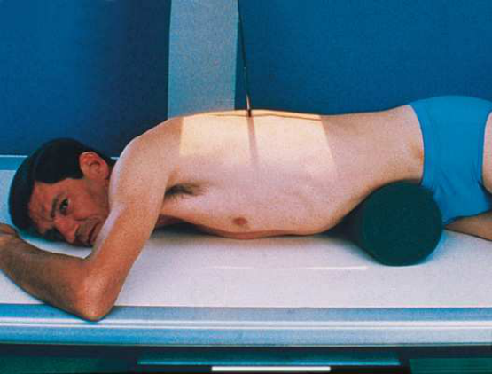
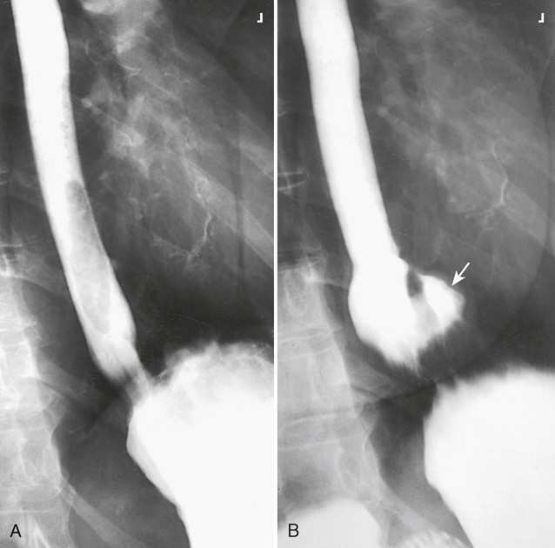

# Rx Stomac Proximal și Esofag Distal — Oblică Postero-Anterioară (PA) — Metoda Wolf (Hernie Hiatală) Oblică Anterioară Dreaptă (OAD / RAO) (Merrill)

  📷 Radiografie Convențională (Rx)
  <strong>Actualizat:</strong> 2026-09-16
  <strong>Autor:</strong> Referință Merrill

---

-   __1. Rezumat Clinic & Indicații__

    ---

    === "Indicații Clinice"

        - Conform reperelor anatomice standard din tratat

    === "Ghid Național IRIS"

        !!! info "Referință Primară: Ghidul Național IRIS (Ordinul MS 1342/2012)"
            - **Capitol Ghid IRIS:** *Ghidul Național IRIS*
            - **Grad de Recomandare:** **De verificat pe indicație; fără grad atribuit automat**
            - **Nivel de Iradiere Estimată:** `De verificat pentru examinarea și populația selectate`

            [:octicons-search-16: Deschide Ghidul IRIS](../../iris.md){ .md-button .md-button--primary } [:material-open-in-new: Aplicația Oficială PWA](https://radiologie-pediatrica.ro/iris/){ .md-button target="_blank" rel="noopener" }
-   __2. Poziționare & Centrare Fascicul__

    ---

    - **Poziție Pacient:** Se așază pacientul în decubit ventral pe masa radiologică. Se instruiește pacientul să adopte o poziție genupectorală modificată în timpul plasării dispozitivului de compresiune. Se plasează dispozitivul de compresiune orizontal sub abdomen, imediat sub rebordul costal. Se poziționează pacientul în poziție oblică anterioară dreaptă (OAD / RAO) de 40 până la 45 grade, cu toracele centrat pe linia mediană a grilei. Se instruiește pacientul să ingereze suspensia de bariu prin înghițituri rapide și continue. Pentru a permite umplerea completă a esofagului, se declanșează expunerea în timpul celei de-a treia sau celei de-a patra înghițituri. se efectuează ecranarea gonadelor cu șorț plumbat.
    - **Punct de Centrare Fascicul:** Perpendicular pe axa longitudinală a spatelui pacientului și centrat la nivelul T6 sau T7. Această poziție determină de obicei o angulare caudală de 10 până la 20 grade a razei centrale.
    - **Distanță Focar-Film (DFF / SID):** Nespecificat în fragmentul extras; de verificat în sursă
    - **Comandă Respiratorie:** Apnee la sfârșitul expirului complet.

-   __3. Parametri Tehnici Expunere__

    ---

    | Parametru Tehnic | Valoare Configurare Generator / Tub |
    |:-----------------|:-------------------------------------|
    | **Tensiune Tub (kV)** | DE CONFIGURAT PE APARAT |
    | **Sarcină / Produs Curent-Timp (mAs)** | DE CONFIGURAT PE APARAT |
    | **Distanță Focar-Film (DFF / SID)** | Nespecificat în fragmentul extras; de verificat în sursă |
    | **Grilă Antidifuzoare (Bucky)** | DE CONFIGURAT PE APARAT |
    | **Dimensiune Focar** | DE CONFIGURAT PE APARAT |
    | **Camere de Ionizare AEC** | DE CONFIGURAT PE APARAT |
    | **Colimare Fascicul** | Se ajustează câmpul de iradiere astfel încât să nu depășească 14 × 17 țoli (35 × 43 cm). Se plasează markerul de lateralitate în câmpul colimat. |
    | **Filtrare Tub** | DE CONFIGURAT PE APARAT |

-   __4. Criterii de Calitate & Reușită Imagine__

    ---

    - Criterii radiologice de calitate a imaginii:
    - Colimare adecvată vizibilă și prezența markerului de lateralitate (D/S) plasat în afara structurilor anatomice de interes
    - Porțiunile mijlocii sau distale ale esofagului și porțiunea superioară a stomacului
    - Esofagul vizibil între coloana vertebrală și cord
    - Penetrarea substanței de contrast
    - Structurile anatomice învecinate

-   __5. Protecție Radiologică (ALARA)__

    ---

    - Nespecificat în fragmentul extras; de verificat în sursă

!!! note "Observații Clinice & Tehnice"
    Manevra Valsalva crește, de asemenea, presiunea intraabdominală și poate fi utilizată în locul metodei Wolf.

### 🖼️ Imagini

<figure class="protocol-image-card" markdown>

<figcaption><strong>Merrill — pagina 1127, imaginea 1</strong> — Imagine din fragmentul sursă; asocierea necesită revizie.</figcaption>

</figure>

<figure class="protocol-image-card" markdown>

<figcaption><strong>Merrill — pagina 1128, imaginea 2</strong> — Imagine din fragmentul sursă; asocierea necesită revizie.</figcaption>

</figure>

=== "Ghid Rapid de Execuție"

    1. **Identificarea și verificarea pacientului:** verificare identitate, zonă de examinat, consimțământ conform procedurii și evaluarea posibilității unei sarcini, când este relevantă.
    2. **Pregătire:** îndepărtarea oricăror obiecte radiopace (bijuterii, agrafe, fermoare, proteze, pansamente dense).
    3. **Poziționare precisă:** alinierea receptorului de imagine și a tubului la distanța prescrisă (Nespecificat în fragmentul extras; de verificat în sursă).
    4. **Colimare strictă:** adaptarea fasciculului strict la regiunea de diagnostic pentru scăderea iradierii și reducerea radiației difuze.
    5. **Radioprotecție:** verificarea [politicii RX](../radioprotectie.md), cu măsuri distincte pentru pacient, personal și însoțitor.

## Surse de documentare

- [Merrill’s Atlas, 15. Digestive System: Salivary Glands, Alimentary Canal, And Biliary System, pagini 1126–1128](https://books.google.com/books/about/Merrill_s_Atlas_of_Radiographic_Position.html?id=BM0lEQAAQBAJ)

## Fragmente sursă traduse (referință tehnică)

### anatomie

Raportul stomacului cu cupolele diafragmatice și este utilă în diagnosticarea herniei hiatale (Fig. 15.81).

### colimare

• Se ajustează câmpul de iradiere astfel încât să nu depășească 14 × 17 țoli (35 × 43 cm). Se plasează markerul de lateralitate în câmpul colimat.

### raza centrală

• Perpendicular pe axa longitudinală a spatelui pacientului și centrat la nivelul T6 sau T7. Această poziție determină de obicei o angulare caudală de 10 până la 20 grade a razei centrale.

### criterii

Criterii radiologice de calitate a imaginii:
• Colimare adecvată vizibilă și prezența markerului de lateralitate (D/S) plasat fără a se suprapune peste anatomia de interes
• Porțiunile mijlocii sau distale ale esofagului și porțiunea superioară a stomacului
• Esofagul vizibil între coloana vertebrală și cord
• Penetrarea mediului de contrast
• Anatomia înconjurătoare

### note

Manevra Valsalva crește, de asemenea, presiunea intraabdominală și poate fi utilizată în locul metodei Wolf.

### part_pos

• Se instruiește pacientul să adopte o poziție genupectorală modificată în timpul plasării dispozitivului de compresiune.
• Se plasează dispozitivul de compresiune orizontal sub abdomen, imediat sub rebordul costal.
• Se poziționează pacientul în poziție oblică anterioară dreaptă (OAD / RAO) de 40 până la 45 grade, cu toracele centrat pe linia mediană a grilei.
• Se instruiește pacientul să ingereze suspensia de bariu prin înghițituri rapide și continue.
• Pentru a permite umplerea completă a esofagului, se declanșează expunerea în timpul celei de-a treia sau celei de-a patra înghițituri.
• se efectuează ecranarea gonadelor cu șorț plumbat.

### patient_pos

• se așază pacientul în decubit ventral pe masa radiologică.

### respirație

Apnee la sfârșitul expirului complet.

### tehnică

Poziționat conform indicațiilor producătorului sau protocolului departamentului pentru orientarea corectă a afișării anatomiei; placa razei centrale: 14 × 17 țoli (35 × 43 cm), longitudinal.
Metoda Wolf 12 este o modificare a poziției Trendelenburg. Tehnica a fost dezvoltată pentru a aplica o presiune intraabdominală mai mare decât cea obținută numai prin angularea corpului și pentru a asigura rezultate mai constante în evidențierea radiografică a hernierilor gastroesofagiene mici, prin alunecare, prin hiatusul esofagian.
Metoda Wolf necesită utilizarea unui dispozitiv de compresiune radiotransparent, semicilindric, cu lungimea de 22 țoli (55 cm), lățimea de 10 țoli (24 cm) și înălțimea de 8 țoli (20 cm). (Buretele de compresiune ilustrat în Fig. 15.80 este puțin mai mic decât cel descris de Wolf.)
Wolf și Guglielmo 13 au afirmat că acest dispozitiv de compresiune nu doar asigură angularea trunchiului pacientului în poziție Trendelenburg, ci și crește suficient presiunea intraabdominală pentru a permite umplerea adecvată cu substanță de contrast și distensia maximă a întregului esofag. Un alt avantaj al dispozitivului este că nu necesită angularea mesei de examinare; pacientul poate ține recipientul cu bariu și poate ingera suspensia de bariu printr-un pai cu relativă ușurință.

