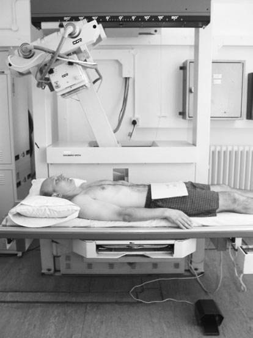
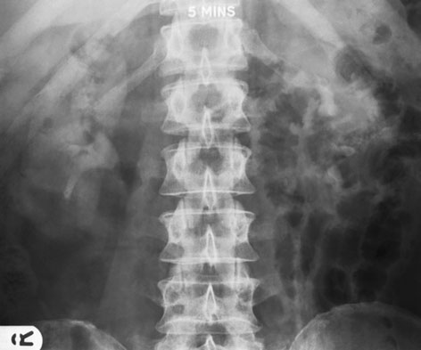
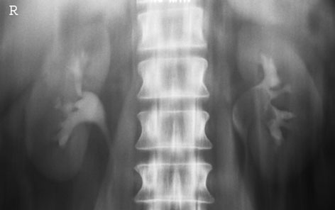

# Rx Tomografie Liniară Convențională Aparat Renal (Rinichi)

  📷 Radiografie Convențională (Rx)
  <strong>Actualizat:</strong> 2026-09-16
  <strong>Autor:</strong> Departamentul de Radiologie / Referință Clark (Ed. 12)

---

-   __1. Rezumat Clinic & Indicații__

    ---

    === "Indicații Clinice"

        - 487 16 Tomografie Liniară Convențională Aparat Renal (Rinichi) în this situation, Tomografie Liniară Convențională este often used ca simple, cheap și relatively effective method de imaging renal tract liber de overlying structures. Since structures that sunt required la fie visualized sunt relatively thick (Antero-posterior (AP) measurement), zonography, sau narrow-angle Tomografie Liniară Convențională, este used la produce large layer thickness. Tomografie Liniară Convențională este used during intravenous urography either la 10–20 minutes after injection, la diffuse shadows de gas that overlie calyces preventing their clear visualization, sau immediately pe completion de injection la show nephrogram stage. This latter method – nephrotomography – was used la differentiate între rinichi cysts și proces proliferativ tumoral și între intra- și extra-renal masses, but has been actively superseded prin ultrasound și CT.

    === "Ghid Național IRIS"

        !!! info "Referință Primară: Ghidul Național IRIS (Ordinul MS 1342/2012)"
            - **Capitol Ghid IRIS:** *Ghidul Național IRIS*
            - **Grad de Recomandare:** **De verificat pe indicație; fără grad atribuit automat**
            - **Nivel de Iradiere Estimată:** `De verificat pentru examinarea și populația selectate`

            [:octicons-search-16: Deschide Ghidul IRIS](../../iris.md){ .md-button .md-button--primary } [:material-open-in-new: Aplicația Oficială PWA](https://radiologie-pediatrica.ro/iris/){ .md-button target="_blank" rel="noopener" }
-   __2. Poziționare & Centrare Fascicul__

    ---

    - **Poziție Pacient:** • pacientul este Decubit dorsal pe masa de examinare, cu planul mediosagital de corp la drept-angles la și în linia mediană mesei.
    - **Punct de Centrare Fascicul:** • raza centrală verticală centrală este centred în linia mediană, midway între suprasternal notch și simfiză pubiană.
Pivot height
• 8–11 cm.
    - **Distanță Focar-Film (DFF / SID):** 100 cm
    - **Comandă Respiratorie:** Apnee pe durata expunerii (apnee în inspir pentru torace; expir pentru Abdomen/bazin).

-   __3. Parametri Tehnici Expunere__

    ---

    | Parametru Tehnic | Valoare Configurare Generator / Tub |
    |:-----------------|:-------------------------------------|
    | **Tensiune Tub (kV)** | DE CONFIGURAT PE APARAT |
    | **Sarcină / Produs Curent-Timp (mAs)** | Conform AEC / grosime anatomică |
    | **Distanță Focar-Film (DFF / SID)** | 100 cm |
    | **Grilă Antidifuzoare (Bucky)** | Conform grosimii anatomice (> 10-12 cm cu grilă) |
    | **Dimensiune Focar** | Focar Mic (0.6 mm) |
    | **Camere de Ionizare AEC** | DE CONFIGURAT PE APARAT |
    | **Colimare Fascicul** | Colimare strictă la aria anatomică de interes diagnostic |
    | **Filtrare Tub** | Totală ≥ 2.5 mm Al echivalent (conform Clark: 3.0 mm Al eq.) |

-   __4. Criterii de Calitate & Reușită Imagine__

    ---

    - Vizualizarea clară întregii arii anatomice (Tomografie Liniară Convențională).
    - Absența artefactelor de mișcare; trabeculație osoasă și contururi nete.
    - Densitate optică și contrast adecvate pentru diferențierea țesuturilor moi de structurile osoase.

-   __5. Protecție Radiologică (ALARA)__

    ---

    - Ecranare gonadică cu șorț plumbat dacă gonadele sunt în apropierea fasciculului util (regula ALARA).
    - Colimare precisă la dimensiunea anatomică strict necesară pentru reducerea dozei și a radiației difuze.
    - Verificarea posibilității unei sarcini la pacientele de vârstă fertilă înainte de expunere.

!!! note "Observații Clinice & Tehnice"
    trebuie să fie made when selecting pivot height.
Tomographic movement
• Linear 10 grade – zonography.
• Linear 30 grade – la blur out overlying bowel gas.
pacient poziționat pentru Tomografie Liniară Convențională de renal areas – note that during IVU abdominal compression este usually în place Five-minute post-contrast imagine cu bowel gas obscuring renal areas Tomografie Liniară Convențională imagine evidențiind renal areas liber de la gas shadows și mass în stâng renal pelvic region

### 🖼️ Imagini

<figure class="protocol-image-card" markdown>

<figcaption><strong>Tomografie Liniară Convențională imagine evidențiind renal areas liber de la gas shadows și a</strong> — Poziționare pacient și centrare fascicul conform Clark (Ed. 12)</figcaption>

</figure>

<figure class="protocol-image-card" markdown>

<figcaption><strong>Figura 2: Aspect radiografic / Poziționare (Clark Ed. 12)</strong> — Aspect radiografic / ghid de poziționare conform tratatului Clark (Ed. 12)</figcaption>

</figure>

<figure class="protocol-image-card" markdown>

<figcaption><strong>Figura 3: Aspect radiografic / Poziționare (Clark Ed. 12)</strong> — Aspect radiografic / ghid de poziționare conform tratatului Clark (Ed. 12)</figcaption>

</figure>

=== "Ghid Rapid de Execuție"

    1. **Identificarea și verificarea pacientului:** verificare identitate, zonă de examinat, consimțământ conform procedurii și evaluarea posibilității unei sarcini, când este relevantă.
    2. **Pregătire:** îndepărtarea oricăror obiecte radiopace (bijuterii, agrafe, fermoare, proteze, pansamente dense).
    3. **Poziționare precisă:** alinierea receptorului de imagine și a tubului la distanța prescrisă (100 cm).
    4. **Colimare strictă:** adaptarea fasciculului strict la regiunea de diagnostic pentru scăderea iradierii și reducerea radiației difuze.
    5. **Radioprotecție:** verificarea [politicii RX](../radioprotectie.md), cu măsuri distincte pentru pacient, personal și însoțitor.

## Surse de documentare

- [Clark's Positioning in Radiography (Ed. 12), Pagina 502](../../assets/protocols/sources/Clark___Positioning_in_Radiography__12th_edition.pdf#page=502)
