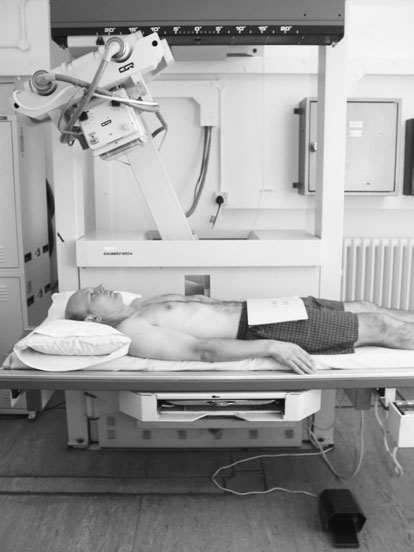
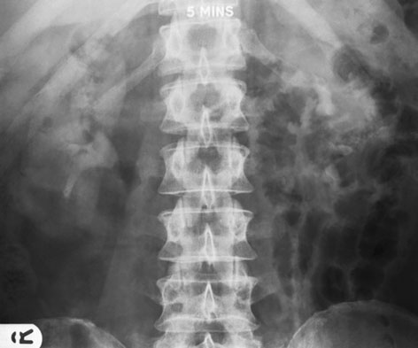
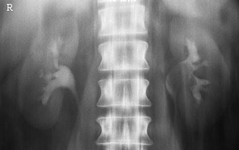

# Rx Tomografie Liniară Convențională Aparat Renal (Rinichi)

  📷 Radiografie Convențională (Rx)
  <strong>Actualizat:</strong> 2026-09-16
  <strong>Autor:</strong> Departamentul de Radiologie / Referință Clark (Ed. 12)

---

-   __1. Rezumat Clinic & Indicații__

    ---

    === "Indicații Clinice"

        - 487 16 Tomografie liniară convențională a aparatului renal (rinichi) În această situație, tomografia liniară convențională este adesea utilizată ca metodă simplă, ieftină și relativ eficientă de vizualizare a tractului urinar fără suprapunerea altor structuri. Deoarece structurile care trebuie vizualizate sunt relativ groase (dimensiunea antero-posterioară (AP)), se utilizează zonografia sau tomografia liniară convențională cu unghi îngust pentru a obține un strat de grosime mare. Tomografia liniară convențională se utilizează în timpul urografiei intravenoase, fie la 10–20 minute după injectare, pentru a estompa umbrele gazelor care se suprapun peste calice și împiedică vizualizarea lor clară, fie imediat după terminarea injectării, pentru a evidenția faza nefrografică. Această din urmă metodă – nefrotomografia – era utilizată pentru diferențierea chisturilor renale de procesele proliferative tumorale și a maselor intrarenale de cele extrarenale, dar a fost înlocuită în mod activ de ecografie și CT.

    === "Ghid Național IRIS"

        !!! info "Referință Primară: Ghidul Național IRIS (Ordinul MS 1342/2012)"
            - **Capitol Ghid IRIS:** *Ghidul Național IRIS*
            - **Grad de Recomandare:** **De verificat pe indicație; fără grad atribuit automat**
            - **Nivel de Iradiere Estimată:** `De verificat pentru examinarea și populația selectate`

            [:octicons-search-16: Deschide Ghidul IRIS](../../iris.md){ .md-button .md-button--primary } [:material-open-in-new: Aplicația Oficială PWA](https://radiologie-pediatrica.ro/iris/){ .md-button target="_blank" rel="noopener" }
-   __2. Poziționare & Centrare Fascicul__

    ---

    - **Poziție Pacient:** • Pacientul este în decubit dorsal pe masa de examinare, cu planul mediosagital al corpului în unghi drept față de masă și aliniat cu linia mediană a mesei.
    - **Punct de Centrare Fascicul:** • Raza centrală verticală este centrată pe linia mediană, la jumătatea distanței dintre incizura suprasternală și simfiza pubiană.
Înălțimea pivotului
• 8–11 cm.
    - **Distanță Focar-Film (DFF / SID):** 100 cm
    - **Comandă Respiratorie:** Apnee pe durata expunerii (apnee în inspir pentru torace; expir pentru Abdomen/bazin).

-   __3. Parametri Tehnici Expunere__

    ---

    | Parametru Tehnic | Valoare Configurare Generator / Tub |
    |:-----------------|:-------------------------------------|
    | **Tensiune Tub (kV)** | DE CONFIGURAT PE APARAT |
    | **Sarcină / Produs Curent-Timp (mAs)** | Conform AEC / grosimii anatomice |
    | **Distanță Focar-Film (DFF / SID)** | 100 cm |
    | **Grilă Antidifuzoare (Bucky)** | Conform grosimii anatomice (> 10-12 cm cu grilă) |
    | **Dimensiune Focar** | Focar Mic (0.6 mm) |
    | **Camere de Ionizare AEC** | DE CONFIGURAT PE APARAT |
    | **Colimare Fascicul** | Colimare strictă la aria anatomică de interes diagnostic |
    | **Filtrare Tub** | Totală ≥ 2.5 mm Al echivalent (conform Clark: 3.0 mm Al echivalent) |

-   __4. Criterii de Calitate & Reușită Imagine__

    ---

    - Vizualizarea clară a întregii arii anatomice (Tomografie Liniară Convențională).
    - Absența artefactelor de mișcare; trabeculație osoasă și contururi nete.
    - Densitate optică și contrast adecvate pentru diferențierea țesuturilor moi de structurile osoase.

-   __5. Protecție Radiologică (ALARA)__

    ---

    - Ecranare gonadică cu șorț plumbat dacă gonadele sunt în apropierea fasciculului util (regula ALARA).
    - Colimare precisă la dimensiunea anatomică strict necesară pentru reducerea dozei și a radiației difuze.
    - Verificarea posibilității unei sarcini la pacientele de vârstă fertilă înainte de expunere.

!!! note "Observații Clinice & Tehnice"
    trebuie efectuată la alegerea înălțimii pivotului.
Mișcarea tomografică
• Liniară 10 grade – zonografie.
• Liniară 30 grade – pentru estomparea gazelor intestinale suprapuse.
Pacient poziționat pentru tomografia liniară convențională a regiunilor renale – rețineți că, în timpul IVU, compresia abdominală este de obicei aplicată. Imagine la cinci minute după administrarea substanței de contrast, cu gaze intestinale care maschează regiunile renale. Imagine de tomografie liniară convențională care evidențiază regiunile renale fără umbrele gazelor și o masă în regiunea bazinetului renal stâng.

### 🖼️ Imagini

<figure class="protocol-image-card" markdown>

<figcaption><strong>Imagine de tomografie liniară convențională care evidențiază regiunile renale fără umbrele gazelor și o</strong> — Poziționarea pacientului și centrarea fasciculului conform Clark (Ed. 12)</figcaption>

</figure>

<figure class="protocol-image-card" markdown>

<figcaption><strong>Figura 2: Aspect radiografic / Poziționare (Clark Ed. 12)</strong> — Aspect radiografic / ghid de poziționare conform tratatului Clark (Ed. 12)</figcaption>

</figure>

<figure class="protocol-image-card" markdown>

<figcaption><strong>Figura 3: Aspect radiografic / Poziționare (Clark Ed. 12)</strong> — Aspect radiografic / ghid de poziționare conform tratatului Clark (Ed. 12)</figcaption>

</figure>

=== "Ghid Rapid de Execuție"

    1. **Identificarea și verificarea pacientului:** verificare identitate, zonă de examinat, consimțământ conform procedurii și evaluarea posibilității unei sarcini, când este relevantă.
    2. **Pregătire:** îndepărtarea oricăror obiecte radiopace (bijuterii, agrafe, fermoare, proteze, pansamente dense).
    3. **Poziționare precisă:** alinierea receptorului de imagine și a tubului la distanța prescrisă (100 cm).
    4. **Colimare strictă:** adaptarea fasciculului strict la regiunea de diagnostic pentru scăderea iradierii și reducerea radiației difuze.
    5. **Radioprotecție:** verificarea [politicii RX](../radioprotectie.md), cu măsuri distincte pentru pacient, personal și însoțitor.

## Surse de documentare

- [Clark's Positioning in Radiography (Ed. 12), Pagina 502](https://books.google.com/books/about/Clark_s_Positioning_in_Radiography.html?id=Xxu6MwEACAAJ)
