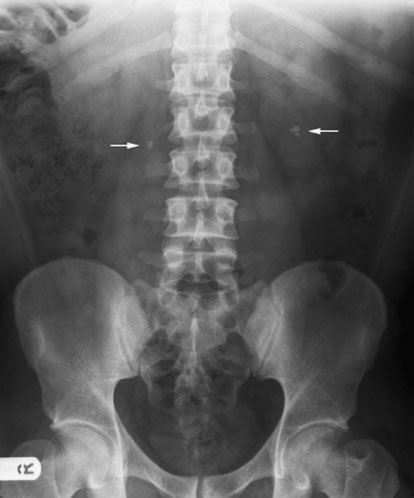
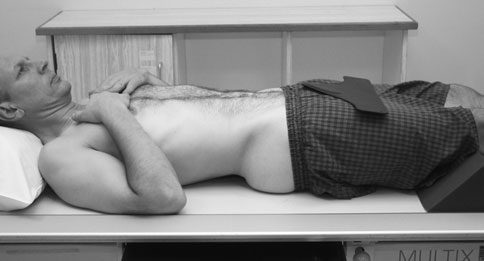

# Rx Tract Urinar (Aparatul Renal) Antero-Posterior (AP)

  📷 Radiografie Convențională (Rx)
  <strong>Actualizat:</strong> 2026-09-16
  <strong>Autor:</strong> Departamentul de Radiologie / Referință Clark (Ed. 12)

---

-   __1. Rezumat Clinic & Indicații__

    ---

    === "Indicații Clinice"

        - 345 11 Tract Urinar (Aparatul Renal) Antero-posterior (AP)

    === "Ghid Național IRIS"

        !!! info "Referință Primară: Ghidul Național IRIS (Ordinul MS 1342/2012)"
            - **Capitol Ghid IRIS:** *Ghidul Național IRIS*
            - **Grad de Recomandare:** **De verificat pe indicație; fără grad atribuit automat**
            - **Nivel de Iradiere Estimată:** `De verificat pentru examinarea și populația selectate`

            [:octicons-search-16: Deschide Ghidul IRIS](../../iris.md){ .md-button .md-button--primary } [:material-open-in-new: Aplicația Oficială PWA](https://radiologie-pediatrica.ro/iris/){ .md-button target="_blank" rel="noopener" }
-   __2. Poziționare & Centrare Fascicul__

    ---

    - **Poziție Pacient:** • Pacientul este așezat în decubit dorsal pe masa radiologică, cu planul mediosagital de corp la drept-angles la și în linia mediană mesei.
• mâinile poate fie plasat high pe toracele, sau brațele poate fie prin pacientul’s side și slightly away de la trunk.
• size de casetă used trebuie să fie large enough la cover region de la above upper poles de Aparat Renal (Rinichi) la simfiză pubiană (e.g. a 35  43-cm casetă).
• caseta este plasat în tăvița Bucky și poziționat astfel încât simfiză pubiană este included pe lower part de film radiologic, bearing în mind that Oblică rays will project simfiză downwards.
• centre de caseta will fie approximately la nivelul point located 1 cm below line joining crestele iliace. This will ensure that simfiză pubiană este included pe imagine.
• wide imobilizare band este applied la pacientul’s Abdomen și, depending pe pacientul’s condition, compression este applied. This compression este more effective if long pad este plasat along linia mediană under compression band before tightening band.
    - **Punct de Centrare Fascicul:** • raza centrală verticală centrală este orientat la centre de caseta, which este în linia mediană about level de lower costal margin în mid-axillary line. X-ray fascicul este collimated la just within margins de caseta.
• Using high mA și short expunere time, expunere este made pe Apnee la sfârșitul expirului complet (diafragm ridicat).
    - **Distanță Focar-Film (DFF / SID):** 100 cm
    - **Comandă Respiratorie:** respirație after expir profund complet

-   __3. Parametri Tehnici Expunere__

    ---

    | Parametru Tehnic | Valoare Configurare Generator / Tub |
    |:-----------------|:-------------------------------------|
    | **Tensiune Tub (kV)** | DE CONFIGURAT PE APARAT |
    | **Sarcină / Produs Curent-Timp (mAs)** | Conform AEC / grosime anatomică |
    | **Distanță Focar-Film (DFF / SID)** | 100 cm |
    | **Grilă Antidifuzoare (Bucky)** | Cu grilă antidifuzoare Bucky |
    | **Dimensiune Focar** | Focar Mic (0.6 mm) |
    | **Camere de Ionizare AEC** | Camerele laterale (sau camera centrală funcție de regiune) |
    | **Colimare Fascicul** | Colimare strictă adaptată pe receptor 35 x 43 cm |
    | **Filtrare Tub** | Totală ≥ 2.5 mm Al echivalent (conform Clark: 3.0 mm Al eq.) |

-   __4. Criterii de Calitate & Reușită Imagine__

    ---

    - Vizualizarea clară întregii arii anatomice (Tract Urinar (Aparatul Renal)).
    - Absența artefactelor de mișcare; trabeculație osoasă și contururi nete.
    - Densitate optică și contrast adecvate pentru diferențierea țesuturilor moi de structurile osoase.

-   __5. Protecție Radiologică (ALARA)__

    ---

    - The ‘pregnancy rule’ should be observed unless permission has been given to ignore it in the case of emergency. If the whole of the renal tract including bladder is to be visualized, then no gonad shielding is possible for females; for males, a lead sheet can be placed over the lower edge of the symphysis pubis to protect the testes. If the bladder and lower ureters are not to be included on the image, then females can also be given gonad protection by placing a lead-rubber sheet over the lower Abdomen to protect the ovaries. Other methods discussed previously that reduce radiation dose to the patient should be followed. Preparation of the patient If possible, the patient should have a low-residue diet and laxatives during the 48 hours prior to the examination to clear the bowel of gas and faecal matter that might overlie the renal tract. In the case of emergency radiography, no bowel preparation is possible. The patient wears a clean gown.
    - Ecranare gonadică cu șorț plumbat dacă gonadele sunt în apropierea fasciculului util (regula ALARA).
    - Colimare precisă la dimensiunea anatomică strict necesară pentru reducerea dozei și a radiației difuze.
    - Verificarea posibilității unei sarcini la pacientele de vârstă fertilă înainte de expunere.

!!! note "Observații Clinice & Tehnice"
    • Small opacities overlying rinichi poate fie inside sau outside rinichi substance. further radiografie taken pe arrested respirație after inspir profund complet might show difference în extent și direction de movement de rinichi și calcificări patologice culcat outside rinichi.
• în some cases it poate fie necessary la include collimated rinichi area if superior renal margini sunt excluded în full-length film radiologic.
Antero-posterior (AP) Decubit dorsal plain imagine de abdomenul evidențiind stâng lower pole renal calculus și calculus în upper drept ureter Plain radiografie de abdominal și pelvic cavity este carried out la visualize:
• outline de Aparat Renal (Rinichi), surrounded prin their perirenal fat;
• Profil (lateral) margine de psoas muscle;
• opaque stones în rinichi area, în line de ureters și în region de bladder;
• calcificări patologice within rinichi sau în bladder perete;
• presence de gas within Tract Urinar (Aparatul Renal).

### 🖼️ Imagini

<figure class="protocol-image-card" markdown>

<figcaption><strong>rinichi substance. further radiografie taken pe arrested</strong> — Poziționare pacient și centrare fascicul conform Clark (Ed. 12)</figcaption>

</figure>

<figure class="protocol-image-card" markdown>

<figcaption><strong>Antero-posterior (AP) Decubit dorsal plain imagine de abdomenul evidențiind stâng lower pole</strong> — Aspect radiografic / ghid de poziționare conform tratatului Clark (Ed. 12)</figcaption>

</figure>

=== "Ghid Rapid de Execuție"

    1. **Identificarea și verificarea pacientului:** verificare identitate, zonă de examinat, consimțământ conform procedurii și evaluarea posibilității unei sarcini, când este relevantă.
    2. **Pregătire:** îndepărtarea oricăror obiecte radiopace (bijuterii, agrafe, fermoare, proteze, pansamente dense).
    3. **Poziționare precisă:** alinierea receptorului de imagine și a tubului la distanța prescrisă (100 cm).
    4. **Colimare strictă:** adaptarea fasciculului strict la regiunea de diagnostic pentru scăderea iradierii și reducerea radiației difuze.
    5. **Radioprotecție:** verificarea [politicii RX](../radioprotectie.md), cu măsuri distincte pentru pacient, personal și însoțitor.

## Surse de documentare

- [Clark's Positioning in Radiography (Ed. 12), Pagina 360](../../assets/protocols/sources/Clark___Positioning_in_Radiography__12th_edition.pdf#page=360)
