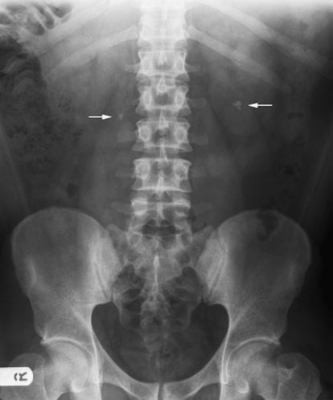
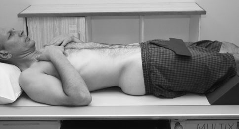

# Rx Tract Urinar (Aparatul Renal) Antero-Posterior (AP)

  📷 Radiografie Convențională (Rx)
  <strong>Actualizat:</strong> 2026-09-16
  <strong>Autor:</strong> Departamentul de Radiologie / Referință Clark (Ed. 12)

---

-   __1. Rezumat Clinic & Indicații__

    ---

    === "Indicații Clinice"

        - 345 11 Tract Urinar (Aparatul Renal) Antero-posterior (AP)

    === "Ghid Național IRIS"

        !!! info "Referință Primară: Ghidul Național IRIS (Ordinul MS 1342/2012)"
            - **Capitol Ghid IRIS:** *Aparat digestiv & Abdomen*
            - **Grad de Recomandare:** **Grad B**
            - **Nivel de Iradiere Estimată:** `Clasa 2 (Foarte mică ~ 0.7 - 1.2 mSv)`

            [:octicons-search-16: Deschide Ghidul IRIS](../../iris.md){ .md-button .md-button--primary } [:material-open-in-new: Aplicația Oficială PWA](https://radiologie-pediatrica.ro/iris/){ .md-button target="_blank" rel="noopener" }

-   __2. Poziționare & Centrare Fascicul__

    ---

    - **Poziție Pacient:**
        - Pacientul este așezat în decubit dorsal pe masa radiologică, cu planul mediosagital al corpului în unghi drept față de masă și aliniat cu linia mediană a mesei.
        - Mâinile pot fi așezate sus pe torace sau brațele pot fi pe lângă corpul pacientului, ușor depărtate de trunchi.
        - Caseta utilizată trebuie să fie suficient de mare pentru a cuprinde regiunea de deasupra polilor superiori ai rinichilor până la simfiza pubiană (de exemplu, o casetă de 35 × 43-cm).
        - Caseta se așază în tăvița Bucky și se poziționează astfel încât simfiza pubiană să fie inclusă în partea inferioară a filmului radiologic, ținând cont de faptul că razele oblice vor proiecta simfiza în jos.
        - Centrul casetei se va afla aproximativ la nivelul unui punct situat la 1 cm sub linia care unește crestele iliace. Astfel, simfiza pubiană va fi inclusă pe imagine.
        - Se aplică o bandă lată de imobilizare pe abdomenul pacientului și, în funcție de starea acestuia, se aplică o compresie. Această compresie este mai eficientă dacă se așază o pernă lungă de-a lungul liniei mediane, sub banda de compresie, înainte de strângerea benzii.
    - **Punct de Centrare Fascicul:**
        - Raza centrală verticală este orientată spre centrul casetei, care se află pe linia mediană, aproximativ la nivelul marginii costale inferioare de pe linia axilară medie. Fasciculul de raze X este colimat imediat în interiorul marginilor casetei.
        - Utilizând un mA ridicat și un timp de expunere scurt, expunerea se efectuează în apnee la sfârșitul expirului complet (diafragm ridicat).
    - **Distanță Focar-Film (DFF / SID):** 100 cm
    - **Comandă Respiratorie:** respirație după un expir profund complet

-   __3. Parametri Tehnici Expunere__

    ---

    | Parametru Tehnic | Valoare Configurare Generator / Tub |
    |:-----------------|:-------------------------------------|
    | **Tensiune Tub (kV)** | DE CONFIGURAT PE APARAT |
    | **Sarcină / Produs Curent-Timp (mAs)** | Conform AEC / grosimii anatomice |
    | **Distanță Focar-Film (DFF / SID)** | 100 cm |
    | **Grilă Antidifuzoare (Bucky)** | Cu grilă antidifuzoare Bucky |
    | **Dimensiune Focar** | Focar Mic (0.6 mm) |
    | **Camere de Ionizare AEC** | Camerele laterale (sau camera centrală, în funcție de regiune) |
    | **Colimare Fascicul** | Colimare strictă adaptată pe receptor 35 x 43 cm |
    | **Filtrare Tub** | Totală ≥ 2.5 mm Al echivalent (conform Clark: 3.0 mm Al echivalent) |

-   __4. Criterii de Calitate & Reușită Imagine__

    ---

    - Vizualizarea clară a întregii arii anatomice (Tract Urinar (Aparatul Renal)).
    - Absența artefactelor de mișcare; trabeculație osoasă și contururi nete.
    - Densitate optică și contrast adecvate pentru diferențierea țesuturilor moi de structurile osoase.

-   __5. Protecție Radiologică (ALARA)__

    ---

    - „Regula privind sarcina” trebuie respectată, cu excepția cazului în care s-a acordat permisiunea de a nu o aplica într-o situație de urgență. Dacă trebuie vizualizat întregul tract urinar, inclusiv vezica urinară, protecția gonadelor nu este posibilă la femei; la bărbați, se poate așeza o foaie de plumb peste marginea inferioară a simfizei pubiene pentru a proteja testiculele. Dacă vezica urinară și porțiunile inferioare ale ureterelor nu trebuie incluse pe imagine, se poate asigura protecția gonadelor și la femei, prin așezarea unei foi de cauciuc plumbat peste partea inferioară a abdomenului, pentru a proteja ovarele. Trebuie aplicate și celelalte metode discutate anterior care reduc doza de radiații administrată pacientului. Pregătirea pacientului Dacă este posibil, pacientul trebuie să urmeze o dietă săracă în reziduuri și să ia laxative în cele 48 de ore dinaintea examinării, pentru a elimina din intestin gazele și materiile fecale care s-ar putea suprapune peste tractul urinar. În cazul radiografiei de urgență, pregătirea intestinală nu este posibilă. Pacientul poartă un halat curat.
    - Ecranare gonadică cu șorț plumbat dacă gonadele sunt în apropierea fasciculului util (regula ALARA).
    - Colimare precisă la dimensiunea anatomică strict necesară pentru reducerea dozei și a radiației difuze.
    - Verificarea posibilității unei sarcini la pacientele de vârstă fertilă înainte de expunere.

!!! note "Observații Clinice & Tehnice"
    - Opacitățile mici suprapuse peste rinichi pot fi în interiorul sau în afara parenchimului renal. O radiografie suplimentară efectuată în apnee după un inspir profund complet ar putea evidenția o diferență în amplitudinea și direcția deplasării rinichiului și a calcificărilor patologice situate în afara acestuia.
    - În unele cazuri, poate fi necesară includerea unei imagini colimate a regiunii renale dacă marginile renale superioare nu sunt cuprinse pe filmul radiologic de ansamblu. Imagine radiografică simplă a abdomenului în incidență antero-posterioară (AP), în decubit dorsal, care evidențiază un calcul la polul inferior al rinichiului stâng și un calcul în porțiunea superioară a ureterului drept. Radiografia simplă a cavității abdominale și pelvine se efectuează pentru a vizualiza:
    - conturul rinichilor, înconjurați de grăsimea perirenală;
    - marginea laterală a mușchiului psoas;
    - calculii radioopaci din regiunea renală, de pe traiectul ureterelor și din regiunea vezicii urinare;
    - calcificările patologice din interiorul rinichiului sau din peretele vezicii urinare;
    - prezența gazelor în tractul urinar (aparatul renal).

### 🖼️ Imagini

<figure class="protocol-image-card" markdown>

<figcaption><strong>parenchim renal. O radiografie suplimentară efectuată în apnee</strong> — Poziționarea pacientului și centrarea fasciculului conform Clark (Ed. 12)</figcaption>

</figure>

<figure class="protocol-image-card" markdown>

<figcaption><strong>Imagine radiografică simplă a abdomenului în incidență antero-posterioară (AP), în decubit dorsal, care evidențiază polul inferior stâng</strong> — Aspect radiografic / ghid de poziționare conform tratatului Clark (Ed. 12)</figcaption>

</figure>

=== "Ghid Rapid de Execuție"

    1. **Identificarea și verificarea pacientului:** verificare identitate, zonă de examinat, consimțământ conform procedurii și evaluarea posibilității unei sarcini, când este relevantă.
    2. **Pregătire:** îndepărtarea oricăror obiecte radiopace (bijuterii, agrafe, fermoare, proteze, pansamente dense).
    3. **Poziționare precisă:** alinierea receptorului de imagine și a tubului la distanța prescrisă (100 cm).
    4. **Colimare strictă:** adaptarea fasciculului strict la regiunea de diagnostic pentru scăderea iradierii și reducerea radiației difuze.
    5. **Radioprotecție:** verificarea [politicii RX](../radioprotectie.md), cu măsuri distincte pentru pacient, personal și însoțitor.

## Surse de documentare

- [Clark's Positioning in Radiography (Ed. 12), Pagina 360](https://books.google.com/books/about/Clark_s_Positioning_in_Radiography.html?id=Xxu6MwEACAAJ)
