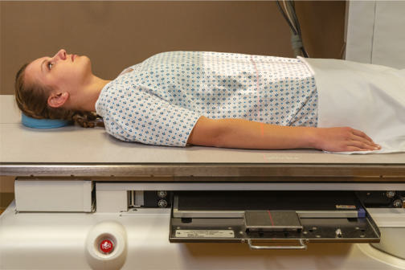
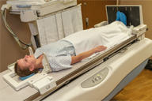
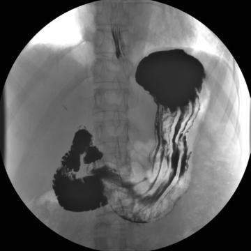
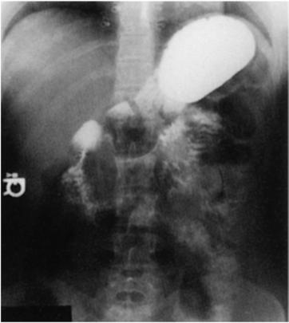

# Rx Tranzit Baritat Gastro-Duodenal (TBGD) AP (Antero-Posterior)

  📷 Radiografie Convențională (Rx)
  <strong>Actualizat:</strong> 2026-09-15
  <strong>Autor:</strong> Departamentul de Radiologie / Referință Bontrager

---

-   __1. Rezumat Clinic & Indicații__

    ---

    === "Indicații Clinice"

        - Possible hiatal hernia may be demonstrated in Trendelenburg position

    === "Ghid Național IRIS"

        !!! info "Referință Primară: Ghidul Național IRIS (Ordinul MS 1342/2012)"
            - **Capitol Ghid IRIS:** *Ghidul Național IRIS*
            - **Grad de Recomandare:** **De verificat pe indicație; fără grad atribuit automat**
            - **Nivel de Iradiere Estimată:** `De verificat pentru examinarea și populația selectate`

            [:octicons-search-16: Deschide Ghidul IRIS](../../iris.md){ .md-button .md-button--primary } [:material-open-in-new: Aplicația Oficială PWA](https://radiologie-pediatrica.ro/iris/){ .md-button target="_blank" rel="noopener" }
-   __2. Poziționare & Centrare Fascicul__

    ---

    - **Poziție Pacient:** Pacient: Position patient Decubit Dorsal, arms at sides; provide a support for patient’s head and knees (Fig. 12.103).; Regiune anatomică: Align MSP to midline of table. Ensure that body is not rotated. Center IR to CR. Bottom of IR should be about at level of creasta iliacă (corespunzător L4-L5).
    - **Punct de Centrare Fascicul:** Center Raza centrală (RC) perpendiculară pe receptorul de imagine Sthenic body type: Center CR and IR to level of l1 (about midway between xiphoid tip and lower margin of Coaste (Grilaj Costal)), midway between midline and left lateral margin of Abdomen Hypersthenic body type: Center about 2 inches (5 cm) above L1 Asthenic body type: Position CR about 2 inches (5 cm) below and nearer to midline
    - **Distanță Focar-Film (DFF / SID):** 100 cm
    - **Comandă Respiratorie:** Suspend respiration and expose on expiration. Alternative AP: Slight Trendelenburg Position A Trendelenburg (headdown) position may be necessary to fill the fundus on a thin asthenic patient. A moderate Trendelenburg angulation facilitates the demonstration of hiatal hernia. (Install Umăr brace for patient safety.) Fig. 12.104 AP—Decubit Dorsal. Fig. 12.105 AP—Trendelenburg position. Tranzit Baritat Gastro-Duodenal (TBGD) ROUTINE RAO PA Right lateral LPO AP Fig. 12.103 AP Decubit Dorsal. Inset, Trendelenburg option.

-   __3. Parametri Tehnici Expunere__

    ---

    | Parametru Tehnic | Valoare Configurare Generator / Tub |
    |:-----------------|:-------------------------------------|
    | **Tensiune Tub (kV)** | 110-125 kV |
    | **Sarcină / Produs Curent-Timp (mAs)** | DE CONFIGURAT PE APARAT |
    | **Distanță Focar-Film (DFF / SID)** | 100 cm |
    | **Grilă Antidifuzoare (Bucky)** | Cu grilă antidifuzoare Bucky |
    | **Dimensiune Focar** | Focar Mare (1.0 - 1.2 mm) |
    | **Camere de Ionizare AEC** | Camerele laterale (sau camera centrală funcție de regiune) |
    | **Colimare Fascicul** | Field Size Collimate on four sides to outer margins of IR or to area of interest if larger IR is used. |
    | **Filtrare Tub** | Totală ≥ 2.5 mm Al echivalent |

-   __4. Criterii de Calitate & Reușită Imagine__

    ---

    - Entire stomach and duodenum are visible (Figs. 12.104 and 12.105).
    - Diaphragm and lower lung fields are included for demonstration of possible hiatal hernia. Position:
    - Fundus of stomach is filled with barium and is near center of IR.
    - Proper collimation field size is applied.
    - CR is centered to duodenal bulb at level of L1. Exposure:
    - Optimal image receptor exposure and contrast to visualize the gastric folds without overexposing other pertinent anatomy.
    - Sharp structural margins indicate no motion.

-   __5. Protecție Radiologică (ALARA)__

    ---

    - Ecranare gonadică și a organelor radiosensibile conform procedurilor locale de radioprotecție ALARA.
    - Colimare strictă la aria de interes pentru limitarea radiației difuze.
    - Verificarea posibilității unei sarcini la pacientele de vârstă fertilă înainte de expunere.

### 🖼️ Imagini

<figure class="protocol-image-card" markdown>

<figcaption><strong>Fig. 12.104 AP—Decubit Dorsal.</strong> — Poziționare pacient conform Ghidului Bontrager (Fig. 12.104 AP—supine.)</figcaption>

</figure>

<figure class="protocol-image-card" markdown>

<figcaption><strong>Fig. 12.105 AP—Trendelenburg position.</strong> — Aspect radiografic de referință conform Ghidului Bontrager (Fig. 12.105 AP—Trendelenburg position.)</figcaption>

</figure>

<figure class="protocol-image-card" markdown>

<figcaption><strong>Fig. 12.103 AP Decubit Dorsal. Inset, Trendelenburg option.</strong> — Aspect radiografic de referință conform Ghidului Bontrager (Fig. 12.103 AP supine. Inset, Trendelenburg option.)</figcaption>

</figure>

<figure class="protocol-image-card" markdown>

<figcaption><strong>Figura 4</strong> — Aspect radiografic de referință conform Ghidului Bontrager (Figura 4)</figcaption>

</figure>

=== "Ghid Rapid de Execuție"

    1. **Identificarea și verificarea pacientului:** verificare identitate, zonă de examinat, consimțământ conform procedurii și evaluarea posibilității unei sarcini, când este relevantă.
    2. **Pregătire:** îndepărtarea oricăror obiecte radiopace (bijuterii, agrafe, fermoare, proteze, pansamente dense).
    3. **Poziționare precisă:** alinierea receptorului de imagine și a tubului la distanța prescrisă (100 cm).
    4. **Colimare strictă:** adaptarea fasciculului strict la regiunea de diagnostic pentru scăderea iradierii și reducerea radiației difuze.
    5. **Radioprotecție:** verificarea [politicii RX](../radioprotectie.md), cu măsuri distincte pentru pacient, personal și însoțitor.

## Surse de documentare

- [Bontrager's Textbook of Radiographic Positioning (Ed. 9/10), Pagina 512](https://www.elsevier.com/books/textbook-of-radiographic-positioning-and-related-anatomy/lampignano/978-0-323-65367-1)
