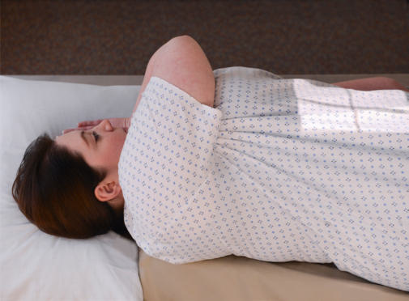
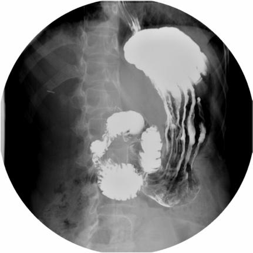

# Rx Tranzit Baritat Gastro-Duodenal (TBGD) LPO POSITION

  📷 Radiografie Convențională (Rx)
  <strong>Actualizat:</strong> 2026-09-15
  <strong>Autor:</strong> Departamentul de Radiologie / Referință Bontrager

---

-   __1. Rezumat Clinic & Indicații__

    ---

    === "Indicații Clinice"

        - When a doublecontrast technique is used, the airfilled pylorus and duodenal bulb may better demonstrate signs of gastritis and ulcers.

    === "Ghid Național IRIS"

        !!! info "Referință Primară: Ghidul Național IRIS (Ordinul MS 1342/2012)"
            - **Capitol Ghid IRIS:** *Ghidul Național IRIS*
            - **Grad de Recomandare:** **De verificat pe indicație; fără grad atribuit automat**
            - **Nivel de Iradiere Estimată:** `De verificat pentru examinarea și populația selectate`

            [:octicons-search-16: Deschide Ghidul IRIS](../../iris.md){ .md-button .md-button--primary } [:material-open-in-new: Aplicația Oficială PWA](https://radiologie-pediatrica.ro/iris/){ .md-button target="_blank" rel="noopener" }
-   __2. Poziționare & Centrare Fascicul__

    ---

    - **Poziție Pacient:** Pacient: Position patient Decubit, with the body partially rotated into an LPO position; provide support for patient’s head and upper torso (Fig. 12.101).; Regiune anatomică: Rotate 30° to 60° from Decubit Dorsal position, with left posterior against IR or table (more rotation (up to 60°) is often required for hypersthenic body habitus and less rotation (30°) for asthenic body habitus7). Flex right Genunchi for support. Extend left arm from body and raise right arm high across Torace to grasp end of table for support. (Do not pinch Degete Mână when moving bucky.) Center IR at CR (bottom of IR at level of creasta iliacă (corespunzător L4-L5)).
    - **Punct de Centrare Fascicul:** Direct Raza centrală (RC) perpendiculară pe receptorul de imagine Sthenic body type: Center CR and IR to level of l1 (about midway between xiphoid tip and lower lateral margin of Coaste (Grilaj Costal)) and midway between midline of body and left lateral margin of Abdomen, 45° oblique Hypersthenic body type: Center about 2 inches (5 cm) above L1, 60° oblique Asthenic body type: Center about 2 inches (5 cm) below L1 and nearer to midline, 30° oblique
    - **Distanță Focar-Film (DFF / SID):** 100 cm
    - **Comandă Respiratorie:** Suspend respiration and expose on expiration.

-   __3. Parametri Tehnici Expunere__

    ---

    | Parametru Tehnic | Valoare Configurare Generator / Tub |
    |:-----------------|:-------------------------------------|
    | **Tensiune Tub (kV)** | 110-125 kV |
    | **Sarcină / Produs Curent-Timp (mAs)** | DE CONFIGURAT PE APARAT |
    | **Distanță Focar-Film (DFF / SID)** | 100 cm |
    | **Grilă Antidifuzoare (Bucky)** | Cu grilă antidifuzoare Bucky |
    | **Dimensiune Focar** | Focar Mare (1.0 - 1.2 mm) |
    | **Camere de Ionizare AEC** | Camerele laterale (sau camera centrală funcție de regiune) |
    | **Colimare Fascicul** | Field Size Collimate on four sides to outer margins of IR or to area of interest on larger IR. |
    | **Filtrare Tub** | Totală ≥ 2.5 mm Al echivalent |

-   __4. Criterii de Calitate & Reușită Imagine__

    ---

    - Entire stomach and duodenum are visible (Fig. 12.102).
    - Unobstructed view of duodenal bulb should be provided, without superimposition by the pylorus of the stomach. Position:
    - Fundus should be filled with barium.
    - With a doublecontrast procedure, body and pylorus and occasionally duodenal bulb are air filled.
    - Proper collimation field size is applied.
    - CR is centered level to the duodenal bulb. Exposure:
    - Optimal image receptor exposure and contrast to visualize gastric folds without overexposing other pertinent anatomy.
    - Sharp structural margins indicate no motion. Fig. 12.102 LPO position.

-   __5. Protecție Radiologică (ALARA)__

    ---

    - Ecranare gonadică și a organelor radiosensibile conform procedurilor locale de radioprotecție ALARA.
    - Colimare strictă la aria de interes pentru limitarea radiației difuze.
    - Verificarea posibilității unei sarcini la pacientele de vârstă fertilă înainte de expunere.

!!! note "Observații Clinice & Tehnice"
    The stomach generally is located higher in this position than in the lateral; therefore, center one vertebra higher than on PA or RAO position. Tranzit Baritat Gastro-Duodenal (TBGD) ROUTINE RAO PA Right lateral LPO AP Fig. 12.101 LPO position.

### 🖼️ Imagini

<figure class="protocol-image-card" markdown>

<figcaption><strong>Fig. 12.101 LPO position.</strong> — Poziționare pacient conform Ghidului Bontrager (Fig. 12.101 LPO position.)</figcaption>

</figure>

<figure class="protocol-image-card" markdown>

<figcaption><strong>Fig. 12.102 LPO position.</strong> — Aspect radiografic de referință conform Ghidului Bontrager (Fig. 12.102 LPO position.)</figcaption>

</figure>

=== "Ghid Rapid de Execuție"

    1. **Identificarea și verificarea pacientului:** verificare identitate, zonă de examinat, consimțământ conform procedurii și evaluarea posibilității unei sarcini, când este relevantă.
    2. **Pregătire:** îndepărtarea oricăror obiecte radiopace (bijuterii, agrafe, fermoare, proteze, pansamente dense).
    3. **Poziționare precisă:** alinierea receptorului de imagine și a tubului la distanța prescrisă (100 cm).
    4. **Colimare strictă:** adaptarea fasciculului strict la regiunea de diagnostic pentru scăderea iradierii și reducerea radiației difuze.
    5. **Radioprotecție:** verificarea [politicii RX](../radioprotectie.md), cu măsuri distincte pentru pacient, personal și însoțitor.

## Surse de documentare

- [Bontrager's Textbook of Radiographic Positioning (Ed. 9/10), Pagina 511](https://www.elsevier.com/books/textbook-of-radiographic-positioning-and-related-anatomy/lampignano/978-0-323-65367-1)
