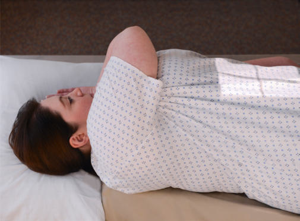
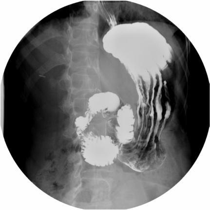

# Rx Tranzit Baritat Gastro-Duodenal (TBGD) Oblică Posterioară Stângă (OPS / LPO)

  📷 Radiografie Convențională (Rx)
  <strong>Actualizat:</strong> 2026-09-15
  <strong>Autor:</strong> Departamentul de Radiologie / Referință Bontrager

---

-   __1. Rezumat Clinic & Indicații__

    ---

    === "Indicații Clinice"

        - Când se utilizează tehnica cu dublu contrast, pilorul și bulbul duodenal umplute cu aer pot evidenția mai bine semnele de gastrită și ulcerele.

    === "Ghid Național IRIS"

        !!! info "Referință Primară: Ghidul Național IRIS (Ordinul MS 1342/2012)"
            - **Capitol Ghid IRIS:** *Aparat digestiv & Abdomen*
            - **Grad de Recomandare:** **Grad B**
            - **Nivel de Iradiere Estimată:** `Clasa 2 (Foarte mică ~ 0.7 - 1.2 mSv)`

            [:octicons-search-16: Deschide Ghidul IRIS](../../iris.md){ .md-button .md-button--primary } [:material-open-in-new: Aplicația Oficială PWA](https://radiologie-pediatrica.ro/iris/){ .md-button target="_blank" rel="noopener" }

-   __2. Poziționare & Centrare Fascicul__

    ---

    - **Poziție Pacient:** Pacient: poziționați pacientul în decubit, cu corpul rotit parțial în poziție oblică posterioară stângă (OPS / LPO); asigurați sprijin pentru capul și partea superioară a trunchiului pacientului (Fig. 12.101).; Regiune anatomică: rotiți cu 30° până la 60° din poziția de decubit dorsal, cu partea posterioară stângă sprijinită pe receptorul de imagine sau pe masă (o rotație mai mare (până la 60°) este adesea necesară pentru tipul constituțional hiperstenic și o rotație mai mică (30°) pentru tipul constituțional astenic7). Flectați genunchiul drept pentru sprijin. Întindeți brațul stâng îndepărtându-l de corp și ridicați brațul drept sus, peste torace, pentru a apuca capătul mesei pentru sprijin. (Nu prindeți degetele mâinii la deplasarea sistemului Bucky.) Centrați receptorul de imagine pe raza centrală (marginea inferioară a receptorului de imagine la nivelul crestei iliace (corespunzător L4-L5)).
    - **Punct de Centrare Fascicul:** Orientați raza centrală (RC) perpendicular pe receptorul de imagine. Tip constituțional stenic: centrați raza centrală și receptorul de imagine la nivelul l1 (aproximativ la jumătatea distanței dintre vârful apendicelui xifoid și marginea laterală inferioară a coastelor (grilajului costal)) și la jumătatea distanței dintre linia mediană a corpului și marginea laterală stângă a abdomenului, oblic la 45°. Tip constituțional hiperstenic: centrați la aproximativ 2 țoli (5 cm) deasupra L1, oblic la 60°. Tip constituțional astenic: centrați la aproximativ 2 țoli (5 cm) sub L1 și mai aproape de linia mediană, oblic la 30°.
    - **Distanță Focar-Film (DFF / SID):** 100 cm
    - **Comandă Respiratorie:** Apnee la sfârșitul expirului pe durata expunerii.

-   __3. Parametri Tehnici Expunere__

    ---

    | Parametru Tehnic | Valoare Configurare Generator / Tub |
    |:-----------------|:-------------------------------------|
    | **Tensiune Tub (kV)** | 110-125 kV |
    | **Sarcină / Produs Curent-Timp (mAs)** | DE CONFIGURAT PE APARAT |
    | **Distanță Focar-Film (DFF / SID)** | 100 cm |
    | **Grilă Antidifuzoare (Bucky)** | Cu grilă antidifuzoare Bucky |
    | **Dimensiune Focar** | Focar Mare (1.0 - 1.2 mm) |
    | **Camere de Ionizare AEC** | Camerele laterale (sau camera centrală, în funcție de regiune) |
    | **Colimare Fascicul** | Dimensiunea câmpului Colimați pe cele patru laturi până la marginile exterioare ale receptorului de imagine sau la aria de interes diagnostic pe un receptor de imagine mai mare. |
    | **Filtrare Tub** | Totală ≥ 2.5 mm Al echivalent |

-   __4. Criterii de Calitate & Reușită Imagine__

    ---

    - Stomacul și duodenul sunt vizibile în întregime (Fig. 12.102).
    - Trebuie obținută o imagine neobstrucționată a bulbului duodenal, fără suprapunerea pilorului gastric. Poziție:
    - Fundul gastric trebuie să fie umplut cu bariu.
    - În procedura cu dublu contrast, corpul gastric și pilorul și, ocazional, bulbul duodenal sunt umplute cu aer.
    - Se aplică dimensiunea corectă a câmpului de colimare.
    - Raza centrală este centrată la nivelul bulbului duodenal. Expunere:
    - Expunere a receptorului de imagine și contrast optime pentru vizualizarea pliurilor gastrice fără supraexpunerea celorlalte structuri anatomice relevante.
    - Marginile nete ale structurilor indică absența mișcării. Fig. 12.102 poziție oblică posterioară stângă (OPS / LPO).

-   __5. Protecție Radiologică (ALARA)__

    ---

    - Ecranare gonadică și a organelor radiosensibile conform procedurilor locale de radioprotecție ALARA.
    - Colimare strictă la aria de interes pentru limitarea radiației difuze.
    - Verificarea posibilității unei sarcini la pacientele de vârstă fertilă înainte de expunere.

!!! note "Observații Clinice & Tehnice"
    Stomacul este în general situat mai sus în această poziție decât în poziția de profil; prin urmare, centrați cu o vertebră mai sus decât în PA sau în poziția oblică anterioară dreaptă (OAD / RAO). Tranzit Baritat Gastro-Duodenal (TBGD) DE RUTINĂ RAO PA profil drept LPO AP Fig. 12.101 poziție oblică posterioară stângă (OPS / LPO).

### 🖼️ Imagini

<figure class="protocol-image-card" markdown>

<figcaption><strong>Fig. 12.101 poziție oblică posterioară stângă (OPS / LPO).</strong> — Poziționare pacient conform Ghidului Bontrager (Fig. 12.101 poziție oblică posterioară stângă (OPS / LPO).)</figcaption>

</figure>

<figure class="protocol-image-card" markdown>

<figcaption><strong>Fig. 12.102 poziție oblică posterioară stângă (OPS / LPO).</strong> — Aspect radiografic de referință conform Ghidului Bontrager (Fig. 12.102 poziție oblică posterioară stângă (OPS / LPO).)</figcaption>

</figure>

=== "Ghid Rapid de Execuție"

    1. **Identificarea și verificarea pacientului:** verificare identitate, zonă de examinat, consimțământ conform procedurii și evaluarea posibilității unei sarcini, când este relevantă.
    2. **Pregătire:** îndepărtarea oricăror obiecte radiopace (bijuterii, agrafe, fermoare, proteze, pansamente dense).
    3. **Poziționare precisă:** alinierea receptorului de imagine și a tubului la distanța prescrisă (100 cm).
    4. **Colimare strictă:** adaptarea fasciculului strict la regiunea de diagnostic pentru scăderea iradierii și reducerea radiației difuze.
    5. **Radioprotecție:** verificarea [politicii RX](../radioprotectie.md), cu măsuri distincte pentru pacient, personal și însoțitor.

## Surse de documentare

- [Bontrager's Textbook of Radiographic Positioning (Ed. 9/10), Pagina 511](https://www.elsevier.com/books/textbook-of-radiographic-positioning-and-related-anatomy/lampignano/978-0-323-65367-1)
