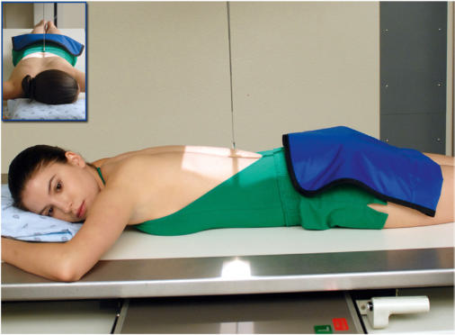
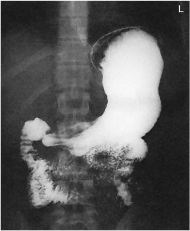

# Rx Tranzit Baritat Gastro-Duodenal (TBGD) PA (Postero-Anterior)

  📷 Radiografie Convențională (Rx)
  <strong>Actualizat:</strong> 2026-09-15
  <strong>Autor:</strong> Departamentul de Radiologie / Referință Bontrager

---

-   __1. Rezumat Clinic & Indicații__

    ---

    === "Indicații Clinice"

        - Polyps, diverticula, bezoars, and signs of gastritis in the body and pylorus of the stomach

    === "Ghid Național IRIS"

        !!! info "Referință Primară: Ghidul Național IRIS (Ordinul MS 1342/2012)"
            - **Capitol Ghid IRIS:** *Ghidul Național IRIS*
            - **Grad de Recomandare:** **De verificat pe indicație; fără grad atribuit automat**
            - **Nivel de Iradiere Estimată:** `De verificat pentru examinarea și populația selectate`

            [:octicons-search-16: Deschide Ghidul IRIS](../../iris.md){ .md-button .md-button--primary } [:material-open-in-new: Aplicația Oficială PWA](https://radiologie-pediatrica.ro/iris/){ .md-button target="_blank" rel="noopener" }
-   __2. Poziționare & Centrare Fascicul__

    ---

    - **Poziție Pacient:** Pacient: Position patient Decubit Ventral, with arms up beside head; provide a support for patient’s head (Fig. 12.96).; Regiune anatomică: Align MSP to CR and to table. Ensure that the body is not rotated.
    - **Punct de Centrare Fascicul:** Direct Raza centrală (RC) perpendiculară pe receptorul de imagine. Sthenic body type: Center CR and IR to level of pylorus and duodenal bulb at level of l1 (1 to 2 inches [2.5 to 5 cm] above lower lateral rib margin) and about 1 inch (2.5 cm) left of the vertebral column. Asthenic body type: Center about 2 inches (5 cm) below level of L1. Hypersthenic body type: Center about 2 inches (5 cm) above level of L1 and nearer midline. Center IR to CR.
    - **Distanță Focar-Film (DFF / SID):** 100 cm
    - **Comandă Respiratorie:** Suspend respiration and expose on expiration. Alternate PA Axial The position of the high transverse stomach on a hypersthenic patient causes almost an endon view, with much overlapping of the pyloric region of the stomach and the duodenal bulb with a Incidență Postero-Anterioară (PA) (Fig. 12.97). Therefore, a 35° to 45° cephalic angle of the CR separates these areas for better visualization. The greater and lesser curvatures of the stomach also are better visualized in profile. For infants, a 20° to 25° cephalic CR angle is recommended to open the body and pylorus of stomach. (35) (43) Tranzit Baritat Gastro-Duodenal (TBGD) ROUTINE RAO PA Right lateral LPO AP Fig. 12.96 PA position. Fig. 12.97 Incidență Postero-Anterioară (PA).

-   __3. Parametri Tehnici Expunere__

    ---

    | Parametru Tehnic | Valoare Configurare Generator / Tub |
    |:-----------------|:-------------------------------------|
    | **Tensiune Tub (kV)** | 110-125 kV |
    | **Sarcină / Produs Curent-Timp (mAs)** | DE CONFIGURAT PE APARAT |
    | **Distanță Focar-Film (DFF / SID)** | 100 cm |
    | **Grilă Antidifuzoare (Bucky)** | Cu grilă antidifuzoare Bucky |
    | **Dimensiune Focar** | Focar Mare (1.0 - 1.2 mm) |
    | **Camere de Ionizare AEC** | Camerele laterale (sau camera centrală funcție de regiune) |
    | **Colimare Fascicul** | Field Size Collimate on four sides to outer margins of IR or to area of interest on a larger IR. L or R marker should be placed within collimation field size. |
    | **Filtrare Tub** | Totală ≥ 2.5 mm Al echivalent |

-   __4. Criterii de Calitate & Reușită Imagine__

    ---

    - Entire stomach and duodenum are visible. Position:
    - Body and pylorus of the stomach are filled with barium. Proper collimation field size is applied. Exposure:
    - Optimal image receptor exposure and contrast to visualize the gastric folds without overexposing other pertinent anatomy.
    - Sharp structural margins indicate no motion.

-   __5. Protecție Radiologică (ALARA)__

    ---

    - Ecranare gonadică și a organelor radiosensibile conform procedurilor locale de radioprotecție ALARA.
    - Colimare strictă la aria de interes pentru limitarea radiației difuze.
    - Verificarea posibilității unei sarcini la pacientele de vârstă fertilă înainte de expunere.

### 🖼️ Imagini

<figure class="protocol-image-card" markdown>

<figcaption><strong>Fig. 12.96 PA position.</strong> — Poziționare pacient conform Ghidului Bontrager (Fig. 12.96 PA position.)</figcaption>

</figure>

<figure class="protocol-image-card" markdown>

<figcaption><strong>Fig. 12.97 Incidență Postero-Anterioară (PA).</strong> — Aspect radiografic de referință conform Ghidului Bontrager (Fig. 12.97 PA projection.)</figcaption>

</figure>

=== "Ghid Rapid de Execuție"

    1. **Identificarea și verificarea pacientului:** verificare identitate, zonă de examinat, consimțământ conform procedurii și evaluarea posibilității unei sarcini, când este relevantă.
    2. **Pregătire:** îndepărtarea oricăror obiecte radiopace (bijuterii, agrafe, fermoare, proteze, pansamente dense).
    3. **Poziționare precisă:** alinierea receptorului de imagine și a tubului la distanța prescrisă (100 cm).
    4. **Colimare strictă:** adaptarea fasciculului strict la regiunea de diagnostic pentru scăderea iradierii și reducerea radiației difuze.
    5. **Radioprotecție:** verificarea [politicii RX](../radioprotectie.md), cu măsuri distincte pentru pacient, personal și însoțitor.

## Surse de documentare

- [Bontrager's Textbook of Radiographic Positioning (Ed. 9/10), Pagina 509](https://www.elsevier.com/books/textbook-of-radiographic-positioning-and-related-anatomy/lampignano/978-0-323-65367-1)
