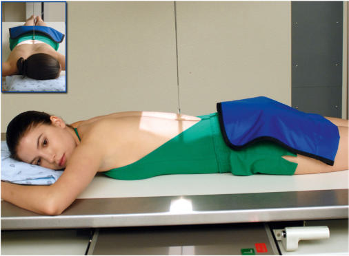
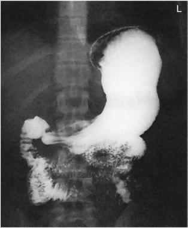

# Rx Tranzit Baritat Gastro-Duodenal (TBGD) PA (Postero-Anterior)

  📷 Radiografie Convențională (Rx)
  <strong>Actualizat:</strong> 2026-09-15
  <strong>Autor:</strong> Departamentul de Radiologie / Referință Bontrager

---

-   __1. Rezumat Clinic & Indicații__

    ---

    === "Indicații Clinice"

        - Polipi, diverticuli, bezoari și semne de gastrită la nivelul corpului și al pilorului stomacului

    === "Ghid Național IRIS"

        !!! info "Referință Primară: Ghidul Național IRIS (Ordinul MS 1342/2012)"
            - **Capitol Ghid IRIS:** *Ghidul Național IRIS*
            - **Grad de Recomandare:** **De verificat pe indicație; fără grad atribuit automat**
            - **Nivel de Iradiere Estimată:** `De verificat pentru examinarea și populația selectate`

            [:octicons-search-16: Deschide Ghidul IRIS](../../iris.md){ .md-button .md-button--primary } [:material-open-in-new: Aplicația Oficială PWA](https://radiologie-pediatrica.ro/iris/){ .md-button target="_blank" rel="noopener" }
-   __2. Poziționare & Centrare Fascicul__

    ---

    - **Poziție Pacient:** Pacient: se poziționează pacientul în decubit ventral, cu brațele ridicate lângă cap; se asigură sprijin pentru capul pacientului (Fig. 12.96).; Regiune anatomică: se aliniază MSP cu raza centrală și cu masa. Se asigură absența rotației corpului.
    - **Punct de Centrare Fascicul:** Se direcționează raza centrală (RC) perpendicular pe receptorul de imagine. Tip constituțional stenic: se centrează raza centrală și receptorul de imagine la nivelul pilorului și al bulbului duodenal, la nivelul l1 (1 la 2 inchi [2.5 la 5 cm] deasupra marginii costale inferolaterale) și la aproximativ 1 inch (2.5 cm) la stânga coloanei vertebrale. Tip constituțional astenic: se centrează la aproximativ 2 inchi (5 cm) sub nivelul L1. Tip constituțional hiperstenic: se centrează la aproximativ 2 inchi (5 cm) deasupra nivelului L1 și mai aproape de linia mediană. Se centrează receptorul de imagine pe raza centrală.
    - **Distanță Focar-Film (DFF / SID):** 100 cm
    - **Comandă Respiratorie:** Apnee la sfârșitul expirului pe durata expunerii. Poziție alternativă PA axială: poziția înaltă și transversală a stomacului la pacientul hiperstenic determină o vizualizare aproape de-a lungul axului său, cu suprapunere importantă a regiunii pilorice a stomacului și a bulbului duodenal în incidența postero-anterioară (PA) (Fig. 12.97). Prin urmare, o înclinare cranială de 35° la 45° a razei centrale separă aceste regiuni pentru o vizualizare mai bună. Curbura mare și curbura mică ale stomacului sunt, de asemenea, mai bine vizualizate din profil. Pentru sugari, se recomandă o înclinare cranială de 20° la 25° a razei centrale pentru a deschide corpul și pilorul stomacului. (35) (43) Tranzit Baritat Gastro-Duodenal (TBGD) DE RUTINĂ RAO PA profil drept LPO AP Fig. 12.96 Poziție PA. Fig. 12.97 Incidență Postero-Anterioară (PA).

-   __3. Parametri Tehnici Expunere__

    ---

    | Parametru Tehnic | Valoare Configurare Generator / Tub |
    |:-----------------|:-------------------------------------|
    | **Tensiune Tub (kV)** | 110-125 kV |
    | **Sarcină / Produs Curent-Timp (mAs)** | DE CONFIGURAT PE APARAT |
    | **Distanță Focar-Film (DFF / SID)** | 100 cm |
    | **Grilă Antidifuzoare (Bucky)** | Cu grilă antidifuzoare Bucky |
    | **Dimensiune Focar** | Focar Mare (1.0 - 1.2 mm) |
    | **Camere de Ionizare AEC** | Camerele laterale (sau camera centrală, în funcție de regiune) |
    | **Colimare Fascicul** | Dimensiunea câmpului: se colimează pe cele patru laturi până la marginile exterioare ale receptorului de imagine sau la zona de interes diagnostic pe un receptor de imagine mai mare. Marcajul L sau R trebuie plasat în interiorul câmpului de colimare. |
    | **Filtrare Tub** | Totală ≥ 2.5 mm Al echivalent |

-   __4. Criterii de Calitate & Reușită Imagine__

    ---

    - Stomacul și duodenul sunt vizibile în întregime. Poziție:
    - Corpul și pilorul stomacului sunt umplute cu bariu. Se aplică dimensiunea corectă a câmpului de colimare. Expunere:
    - Expunere a receptorului de imagine și contrast optime pentru vizualizarea pliurilor gastrice fără supraexpunerea celorlalte structuri anatomice relevante.
    - Marginile nete ale structurilor indică absența mișcării.

-   __5. Protecție Radiologică (ALARA)__

    ---

    - Ecranare gonadică și a organelor radiosensibile conform procedurilor locale de radioprotecție ALARA.
    - Colimare strictă la aria de interes pentru limitarea radiației difuze.
    - Verificarea posibilității unei sarcini la pacientele de vârstă fertilă înainte de expunere.

### 🖼️ Imagini

<figure class="protocol-image-card" markdown>

<figcaption><strong>Fig. 12.96 Poziție PA.</strong> — Poziționare pacient conform Ghidului Bontrager (Fig. 12.96 Poziție PA.)</figcaption>

</figure>

<figure class="protocol-image-card" markdown>

<figcaption><strong>Fig. 12.97 Incidență Postero-Anterioară (PA).</strong> — Aspect radiografic de referință conform Ghidului Bontrager (Fig. 12.97 Incidență PA.)</figcaption>

</figure>

=== "Ghid Rapid de Execuție"

    1. **Identificarea și verificarea pacientului:** verificare identitate, zonă de examinat, consimțământ conform procedurii și evaluarea posibilității unei sarcini, când este relevantă.
    2. **Pregătire:** îndepărtarea oricăror obiecte radiopace (bijuterii, agrafe, fermoare, proteze, pansamente dense).
    3. **Poziționare precisă:** alinierea receptorului de imagine și a tubului la distanța prescrisă (100 cm).
    4. **Colimare strictă:** adaptarea fasciculului strict la regiunea de diagnostic pentru scăderea iradierii și reducerea radiației difuze.
    5. **Radioprotecție:** verificarea [politicii RX](../radioprotectie.md), cu măsuri distincte pentru pacient, personal și însoțitor.

## Surse de documentare

- [Bontrager's Textbook of Radiographic Positioning (Ed. 9/10), Pagina 509](https://www.elsevier.com/books/textbook-of-radiographic-positioning-and-related-anatomy/lampignano/978-0-323-65367-1)
