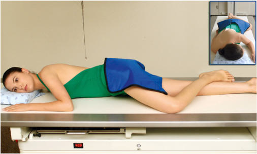
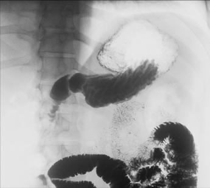

# Rx Tranzit Baritat Gastro-Duodenal (TBGD) RAO POSITION

  📷 Radiografie Convențională (Rx)
  <strong>Actualizat:</strong> 2026-09-15
  <strong>Autor:</strong> Departamentul de Radiologie / Referință Bontrager

---

-   __1. Rezumat Clinic & Indicații__

    ---

    === "Indicații Clinice"

        - Ideal position for demonstrating polyps and ulcers of the pylorus, duodenal bulb, and Cloop of the duodenum

    === "Ghid Național IRIS"

        !!! info "Referință Primară: Ghidul Național IRIS (Ordinul MS 1342/2012)"
            - **Capitol Ghid IRIS:** *Ghidul Național IRIS*
            - **Grad de Recomandare:** **De verificat pe indicație; fără grad atribuit automat**
            - **Nivel de Iradiere Estimată:** `De verificat pentru examinarea și populația selectate`

            [:octicons-search-16: Deschide Ghidul IRIS](../../iris.md){ .md-button .md-button--primary } [:material-open-in-new: Aplicația Oficială PWA](https://radiologie-pediatrica.ro/iris/){ .md-button target="_blank" rel="noopener" }
-   __2. Poziționare & Centrare Fascicul__

    ---

    - **Poziție Pacient:** Pacient: Position patient Decubit, with body partially rotated into an RAO position; provide a support for patient’s head and upper torso (Fig. 12.93).; Regiune anatomică: From a Decubit Ventral position, rotate 40° to 70°, with right anterior body against IR or table (more rotation is often required for hypersthenic patients, and less is required for asthenic patients). Place right arm down and left arm flexed at Cot and up by the patient’s head. Flex left Genunchi for support.
    - **Punct de Centrare Fascicul:** Direct Raza centrală (RC) perpendiculară pe receptorul de imagine Sthenic body type: Center CR and IR to duodenal bulb at level of l1 (1 to 2 inches [2.5 to 5 cm] above lower lateral rib margin), midway between spine and upside lateral border of Abdomen, 45° to 55° oblique Asthenic body type: Center about 2 inches (5 cm) below level of L1, 40° oblique Hypersthenic body type: Center about 2 inches (5 cm) above level of L1 and nearer midline, 70° oblique Center IR to CR
    - **Distanță Focar-Film (DFF / SID):** 100 cm
    - **Comandă Respiratorie:** Suspend respiration and expose on expiration. Tranzit Baritat Gastro-Duodenal (TBGD) ROUTINE RAO PA Right lateral LPO AP Fig. 12.93 RAO position.

-   __3. Parametri Tehnici Expunere__

    ---

    | Parametru Tehnic | Valoare Configurare Generator / Tub |
    |:-----------------|:-------------------------------------|
    | **Tensiune Tub (kV)** | 110-125 kV |
    | **Sarcină / Produs Curent-Timp (mAs)** | DE CONFIGURAT PE APARAT |
    | **Distanță Focar-Film (DFF / SID)** | 100 cm |
    | **Grilă Antidifuzoare (Bucky)** | Cu grilă antidifuzoare Bucky |
    | **Dimensiune Focar** | Focar Mare (1.0 - 1.2 mm) |
    | **Camere de Ionizare AEC** | Camerele laterale (sau camera centrală funcție de regiune) |
    | **Colimare Fascicul** | Strictă pe regiunea de interes anatomic |
    | **Filtrare Tub** | Totală ≥ 2.5 mm Al echivalent |

-   __4. Criterii de Calitate & Reușită Imagine__

    ---

    - Entire stomach and Cloop of duodenum are visible (Figs. 12.94 and 12.95). Position:
    - Duodenal bulb is in profile.
    - Proper collimation field size is applied.
    - CR is centered to level of L1, with body of stomach and Cloop centered on radiograph. Exposure:
    - Optimal image receptor exposure and contrast to visualize clearly the gastric folds without overexposing other pertinent anatomy.
    - Sharp structural margins indicate no motion. L Fig. 12.94 RAO upper GI position. Fundus (air-filled) L Pylorus (barium-filled) Small intestine (jejunum) Duodenal bulb L1 Fig. 12.95 RAO upper GI position.

-   __5. Protecție Radiologică (ALARA)__

    ---

    - Ecranare gonadică și a organelor radiosensibile conform procedurilor locale de radioprotecție ALARA.
    - Colimare strictă la aria de interes pentru limitarea radiației difuze.
    - Verificarea posibilității unei sarcini la pacientele de vârstă fertilă înainte de expunere.

### 🖼️ Imagini

<figure class="protocol-image-card" markdown>

<figcaption><strong>Fig. 12.93 RAO position.</strong> — Poziționare pacient conform Ghidului Bontrager (Fig. 12.93 RAO position.)</figcaption>

</figure>

<figure class="protocol-image-card" markdown>

<figcaption><strong>Fig. 12.94 RAO upper GI position.</strong> — Aspect radiografic de referință conform Ghidului Bontrager (Fig. 12.94 RAO upper GI position.)</figcaption>

</figure>

<figure class="protocol-image-card" markdown>

<figcaption><strong>Fig. 12.95 RAO upper GI position.</strong> — Aspect radiografic de referință conform Ghidului Bontrager (Fig. 12.95 RAO upper GI position.)</figcaption>

</figure>

=== "Ghid Rapid de Execuție"

    1. **Identificarea și verificarea pacientului:** verificare identitate, zonă de examinat, consimțământ conform procedurii și evaluarea posibilității unei sarcini, când este relevantă.
    2. **Pregătire:** îndepărtarea oricăror obiecte radiopace (bijuterii, agrafe, fermoare, proteze, pansamente dense).
    3. **Poziționare precisă:** alinierea receptorului de imagine și a tubului la distanța prescrisă (100 cm).
    4. **Colimare strictă:** adaptarea fasciculului strict la regiunea de diagnostic pentru scăderea iradierii și reducerea radiației difuze.
    5. **Radioprotecție:** verificarea [politicii RX](../radioprotectie.md), cu măsuri distincte pentru pacient, personal și însoțitor.

## Surse de documentare

- [Bontrager's Textbook of Radiographic Positioning (Ed. 9/10), Pagina 508](https://www.elsevier.com/books/textbook-of-radiographic-positioning-and-related-anatomy/lampignano/978-0-323-65367-1)
