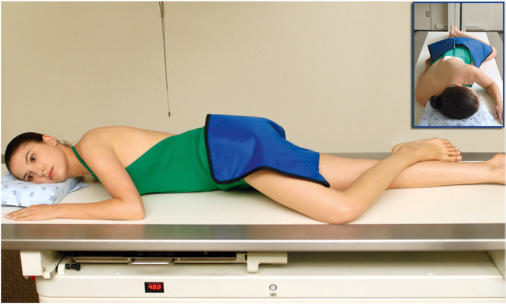
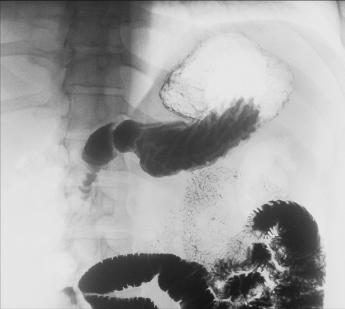

# Rx Tranzit Baritat Gastro-Duodenal (TBGD) Oblică Anterioară Dreaptă (OAD / RAO)

  📷 Radiografie Convențională (Rx)
  <strong>Actualizat:</strong> 2026-09-15
  <strong>Autor:</strong> Departamentul de Radiologie / Referință Bontrager

---

-   __1. Rezumat Clinic & Indicații__

    ---

    === "Indicații Clinice"

        - Poziție ideală pentru evidențierea polipilor și a ulcerelor pilorului, bulbului duodenal și ansei în C a duodenului

    === "Ghid Național IRIS"

        !!! info "Referință Primară: Ghidul Național IRIS (Ordinul MS 1342/2012)"
            - **Capitol Ghid IRIS:** *Aparat digestiv & Abdomen*
            - **Grad de Recomandare:** **Grad B**
            - **Nivel de Iradiere Estimată:** `Clasa 2 (Foarte mică ~ 0.7 - 1.2 mSv)`

            [:octicons-search-16: Deschide Ghidul IRIS](../../iris.md){ .md-button .md-button--primary } [:material-open-in-new: Aplicația Oficială PWA](https://radiologie-pediatrica.ro/iris/){ .md-button target="_blank" rel="noopener" }

-   __2. Poziționare & Centrare Fascicul__

    ---

    - **Poziție Pacient:** Pacient: se poziționează pacientul în decubit, cu corpul rotit parțial în poziție oblică anterioară dreaptă (OAD / RAO); se asigură sprijin pentru capul pacientului și partea superioară a trunchiului (Fig. 12.93).; Regiune anatomică: din poziția de decubit ventral, se rotește corpul cu 40° la 70°, cu partea anterioară dreaptă în contact cu receptorul de imagine sau cu masa (pentru pacienții hiperstenici este adesea necesară o rotație mai mare, iar pentru pacienții astenici este necesară o rotație mai mică). Se așază brațul drept în jos și brațul stâng ridicat lângă capul pacientului, cu cotul flectat. Se flectează genunchiul stâng pentru sprijin.
    - **Punct de Centrare Fascicul:** Se direcționează raza centrală (RC) perpendicular pe receptorul de imagine. Tip constituțional stenic: se centrează raza centrală și receptorul de imagine la nivelul bulbului duodenal, la nivelul l1 (1 la 2 inchi [2.5 la 5 cm] deasupra marginii costale inferolaterale), la jumătatea distanței dintre coloana vertebrală și marginea laterală a abdomenului de pe partea ridicată, cu o oblicitate de 45° la 55°. Tip constituțional astenic: se centrează la aproximativ 2 inchi (5 cm) sub nivelul L1, cu o oblicitate de 40°. Tip constituțional hiperstenic: se centrează la aproximativ 2 inchi (5 cm) deasupra nivelului L1 și mai aproape de linia mediană, cu o oblicitate de 70°. Se centrează receptorul de imagine pe raza centrală.
    - **Distanță Focar-Film (DFF / SID):** 100 cm
    - **Comandă Respiratorie:** Apnee la sfârșitul expirului pe durata expunerii. Tranzit Baritat Gastro-Duodenal (TBGD) DE RUTINĂ RAO PA profil drept LPO AP Fig. 12.93 poziție oblică anterioară dreaptă (OAD / RAO).

-   __3. Parametri Tehnici Expunere__

    ---

    | Parametru Tehnic | Valoare Configurare Generator / Tub |
    |:-----------------|:-------------------------------------|
    | **Tensiune Tub (kV)** | 110-125 kV |
    | **Sarcină / Produs Curent-Timp (mAs)** | DE CONFIGURAT PE APARAT |
    | **Distanță Focar-Film (DFF / SID)** | 100 cm |
    | **Grilă Antidifuzoare (Bucky)** | Cu grilă antidifuzoare Bucky |
    | **Dimensiune Focar** | Focar Mare (1.0 - 1.2 mm) |
    | **Camere de Ionizare AEC** | Camerele laterale (sau camera centrală, în funcție de regiune) |
    | **Colimare Fascicul** | Colimare strictă pe regiunea anatomică de interes diagnostic |
    | **Filtrare Tub** | Totală ≥ 2.5 mm Al echivalent |

-   __4. Criterii de Calitate & Reușită Imagine__

    ---

    - Stomacul și ansa în C a duodenului sunt vizibile în întregime (Fig. 12.94 și 12.95). Poziție:
    - Bulbul duodenal este vizualizat din profil.
    - Se aplică dimensiunea corectă a câmpului de colimare.
    - Raza centrală este centrată la nivelul L1, iar corpul stomacului și ansa în C sunt centrate pe radiografie. Expunere:
    - Expunere optimă a receptorului de imagine și contrast optim pentru vizualizarea clară a pliurilor gastrice, fără supraexpunerea celorlalte structuri anatomice relevante.
    - Contururile nete ale structurilor indică absența mișcării. L Fig. 12.94 Poziție RAO pentru tractul gastrointestinal superior. Fundul stomacului (umplut cu aer) L Pilor (umplut cu bariu) Intestin subțire (jejun) Bulb duodenal L1 Fig. 12.95 Poziție RAO pentru tractul gastrointestinal superior.

-   __5. Protecție Radiologică (ALARA)__

    ---

    - Ecranare gonadică și a organelor radiosensibile conform procedurilor locale de radioprotecție ALARA.
    - Colimare strictă la aria de interes pentru limitarea radiației difuze.
    - Verificarea posibilității unei sarcini la pacientele de vârstă fertilă înainte de expunere.

### 🖼️ Imagini

<figure class="protocol-image-card" markdown>

<figcaption><strong>Fig. 12.93 poziție oblică anterioară dreaptă (OAD / RAO).</strong> — Poziționare pacient conform Ghidului Bontrager (Fig. 12.93 poziție oblică anterioară dreaptă (OAD / RAO).)</figcaption>

</figure>

<figure class="protocol-image-card" markdown>

<figcaption><strong>Fig. 12.94 Poziție RAO pentru tractul gastrointestinal superior.</strong> — Aspect radiografic de referință conform Ghidului Bontrager (Fig. 12.94 Poziție RAO pentru tractul gastrointestinal superior.)</figcaption>

</figure>

<figure class="protocol-image-card" markdown>

<figcaption><strong>Fig. 12.95 Poziție RAO pentru tractul gastrointestinal superior.</strong> — Aspect radiografic de referință conform Ghidului Bontrager (Fig. 12.95 Poziție RAO pentru tractul gastrointestinal superior.)</figcaption>

</figure>

=== "Ghid Rapid de Execuție"

    1. **Identificarea și verificarea pacientului:** verificare identitate, zonă de examinat, consimțământ conform procedurii și evaluarea posibilității unei sarcini, când este relevantă.
    2. **Pregătire:** îndepărtarea oricăror obiecte radiopace (bijuterii, agrafe, fermoare, proteze, pansamente dense).
    3. **Poziționare precisă:** alinierea receptorului de imagine și a tubului la distanța prescrisă (100 cm).
    4. **Colimare strictă:** adaptarea fasciculului strict la regiunea de diagnostic pentru scăderea iradierii și reducerea radiației difuze.
    5. **Radioprotecție:** verificarea [politicii RX](../radioprotectie.md), cu măsuri distincte pentru pacient, personal și însoțitor.

## Surse de documentare

- [Bontrager's Textbook of Radiographic Positioning (Ed. 9/10), Pagina 508](https://www.elsevier.com/books/textbook-of-radiographic-positioning-and-related-anatomy/lampignano/978-0-323-65367-1)
