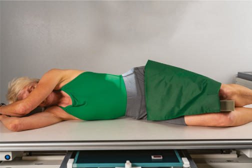
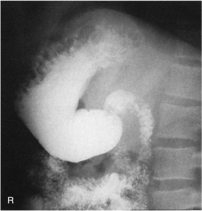
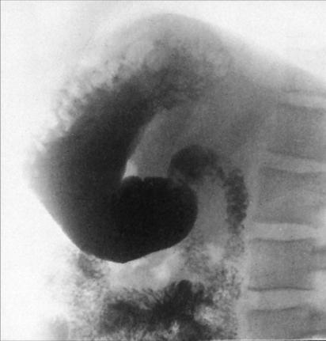

# Rx Tranzit Baritat Gastro-Duodenal (TBGD) RIGHT Profil (Lateral)

  📷 Radiografie Convențională (Rx)
  <strong>Actualizat:</strong> 2026-09-15
  <strong>Autor:</strong> Departamentul de Radiologie / Referință Bontrager

---

-   __1. Rezumat Clinic & Indicații__

    ---

    === "Indicații Clinice"

        - Pathologic processes of the retrogastric space (space behind the stomach)
        - Diverticula, tumors, gastric ulcers, and traumatism acuttism / Regim Urgență to the stomach may be demonstrated along posterior margin of stomach

    === "Ghid Național IRIS"

        !!! info "Referință Primară: Ghidul Național IRIS (Ordinul MS 1342/2012)"
            - **Capitol Ghid IRIS:** *Ghidul Național IRIS*
            - **Grad de Recomandare:** **De verificat pe indicație; fără grad atribuit automat**
            - **Nivel de Iradiere Estimată:** `De verificat pentru examinarea și populația selectate`

            [:octicons-search-16: Deschide Ghidul IRIS](../../iris.md){ .md-button .md-button--primary } [:material-open-in-new: Aplicația Oficială PWA](https://radiologie-pediatrica.ro/iris/){ .md-button target="_blank" rel="noopener" }
-   __2. Poziționare & Centrare Fascicul__

    ---

    - **Poziție Pacient:** Pacient: Position patient Decubit in a right Incidență de Profil (Lateral) (Fig. 12.98). Provide a support for patient’s head. Place arms up near patient’s head and flex knees.; Regiune anatomică: Ensure that shoulders and hips are in a true Incidență de Profil (Lateral). Center IR at CR (bottom of IR about at level of creasta iliacă (corespunzător L4-L5)).
    - **Punct de Centrare Fascicul:** Direct Raza centrală (RC) perpendiculară pe receptorul de imagine Sthenic body type: Center CR and IR to duodenal bulb at level of l1 (level of lower lateral margin of the Coaste (Grilaj Costal)) and 1 to 1½ inches (2.5 to 4 cm) anterior to midcoronal plane (near midway between anterior border of vertebrae and anterior Abdomen) Hypersthenic body type: Center about 2 inches (5 cm) above L1 Asthenic body type: Center about 2 inches (5 cm) below L1
    - **Distanță Focar-Film (DFF / SID):** 100 cm
    - **Comandă Respiratorie:** Suspend respiration and expose on expiration.

-   __3. Parametri Tehnici Expunere__

    ---

    | Parametru Tehnic | Valoare Configurare Generator / Tub |
    |:-----------------|:-------------------------------------|
    | **Tensiune Tub (kV)** | 110-125 kV |
    | **Sarcină / Produs Curent-Timp (mAs)** | DE CONFIGURAT PE APARAT |
    | **Distanță Focar-Film (DFF / SID)** | 100 cm |
    | **Grilă Antidifuzoare (Bucky)** | Cu grilă antidifuzoare Bucky |
    | **Dimensiune Focar** | Focar Mare (1.0 - 1.2 mm) |
    | **Camere de Ionizare AEC** | Camerele laterale (sau camera centrală funcție de regiune) |
    | **Colimare Fascicul** | Strictă pe regiunea de interes anatomic |
    | **Filtrare Tub** | Totală ≥ 2.5 mm Al echivalent |

-   __4. Criterii de Calitate & Reușită Imagine__

    ---

    - Entire stomach and duodenum are visible (Figs. 12.99 and 12.100).
    - Retrogastric space is demonstrated.
    - Pylorus of stomach and Cloop of duodenum should be visualized well on hypersthenic patients. Position:
    - Absența rotației anatomice: clavicule echidistante față de linia apofizelor spinoase should be present.
    - Vertebral bodies should be seen for reference purposes.
    - Intervertebral foramen should be open, indicating a true Incidență de Profil (Lateral).
    - Proper collimation field size is applied.
    - CR is centered to duodenal bulb at level of L1. Exposure:
    - Optimal image receptor exposure and contrast to visualize the gastric folds without overexposing other pertinent anatomy.
    - Sharp structural margins indicate no motion. Tranzit Baritat Gastro-Duodenal (TBGD) ROUTINE
    - RAO
    - PA
    - Right lateral
    - LPO
    - AP R Fundus Pyloric antrum Duodenal bulb Body Fig. 12.100 Right lateral upper GI position. Fig. 12.99 Right lateral upper GI position.

-   __5. Protecție Radiologică (ALARA)__

    ---

    - Ecranare gonadică și a organelor radiosensibile conform procedurilor locale de radioprotecție ALARA.
    - Colimare strictă la aria de interes pentru limitarea radiației difuze.
    - Verificarea posibilității unei sarcini la pacientele de vârstă fertilă înainte de expunere.

!!! note "Observații Clinice & Tehnice"
    The stomach generally is located about one vertebra higher in this position than in the PA or Incidență Oblică. Fig. 12.98 Right Incidență de Profil (Lateral).

### 🖼️ Imagini

<figure class="protocol-image-card" markdown>

<figcaption><strong>Fig. 12.98 Right Incidență de Profil (Lateral).</strong> — Poziționare pacient conform Ghidului Bontrager (Fig. 12.98 Right lateral position.)</figcaption>

</figure>

<figure class="protocol-image-card" markdown>

<figcaption><strong>Fig. 12.100 Right lateral upper GI position.</strong> — Aspect radiografic de referință conform Ghidului Bontrager (Fig. 12.100 Right lateral upper GI position.)</figcaption>

</figure>

<figure class="protocol-image-card" markdown>

<figcaption><strong>Fig. 12.99 Right lateral upper GI position.</strong> — Aspect radiografic de referință conform Ghidului Bontrager (Fig. 12.99 Right lateral upper GI position.)</figcaption>

</figure>

=== "Ghid Rapid de Execuție"

    1. **Identificarea și verificarea pacientului:** verificare identitate, zonă de examinat, consimțământ conform procedurii și evaluarea posibilității unei sarcini, când este relevantă.
    2. **Pregătire:** îndepărtarea oricăror obiecte radiopace (bijuterii, agrafe, fermoare, proteze, pansamente dense).
    3. **Poziționare precisă:** alinierea receptorului de imagine și a tubului la distanța prescrisă (100 cm).
    4. **Colimare strictă:** adaptarea fasciculului strict la regiunea de diagnostic pentru scăderea iradierii și reducerea radiației difuze.
    5. **Radioprotecție:** verificarea [politicii RX](../radioprotectie.md), cu măsuri distincte pentru pacient, personal și însoțitor.

## Surse de documentare

- [Bontrager's Textbook of Radiographic Positioning (Ed. 9/10), Pagina 510](https://www.elsevier.com/books/textbook-of-radiographic-positioning-and-related-anatomy/lampignano/978-0-323-65367-1)
