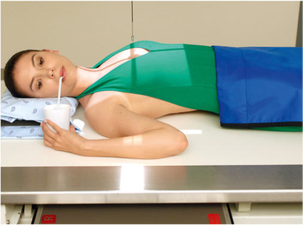
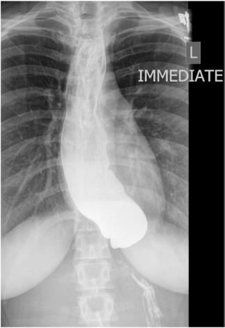

# Rx Tranzit Esofagian (Esofagobaritat) AP (PA) Incidență

  📷 Radiografie Convențională (Rx)
  <strong>Actualizat:</strong> 2026-09-15
  <strong>Autor:</strong> Departamentul de Radiologie / Referință Bontrager

---

-   __1. Rezumat Clinic & Indicații__

    ---

    === "Indicații Clinice"

        - Strictures, Corp străin / corpuri străine radio-opace, anatomic anomalies, și proces proliferativ tumorals de esophagus This incidență poate nu fie ca diagnostic ca RAO sau Incidență de Profil (lateral) due la esophagus este superimposed over Coloană Toracală.

    === "Ghid Național IRIS"

        !!! info "Referință Primară: Ghidul Național IRIS (Ordinul MS 1342/2012)"
            - **Capitol Ghid IRIS:** *Ghidul Național IRIS*
            - **Grad de Recomandare:** **De verificat pe indicație; fără grad atribuit automat**
            - **Nivel de Iradiere Estimată:** `De verificat pentru examinarea și populația selectate`

            [:octicons-search-16: Deschide Ghidul IRIS](../../iris.md){ .md-button .md-button--primary } [:material-open-in-new: Aplicația Oficială PWA](https://radiologie-pediatrica.ro/iris/){ .md-button target="_blank" rel="noopener" }
-   __2. Poziționare & Centrare Fascicul__

    ---

    - **Poziție Pacient:** Pacient: poziție pacient Decubit sau Ortostatism (Decubit preferred) (Fig. 12.88).; Regiune anatomică: Align MSp la midline de receptorul de imagine sau table. Ensure that umeri și hips sunt nu rotit. Place drept braț up la hold cup de barium. Place top de receptorul de imagine about 2 inches (5 cm) above top de Umăr, la place raza centrală la center de receptorul de imagine.
    - **Punct de Centrare Fascicul:** la MSP, 1 inch (2.5 cm) inferior la sternal angle (T5–T6) sau approximately 3 inches (8 cm) inferior la incizura jugulară (manubriul sternal)
    - **Distanță Focar-Film (DFF / SID):** 100 cm
    - **Comandă Respiratorie:** Apnee la sfârșitul expirului pe durata expunerii. Alternative PA This imagine also poate fie taken ca Incidență Postero-Anterioară (PA) cu similar positioning, centering, și raza centrală locations.

-   __3. Parametri Tehnici Expunere__

    ---

    | Parametru Tehnic | Valoare Configurare Generator / Tub |
    |:-----------------|:-------------------------------------|
    | **Tensiune Tub (kV)** | 110-125 kV |
    | **Sarcină / Produs Curent-Timp (mAs)** | DE CONFIGURAT PE APARAT |
    | **Distanță Focar-Film (DFF / SID)** | 100 cm |
    | **Grilă Antidifuzoare (Bucky)** | Cu grilă antidifuzoare Bucky |
    | **Dimensiune Focar** | Focar Mare (1.0 - 1.2 mm) |
    | **Camere de Ionizare AEC** | Camerele laterale (sau camera centrală funcție de regiune) |
    | **Colimare Fascicul** | Field Size Use tight side collimation field size la result în collimation field size that este about 5 la 6 inches (12 la 15 cm) wide. L sau R marker trebuie să fie plasat within collimation field size. |
    | **Filtrare Tub** | Totală ≥ 2.5 mm Al echivalent |

-   __4. Criterii de Calitate & Reușită Imagine__

    ---

    - Entire esophagus este filled cu barium (Fig. 12.89). poziție:
    - Absența rotației anatomice: clavicule echidistante față de linia apofizelor spinoase de pacientul’s corp este evidenced prin symmetry de articulații sternoclaviculare.
    - corect collimation field size este applied. expunere:
    - optim receptorul de imagine expunere și contrast la visualize esophagus through superimposed coloană toracală.
    - net structural margins indicate fără mișcare.

-   __5. Protecție Radiologică (ALARA)__

    ---

    - Ecranare gonadică și a organelor radiosensibile conform procedurilor locale de radioprotecție ALARA.
    - Colimare strictă la aria de interes pentru limitarea radiației difuze.
    - Verificarea posibilității unei sarcini la pacientele de vârstă fertilă înainte de expunere.

!!! note "Observații Clinice & Tehnice"
    S: Two sau three spoonfuls de thick barium trebuie să fie ingested, și expunere trebuie să fie made immediately after last bolus este swallowed. (pacient generally does nu breathe immediately after swallow.) pentru complete filling de esophagus cu thin barium, pacientul poate have la drink through straw, cu continuous swallowing și expunere made after three sau four swallows fără suspending respirație. Tranzit Esofagian (Esofagobaritat) ROUTINE RAO (35° la 40°) lateral AP (PA) Fig. 12.88 Decubit Incidență Antero-Posterioară (AP). Fig. 12.89 AP esophageal incidență.

### 🖼️ Imagini

<figure class="protocol-image-card" markdown>

<figcaption><strong>Fig. 12.88 Decubit Incidență Antero-Posterioară (AP).</strong> — Poziționare pacient conform Ghidului Bontrager (Fig. 12.88 Recumbent AP incidență.)</figcaption>

</figure>

<figure class="protocol-image-card" markdown>

<figcaption><strong>Fig. 12.89 AP esophageal incidență.</strong> — Aspect radiografic de referință conform Ghidului Bontrager (Fig. 12.89 AP esophageal incidență.)</figcaption>

</figure>

=== "Ghid Rapid de Execuție"

    1. **Identificarea și verificarea pacientului:** verificare identitate, zonă de examinat, consimțământ conform procedurii și evaluarea posibilității unei sarcini, când este relevantă.
    2. **Pregătire:** îndepărtarea oricăror obiecte radiopace (bijuterii, agrafe, fermoare, proteze, pansamente dense).
    3. **Poziționare precisă:** alinierea receptorului de imagine și a tubului la distanța prescrisă (100 cm).
    4. **Colimare strictă:** adaptarea fasciculului strict la regiunea de diagnostic pentru scăderea iradierii și reducerea radiației difuze.
    5. **Radioprotecție:** verificarea [politicii RX](../radioprotectie.md), cu măsuri distincte pentru pacient, personal și însoțitor.

## Surse de documentare

- [Bontrager's Textbook of Radiographic Positioning (Ed. 9/10), Pagina 506](https://www.elsevier.com/books/textbook-of-radiographic-positioning-and-related-anatomy/lampignano/978-0-323-65367-1)
