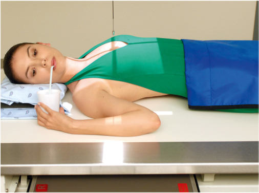
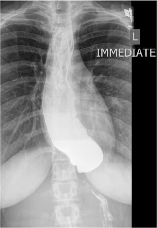

# Rx Tranzit Esofagian (Esofagobaritat) Incidență AP (PA)

  📷 Radiografie Convențională (Rx)
  <strong>Actualizat:</strong> 2026-09-15
  <strong>Autor:</strong> Departamentul de Radiologie / Referință Bontrager

---

-   __1. Rezumat Clinic & Indicații__

    ---

    === "Indicații Clinice"

        - Stricturi, corp străin / corpuri străine radioopace, anomalii anatomice și procese proliferative tumorale ale esofagului. Această incidență poate să nu aibă aceeași valoare diagnostică precum RAO sau incidența de profil (lateral), deoarece esofagul se suprapune peste coloana toracală.

    === "Ghid Național IRIS"

        !!! info "Referință Primară: Ghidul Național IRIS (Ordinul MS 1342/2012)"
            - **Capitol Ghid IRIS:** *Aparat digestiv & Abdomen*
            - **Grad de Recomandare:** **Grad B**
            - **Nivel de Iradiere Estimată:** `Clasa 2 (Foarte mică ~ 0.7 - 1.2 mSv)`

            [:octicons-search-16: Deschide Ghidul IRIS](../../iris.md){ .md-button .md-button--primary } [:material-open-in-new: Aplicația Oficială PWA](https://radiologie-pediatrica.ro/iris/){ .md-button target="_blank" rel="noopener" }

-   __2. Poziționare & Centrare Fascicul__

    ---

    - **Poziție Pacient:** Pacient: se poziționează pacientul în decubit sau în ortostatism (de preferat în decubit) (Fig. 12.88).; Regiune anatomică: se aliniază MSp cu linia mediană a receptorului de imagine sau a mesei. Se asigură absența rotației umerilor și a șoldurilor. Se ridică brațul drept pentru a ține paharul cu bariu. Se poziționează marginea superioară a receptorului de imagine la aproximativ 2 inchi (5 cm) deasupra părții superioare a umărului, pentru a plasa raza centrală în centrul receptorului de imagine.
    - **Punct de Centrare Fascicul:** La MSP, la 1 țol (2.5 cm) inferior de unghiul sternal (T5–T6) sau la aproximativ 3 inchi (8 cm) inferior de incizura jugulară (manubriul sternal)
    - **Distanță Focar-Film (DFF / SID):** 100 cm
    - **Comandă Respiratorie:** Apnee la sfârșitul expirului pe durata expunerii. Alternativă PA: această imagine poate fi obținută și în incidență postero-anterioară (PA), cu poziționare, centrare și localizare a razei centrale similare.

-   __3. Parametri Tehnici Expunere__

    ---

    | Parametru Tehnic | Valoare Configurare Generator / Tub |
    |:-----------------|:-------------------------------------|
    | **Tensiune Tub (kV)** | 110-125 kV |
    | **Sarcină / Produs Curent-Timp (mAs)** | DE CONFIGURAT PE APARAT |
    | **Distanță Focar-Film (DFF / SID)** | 100 cm |
    | **Grilă Antidifuzoare (Bucky)** | Cu grilă antidifuzoare Bucky |
    | **Dimensiune Focar** | Focar Mare (1.0 - 1.2 mm) |
    | **Camere de Ionizare AEC** | Camerele laterale (sau camera centrală, în funcție de regiune) |
    | **Colimare Fascicul** | Dimensiunea câmpului Utilizați o colimare laterală strânsă pentru a obține un câmp de aproximativ 5 la 6 țoli (12 la 15 cm) lățime. Markerul L sau R trebuie să fie plasat în interiorul câmpului colimat. |
    | **Filtrare Tub** | Totală ≥ 2.5 mm Al echivalent |

-   __4. Criterii de Calitate & Reușită Imagine__

    ---

    - Întregul esofag este umplut cu bariu (Fig. 12.89). Poziție:
    - Absența rotației anatomice a corpului pacientului, cu clavicule echidistante față de linia apofizelor spinoase, este evidențiată prin simetria articulațiilor sternoclaviculare.
    - Se aplică o colimare corectă a dimensiunilor câmpului. Expunere:
    - Expunere optimă a receptorului de imagine și contrast optim pentru vizualizarea esofagului prin coloana toracală suprapusă.
    - Marginile nete ale structurilor indică absența mișcării.

-   __5. Protecție Radiologică (ALARA)__

    ---

    - Ecranare gonadică și a organelor radiosensibile conform procedurilor locale de radioprotecție ALARA.
    - Colimare strictă la aria de interes pentru limitarea radiației difuze.
    - Verificarea posibilității unei sarcini la pacientele de vârstă fertilă înainte de expunere.

!!! note "Observații Clinice & Tehnice"
    S: se administrează două sau trei linguri de bariu gros, iar expunerea trebuie efectuată imediat după înghițirea ultimului bolus. (În general, pacientul nu respiră imediat după înghițire.) Pentru umplerea completă a esofagului cu bariu fluid, poate fi necesar ca pacientul să bea printr-un pai, înghițind continuu, iar expunerea să fie efectuată după trei sau patru înghițituri, fără apnee. Tranzit Esofagian (Esofagobaritat) DE RUTINĂ RAO (35° la 40°) profil AP (PA) Fig. 12.88 Incidență antero-posterioară (AP) în decubit. Fig. 12.89 Incidență AP a esofagului.

### 🖼️ Imagini

<figure class="protocol-image-card" markdown>

<figcaption><strong>Fig. 12.88 Incidență antero-posterioară (AP) în decubit.</strong> — Poziționarea pacientului conform Ghidului Bontrager (Fig. 12.88 Incidență AP în decubit.)</figcaption>

</figure>

<figure class="protocol-image-card" markdown>

<figcaption><strong>Fig. 12.89 Incidență AP a esofagului.</strong> — Aspect radiografic de referință conform Ghidului Bontrager (Fig. 12.89 Incidență AP a esofagului.)</figcaption>

</figure>

=== "Ghid Rapid de Execuție"

    1. **Identificarea și verificarea pacientului:** verificare identitate, zonă de examinat, consimțământ conform procedurii și evaluarea posibilității unei sarcini, când este relevantă.
    2. **Pregătire:** îndepărtarea oricăror obiecte radiopace (bijuterii, agrafe, fermoare, proteze, pansamente dense).
    3. **Poziționare precisă:** alinierea receptorului de imagine și a tubului la distanța prescrisă (100 cm).
    4. **Colimare strictă:** adaptarea fasciculului strict la regiunea de diagnostic pentru scăderea iradierii și reducerea radiației difuze.
    5. **Radioprotecție:** verificarea [politicii RX](../radioprotectie.md), cu măsuri distincte pentru pacient, personal și însoțitor.

## Surse de documentare

- [Bontrager's Textbook of Radiographic Positioning (Ed. 9/10), Pagina 506](https://www.elsevier.com/books/textbook-of-radiographic-positioning-and-related-anatomy/lampignano/978-0-323-65367-1)
