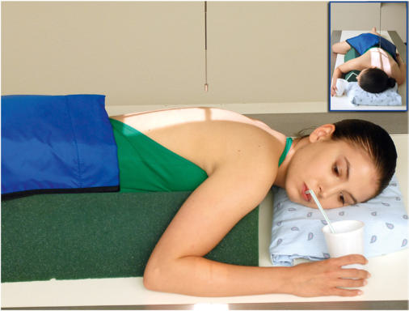
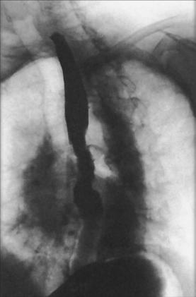

# Rx Tranzit Esofagian (Esofagobaritat) Oblică Anterioară Stângă (OAS / LAO)

  📷 Radiografie Convențională (Rx)
  <strong>Actualizat:</strong> 2026-09-15
  <strong>Autor:</strong> Departamentul de Radiologie / Referință Bontrager

---

-   __1. Rezumat Clinic & Indicații__

    ---

    === "Indicații Clinice"

        - Strictures, Corp străin / corpuri străine radio-opace, anatomic anomalies, și proces proliferativ tumorals de esophagus

    === "Ghid Național IRIS"

        !!! info "Referință Primară: Ghidul Național IRIS (Ordinul MS 1342/2012)"
            - **Capitol Ghid IRIS:** *Ghidul Național IRIS*
            - **Grad de Recomandare:** **De verificat pe indicație; fără grad atribuit automat**
            - **Nivel de Iradiere Estimată:** `De verificat pentru examinarea și populația selectate`

            [:octicons-search-16: Deschide Ghidul IRIS](../../iris.md){ .md-button .md-button--primary } [:material-open-in-new: Aplicația Oficială PWA](https://radiologie-pediatrica.ro/iris/){ .md-button target="_blank" rel="noopener" }
-   __2. Poziționare & Centrare Fascicul__

    ---

    - **Poziție Pacient:** Pacient: poziție pacient Decubit sau Ortostatism (Decubit preferred) (Fig. 12.90).; Regiune anatomică: Rotate 35° la 40° de la PA, cu stâng anterior corp against receptorul de imagine sau table. Place stâng braț down prin pacient’s side, cu drept braț flectat la Cot și up prin pacient’s cap. Flex drept Genunchi pentru support. Place top de receptorul de imagine about 2 inches (5 cm) above level de umeri, la place raza centrală la center de receptorul de imagine.
    - **Punct de Centrare Fascicul:** la level de T5 sau T6 (2 la 3 inches [5 la 7.5 cm] inferior la incizura jugulară (manubriul sternal))
    - **Distanță Focar-Film (DFF / SID):** 100 cm
    - **Comandă Respiratorie:** Apnee la sfârșitul expirului pe durata expunerii.

-   __3. Parametri Tehnici Expunere__

    ---

    | Parametru Tehnic | Valoare Configurare Generator / Tub |
    |:-----------------|:-------------------------------------|
    | **Tensiune Tub (kV)** | 110-125 kV |
    | **Sarcină / Produs Curent-Timp (mAs)** | DE CONFIGURAT PE APARAT |
    | **Distanță Focar-Film (DFF / SID)** | 100 cm |
    | **Grilă Antidifuzoare (Bucky)** | Cu grilă antidifuzoare Bucky |
    | **Dimensiune Focar** | Focar Mare (1.0 - 1.2 mm) |
    | **Camere de Ionizare AEC** | Camerele laterale (sau camera centrală funcție de regiune) |
    | **Colimare Fascicul** | Field Size Collimate lateral margini la create twosided collimation field size about 5 la 6 inches (12 la 15 cm) wide. L sau R marker trebuie să fie plasat within collimation field size. |
    | **Filtrare Tub** | Totală ≥ 2.5 mm Al echivalent |

-   __4. Criterii de Calitate & Reușită Imagine__

    ---

    - Esophagus este seen între hilar region de plămâni și Coloană Toracală (Figs. 12.91 și 12.92).
    - Entire esophagus este filled cu contrast medium. poziție:
    - pacientul’s upper limbs trebuie să nu superimpose esophagus.
    - corect collimation field size este applied. expunere:
    - optim receptorul de imagine expunere și contrast la visualize clearly margini de contrast media–filled esophagus through cordul shadow.
    - net structural margins indicate fără mișcare. L Fig. 12.91 LAO esophagus—evidențiind constricted area de esophagus, possibly carcinoma (arrows). Esophagus L Hilar region de plămâni Trachea Barium și air în stomach Constricted area de pathologic process Fig. 12.92 LAO esophageal poziție.

-   __5. Protecție Radiologică (ALARA)__

    ---

    - Ecranare gonadică și a organelor radiosensibile conform procedurilor locale de radioprotecție ALARA.
    - Colimare strictă la aria de interes pentru limitarea radiației difuze.
    - Verificarea posibilității unei sarcini la pacientele de vârstă fertilă înainte de expunere.

!!! note "Observații Clinice & Tehnice"
    Thin barium: pentru complete filling de esophagus cu thin barium, pacientul poate have la drink through straw, cu continuous swallowing și expunere made after three sau four swallows fără suspending respirație (using ca short expunere time ca possible). Tranzit Esofagian (Esofagobaritat) SPECIAL LAO Fig. 12.90 Decubit poziție oblică anterioară stângă (OAS / LAO).

### 🖼️ Imagini

<figure class="protocol-image-card" markdown>

<figcaption><strong>Fig. 12.90 Decubit poziție oblică anterioară stângă (OAS / LAO).</strong> — Poziționare pacient conform Ghidului Bontrager (Fig. 12.90 Recumbent poziție oblică anterioară stângă (OAS / LAO).)</figcaption>

</figure>

<figure class="protocol-image-card" markdown>

<figcaption><strong>Fig. 12.91 LAO esophagus—evidențiind constricted area de</strong> — Aspect radiografic de referință conform Ghidului Bontrager (Fig. 12.91 LAO esophagus—evidențiind constricted area de)</figcaption>

</figure>

<figure class="protocol-image-card" markdown>

<figcaption><strong>Fig. 12.92 LAO esophageal poziție.</strong> — Aspect radiografic de referință conform Ghidului Bontrager (Fig. 12.92 LAO esophageal poziție.)</figcaption>

</figure>

=== "Ghid Rapid de Execuție"

    1. **Identificarea și verificarea pacientului:** verificare identitate, zonă de examinat, consimțământ conform procedurii și evaluarea posibilității unei sarcini, când este relevantă.
    2. **Pregătire:** îndepărtarea oricăror obiecte radiopace (bijuterii, agrafe, fermoare, proteze, pansamente dense).
    3. **Poziționare precisă:** alinierea receptorului de imagine și a tubului la distanța prescrisă (100 cm).
    4. **Colimare strictă:** adaptarea fasciculului strict la regiunea de diagnostic pentru scăderea iradierii și reducerea radiației difuze.
    5. **Radioprotecție:** verificarea [politicii RX](../radioprotectie.md), cu măsuri distincte pentru pacient, personal și însoțitor.

## Surse de documentare

- [Bontrager's Textbook of Radiographic Positioning (Ed. 9/10), Pagina 507](https://www.elsevier.com/books/textbook-of-radiographic-positioning-and-related-anatomy/lampignano/978-0-323-65367-1)
