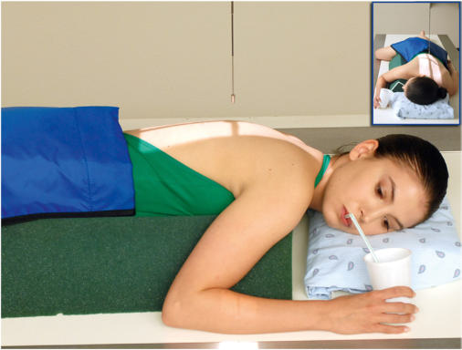
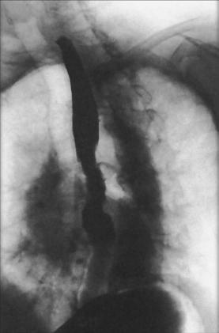

# Rx Tranzit Esofagian (Esofagobaritat) Oblică Anterioară Stângă (OAS / LAO)

  📷 Radiografie Convențională (Rx)
  <strong>Actualizat:</strong> 2026-09-15
  <strong>Autor:</strong> Departamentul de Radiologie / Referință Bontrager

---

-   __1. Rezumat Clinic & Indicații__

    ---

    === "Indicații Clinice"

        - Stricturi, corp străin / corpuri străine radioopace, anomalii anatomice și procese proliferative tumorale ale esofagului

    === "Ghid Național IRIS"

        !!! info "Referință Primară: Ghidul Național IRIS (Ordinul MS 1342/2012)"
            - **Capitol Ghid IRIS:** *Ghidul Național IRIS*
            - **Grad de Recomandare:** **De verificat pe indicație; fără grad atribuit automat**
            - **Nivel de Iradiere Estimată:** `De verificat pentru examinarea și populația selectate`

            [:octicons-search-16: Deschide Ghidul IRIS](../../iris.md){ .md-button .md-button--primary } [:material-open-in-new: Aplicația Oficială PWA](https://radiologie-pediatrica.ro/iris/){ .md-button target="_blank" rel="noopener" }
-   __2. Poziționare & Centrare Fascicul__

    ---

    - **Poziție Pacient:** Pacient: pacientul în decubit sau în ortostatism (de preferat în decubit) (Fig. 12.90).; Regiune anatomică: Rotiți pacientul cu 35° la 40° față de poziția PA, cu partea anterioară stângă a corpului sprijinită de receptorul de imagine sau de masă. Așezați brațul stâng în jos, de-a lungul corpului pacientului, cu brațul drept flectat la cot și ridicat lângă capul pacientului. Flectați genunchiul drept pentru sprijin. Așezați marginea superioară a receptorului de imagine la aproximativ 2 țoli (5 cm) deasupra nivelului umerilor, pentru a centra raza centrală pe centrul receptorului de imagine.
    - **Punct de Centrare Fascicul:** la nivelul T5 sau T6 (2 la 3 țoli [5 la 7.5 cm] inferior de incizura jugulară (manubriul sternal))
    - **Distanță Focar-Film (DFF / SID):** 100 cm
    - **Comandă Respiratorie:** Apnee la sfârșitul expirului pe durata expunerii.

-   __3. Parametri Tehnici Expunere__

    ---

    | Parametru Tehnic | Valoare Configurare Generator / Tub |
    |:-----------------|:-------------------------------------|
    | **Tensiune Tub (kV)** | 110-125 kV |
    | **Sarcină / Produs Curent-Timp (mAs)** | DE CONFIGURAT PE APARAT |
    | **Distanță Focar-Film (DFF / SID)** | 100 cm |
    | **Grilă Antidifuzoare (Bucky)** | Cu grilă antidifuzoare Bucky |
    | **Dimensiune Focar** | Focar Mare (1.0 - 1.2 mm) |
    | **Camere de Ionizare AEC** | Camerele laterale (sau camera centrală, în funcție de regiune) |
    | **Colimare Fascicul** | Dimensiunea câmpului Colimați marginile laterale pentru a crea un câmp colimat pe două laturi, cu o lățime de aproximativ 5 la 6 țoli (12 la 15 cm). Markerul L sau R trebuie să fie plasat în interiorul câmpului colimat. |
    | **Filtrare Tub** | Totală ≥ 2.5 mm Al echivalent |

-   __4. Criterii de Calitate & Reușită Imagine__

    ---

    - Esofagul este vizibil între regiunea hilară a plămânilor și coloana toracală (Fig. 12.91 și 12.92).
    - Întregul esofag este umplut cu substanță de contrast. Poziție:
    - Membrele superioare ale pacientului nu trebuie să se suprapună peste esofag.
    - Se aplică o colimare corectă a dimensiunilor câmpului. Expunere:
    - Expunere optimă a receptorului de imagine și contrast optim pentru vizualizarea clară a contururilor esofagului umplut cu substanță de contrast prin opacitatea cardiacă.
    - Contururile nete ale structurilor indică absența mișcării. L Fig. 12.91 Esofag în LAO—evidențiind o zonă îngustată a esofagului, posibil carcinom (săgeți). Esofag L Regiunea hilară a plămânilor Trahee Bariu și aer în stomac Zonă îngustată de procesul patologic Fig. 12.92 Poziție LAO pentru esofag.

-   __5. Protecție Radiologică (ALARA)__

    ---

    - Ecranare gonadică și a organelor radiosensibile conform procedurilor locale de radioprotecție ALARA.
    - Colimare strictă la aria de interes pentru limitarea radiației difuze.
    - Verificarea posibilității unei sarcini la pacientele de vârstă fertilă înainte de expunere.

!!! note "Observații Clinice & Tehnice"
    Suspensie baritată fluidă: pentru umplerea completă a esofagului cu suspensie baritată fluidă, poate fi necesar ca pacientul să bea printr-un pai, înghițind continuu, iar expunerea să fie efectuată după trei sau patru înghițituri, fără apnee (utilizând un timp de expunere cât mai scurt posibil). Tranzit Esofagian (Esofagobaritat) SPECIAL LAO Fig. 12.90 Poziție oblică anterioară stângă (OAS / LAO) în decubit.

### 🖼️ Imagini

<figure class="protocol-image-card" markdown>

<figcaption><strong>Fig. 12.90 Poziție oblică anterioară stângă (OAS / LAO) în decubit.</strong> — Poziționarea pacientului conform Ghidului Bontrager (Fig. 12.90 Poziție oblică anterioară stângă (OAS / LAO) în decubit.)</figcaption>

</figure>

<figure class="protocol-image-card" markdown>

<figcaption><strong>Fig. 12.91 Esofag în LAO—evidențiind zona îngustată a</strong> — Aspect radiografic de referință conform Ghidului Bontrager (Fig. 12.91 Esofag în LAO—evidențiind zona îngustată a)</figcaption>

</figure>

<figure class="protocol-image-card" markdown>

<figcaption><strong>Fig. 12.92 Poziție LAO pentru esofag.</strong> — Aspect radiografic de referință conform Ghidului Bontrager (Fig. 12.92 Poziție LAO pentru esofag.)</figcaption>

</figure>

=== "Ghid Rapid de Execuție"

    1. **Identificarea și verificarea pacientului:** verificare identitate, zonă de examinat, consimțământ conform procedurii și evaluarea posibilității unei sarcini, când este relevantă.
    2. **Pregătire:** îndepărtarea oricăror obiecte radiopace (bijuterii, agrafe, fermoare, proteze, pansamente dense).
    3. **Poziționare precisă:** alinierea receptorului de imagine și a tubului la distanța prescrisă (100 cm).
    4. **Colimare strictă:** adaptarea fasciculului strict la regiunea de diagnostic pentru scăderea iradierii și reducerea radiației difuze.
    5. **Radioprotecție:** verificarea [politicii RX](../radioprotectie.md), cu măsuri distincte pentru pacient, personal și însoțitor.

## Surse de documentare

- [Bontrager's Textbook of Radiographic Positioning (Ed. 9/10), Pagina 507](https://www.elsevier.com/books/textbook-of-radiographic-positioning-and-related-anatomy/lampignano/978-0-323-65367-1)
