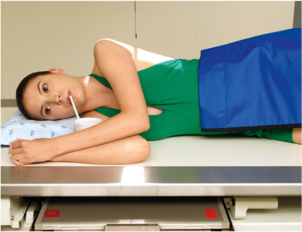
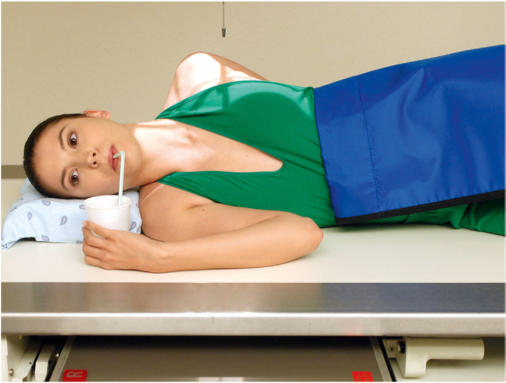
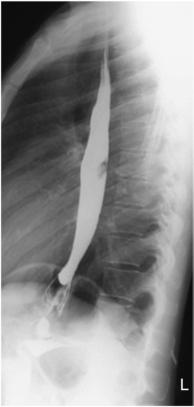

# Rx Tranzit Esofagian (Esofagobaritat) Profil (Lateral)

  📷 Radiografie Convențională (Rx)
  <strong>Actualizat:</strong> 2026-09-15
  <strong>Autor:</strong> Departamentul de Radiologie / Referință Bontrager

---

-   __1. Rezumat Clinic & Indicații__

    ---

    === "Indicații Clinice"

        - Strictures, foreign bodies, anatomic anomalies, and neoplasms of the esophagus

    === "Ghid Național IRIS"

        !!! info "Referință Primară: Ghidul Național IRIS (Ordinul MS 1342/2012)"
            - **Capitol Ghid IRIS:** *Ghidul Național IRIS*
            - **Grad de Recomandare:** **De verificat pe indicație; fără grad atribuit automat**
            - **Nivel de Iradiere Estimată:** `De verificat pentru examinarea și populația selectate`

            [:octicons-search-16: Deschide Ghidul IRIS](../../iris.md){ .md-button .md-button--primary } [:material-open-in-new: Aplicația Oficială PWA](https://radiologie-pediatrica.ro/iris/){ .md-button target="_blank" rel="noopener" }
-   __2. Poziționare & Centrare Fascicul__

    ---

    - **Poziție Pacient:** Pacient: Position patient Decubit or Ortostatism (Decubit preferred) (Fig. 12.85).; Regiune anatomică: Place patient’s arms near the head, with the elbows flexed and superimposed. Align midcoronal plane to midline of IR or table. Place shoulders and hips in a true Incidență de Profil (Lateral). Place top of IR about 2 inches (5 cm) above level of shoulders, to place center of IR at CR.
    - **Punct de Centrare Fascicul:** to level of T6 (2 to 3 inches [5 to 8 cm] inferior to incizura jugulară (manubriul sternal))
    - **Distanță Focar-Film (DFF / SID):** 100 cm
    - **Comandă Respiratorie:** Suspend respiration.

-   __3. Parametri Tehnici Expunere__

    ---

    | Parametru Tehnic | Valoare Configurare Generator / Tub |
    |:-----------------|:-------------------------------------|
    | **Tensiune Tub (kV)** | 110-125 kV |
    | **Sarcină / Produs Curent-Timp (mAs)** | DE CONFIGURAT PE APARAT |
    | **Distanță Focar-Film (DFF / SID)** | 100 cm |
    | **Grilă Antidifuzoare (Bucky)** | Cu grilă antidifuzoare Bucky |
    | **Dimensiune Focar** | Focar Mare (1.0 - 1.2 mm) |
    | **Camere de Ionizare AEC** | Camerele laterale (sau camera centrală funcție de regiune) |
    | **Colimare Fascicul** | field size. |
    | **Filtrare Tub** | Totală ≥ 2.5 mm Al echivalent |

-   __4. Criterii de Calitate & Reușită Imagine__

    ---

    - Entire esophagus is seen between Coloană Toracală and heart (Fig. 12.87). Position:
    - True lateral is indicated by direct superimposition of posterior Coaste (Grilaj Costal).
    - Patient’s arms should not superimpose esophagus.
    - Entire esophagus is filled or lined with contrast media.
    - Proper collimation field size is applied. Exposure:
    - Appropriate technique is used to visualize clearly borders of the contrast media–filled esophagus.
    - Sharp structural margins indicate no motion.

-   __5. Protecție Radiologică (ALARA)__

    ---

    - Ecranare gonadică și a organelor radiosensibile conform procedurilor locale de radioprotecție ALARA.
    - Colimare strictă la aria de interes pentru limitarea radiației difuze.
    - Verificarea posibilității unei sarcini la pacientele de vârstă fertilă înainte de expunere.

!!! note "Observații Clinice & Tehnice"
    See preceding page for barium swallow instructions. Optional Swimmer’s Incidență de Profil (Lateral) This position (Fig. 12.86) allows for better demonstration of the upper esophagus without superimposition of arms and shoulders. Position hips and shoulders in true Incidență de Profil (Lateral); separate shoulders from esophageal region by placing upside Umăr down and back, with arm behind back. Place downside Umăr and arm up and in front to hold cup of barium. Tranzit Esofagian (Esofagobaritat) ROUTINE RAO (35° to 40°) Lateral AP (PA) Fig. 12.85 Right lateral—arms up. Fig. 12.86 Optional—swimmer’s lateral for better visualization of upper esophagus. Fig. 12.87 Lateral esophagus—arms up.

### 🖼️ Imagini

<figure class="protocol-image-card" markdown>

<figcaption><strong>Fig. 12.85 Right lateral—arms up.</strong> — Poziționare pacient conform Ghidului Bontrager (Fig. 12.85 Right lateral—arms up.)</figcaption>

</figure>

<figure class="protocol-image-card" markdown>

<figcaption><strong>Fig. 12.86 Optional—swimmer’s lateral for better visualization of</strong> — Aspect radiografic de referință conform Ghidului Bontrager (Fig. 12.86 Optional—swimmer’s lateral for better visualization of)</figcaption>

</figure>

<figure class="protocol-image-card" markdown>

<figcaption><strong>Fig. 12.87 Lateral esophagus—arms up.</strong> — Aspect radiografic de referință conform Ghidului Bontrager (Fig. 12.87 Lateral esophagus—arms up.)</figcaption>

</figure>

=== "Ghid Rapid de Execuție"

    1. **Identificarea și verificarea pacientului:** verificare identitate, zonă de examinat, consimțământ conform procedurii și evaluarea posibilității unei sarcini, când este relevantă.
    2. **Pregătire:** îndepărtarea oricăror obiecte radiopace (bijuterii, agrafe, fermoare, proteze, pansamente dense).
    3. **Poziționare precisă:** alinierea receptorului de imagine și a tubului la distanța prescrisă (100 cm).
    4. **Colimare strictă:** adaptarea fasciculului strict la regiunea de diagnostic pentru scăderea iradierii și reducerea radiației difuze.
    5. **Radioprotecție:** verificarea [politicii RX](../radioprotectie.md), cu măsuri distincte pentru pacient, personal și însoțitor.

## Surse de documentare

- [Bontrager's Textbook of Radiographic Positioning (Ed. 9/10), Pagina 505](https://www.elsevier.com/books/textbook-of-radiographic-positioning-and-related-anatomy/lampignano/978-0-323-65367-1)
