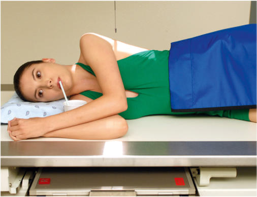
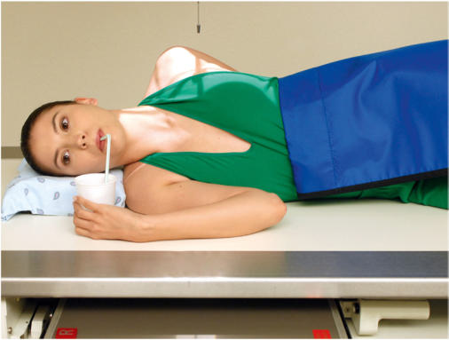
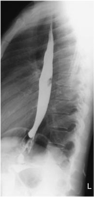

# Rx Tranzit Esofagian (Esofagobaritat) Profil (Lateral)

  📷 Radiografie Convențională (Rx)
  <strong>Actualizat:</strong> 2026-09-15
  <strong>Autor:</strong> Departamentul de Radiologie / Referință Bontrager

---

-   __1. Rezumat Clinic & Indicații__

    ---

    === "Indicații Clinice"

        - Stricturi, corp străin / corpuri străine radioopace, anomalii anatomice și procese proliferative tumorale ale esofagului

    === "Ghid Național IRIS"

        !!! info "Referință Primară: Ghidul Național IRIS (Ordinul MS 1342/2012)"
            - **Capitol Ghid IRIS:** *Aparat digestiv & Abdomen*
            - **Grad de Recomandare:** **Grad B**
            - **Nivel de Iradiere Estimată:** `Clasa 2 (Foarte mică ~ 0.7 - 1.2 mSv)`

            [:octicons-search-16: Deschide Ghidul IRIS](../../iris.md){ .md-button .md-button--primary } [:material-open-in-new: Aplicația Oficială PWA](https://radiologie-pediatrica.ro/iris/){ .md-button target="_blank" rel="noopener" }

-   __2. Poziționare & Centrare Fascicul__

    ---

    - **Poziție Pacient:** Pacient: pacientul în decubit sau în ortostatism (de preferat în decubit) (Fig. 12.85).; Regiune anatomică: Așezați brațele pacientului lângă cap, cu coatele flectate și suprapuse. Aliniați planul mediocoronal cu linia mediană a receptorului de imagine sau a mesei. Așezați umerii și șoldurile în profil strict. Așezați marginea superioară a receptorului de imagine la aproximativ 2 țoli (5 cm) deasupra nivelului umerilor, pentru a alinia centrul receptorului de imagine cu raza centrală.
    - **Punct de Centrare Fascicul:** la nivelul T6 (2 la 3 țoli [5 la 8 cm] inferior de incizura jugulară (manubriul sternal))
    - **Distanță Focar-Film (DFF / SID):** 100 cm
    - **Comandă Respiratorie:** Apnee pe durata expunerii.

-   __3. Parametri Tehnici Expunere__

    ---

    | Parametru Tehnic | Valoare Configurare Generator / Tub |
    |:-----------------|:-------------------------------------|
    | **Tensiune Tub (kV)** | 110-125 kV |
    | **Sarcină / Produs Curent-Timp (mAs)** | DE CONFIGURAT PE APARAT |
    | **Distanță Focar-Film (DFF / SID)** | 100 cm |
    | **Grilă Antidifuzoare (Bucky)** | Cu grilă antidifuzoare Bucky |
    | **Dimensiune Focar** | Focar Mare (1.0 - 1.2 mm) |
    | **Camere de Ionizare AEC** | Camerele laterale (sau camera centrală, în funcție de regiune) |
    | **Colimare Fascicul** | dimensiunea câmpului. |
    | **Filtrare Tub** | Totală ≥ 2.5 mm Al echivalent |

-   __4. Criterii de Calitate & Reușită Imagine__

    ---

    - Întregul esofag este vizibil între coloana toracală și cord (Fig. 12.87). Poziție:
    - Profilul strict este indicat de suprapunerea directă a arcurilor costale posterioare (grilaj costal).
    - Brațele pacientului nu trebuie să se suprapună peste esofag.
    - Întregul esofag este umplut sau tapetat cu substanță de contrast.
    - Se aplică o colimare corectă a dimensiunilor câmpului. Expunere:
    - Se utilizează o tehnică adecvată pentru a vizualiza clar contururile esofagului umplut cu substanță de contrast.
    - Marginile nete ale structurilor indică absența mișcării.

-   __5. Protecție Radiologică (ALARA)__

    ---

    - Ecranare gonadică și a organelor radiosensibile conform procedurilor locale de radioprotecție ALARA.
    - Colimare strictă la aria de interes pentru limitarea radiației difuze.
    - Verificarea posibilității unei sarcini la pacientele de vârstă fertilă înainte de expunere.

!!! note "Observații Clinice & Tehnice"
    Consultați pagina precedentă pentru instrucțiunile privind înghițirea suspensiei baritate. Incidență de profil în poziția înotătorului, opțională Această poziție (Fig. 12.86) permite o mai bună evidențiere a porțiunii superioare a esofagului, fără suprapunerea brațelor și a umerilor. Poziționați șoldurile și umerii în profil strict; îndepărtați umerii de regiunea esofagiană, așezând umărul de deasupra în jos și înapoi, cu brațul în spatele corpului. Așezați umărul și brațul de dedesubt în sus și în față, pentru a ține paharul cu suspensie baritată. Tranzit Esofagian (Esofagobaritat) DE RUTINĂ RAO (35° la 40°) profil AP (PA) Fig. 12.85 Profil drept—brațele ridicate. Fig. 12.86 Opțional—profil în poziția înotătorului pentru o mai bună vizualizare a porțiunii superioare a esofagului. Fig. 12.87 Esofag în incidență de profil—brațele ridicate.

### 🖼️ Imagini

<figure class="protocol-image-card" markdown>

<figcaption><strong>Fig. 12.85 Profil drept—brațele ridicate.</strong> — Poziționarea pacientului conform Ghidului Bontrager (Fig. 12.85 Profil drept—brațele ridicate.)</figcaption>

</figure>

<figure class="protocol-image-card" markdown>

<figcaption><strong>Fig. 12.86 Opțional—profil în poziția înotătorului pentru o mai bună vizualizare a</strong> — Aspect radiografic de referință conform Ghidului Bontrager (Fig. 12.86 Opțional—profil în poziția înotătorului pentru o mai bună vizualizare a)</figcaption>

</figure>

<figure class="protocol-image-card" markdown>

<figcaption><strong>Fig. 12.87 Esofag în incidență de profil—brațele ridicate.</strong> — Aspect radiografic de referință conform Ghidului Bontrager (Fig. 12.87 Esofag în incidență de profil—brațele ridicate.)</figcaption>

</figure>

=== "Ghid Rapid de Execuție"

    1. **Identificarea și verificarea pacientului:** verificare identitate, zonă de examinat, consimțământ conform procedurii și evaluarea posibilității unei sarcini, când este relevantă.
    2. **Pregătire:** îndepărtarea oricăror obiecte radiopace (bijuterii, agrafe, fermoare, proteze, pansamente dense).
    3. **Poziționare precisă:** alinierea receptorului de imagine și a tubului la distanța prescrisă (100 cm).
    4. **Colimare strictă:** adaptarea fasciculului strict la regiunea de diagnostic pentru scăderea iradierii și reducerea radiației difuze.
    5. **Radioprotecție:** verificarea [politicii RX](../radioprotectie.md), cu măsuri distincte pentru pacient, personal și însoțitor.

## Surse de documentare

- [Bontrager's Textbook of Radiographic Positioning (Ed. 9/10), Pagina 505](https://www.elsevier.com/books/textbook-of-radiographic-positioning-and-related-anatomy/lampignano/978-0-323-65367-1)
