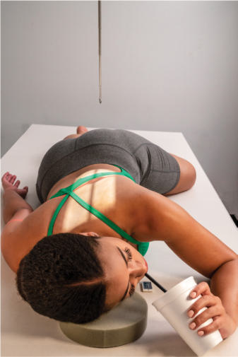
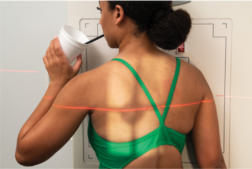
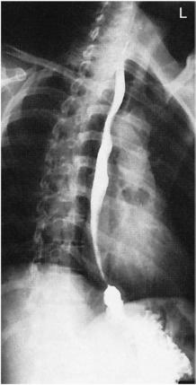
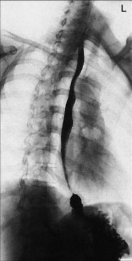

# Rx Tranzit Esofagian (Esofagobaritat) Oblică Anterioară Dreaptă (OAD / RAO)

  📷 Radiografie Convențională (Rx)
  <strong>Actualizat:</strong> 2026-09-15
  <strong>Autor:</strong> Departamentul de Radiologie / Referință Bontrager

---

-   __1. Rezumat Clinic & Indicații__

    ---

    === "Indicații Clinice"

        - Strictures, Corp străin / corpuri străine radio-opace, anatomic anomalies, și proces proliferativ tumorals de esophagus

    === "Ghid Național IRIS"

        !!! info "Referință Primară: Ghidul Național IRIS (Ordinul MS 1342/2012)"
            - **Capitol Ghid IRIS:** *Ghidul Național IRIS*
            - **Grad de Recomandare:** **De verificat pe indicație; fără grad atribuit automat**
            - **Nivel de Iradiere Estimată:** `De verificat pentru examinarea și populația selectate`

            [:octicons-search-16: Deschide Ghidul IRIS](../../iris.md){ .md-button .md-button--primary } [:material-open-in-new: Aplicația Oficială PWA](https://radiologie-pediatrica.ro/iris/){ .md-button target="_blank" rel="noopener" }
-   __2. Poziționare & Centrare Fascicul__

    ---

    - **Poziție Pacient:** Pacient: poziție pacient Decubit sau Ortostatism. Decubit este preferred because de more complete filling de esophagus (caused prin gravity factor cu Ortostatism poziție).; Regiune anatomică: Rotate 35° la 40° de la Decubit ventral poziție, cu drept anterior corp pe / sprijinit de receptorul de imagine sau table (Fig. 12.82). Place drept braț down cu stâng braț flectat la Cot și up prin pacientul’s cap, menținerea cup de barium, cu straw în pacient’s mouth. Flex stâng Genunchi pentru support. Align midline de thorax în Incidență Oblică la midline de receptorul de imagine sau table. Place top de receptorul de imagine about 2 inches (5 cm) above level de umeri la place center de receptorul de imagine la raza centrală.
    - **Punct de Centrare Fascicul:** la center de receptorul de imagine la level de T6 (2 la 3 inches [5 la 8 cm] inferior la incizura jugulară (manubriul sternal))
    - **Distanță Focar-Film (DFF / SID):** 100 cm
    - **Comandă Respiratorie:** Apnee pe durata expunerii (see NOTES).

-   __3. Parametri Tehnici Expunere__

    ---

    | Parametru Tehnic | Valoare Configurare Generator / Tub |
    |:-----------------|:-------------------------------------|
    | **Tensiune Tub (kV)** | 110-125 kV |
    | **Sarcină / Produs Curent-Timp (mAs)** | DE CONFIGURAT PE APARAT |
    | **Distanță Focar-Film (DFF / SID)** | 100 cm |
    | **Grilă Antidifuzoare (Bucky)** | Cu grilă antidifuzoare Bucky |
    | **Dimensiune Focar** | Focar Mare (1.0 - 1.2 mm) |
    | **Camere de Ionizare AEC** | Camerele laterale (sau camera centrală funcție de regiune) |
    | **Colimare Fascicul** | field size. |
    | **Filtrare Tub** | Totală ≥ 2.5 mm Al echivalent |

-   __4. Criterii de Calitate & Reușită Imagine__

    ---

    - Esophagus trebuie să fie vizibil între coloană vertebrală și heart (Figs. 12.83 și 12.84).
    - RAO provides better visibility de esophagus între vertebre și heart than LAO. poziție:
    - adecvat rotație de corp projects esophagus între coloană vertebrală și heart.
    - If esophagus este situated over coloană vertebrală, more rotație de corp este required.
    - Entire esophagus este filled sau lined cu contrast media.
    - Upper limbs trebuie să nu superimpose esophagus.
    - corect collimation field size este applied.
    - raza centrală este centrat la nivelul level de T5 și T6 la include entire esophagus. expunere:
    - optim receptorul de imagine expunere și contrast la visualize clearly margini de contrast media–filled esophagus.
    - net structural margins indicate fără mișcare. Fig. 12.82 35° la 40° RAO—Decubit sau Ortostatism (inset). Fig. 12.83 RAO esophagus. Esophagus Heart stâng hemidiaphragm Stomach Fig. 12.84 RAO esophagus.

-   __5. Protecție Radiologică (ALARA)__

    ---

    - Ecranare gonadică și a organelor radiosensibile conform procedurilor locale de radioprotecție ALARA.
    - Colimare strictă la aria de interes pentru limitarea radiației difuze.
    - Verificarea posibilității unei sarcini la pacientele de vârstă fertilă înainte de expunere.

!!! note "Observații Clinice & Tehnice"
    Thin barium: pentru complete filling de esophagus cu thin barium, pacientul poate have la drink through straw, cu continuous swallowing și expunere made after three sau four swallows fără suspending respirație (using ca short expunere time ca possible). Tranzit Esofagian (Esofagobaritat) ROUTINE RAO (35° la 40°) lateral AP (PA)

### 🖼️ Imagini

<figure class="protocol-image-card" markdown>

<figcaption><strong>Fig. 12.82 35° la 40° RAO—Decubit sau Ortostatism (inset).</strong> — Poziționare pacient conform Ghidului Bontrager (Fig. 12.82 35° la 40° RAO—recumbent sau în ortostatism (inset).)</figcaption>

</figure>

<figure class="protocol-image-card" markdown>

<figcaption><strong>Fig. 12.83 RAO esophagus.</strong> — Aspect radiografic de referință conform Ghidului Bontrager (Fig. 12.83 RAO esophagus.)</figcaption>

</figure>

<figure class="protocol-image-card" markdown>

<figcaption><strong>Fig. 12.84 RAO esophagus.</strong> — Aspect radiografic de referință conform Ghidului Bontrager (Fig. 12.84 RAO esophagus.)</figcaption>

</figure>

<figure class="protocol-image-card" markdown>

<figcaption><strong>Figura 4</strong> — Aspect radiografic de referință conform Ghidului Bontrager (Figura 4)</figcaption>

</figure>

=== "Ghid Rapid de Execuție"

    1. **Identificarea și verificarea pacientului:** verificare identitate, zonă de examinat, consimțământ conform procedurii și evaluarea posibilității unei sarcini, când este relevantă.
    2. **Pregătire:** îndepărtarea oricăror obiecte radiopace (bijuterii, agrafe, fermoare, proteze, pansamente dense).
    3. **Poziționare precisă:** alinierea receptorului de imagine și a tubului la distanța prescrisă (100 cm).
    4. **Colimare strictă:** adaptarea fasciculului strict la regiunea de diagnostic pentru scăderea iradierii și reducerea radiației difuze.
    5. **Radioprotecție:** verificarea [politicii RX](../radioprotectie.md), cu măsuri distincte pentru pacient, personal și însoțitor.

## Surse de documentare

- [Bontrager's Textbook of Radiographic Positioning (Ed. 9/10), Pagina 504](https://www.elsevier.com/books/textbook-of-radiographic-positioning-and-related-anatomy/lampignano/978-0-323-65367-1)
