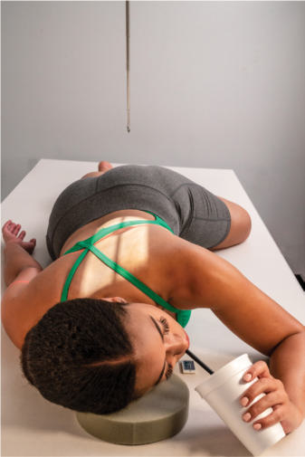
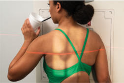
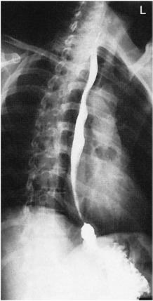
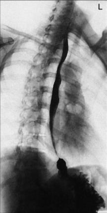

# Rx Tranzit Esofagian (Esofagobaritat) Oblică Anterioară Dreaptă (OAD / RAO)

  📷 Radiografie Convențională (Rx)
  <strong>Actualizat:</strong> 2026-09-15
  <strong>Autor:</strong> Departamentul de Radiologie / Referință Bontrager

---

-   __1. Rezumat Clinic & Indicații__

    ---

    === "Indicații Clinice"

        - Stricturi, corp străin / corpuri străine radioopace, anomalii anatomice și procese proliferative tumorale ale esofagului

    === "Ghid Național IRIS"

        !!! info "Referință Primară: Ghidul Național IRIS (Ordinul MS 1342/2012)"
            - **Capitol Ghid IRIS:** *Aparat digestiv & Abdomen*
            - **Grad de Recomandare:** **Grad B**
            - **Nivel de Iradiere Estimată:** `Clasa 2 (Foarte mică ~ 0.7 - 1.2 mSv)`

            [:octicons-search-16: Deschide Ghidul IRIS](../../iris.md){ .md-button .md-button--primary } [:material-open-in-new: Aplicația Oficială PWA](https://radiologie-pediatrica.ro/iris/){ .md-button target="_blank" rel="noopener" }

-   __2. Poziționare & Centrare Fascicul__

    ---

    - **Poziție Pacient:** Pacient: pacientul în decubit sau în ortostatism. Decubitul este preferat datorită umplerii mai complete a esofagului (gravitația influențează umplerea în ortostatism).; Regiune anatomică: Rotiți pacientul cu 35° la 40° față de poziția de decubit ventral, cu partea anterioară dreaptă a corpului pe / sprijinită de receptorul de imagine sau de masă (Fig. 12.82). Așezați brațul drept în jos, cu brațul stâng flectat la cot și ridicat lângă capul pacientului, ținând paharul cu suspensie baritată, cu paiul în gura pacientului. Flectați genunchiul stâng pentru sprijin. Aliniați linia mediană a toracelui în poziție oblică cu linia mediană a receptorului de imagine sau a mesei. Așezați marginea superioară a receptorului de imagine la aproximativ 2 țoli (5 cm) deasupra nivelului umerilor, pentru a alinia centrul receptorului de imagine cu raza centrală.
    - **Punct de Centrare Fascicul:** la centrul receptorului de imagine, la nivelul T6 (2 la 3 țoli [5 la 8 cm] inferior de incizura jugulară (manubriul sternal))
    - **Distanță Focar-Film (DFF / SID):** 100 cm
    - **Comandă Respiratorie:** Apnee pe durata expunerii (consultați NOTELE).

-   __3. Parametri Tehnici Expunere__

    ---

    | Parametru Tehnic | Valoare Configurare Generator / Tub |
    |:-----------------|:-------------------------------------|
    | **Tensiune Tub (kV)** | 110-125 kV |
    | **Sarcină / Produs Curent-Timp (mAs)** | DE CONFIGURAT PE APARAT |
    | **Distanță Focar-Film (DFF / SID)** | 100 cm |
    | **Grilă Antidifuzoare (Bucky)** | Cu grilă antidifuzoare Bucky |
    | **Dimensiune Focar** | Focar Mare (1.0 - 1.2 mm) |
    | **Camere de Ionizare AEC** | Camerele laterale (sau camera centrală, în funcție de regiune) |
    | **Colimare Fascicul** | dimensiunea câmpului. |
    | **Filtrare Tub** | Totală ≥ 2.5 mm Al echivalent |

-   __4. Criterii de Calitate & Reușită Imagine__

    ---

    - Esofagul trebuie să fie vizibil între coloana vertebrală și cord (Fig. 12.83 și 12.84).
    - RAO oferă o vizibilitate mai bună a esofagului între vertebre și cord decât LAO. Poziție:
    - Rotația adecvată a corpului proiectează esofagul între coloana vertebrală și cord.
    - Dacă esofagul se proiectează peste coloana vertebrală, este necesară o rotație mai mare a corpului.
    - Întregul esofag este umplut sau tapetat cu substanță de contrast.
    - Membrele superioare nu trebuie să se suprapună peste esofag.
    - Se aplică dimensiunea corectă a câmpului de colimare.
    - Raza centrală este centrată la nivelul T5 și T6 pentru a include întregul esofag. Expunere:
    - Expunere optimă a receptorului de imagine și contrast optim pentru vizualizarea clară a contururilor esofagului umplut cu substanță de contrast.
    - Contururile nete ale structurilor indică absența mișcării. Fig. 12.82 RAO la 35° la 40°—decubit sau ortostatism (imagine inserată). Fig. 12.83 Esofag în RAO. Esofag Cord Hemidiafragm stâng Stomac Fig. 12.84 Esofag în RAO.

-   __5. Protecție Radiologică (ALARA)__

    ---

    - Ecranare gonadică și a organelor radiosensibile conform procedurilor locale de radioprotecție ALARA.
    - Colimare strictă la aria de interes pentru limitarea radiației difuze.
    - Verificarea posibilității unei sarcini la pacientele de vârstă fertilă înainte de expunere.

!!! note "Observații Clinice & Tehnice"
    Suspensie baritată fluidă: pentru umplerea completă a esofagului cu suspensie baritată fluidă, poate fi necesar ca pacientul să bea printr-un pai, înghițind continuu, iar expunerea să fie efectuată după trei sau patru înghițituri, fără apnee (utilizând un timp de expunere cât mai scurt posibil). Tranzit Esofagian (Esofagobaritat) DE RUTINĂ RAO (35° la 40°) profil AP (PA)

### 🖼️ Imagini

<figure class="protocol-image-card" markdown>

<figcaption><strong>Fig. 12.82 RAO la 35° la 40°—decubit sau ortostatism (imagine inserată).</strong> — Poziționarea pacientului conform Ghidului Bontrager (Fig. 12.82 RAO la 35° la 40°—în decubit sau în ortostatism (imagine inserată).)</figcaption>

</figure>

<figure class="protocol-image-card" markdown>

<figcaption><strong>Fig. 12.83 Esofag în RAO.</strong> — Aspect radiografic de referință conform Ghidului Bontrager (Fig. 12.83 Esofag în RAO.)</figcaption>

</figure>

<figure class="protocol-image-card" markdown>

<figcaption><strong>Fig. 12.84 Esofag în RAO.</strong> — Aspect radiografic de referință conform Ghidului Bontrager (Fig. 12.84 Esofag în RAO.)</figcaption>

</figure>

<figure class="protocol-image-card" markdown>

<figcaption><strong>Figura 4</strong> — Aspect radiografic de referință conform Ghidului Bontrager (Figura 4)</figcaption>

</figure>

=== "Ghid Rapid de Execuție"

    1. **Identificarea și verificarea pacientului:** verificare identitate, zonă de examinat, consimțământ conform procedurii și evaluarea posibilității unei sarcini, când este relevantă.
    2. **Pregătire:** îndepărtarea oricăror obiecte radiopace (bijuterii, agrafe, fermoare, proteze, pansamente dense).
    3. **Poziționare precisă:** alinierea receptorului de imagine și a tubului la distanța prescrisă (100 cm).
    4. **Colimare strictă:** adaptarea fasciculului strict la regiunea de diagnostic pentru scăderea iradierii și reducerea radiației difuze.
    5. **Radioprotecție:** verificarea [politicii RX](../radioprotectie.md), cu măsuri distincte pentru pacient, personal și însoțitor.

## Surse de documentare

- [Bontrager's Textbook of Radiographic Positioning (Ed. 9/10), Pagina 504](https://www.elsevier.com/books/textbook-of-radiographic-positioning-and-related-anatomy/lampignano/978-0-323-65367-1)
