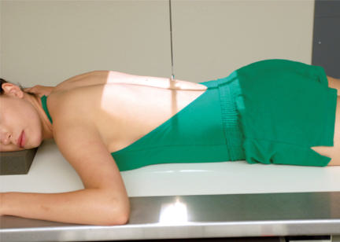
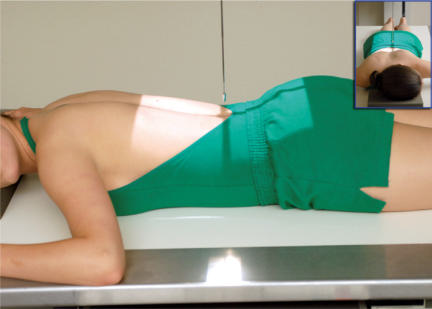
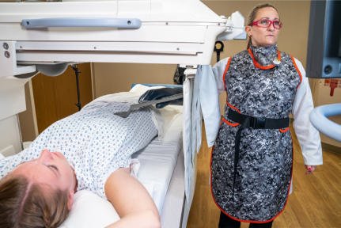

# Rx Tranzit Intestinal Baritat PA (Postero-Anterior)

  📷 Radiografie Convențională (Rx)
  <strong>Actualizat:</strong> 2026-09-15
  <strong>Autor:</strong> Departamentul de Radiologie / Referință Bontrager

---

-   __1. Rezumat Clinic & Indicații__

    ---

    === "Indicații Clinice"

        - Inflammatory processes, proces proliferativ tumorals, și obstructions de intestin subțire
        - Upper Gi–intestin subțire combination: Commonly performed; additional barium este ingested after completion de upper GI (see p. 509).
        - intestin subțire–only series: Includes scout Abdomen radiografie followed prin ingestion de barium și timedinterval radiografii (see p. 510)
        - Enteroclysis și intubation procedures: See descriptions pe pp. 510 și 511.

    === "Ghid Național IRIS"

        !!! info "Referință Primară: Ghidul Național IRIS (Ordinul MS 1342/2012)"
            - **Capitol Ghid IRIS:** *Ghidul Național IRIS*
            - **Grad de Recomandare:** **De verificat pe indicație; fără grad atribuit automat**
            - **Nivel de Iradiere Estimată:** `De verificat pentru examinarea și populația selectate`

            [:octicons-search-16: Deschide Ghidul IRIS](../../iris.md){ .md-button .md-button--primary } [:material-open-in-new: Aplicația Oficială PWA](https://radiologie-pediatrica.ro/iris/){ .md-button target="_blank" rel="noopener" }
-   __2. Poziționare & Centrare Fascicul__

    ---

    - **Poziție Pacient:** Pacient: pacient este Decubit ventral (sau Decubit dorsal if pacient cannot lie în Decubit ventral poziție) cu support pentru capul.; Regiune anatomică: Align plan mediosagital (MSP) la linia mediană mesei/grilă sau raza centrală. Place brațe up beside cap cu membre inferioare extins și support provided under ankles. Ensure that Absența rotației anatomice: clavicule echidistante față de linia apofizelor spinoase occurs.
    - **Punct de Centrare Fascicul:** este perpendicular pe receptorul de imagine. 15 sau 30 minutes: Center la about 2 inches (5 cm) above creasta iliacă (corespunzător L4-L5) (see NOTES) (Fig. 13.54). Hourly: Center raza centrală și midpoint de receptorul de imagine la creasta iliacă (corespunzător L4-L5) (Fig. 13.55). Se centrează receptorul de imagine pe raza centrală.
    - **Distanță Focar-Film (DFF / SID):** 100 cm
    - **Comandă Respiratorie:** Apnee la sfârșitul expirului pe durata expunerii.

-   __3. Parametri Tehnici Expunere__

    ---

    | Parametru Tehnic | Valoare Configurare Generator / Tub |
    |:-----------------|:-------------------------------------|
    | **Tensiune Tub (kV)** | 110-125 kV |
    | **Sarcină / Produs Curent-Timp (mAs)** | DE CONFIGURAT PE APARAT |
    | **Distanță Focar-Film (DFF / SID)** | 100 cm |
    | **Grilă Antidifuzoare (Bucky)** | Cu grilă antidifuzoare Bucky |
    | **Dimensiune Focar** | Focar Mare (1.0 - 1.2 mm) |
    | **Camere de Ionizare AEC** | Camerele laterale (sau camera centrală funcție de regiune) |
    | **Colimare Fascicul** | Field Size Collimate pe four sides la anatomy de interest. |
    | **Filtrare Tub** | Totală ≥ 2.5 mm Al echivalent |

-   __4. Criterii de Calitate & Reușită Imagine__

    ---

    - Entire intestin subțire este evidențiat pe fiecare radiografie, cu stomach included pe first 15minute sau 30minute radiografie (Figs. 13.57 la 13.60). poziție:
    - Absența rotației anatomice: clavicule echidistante față de linia apofizelor spinoase este present.
    - ala de ilium și coloană lombară sunt simetric.
    - corect collimation field size este applied. expunere:
    - optim receptorul de imagine expunere și contrast la visualize contrastfilled intestin subțire fără overexposing parts that sunt filled only partially cu barium.
    - net structural margins indicate fără mișcare.
    - pacient identification information, time interval markeri, și R sau L marker sunt vizibil fără superimposition de essential anatomy. Fig. 13.56 Manual compression de ileocecal valve region.

-   __5. Protecție Radiologică (ALARA)__

    ---

    - Ecranare gonadică și a organelor radiosensibile conform procedurilor locale de radioprotecție ALARA.
    - Colimare strictă la aria de interes pentru limitarea radiației difuze.
    - Verificarea posibilității unei sarcini la pacientele de vârstă fertilă înainte de expunere.

!!! note "Observații Clinice & Tehnice"
    S: Timing begins cu ingestion de barium. Timed intervals de radiografii depend pe transit time de specific barium preparation used și pe department protocol. pentru first 30minute radiografie, center high pentru include entire stomach. Subsequent 30minute interval radiografii sunt taken until barium reaches intestin gros (colon) (usually 2 hours). study este generally completed when contrast medium reaches cecum sau ascending intestin gros (colon). Fluoroscopy și spot imaging de ileocecal valve și terminal ileum after barium reaches this area sunt commonly included în routine Tranzit Intestinal Baritat. This procedure este determined prin fluoroscopist’s preference și prin department protocols (Fig. 13.56). Tranzit Intestinal Baritat ROUTINE PA (every 15 la 30 minutes) enteroclysis și intubation Fig. 13.54 PA—15 sau 30 minutes—centrat approximately 2 inches (5 cm) above creasta iliacă (corespunzător L4-L5). Fig. 13.55 PA—hourly, centrat pe creasta iliacă (corespunzător L4-L5). 30 min.

### 🖼️ Imagini

<figure class="protocol-image-card" markdown>

<figcaption><strong>Fig. 13.54 PA—15 sau 30 minutes—centrat approximately 2 inches</strong> — Poziționare pacient conform Ghidului Bontrager (Fig. 13.54 PA—15 sau 30 minutes—centrat approximately 2 inches)</figcaption>

</figure>

<figure class="protocol-image-card" markdown>

<figcaption><strong>Fig. 13.55 PA—hourly, centrat pe creasta iliacă (corespunzător L4-L5).</strong> — Aspect radiografic de referință conform Ghidului Bontrager (Fig. 13.55 PA—hourly, centrat pe creste iliace.)</figcaption>

</figure>

<figure class="protocol-image-card" markdown>

<figcaption><strong>Fig. 13.56 Manual compression de ileocecal valve region.</strong> — Aspect radiografic de referință conform Ghidului Bontrager (Fig. 13.56 Manual compression de ileocecal valve region.)</figcaption>

</figure>

=== "Ghid Rapid de Execuție"

    1. **Identificarea și verificarea pacientului:** verificare identitate, zonă de examinat, consimțământ conform procedurii și evaluarea posibilității unei sarcini, când este relevantă.
    2. **Pregătire:** îndepărtarea oricăror obiecte radiopace (bijuterii, agrafe, fermoare, proteze, pansamente dense).
    3. **Poziționare precisă:** alinierea receptorului de imagine și a tubului la distanța prescrisă (100 cm).
    4. **Colimare strictă:** adaptarea fasciculului strict la regiunea de diagnostic pentru scăderea iradierii și reducerea radiației difuze.
    5. **Radioprotecție:** verificarea [politicii RX](../radioprotectie.md), cu măsuri distincte pentru pacient, personal și însoțitor.

## Surse de documentare

- [Bontrager's Textbook of Radiographic Positioning (Ed. 9/10), Pagina 539](https://www.elsevier.com/books/textbook-of-radiographic-positioning-and-related-anatomy/lampignano/978-0-323-65367-1)
