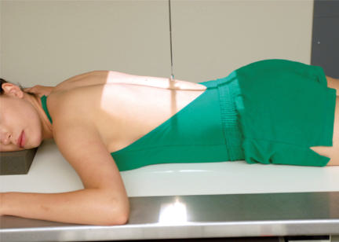
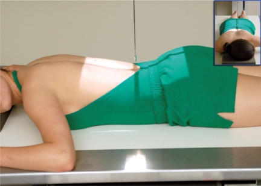
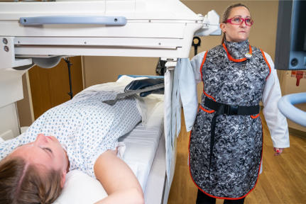

# Rx Tranzit Intestinal Baritat PA (Postero-Anterior)

  📷 Radiografie Convențională (Rx)
  <strong>Actualizat:</strong> 2026-09-15
  <strong>Autor:</strong> Departamentul de Radiologie / Referință Bontrager

---

-   __1. Rezumat Clinic & Indicații__

    ---

    === "Indicații Clinice"

        - Procese inflamatorii, procese proliferative tumorale și obstrucții ale intestinului subțire
        - Examinare combinată a tractului gastrointestinal superior și a intestinului subțire: efectuată frecvent; se ingerează bariu suplimentar după finalizarea examinării tractului gastrointestinal superior (vezi p. 509).
        - Serie de radiografii exclusiv ale intestinului subțire: include o radiografie abdominală preliminară, urmată de ingestia de bariu și de radiografii efectuate la intervale de timp stabilite (vezi p. 510)
        - Proceduri de enterocliză și intubație: vezi descrierile de la pp. 510 și 511.

    === "Ghid Național IRIS"

        !!! info "Referință Primară: Ghidul Național IRIS (Ordinul MS 1342/2012)"
            - **Capitol Ghid IRIS:** *Aparat digestiv & Abdomen*
            - **Grad de Recomandare:** **Grad B**
            - **Nivel de Iradiere Estimată:** `Clasa 2 (Foarte mică ~ 0.7 - 1.2 mSv)`

            [:octicons-search-16: Deschide Ghidul IRIS](../../iris.md){ .md-button .md-button--primary } [:material-open-in-new: Aplicația Oficială PWA](https://radiologie-pediatrica.ro/iris/){ .md-button target="_blank" rel="noopener" }

-   __2. Poziționare & Centrare Fascicul__

    ---

    - **Poziție Pacient:** Pacient: pacientul este în decubit ventral (sau în decubit dorsal dacă nu poate sta în decubit ventral), cu un suport pentru cap.; Regiune anatomică: Aliniați planul mediosagital (MSP) cu linia mediană a mesei/grilei sau cu raza centrală. Așezați brațele în sus, lângă cap, cu membrele inferioare extinse și un suport sub glezne. Asigurați absența rotației anatomice: clavicule echidistante față de linia apofizelor spinoase.
    - **Punct de Centrare Fascicul:** este perpendicular pe receptorul de imagine. La 15 sau 30 minute: Centrați la aproximativ 2 țoli (5 cm) deasupra crestei iliace (corespunzător L4-L5) (consultați NOTELE) (Fig. 13.54). La fiecare oră: Centrați raza centrală și mijlocul receptorului de imagine la nivelul crestei iliace (corespunzător L4-L5) (Fig. 13.55). Se centrează receptorul de imagine pe raza centrală.
    - **Distanță Focar-Film (DFF / SID):** 100 cm
    - **Comandă Respiratorie:** Apnee la sfârșitul expirului pe durata expunerii.

-   __3. Parametri Tehnici Expunere__

    ---

    | Parametru Tehnic | Valoare Configurare Generator / Tub |
    |:-----------------|:-------------------------------------|
    | **Tensiune Tub (kV)** | 110-125 kV |
    | **Sarcină / Produs Curent-Timp (mAs)** | DE CONFIGURAT PE APARAT |
    | **Distanță Focar-Film (DFF / SID)** | 100 cm |
    | **Grilă Antidifuzoare (Bucky)** | Cu grilă antidifuzoare Bucky |
    | **Dimensiune Focar** | Focar Mare (1.0 - 1.2 mm) |
    | **Camere de Ionizare AEC** | Camerele laterale (sau camera centrală, în funcție de regiune) |
    | **Colimare Fascicul** | Dimensiunea câmpului Colimați pe cele patru laturi la regiunea anatomică de interes. |
    | **Filtrare Tub** | Totală ≥ 2.5 mm Al echivalent |

-   __4. Criterii de Calitate & Reușită Imagine__

    ---

    - Întregul intestin subțire este evidențiat pe fiecare radiografie, stomacul fiind inclus pe prima radiografie, la 15 sau 30 de minute (Fig. 13.57 până la 13.60). Poziție:
    - Absența rotației anatomice: clavicule echidistante față de linia apofizelor spinoase.
    - Aripile iliace și coloana lombară sunt simetrice.
    - Se aplică o colimare corectă a dimensiunilor câmpului. Expunere:
    - Expunere optimă a receptorului de imagine și contrast optim pentru vizualizarea intestinului subțire umplut cu substanță de contrast, fără supraexpunerea porțiunilor umplute doar parțial cu bariu.
    - Marginile nete ale structurilor indică absența mișcării.
    - Datele de identificare ale pacientului, marcajele intervalelor de timp și markerul R sau L sunt vizibile fără suprapunere peste structurile anatomice esențiale. Fig. 13.56 Compresie manuală a regiunii valvei ileocecale.

-   __5. Protecție Radiologică (ALARA)__

    ---

    - Ecranare gonadică și a organelor radiosensibile conform procedurilor locale de radioprotecție ALARA.
    - Colimare strictă la aria de interes pentru limitarea radiației difuze.
    - Verificarea posibilității unei sarcini la pacientele de vârstă fertilă înainte de expunere.

!!! note "Observații Clinice & Tehnice"
    S: Cronometrarea începe odată cu ingestia de bariu. Intervalele de timp dintre radiografii depind de timpul de tranzit al preparatului de bariu utilizat și de protocolul departamentului. Pentru prima radiografie, la 30 de minute, centrați sus pentru a include întregul stomac. Radiografiile ulterioare se efectuează la intervale de 30 de minute, până când bariul ajunge în intestinul gros (colon) (de obicei 2 ore). Examinarea se încheie, în general, când substanța de contrast ajunge în cec sau în colonul ascendent. Fluoroscopia și radiografiile țintite ale valvei ileocecale și ale ileonului terminal după ce bariul ajunge în această zonă sunt incluse frecvent în examinarea de rutină a tranzitului intestinal baritat. Această procedură este stabilită în funcție de preferința medicului care efectuează fluoroscopia și de protocoalele departamentului (Fig. 13.56). Tranzit Intestinal Baritat DE RUTINĂ PA (la fiecare 15 până la 30 de minute) enterocliză și intubație Fig. 13.54 PA—15 sau 30 de minute—centrat la aproximativ 2 țoli (5 cm) deasupra crestei iliace (corespunzător L4-L5). Fig. 13.55 PA—la fiecare oră, centrat pe creasta iliacă (corespunzător L4-L5). 30 min.

### 🖼️ Imagini

<figure class="protocol-image-card" markdown>

<figcaption><strong>Fig. 13.54 PA—15 sau 30 de minute—centrat la aproximativ 2 țoli</strong> — Poziționarea pacientului conform Ghidului Bontrager (Fig. 13.54 PA—15 sau 30 de minute—centrat la aproximativ 2 țoli)</figcaption>

</figure>

<figure class="protocol-image-card" markdown>

<figcaption><strong>Fig. 13.55 PA—la fiecare oră, centrat pe creasta iliacă (corespunzător L4-L5).</strong> — Aspect radiografic de referință conform Ghidului Bontrager (Fig. 13.55 PA—la fiecare oră, centrat pe crestele iliace.)</figcaption>

</figure>

<figure class="protocol-image-card" markdown>

<figcaption><strong>Fig. 13.56 Compresie manuală a regiunii valvei ileocecale.</strong> — Aspect radiografic de referință conform Ghidului Bontrager (Fig. 13.56 Compresie manuală a regiunii valvei ileocecale.)</figcaption>

</figure>

=== "Ghid Rapid de Execuție"

    1. **Identificarea și verificarea pacientului:** verificare identitate, zonă de examinat, consimțământ conform procedurii și evaluarea posibilității unei sarcini, când este relevantă.
    2. **Pregătire:** îndepărtarea oricăror obiecte radiopace (bijuterii, agrafe, fermoare, proteze, pansamente dense).
    3. **Poziționare precisă:** alinierea receptorului de imagine și a tubului la distanța prescrisă (100 cm).
    4. **Colimare strictă:** adaptarea fasciculului strict la regiunea de diagnostic pentru scăderea iradierii și reducerea radiației difuze.
    5. **Radioprotecție:** verificarea [politicii RX](../radioprotectie.md), cu măsuri distincte pentru pacient, personal și însoțitor.

## Surse de documentare

- [Bontrager's Textbook of Radiographic Positioning (Ed. 9/10), Pagina 539](https://www.elsevier.com/books/textbook-of-radiographic-positioning-and-related-anatomy/lampignano/978-0-323-65367-1)
