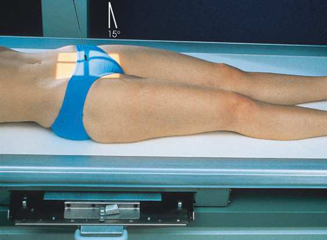
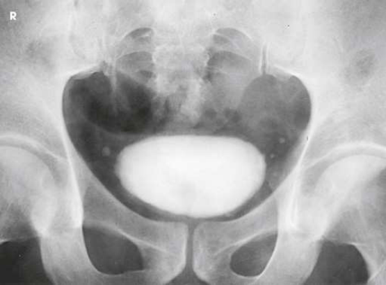
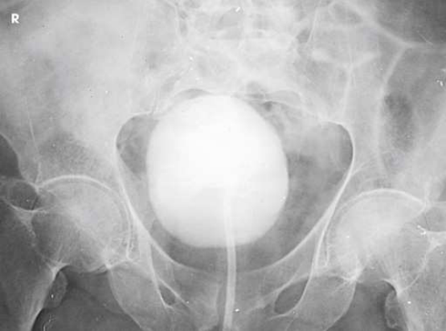

# Rx Urinary Bladder — AP Axial or Incidență PA Axială (Merrill)

  📷 Radiografie Convențională (Rx)
  <strong>Actualizat:</strong> 2026-09-16
  <strong>Autor:</strong> Referință Merrill

---

-   __1. Rezumat Clinic & Indicații__

    ---

    === "Indicații Clinice"

        - Conform reperelor anatomice standard din tratat

    === "Ghid Național IRIS"

        !!! info "Referință Primară: Ghidul Național IRIS (Ordinul MS 1342/2012)"
            - **Capitol Ghid IRIS:** *Ghidul Național IRIS*
            - **Grad de Recomandare:** **De verificat pe indicație; fără grad atribuit automat**
            - **Nivel de Iradiere Estimată:** `De verificat pentru examinarea și populația selectate`

            [:octicons-search-16: Deschide Ghidul IRIS](../../iris.md){ .md-button .md-button--primary } [:material-open-in-new: Aplicația Oficială PWA](https://radiologie-pediatrica.ro/iris/){ .md-button target="_blank" rel="noopener" }
-   __2. Poziționare & Centrare Fascicul__

    ---

    - **Poziție Pacient:** se poziționează pacientul Decubit dorsal pe masa radiologică pentru Incidență Antero-Posterioară (AP) de vezică urinară.; se centrează MSP de pacientul’s corp la linia mediană grilă device. se ajustează pacient’s umeri și hips so that they sunt echidistant față de receptorul de imagine. se poziționează pacientul’s brațe where they do nu cast shadows pe receptorul de imagine. If pacientul este poziționat pentru Decubit dorsal imagine, Se instruiește pacientul să’s membre inferioare extins astfel încât lumbosacral area de coloană vertebrală este arched enough la tilt anterior pelvic bones inferiorly. în this poziție, pubic bones poate more easily fie projected below bladder neck și proximal urethra (Fig. 16.63). se centrează receptorul de imagine 2 inches (5 cm) above upper margine de simfiză pubiană (sau la simfiză pubiană pentru voiding studies).
    - **Punct de Centrare Fascicul:** AP axial înclinat 10 la 15 grade caudal la center de receptorul de imagine. raza centrală trebuie să enter 2 inches (5 cm) above upper margine de simfiză pubiană. When bladder neck și proximal urethra sunt main areas de interest, 5-grade caudal angulation de raza centrală este usually suficient la project pubic bones below them. More sau less angulation poate fie necessary, depending pe amount de lordosis de Coloană Lombară. cu greater lordosis, less angulation poate fie needed (see Fig. 16.63). PA axial When performing PA axial incidențe de bladder, se orientează raza centrală centrală through region de bladder neck la angle 10 la 15 grade cranial, entering about 1 inch (2.5 cm) distal la tip de Coccis și exiting little above superior margine de simfiză pubiană. If prostate este aria de interes diagnostic, raza centrală este orientat 20 la 25 grade cranial la project it above pubic bones. pentru PA axial incidențe, receptorul de imagine este centrat pe raza centrală. perpendicular pe simfiză pubiană pentru voiding studies.
    - **Distanță Focar-Film (DFF / SID):** Nespecificat în fragmentul extras; de verificat în sursă
    - **Comandă Respiratorie:** Apnee la sfârșitul expirului complet.

-   __3. Parametri Tehnici Expunere__

    ---

    | Parametru Tehnic | Valoare Configurare Generator / Tub |
    |:-----------------|:-------------------------------------|
    | **Tensiune Tub (kV)** | DE CONFIGURAT PE APARAT |
    | **Sarcină / Produs Curent-Timp (mAs)** | DE CONFIGURAT PE APARAT |
    | **Distanță Focar-Film (DFF / SID)** | Nespecificat în fragmentul extras; de verificat în sursă |
    | **Grilă Antidifuzoare (Bucky)** | DE CONFIGURAT PE APARAT |
    | **Dimensiune Focar** | DE CONFIGURAT PE APARAT |
    | **Camere de Ionizare AEC** | DE CONFIGURAT PE APARAT |
    | **Colimare Fascicul** | se ajustează câmp de iradiere la 10 × 12 inches (24 × 30 cm) longitudinal. Place correct marker de lateralitate (D/S) în collimated expunere field. |
    | **Filtrare Tub** | DE CONFIGURAT PE APARAT |

-   __4. Criterii de Calitate & Reușită Imagine__

    ---

    - Criterii radiologice de calitate imaginii:
    - Colimare adecvată vizibilă și prezența markerului de lateralitate (D/S) plasat clear de anatomy de interest
    - Regions de extremitatea distală ureters, bladder, și proximal portion de urethra
    - Pubic bones projected below bladder neck și proximal urethra
    - Contrast medium în bladder, distal ureters, și proximal urethra
    - Surrounding anatomy

-   __5. Protecție Radiologică (ALARA)__

    ---

    - Nespecificat în fragmentul extras; de verificat în sursă

!!! note "Observații Clinice & Tehnice"
    Preliminary (scout) și postinjection imagini sunt most commonly obtained cu pacientul Decubit dorsal. Decubit ventral poziție este sometimes used la imagine areas de bladder nu clar vizibil(e) pe Incidență AP Axială. Incidență AP Axială using Trendelenburg poziție la 15 la 20 grade și cu raza centrală centrală Orientat vertical este sometimes used la show distal ends de ureters. în this înclinat poziție, weight de contained lichid stretches bladder fundus superiorly, giving unobstructed incidență de lower ureters și vesicoureteral orifice areas.

### 🖼️ Imagini

<figure class="protocol-image-card" markdown>

<figcaption><strong>Merrill — pagina PDF 1266, imaginea 1</strong> — Imagine din fragmentul sursă; asocierea necesită revizie.</figcaption>

</figure>

<figure class="protocol-image-card" markdown>

<figcaption><strong>Merrill — pagina PDF 1266, imaginea 2</strong> — Imagine din fragmentul sursă; asocierea necesită revizie.</figcaption>

</figure>

<figure class="protocol-image-card" markdown>

<figcaption><strong>Merrill — pagina PDF 1267, imaginea 3</strong> — Imagine din fragmentul sursă; asocierea necesită revizie.</figcaption>

</figure>

=== "Ghid Rapid de Execuție"

    1. **Identificarea și verificarea pacientului:** verificare identitate, zonă de examinat, consimțământ conform procedurii și evaluarea posibilității unei sarcini, când este relevantă.
    2. **Pregătire:** îndepărtarea oricăror obiecte radiopace (bijuterii, agrafe, fermoare, proteze, pansamente dense).
    3. **Poziționare precisă:** alinierea receptorului de imagine și a tubului la distanța prescrisă (Nespecificat în fragmentul extras; de verificat în sursă).
    4. **Colimare strictă:** adaptarea fasciculului strict la regiunea de diagnostic pentru scăderea iradierii și reducerea radiației difuze.
    5. **Radioprotecție:** verificarea [politicii RX](../radioprotectie.md), cu măsuri distincte pentru pacient, personal și însoțitor.

## Surse de documentare

- [Merrill’s Atlas, 16. Urinary System and Venipuncture, pagini PDF 1265–1267](../../assets/protocols/sources/a56d45c16829_Merrills_Atlas_of_Radiographic_Positioning__Procedures_3Vol_Set.pdf#page=1265)

## Fragmente sursă traduse (referință tehnică)

### anatomy

AP axial și PA axial incidențe show bladder filled cu contrast medium (Figs. 16.64 și 16.65). If reflux este present, distal ureters sunt
also visualized.

### collimation

• se ajustează câmp de iradiere la 10 × 12 inches (24 × 30 cm) longitudinal. Place correct marker de lateralitate (D/S) în collimated expunere field.

### cr

AP axial
• înclinat 10 la 15 grade caudal la center de receptorul de imagine. raza centrală trebuie să enter 2 inches (5 cm) above upper margine de pubic
simfiză. When bladder neck și proximal urethra sunt main areas de interest, 5-grade caudal angulation de raza centrală este
usually suficient la project pubic bones below them. More sau less angulation poate fie necessary, depending pe amount de
lordosis de lumbar coloană vertebrală. cu greater lordosis, less angulation poate fie needed (see Fig. 16.63).
PA axial
• When performing PA axial incidențe de bladder, se orientează raza centrală centrală through region de bladder neck la angle 10 la 15
grade cranial, entering about 1 inch (2.5 cm) distal la tip de coccyx și exiting little above superior margine de simfiză pubiană. If prostate este aria de interes diagnostic, raza centrală este orientat 20 la 25 grade cranial la project it above pubic bones. pentru PA axial incidențe, receptorul de imagine este centrat pe raza centrală.
• perpendicular pe simfiză pubiană pentru voiding studies.

### criteria

Criterii radiologice de calitate imaginii:
• Colimare adecvată vizibilă și prezența markerului de lateralitate (D/S) plasat clear de anatomy de interest
• Regions de extremitatea distală ureters, bladder, și proximal portion de urethra
• Pubic bones projected below bladder neck și proximal urethra
• Contrast medium în bladder, distal ureters, și proximal urethra
• Surrounding anatomy

### notes

Preliminary (scout) și postinjection imagini sunt most commonly obtained cu pacientul în decubit dorsal. decubit ventral este sometimes
used la imagine areas de bladder nu clar vizibil(e) pe AP axial incidență. AP axial incidență using Trendelenburg poziție la 15 la
20 grade și cu raza centrală centrală Orientat vertical este sometimes used la show distal ends de ureters. în this înclinat poziție, weight
de contained lichid stretches bladder fundus superiorly, giving unobstructed incidență de lower ureters și vesicoureteral
orifice areas.

### part_pos

• se centrează MSP de pacientul’s corp la linia mediană grilă device.
• se ajustează pacient’s umeri și hips so that they sunt echidistant față de receptorul de imagine.
• se poziționează pacientul’s brațe where they do nu cast shadows pe receptorul de imagine.
• If pacientul este poziționat pentru în decubit dorsal imagine, Se instruiește pacientul să’s membre inferioare extins astfel încât lumbosacral area de coloană vertebrală este arched
enough la tilt anterior pelvic bones inferiorly. în this poziție, pubic bones poate more easily fie projected below bladder
neck și proximal urethra (Fig. 16.63).
• se centrează receptorul de imagine 2 inches (5 cm) above upper margine de simfiză pubiană (sau la simfiză pubiană pentru voiding studies).

### patient_pos

• se poziționează pacientul în decubit dorsal pe masa radiologică pentru AP incidență de vezică urinară.

### respiration

Apnee la sfârșitul expirului complet.

### tech

poziționat prin manufacturer sau department protocol pentru corect anatomy display orientation; raza centrală plate: 10 × 12 inches (24 ×
30 cm) longitudinal.

