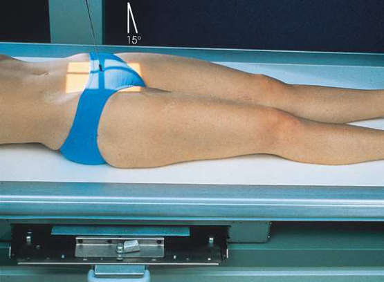
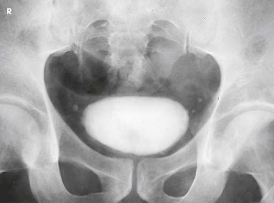
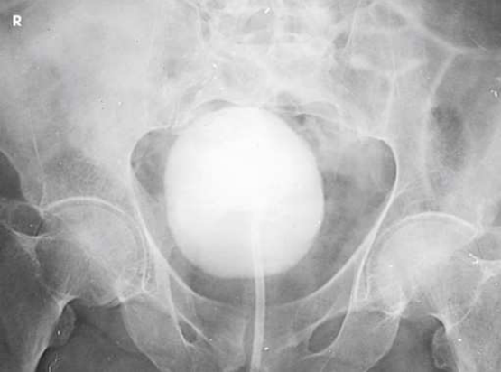

# Rx Vezică urinară — Incidență AP axială sau incidență PA axială (Merrill)

  📷 Radiografie Convențională (Rx)
  <strong>Actualizat:</strong> 2026-09-16
  <strong>Autor:</strong> Referință Merrill

---

-   __1. Rezumat Clinic & Indicații__

    ---

    === "Indicații Clinice"

        - Conform reperelor anatomice standard din tratat

    === "Ghid Național IRIS"

        !!! info "Referință Primară: Ghidul Național IRIS (Ordinul MS 1342/2012)"
            - **Capitol Ghid IRIS:** *Ghidul Național IRIS*
            - **Grad de Recomandare:** **De verificat pe indicație; fără grad atribuit automat**
            - **Nivel de Iradiere Estimată:** `De verificat pentru examinarea și populația selectate`

            [:octicons-search-16: Deschide Ghidul IRIS](../../iris.md){ .md-button .md-button--primary } [:material-open-in-new: Aplicația Oficială PWA](https://radiologie-pediatrica.ro/iris/){ .md-button target="_blank" rel="noopener" }
-   __2. Poziționare & Centrare Fascicul__

    ---

    - **Poziție Pacient:** Se poziționează pacientul în decubit dorsal pe masa radiologică pentru incidența antero-posterioară (AP) a vezicii urinare.; Se centrează MSP al corpului pacientului pe linia mediană a dispozitivului cu grilă. Se ajustează poziția umerilor și a șoldurilor pacientului astfel încât acestea să fie echidistante față de receptorul de imagine. Se poziționează brațele pacientului astfel încât să nu proiecteze umbre pe receptorul de imagine. Dacă pacientul este poziționat pentru o imagine în decubit dorsal, se instruiește să își extindă membrele inferioare astfel încât regiunea lombosacrată a coloanei vertebrale să fie suficient de arcuită pentru a înclina inferior oasele anterioare ale pelvisului. În această poziție, oasele pubiene pot fi proiectate mai ușor sub colul vezical și uretra proximală (Fig. 16.63). Se centrează receptorul de imagine la 2 țoli (5 cm) deasupra marginii superioare a simfizei pubiene (sau la nivelul simfizei pubiene pentru examinările micționale).
    - **Punct de Centrare Fascicul:** AP axială: raza centrală este înclinată caudal cu 10 până la 15 grade, spre centrul receptorului de imagine. Raza centrală trebuie să pătrundă la 2 țoli (5 cm) deasupra marginii superioare a simfizei pubiene. Când colul vezical și uretra proximală sunt principalele zone de interes, o angulare caudală de 5 grade a razei centrale este de obicei suficientă pentru a proiecta oasele pubiene sub acestea. Poate fi necesară o angulare mai mare sau mai mică, în funcție de gradul lordozei coloanei lombare. În cazul unei lordoze mai accentuate, poate fi necesară o angulare mai mică (vezi Fig. 16.63). PA axială: când se efectuează incidențe PA axiale ale vezicii urinare, se orientează raza centrală prin regiunea colului vezical, la un unghi de 10 până la 15 grade cranial, pătrunzând la aproximativ 1 țol (2.5 cm) distal de vârful coccisului și ieșind puțin deasupra marginii superioare a simfizei pubiene. Dacă prostata este aria de interes diagnostic, raza centrală este orientată cranial cu 20 până la 25 de grade pentru a o proiecta deasupra oaselor pubiene. Pentru incidențele PA axiale, receptorul de imagine este centrat pe raza centrală. Raza centrală este perpendiculară pe simfiza pubiană pentru examinările micționale.
    - **Distanță Focar-Film (DFF / SID):** Nespecificat în fragmentul extras; de verificat în sursă
    - **Comandă Respiratorie:** Apnee la sfârșitul expirului complet.

-   __3. Parametri Tehnici Expunere__

    ---

    | Parametru Tehnic | Valoare Configurare Generator / Tub |
    |:-----------------|:-------------------------------------|
    | **Tensiune Tub (kV)** | DE CONFIGURAT PE APARAT |
    | **Sarcină / Produs Curent-Timp (mAs)** | DE CONFIGURAT PE APARAT |
    | **Distanță Focar-Film (DFF / SID)** | Nespecificat în fragmentul extras; de verificat în sursă |
    | **Grilă Antidifuzoare (Bucky)** | DE CONFIGURAT PE APARAT |
    | **Dimensiune Focar** | DE CONFIGURAT PE APARAT |
    | **Camere de Ionizare AEC** | DE CONFIGURAT PE APARAT |
    | **Colimare Fascicul** | Se ajustează câmpul de iradiere la 10 × 12 țoli (24 × 30 cm), longitudinal. Plasați markerul de lateralitate (D/S) corect în câmpul de expunere colimat. |
    | **Filtrare Tub** | DE CONFIGURAT PE APARAT |

-   __4. Criterii de Calitate & Reușită Imagine__

    ---

    - Criterii radiologice de calitate a imaginii:
    - Colimare adecvată vizibilă și prezența markerului de lateralitate (D/S) plasat în afara structurilor anatomice de interes
    - Regiunile extremităților distale ale ureterelor, vezica urinară și porțiunea proximală a uretrei
    - Oasele pubiene proiectate sub colul vezical și uretra proximală
    - Substanță de contrast în vezica urinară, ureterele distale și uretra proximală
    - Structurile anatomice învecinate

-   __5. Protecție Radiologică (ALARA)__

    ---

    - Nespecificat în fragmentul extras; de verificat în sursă

!!! note "Observații Clinice & Tehnice"
    Imaginile preliminare și cele după injectare sunt obținute cel mai frecvent cu pacientul în decubit dorsal. Poziția de decubit ventral este uneori utilizată pentru a vizualiza zone ale vezicii urinare care nu sunt clar vizibile în incidența AP axială. Incidența AP axială în poziție Trendelenburg la 15 până la 20 de grade, cu raza centrală orientată vertical, este uneori utilizată pentru a evidenția extremitățile distale ale ureterelor. În această poziție înclinată, greutatea lichidului conținut întinde fundul vezicii urinare în sens superior, oferind o vizualizare fără suprapuneri a porțiunilor inferioare ale ureterelor și a regiunilor orificiilor vezicoureterale.

### 🖼️ Imagini

<figure class="protocol-image-card" markdown>

<figcaption><strong>Merrill — pagina 1266, imaginea 1</strong> — Imagine din fragmentul sursă; asocierea necesită revizie.</figcaption>

</figure>

<figure class="protocol-image-card" markdown>

<figcaption><strong>Merrill — pagina 1266, imaginea 2</strong> — Imagine din fragmentul sursă; asocierea necesită revizie.</figcaption>

</figure>

<figure class="protocol-image-card" markdown>

<figcaption><strong>Merrill — pagina 1267, imaginea 3</strong> — Imagine din fragmentul sursă; asocierea necesită revizie.</figcaption>

</figure>

=== "Ghid Rapid de Execuție"

    1. **Identificarea și verificarea pacientului:** verificare identitate, zonă de examinat, consimțământ conform procedurii și evaluarea posibilității unei sarcini, când este relevantă.
    2. **Pregătire:** îndepărtarea oricăror obiecte radiopace (bijuterii, agrafe, fermoare, proteze, pansamente dense).
    3. **Poziționare precisă:** alinierea receptorului de imagine și a tubului la distanța prescrisă (Nespecificat în fragmentul extras; de verificat în sursă).
    4. **Colimare strictă:** adaptarea fasciculului strict la regiunea de diagnostic pentru scăderea iradierii și reducerea radiației difuze.
    5. **Radioprotecție:** verificarea [politicii RX](../radioprotectie.md), cu măsuri distincte pentru pacient, personal și însoțitor.

## Surse de documentare

- [Merrill’s Atlas, 16. Urinary System and Venipuncture, pagini 1265–1267](https://books.google.com/books/about/Merrill_s_Atlas_of_Radiographic_Position.html?id=BM0lEQAAQBAJ)

## Fragmente sursă traduse (referință tehnică)

### anatomie

Incidențele AP axiale și PA axiale evidențiază vezica urinară umplută cu substanță de contrast (Fig. 16.64 și 16.65). Dacă este prezent refluxul, sunt vizualizate
și ureterele distale.

### colimare

• Se ajustează câmpul de iradiere la 10 × 12 țoli (24 × 30 cm), longitudinal. Plasați markerul de lateralitate (D/S) corect în câmpul de expunere colimat.

### raza centrală

AP axială
• Raza centrală este înclinată caudal cu 10 până la 15 grade, spre centrul receptorului de imagine. Raza centrală trebuie să pătrundă la 2 țoli (5 cm) deasupra marginii superioare a simfizei
pubiene. Când colul vezical și uretra proximală sunt principalele zone de interes, o angulare caudală de 5 grade a razei centrale este
de obicei suficientă pentru a proiecta oasele pubiene sub acestea. Poate fi necesară o angulare mai mare sau mai mică, în funcție de gradul
lordozei coloanei lombare. În cazul unei lordoze mai accentuate, poate fi necesară o angulare mai mică (vezi Fig. 16.63).
PA axială
• Când se efectuează incidențe PA axiale ale vezicii urinare, se orientează raza centrală prin regiunea colului vezical, la un unghi de 10 până la 15
grade cranial, pătrunzând la aproximativ 1 țol (2.5 cm) distal de vârful coccisului și ieșind puțin deasupra marginii superioare a simfizei pubiene. Dacă prostata este aria de interes diagnostic, raza centrală este orientată cranial cu 20 până la 25 de grade pentru a o proiecta deasupra oaselor pubiene. Pentru incidențele PA axiale, receptorul de imagine este centrat pe raza centrală.
• Raza centrală este perpendiculară pe simfiza pubiană pentru examinările micționale.

### criterii

Criterii radiologice de calitate a imaginii:
• Colimare adecvată vizibilă și prezența markerului de lateralitate (D/S) plasat fără suprapunere peste structurile anatomice de interes
• Regiunile extremităților distale ale ureterelor, vezica urinară și porțiunea proximală a uretrei
• Oasele pubiene proiectate sub colul vezical și uretra proximală
• Substanță de contrast în vezica urinară, ureterele distale și uretra proximală
• Structurile anatomice înconjurătoare

### note

Imaginile preliminare și cele după injectare sunt obținute cel mai frecvent cu pacientul în decubit dorsal. Decubitul ventral este uneori
utilizat pentru a vizualiza zone ale vezicii urinare care nu sunt clar vizibile în incidența AP axială. Incidența AP axială în poziție Trendelenburg la 15 până la
20 de grade, cu raza centrală orientată vertical, este uneori utilizată pentru a evidenția extremitățile distale ale ureterelor. În această poziție înclinată, greutatea
lichidului conținut întinde fundul vezicii urinare în sens superior, oferind o vizualizare fără suprapuneri a porțiunilor inferioare ale ureterelor și a regiunilor orificiilor
vezicoureterale.

### part_pos

• Se centrează MSP al corpului pacientului pe linia mediană a dispozitivului cu grilă.
• Se ajustează poziția umerilor și a șoldurilor pacientului astfel încât acestea să fie echidistante față de receptorul de imagine.
• Se poziționează brațele pacientului astfel încât să nu proiecteze umbre pe receptorul de imagine.
• Dacă pacientul este poziționat pentru o imagine în decubit dorsal, se instruiește să își extindă membrele inferioare astfel încât regiunea lombosacrată a coloanei vertebrale să fie
suficient de arcuită pentru a înclina inferior oasele anterioare ale pelvisului. În această poziție, oasele pubiene pot fi proiectate mai ușor sub colul
vezical și uretra proximală (Fig. 16.63).
• Se centrează receptorul de imagine la 2 țoli (5 cm) deasupra marginii superioare a simfizei pubiene (sau la nivelul simfizei pubiene pentru examinările micționale).

### patient_pos

• Se poziționează pacientul în decubit dorsal pe masa radiologică pentru incidența AP a vezicii urinare.

### respirație

Apnee la sfârșitul expirului complet.

### tehnică

Poziționat conform indicațiilor producătorului sau protocolului departamentului pentru orientarea corectă a afișării structurilor anatomice; placă pentru raza centrală: 10 × 12 țoli (24 ×
30 cm), longitudinal.

