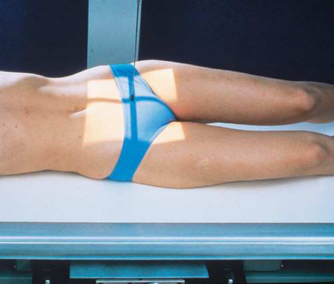
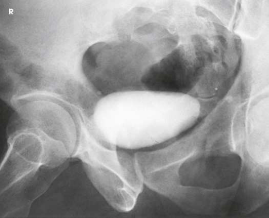
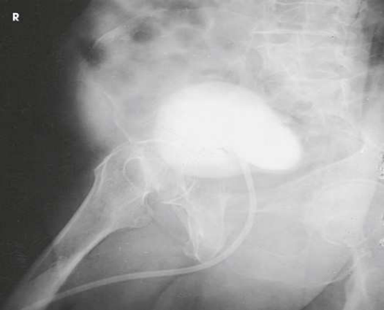

# Rx Urinary Bladder — Oblică Antero-Posterioară (AP) — RPO or Oblică Posterioară Stângă (OPS / LPO) (Merrill)

  📷 Radiografie Convențională (Rx)
  <strong>Actualizat:</strong> 2026-09-16
  <strong>Autor:</strong> Referință Merrill

---

-   __1. Rezumat Clinic & Indicații__

    ---

    === "Indicații Clinice"

        - Conform reperelor anatomice standard din tratat

    === "Ghid Național IRIS"

        !!! info "Referință Primară: Ghidul Național IRIS (Ordinul MS 1342/2012)"
            - **Capitol Ghid IRIS:** *Ghidul Național IRIS*
            - **Grad de Recomandare:** **De verificat pe indicație; fără grad atribuit automat**
            - **Nivel de Iradiere Estimată:** `De verificat pentru examinarea și populația selectate`

            [:octicons-search-16: Deschide Ghidul IRIS](../../iris.md){ .md-button .md-button--primary } [:material-open-in-new: Aplicația Oficială PWA](https://radiologie-pediatrica.ro/iris/){ .md-button target="_blank" rel="noopener" }
-   __2. Poziționare & Centrare Fascicul__

    ---

    - **Poziție Pacient:** se așază pacientul în Decubit dorsal poziție pe masa radiologică.; se rotește pacient 40 la 60 grade RPO sau LPO, according la preference de examining physician (Fig. 16.66). se ajustează pacient astfel încât pubic arch cel mai apropiat de table este aliniat over linia mediană grilă. Extend și abduct uppermost thigh enough la prevent its superimposition pe bladder area. se centrează receptorul de imagine 2 inches (5 cm) above upper margine de simfiză pubiană și approximately 2 inches (5 cm) medial la upper spină iliacă antero-superioară (SIAS) (sau la simfiză pubiană pentru voiding studies).
    - **Punct de Centrare Fascicul:** perpendicular pe centrul receptorului de imagine. raza centrală enters 2 inches (5 cm) above upper margine de simfiză pubiană și 2 inches (5 cm) medial la upper spină iliacă antero-superioară (SIAS). When bladder neck și proximal urethra sunt main areas de interest, 10-grade caudal angulation de raza centrală este usually suficient la project pubic bones below them. perpendicular la nivelul simfiză pubiană pentru voiding studies.
    - **Distanță Focar-Film (DFF / SID):** Nespecificat în fragmentul extras; de verificat în sursă
    - **Comandă Respiratorie:** Apnee la sfârșitul expirului complet.

-   __3. Parametri Tehnici Expunere__

    ---

    | Parametru Tehnic | Valoare Configurare Generator / Tub |
    |:-----------------|:-------------------------------------|
    | **Tensiune Tub (kV)** | DE CONFIGURAT PE APARAT |
    | **Sarcină / Produs Curent-Timp (mAs)** | DE CONFIGURAT PE APARAT |
    | **Distanță Focar-Film (DFF / SID)** | Nespecificat în fragmentul extras; de verificat în sursă |
    | **Grilă Antidifuzoare (Bucky)** | DE CONFIGURAT PE APARAT |
    | **Dimensiune Focar** | DE CONFIGURAT PE APARAT |
    | **Camere de Ionizare AEC** | DE CONFIGURAT PE APARAT |
    | **Colimare Fascicul** | se ajustează câmp de iradiere la 10 × 12 inches (24 × 30 cm) longitudinal. Place correct marker de lateralitate (D/S) în collimated expunere field. |
    | **Filtrare Tub** | DE CONFIGURAT PE APARAT |

-   __4. Criterii de Calitate & Reușită Imagine__

    ---

    - Criterii radiologice de calitate imaginii:
    - Colimare adecvată vizibilă și prezența markerului de lateralitate (D/S) plasat clear de anatomy de interest
    - Regions de distal ends de ureters și bladder, și proximal portion de urethra
    - Pubic bones projected below bladder neck și proximal urethra
    - Contrast medium în bladder, distal ureters, și proximal urethra
    - Surrounding anatomy
    - fără superimposition de bladder prin uppermost thigh Voiding studies
    - Entire urethra vizibil și filled cu contrast medium
    - Urethra overlapping thigh pe oblic incidențe pentru improved visibility
    - Urethra culcat posterior la superimposed pubic și ischial rami pe side down în oblic incidențe

-   __5. Protecție Radiologică (ALARA)__

    ---

    - Nespecificat în fragmentul extras; de verificat în sursă

!!! note "Observații Clinice & Tehnice"
    Conform reperelor anatomice standard din tratat

### 🖼️ Imagini

<figure class="protocol-image-card" markdown>

<figcaption><strong>Merrill — pagina PDF 1268, imaginea 1</strong> — Imagine din fragmentul sursă; asocierea necesită revizie.</figcaption>

</figure>

<figure class="protocol-image-card" markdown>

<figcaption><strong>Merrill — pagina PDF 1269, imaginea 2</strong> — Imagine din fragmentul sursă; asocierea necesită revizie.</figcaption>

</figure>

<figure class="protocol-image-card" markdown>

<figcaption><strong>Merrill — pagina PDF 1269, imaginea 3</strong> — Imagine din fragmentul sursă; asocierea necesită revizie.</figcaption>

</figure>

=== "Ghid Rapid de Execuție"

    1. **Identificarea și verificarea pacientului:** verificare identitate, zonă de examinat, consimțământ conform procedurii și evaluarea posibilității unei sarcini, când este relevantă.
    2. **Pregătire:** îndepărtarea oricăror obiecte radiopace (bijuterii, agrafe, fermoare, proteze, pansamente dense).
    3. **Poziționare precisă:** alinierea receptorului de imagine și a tubului la distanța prescrisă (Nespecificat în fragmentul extras; de verificat în sursă).
    4. **Colimare strictă:** adaptarea fasciculului strict la regiunea de diagnostic pentru scăderea iradierii și reducerea radiației difuze.
    5. **Radioprotecție:** verificarea [politicii RX](../radioprotectie.md), cu măsuri distincte pentru pacient, personal și însoțitor.

## Surse de documentare

- [Merrill’s Atlas, 16. Urinary System and Venipuncture, pagini PDF 1267–1269](../../assets/protocols/sources/a56d45c16829_Merrills_Atlas_of_Radiographic_Positioning__Procedures_3Vol_Set.pdf#page=1267)

## Fragmente sursă traduse (referință tehnică)

### anatomy

oblic incidențe show bladder filled cu contrast medium. If reflux este present, distal ureters sunt also visualized (Figs. 16.67 și 16.68).

### collimation

• se ajustează câmp de iradiere la 10 × 12 inches (24 × 30 cm) longitudinal. Place correct marker de lateralitate (D/S) în collimated expunere field.

### cr

• perpendicular pe centrul receptorului de imagine. raza centrală enters 2 inches (5 cm) above upper margine de simfiză pubiană și 2 inches
(5 cm) medial la upper spină iliacă antero-superioară (SIAS). When bladder neck și proximal urethra sunt main areas de interest, 10-grade caudal
angulation de raza centrală este usually suficient la project pubic bones below them.
• perpendicular la nivelul simfiză pubiană pentru voiding studies.

### criteria

Criterii radiologice de calitate imaginii:
• Colimare adecvată vizibilă și prezența markerului de lateralitate (D/S) plasat clear de anatomy de interest
• Regions de distal ends de ureters și bladder, și proximal portion de urethra
• Pubic bones projected below bladder neck și proximal urethra
• Contrast medium în bladder, distal ureters, și proximal urethra
• Surrounding anatomy
• fără superimposition de bladder prin uppermost thigh
Voiding studies
• Entire urethra vizibil și filled cu contrast medium
• Urethra overlapping thigh pe oblic incidențe pentru improved visibility
• Urethra culcat posterior la superimposed pubic și ischial rami pe side down în oblic incidențe

### part_pos

• se rotește pacient 40 la 60 grade RPO sau LPO, according la preference de examining physician (Fig. 16.66).
• se ajustează pacient astfel încât pubic arch cel mai apropiat de table este aliniat over linia mediană grilă.
• Extend și abduct uppermost thigh enough la prevent its superimposition pe bladder area.
• se centrează receptorul de imagine 2 inches (5 cm) above upper margine de simfiză pubiană și approximately 2 inches (5 cm) medial la upper
spină iliacă antero-superioară (SIAS) (sau la simfiză pubiană pentru voiding studies).

### patient_pos

• se așază pacientul în decubit dorsal pe masa radiologică.

### respiration

Apnee la sfârșitul expirului complet.

### tech

poziționat prin manufacturer sau department protocol pentru corect anatomy display orientation; raza centrală plate: 10 × 12 inches (24 ×
30 cm) longitudinal.

