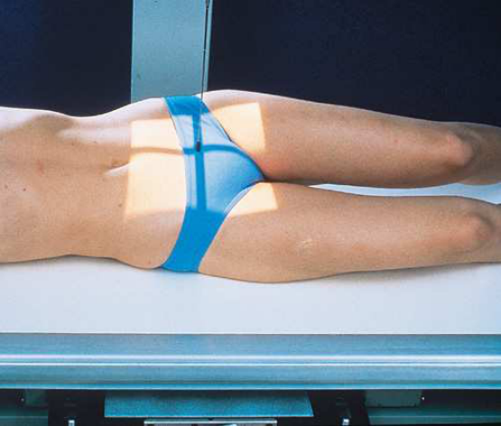
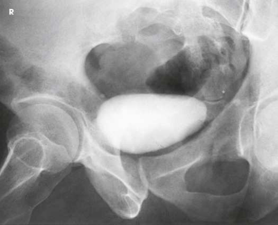
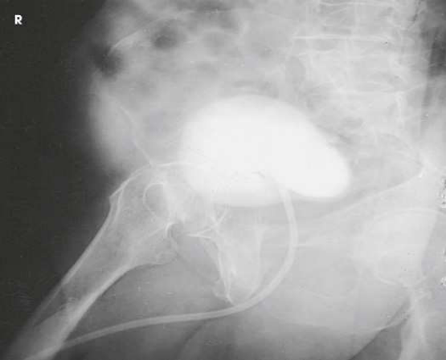

# Rx Vezică Urinară — Oblică Antero-Posterioară (AP) — RPO sau Oblică Posterioară Stângă (OPS / LPO) (Merrill)

  📷 Radiografie Convențională (Rx)
  <strong>Actualizat:</strong> 2026-09-16
  <strong>Autor:</strong> Referință Merrill

---

-   __1. Rezumat Clinic & Indicații__

    ---

    === "Indicații Clinice"

        - Conform reperelor anatomice standard din tratat

    === "Ghid Național IRIS"

        !!! info "Referință Primară: Ghidul Național IRIS (Ordinul MS 1342/2012)"
            - **Capitol Ghid IRIS:** *Ghidul Național IRIS*
            - **Grad de Recomandare:** **De verificat pe indicație; fără grad atribuit automat**
            - **Nivel de Iradiere Estimată:** `De verificat pentru examinarea și populația selectate`

            [:octicons-search-16: Deschide Ghidul IRIS](../../iris.md){ .md-button .md-button--primary } [:material-open-in-new: Aplicația Oficială PWA](https://radiologie-pediatrica.ro/iris/){ .md-button target="_blank" rel="noopener" }
-   __2. Poziționare & Centrare Fascicul__

    ---

    - **Poziție Pacient:** Se așază pacientul în decubit dorsal pe masa radiologică.; Se rotește pacientul cu 40 până la 60 de grade în RPO sau LPO, conform preferinței medicului examinator (Fig. 16.66). Se ajustează poziția pacientului astfel încât arcul pubian cel mai apropiat de masă să fie aliniat cu linia mediană a grilei. Extindeți și abduceți coapsa aflată deasupra suficient pentru a preveni suprapunerea acesteia peste regiunea vezicii urinare. Se centrează receptorul de imagine la 2 țoli (5 cm) deasupra marginii superioare a simfizei pubiene și la aproximativ 2 țoli (5 cm) medial de spina iliacă antero-superioară (SIAS) aflată deasupra (sau la nivelul simfizei pubiene pentru examinările micționale).
    - **Punct de Centrare Fascicul:** Perpendicular pe centrul receptorului de imagine. Raza centrală pătrunde la 2 țoli (5 cm) deasupra marginii superioare a simfizei pubiene și la 2 țoli (5 cm) medial de spina iliacă antero-superioară (SIAS) aflată deasupra. Când colul vezical și uretra proximală sunt principalele zone de interes, o angulare caudală de 10 grade a razei centrale este de obicei suficientă pentru a proiecta oasele pubiene sub acestea. Perpendicular la nivelul simfizei pubiene pentru examinările micționale.
    - **Distanță Focar-Film (DFF / SID):** Nespecificat în fragmentul extras; de verificat în sursă
    - **Comandă Respiratorie:** Apnee la sfârșitul expirului complet.

-   __3. Parametri Tehnici Expunere__

    ---

    | Parametru Tehnic | Valoare Configurare Generator / Tub |
    |:-----------------|:-------------------------------------|
    | **Tensiune Tub (kV)** | DE CONFIGURAT PE APARAT |
    | **Sarcină / Produs Curent-Timp (mAs)** | DE CONFIGURAT PE APARAT |
    | **Distanță Focar-Film (DFF / SID)** | Nespecificat în fragmentul extras; de verificat în sursă |
    | **Grilă Antidifuzoare (Bucky)** | DE CONFIGURAT PE APARAT |
    | **Dimensiune Focar** | DE CONFIGURAT PE APARAT |
    | **Camere de Ionizare AEC** | DE CONFIGURAT PE APARAT |
    | **Colimare Fascicul** | Se ajustează câmpul de iradiere la 10 × 12 țoli (24 × 30 cm), longitudinal. Plasați markerul de lateralitate (D/S) corect în câmpul de expunere colimat. |
    | **Filtrare Tub** | DE CONFIGURAT PE APARAT |

-   __4. Criterii de Calitate & Reușită Imagine__

    ---

    - Criterii radiologice de calitate a imaginii:
    - Colimare adecvată vizibilă și prezența markerului de lateralitate (D/S) plasat în afara structurilor anatomice de interes
    - Regiunile extremităților distale ale ureterelor și ale vezicii urinare și porțiunea proximală a uretrei
    - Oasele pubiene proiectate sub colul vezical și uretra proximală
    - Substanță de contrast în vezica urinară, ureterele distale și uretra proximală
    - Structurile anatomice învecinate
    - Fără suprapunerea coapsei aflate deasupra peste vezica urinară. Examinări micționale
    - Întreaga uretră vizibilă și umplută cu substanță de contrast
    - Uretra suprapusă peste coapsă în incidențele oblice pentru o vizibilitate mai bună
    - Uretra situată posterior de ramurile pubiene și ischiatice suprapuse de pe partea aflată dedesubt în incidențele oblice

-   __5. Protecție Radiologică (ALARA)__

    ---

    - Nespecificat în fragmentul extras; de verificat în sursă

!!! note "Observații Clinice & Tehnice"
    Conform reperelor anatomice standard din tratat

### 🖼️ Imagini

<figure class="protocol-image-card" markdown>

<figcaption><strong>Merrill — pagina 1268, imaginea 1</strong> — Imagine din fragmentul sursă; asocierea necesită revizie.</figcaption>

</figure>

<figure class="protocol-image-card" markdown>

<figcaption><strong>Merrill — pagina 1269, imaginea 2</strong> — Imagine din fragmentul sursă; asocierea necesită revizie.</figcaption>

</figure>

<figure class="protocol-image-card" markdown>

<figcaption><strong>Merrill — pagina 1269, imaginea 3</strong> — Imagine din fragmentul sursă; asocierea necesită revizie.</figcaption>

</figure>

=== "Ghid Rapid de Execuție"

    1. **Identificarea și verificarea pacientului:** verificare identitate, zonă de examinat, consimțământ conform procedurii și evaluarea posibilității unei sarcini, când este relevantă.
    2. **Pregătire:** îndepărtarea oricăror obiecte radiopace (bijuterii, agrafe, fermoare, proteze, pansamente dense).
    3. **Poziționare precisă:** alinierea receptorului de imagine și a tubului la distanța prescrisă (Nespecificat în fragmentul extras; de verificat în sursă).
    4. **Colimare strictă:** adaptarea fasciculului strict la regiunea de diagnostic pentru scăderea iradierii și reducerea radiației difuze.
    5. **Radioprotecție:** verificarea [politicii RX](../radioprotectie.md), cu măsuri distincte pentru pacient, personal și însoțitor.

## Surse de documentare

- [Merrill’s Atlas, 16. Urinary System and Venipuncture, pagini 1267–1269](https://books.google.com/books/about/Merrill_s_Atlas_of_Radiographic_Position.html?id=BM0lEQAAQBAJ)

## Fragmente sursă traduse (referință tehnică)

### anatomie

Incidențele oblice evidențiază vezica urinară umplută cu substanță de contrast. Dacă este prezent refluxul, sunt vizualizate și ureterele distale (Fig. 16.67 și 16.68).

### colimare

• Se ajustează câmpul de iradiere la 10 × 12 țoli (24 × 30 cm), longitudinal. Plasați markerul de lateralitate (D/S) corect în câmpul de expunere colimat.

### raza centrală

• Perpendicular pe centrul receptorului de imagine. Raza centrală pătrunde la 2 țoli (5 cm) deasupra marginii superioare a simfizei pubiene și la 2 țoli
(5 cm) medial de spina iliacă antero-superioară (SIAS) aflată deasupra. Când colul vezical și uretra proximală sunt principalele zone de interes, o angulare caudală de 10 grade
a razei centrale este de obicei suficientă pentru a proiecta oasele pubiene sub acestea.
• Perpendicular la nivelul simfizei pubiene pentru examinările micționale.

### criterii

Criterii radiologice de calitate a imaginii:
• Colimare adecvată vizibilă și prezența markerului de lateralitate (D/S) plasat fără suprapunere peste structurile anatomice de interes
• Regiunile extremităților distale ale ureterelor și ale vezicii urinare și porțiunea proximală a uretrei
• Oasele pubiene proiectate sub colul vezical și uretra proximală
• Substanță de contrast în vezica urinară, ureterele distale și uretra proximală
• Structurile anatomice înconjurătoare
• Fără suprapunerea coapsei aflate deasupra peste vezica urinară
Examinări micționale
• Întreaga uretră vizibilă și umplută cu substanță de contrast
• Uretra suprapusă peste coapsă în incidențele oblice pentru o vizibilitate mai bună
• Uretra situată posterior de ramurile pubiene și ischiatice suprapuse de pe partea aflată dedesubt în incidențele oblice

### part_pos

• se rotește pacientul cu 40 la 60 grade în RPO sau LPO, conform preferinței medicului examinator (Fig. 16.66).
• se ajustează poziția pacientului astfel încât arcul pubian cel mai apropiat de masă să fie aliniat deasupra liniei mediane a grilei.
• se extinde și se abduce coapsa de deasupra suficient pentru a preveni suprapunerea acesteia peste regiunea vezicii urinare.
• se centrează receptorul de imagine la 2 țoli (5 cm) deasupra marginii superioare a simfizei pubiene și la aproximativ 2 țoli (5 cm) medial de spina iliacă antero-superioară (SIAS) de deasupra (sau la nivelul simfizei pubiene pentru examinările micționale).

### patient_pos

• se așază pacientul în decubit dorsal pe masa radiologică.

### respirație

Apnee la sfârșitul expirului complet.

### tehnică

Poziționat conform indicațiilor producătorului sau protocolului departamentului pentru orientarea corectă a afișării structurilor anatomice; placă pentru raza centrală: 10 × 12 țoli (24 ×
30 cm), longitudinal.

