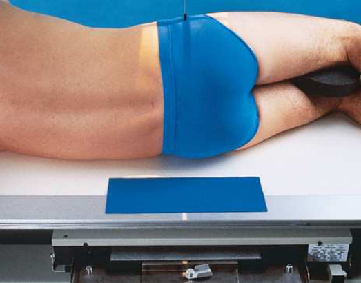

# Rx Urinary Bladder — Incidență de Profil (Lateral) — Profil (Drept sau Stâng) (Merrill)

  📷 Radiografie Convențională (Rx)
  <strong>Actualizat:</strong> 2026-09-16
  <strong>Autor:</strong> Referință Merrill

---

-   __1. Rezumat Clinic & Indicații__

    ---

    === "Indicații Clinice"

        - Conform reperelor anatomice standard din tratat

    === "Ghid Național IRIS"

        !!! info "Referință Primară: Ghidul Național IRIS (Ordinul MS 1342/2012)"
            - **Capitol Ghid IRIS:** *Ghidul Național IRIS*
            - **Grad de Recomandare:** **De verificat pe indicație; fără grad atribuit automat**
            - **Nivel de Iradiere Estimată:** `De verificat pentru examinarea și populația selectate`

            [:octicons-search-16: Deschide Ghidul IRIS](../../iris.md){ .md-button .md-button--primary } [:material-open-in-new: Aplicația Oficială PWA](https://radiologie-pediatrica.ro/iris/){ .md-button target="_blank" rel="noopener" }
-   __2. Poziționare & Centrare Fascicul__

    ---

    - **Poziție Pacient:** se așază pacientul în lateral Decubit poziție pe drept sau stâng side, ca indicated.; Slightly se flectează pacient’s genunchi la comfortable poziție și se ajustează corp astfel încât plan mediocoronal este centrat pe linia mediană grilă. se flectează pacient’s coate, și place mâinile under capul (Fig. 16.69). se centrează receptorul de imagine 2 inches (5 cm) above upper margine de simfiză pubiană la planul mediocoronal.
    - **Punct de Centrare Fascicul:** perpendicular pe receptorul de imagine (RI) și 2 inches (5 cm) above upper margine de simfiză pubiană la planul mediocoronal
    - **Distanță Focar-Film (DFF / SID):** Nespecificat în fragmentul extras; de verificat în sursă
    - **Comandă Respiratorie:** Apnee la sfârșitul expirului complet.

-   __3. Parametri Tehnici Expunere__

    ---

    | Parametru Tehnic | Valoare Configurare Generator / Tub |
    |:-----------------|:-------------------------------------|
    | **Tensiune Tub (kV)** | DE CONFIGURAT PE APARAT |
    | **Sarcină / Produs Curent-Timp (mAs)** | DE CONFIGURAT PE APARAT |
    | **Distanță Focar-Film (DFF / SID)** | Nespecificat în fragmentul extras; de verificat în sursă |
    | **Grilă Antidifuzoare (Bucky)** | DE CONFIGURAT PE APARAT |
    | **Dimensiune Focar** | DE CONFIGURAT PE APARAT |
    | **Camere de Ionizare AEC** | DE CONFIGURAT PE APARAT |
    | **Colimare Fascicul** | se ajustează câmp de iradiere la 10 × 12 inches (24 × 30 cm) longitudinal. Place correct marker de lateralitate (D/S) în collimated expunere field. |
    | **Filtrare Tub** | DE CONFIGURAT PE APARAT |

-   __4. Criterii de Calitate & Reușită Imagine__

    ---

    - Criterii radiologice de calitate imaginii:
    - Colimare adecvată vizibilă și prezența markerului de lateralitate (D/S) plasat clear de anatomy de interest
    - Regions de extremitatea distală ureters, bladder, și proximal portion de urethra
    - Contrast medium în bladder, distal ureters, și proximal urethra
    - Bladder și distal ureters vizibil through Bazin (bazin (pelvis))
    - Superimposed hips și Femur

-   __5. Protecție Radiologică (ALARA)__

    ---

    - Nespecificat în fragmentul extras; de verificat în sursă

!!! note "Observații Clinice & Tehnice"
    Conform reperelor anatomice standard din tratat

### 🖼️ Imagini

<figure class="protocol-image-card" markdown>

<figcaption><strong>Merrill — pagina PDF 1270, imaginea 1</strong> — Imagine din fragmentul sursă; asocierea necesită revizie.</figcaption>

</figure>

=== "Ghid Rapid de Execuție"

    1. **Identificarea și verificarea pacientului:** verificare identitate, zonă de examinat, consimțământ conform procedurii și evaluarea posibilității unei sarcini, când este relevantă.
    2. **Pregătire:** îndepărtarea oricăror obiecte radiopace (bijuterii, agrafe, fermoare, proteze, pansamente dense).
    3. **Poziționare precisă:** alinierea receptorului de imagine și a tubului la distanța prescrisă (Nespecificat în fragmentul extras; de verificat în sursă).
    4. **Colimare strictă:** adaptarea fasciculului strict la regiunea de diagnostic pentru scăderea iradierii și reducerea radiației difuze.
    5. **Radioprotecție:** verificarea [politicii RX](../radioprotectie.md), cu măsuri distincte pentru pacient, personal și însoțitor.

## Surse de documentare

- [Merrill’s Atlas, 16. Urinary System and Venipuncture, pagini PDF 1269–1270](../../assets/protocols/sources/a56d45c16829_Merrills_Atlas_of_Radiographic_Positioning__Procedures_3Vol_Set.pdf#page=1269)

## Fragmente sursă traduse (referință tehnică)

### anatomy

lateral imagine shows bladder filled cu contrast medium. If reflux este present, distal ureters sunt also visualized. lateral incidențe show
anterior și posterior bladder pereți și base de bladder (Fig. 16.70).

### collimation

• se ajustează câmp de iradiere la 10 × 12 inches (24 × 30 cm) longitudinal. Place correct marker de lateralitate (D/S) în collimated expunere field.

### cr

• perpendicular pe receptorul de imagine (RI) și 2 inches (5 cm) above upper margine de simfiză pubiană la planul mediocoronal

### criteria

Criterii radiologice de calitate imaginii:
• Colimare adecvată vizibilă și prezența markerului de lateralitate (D/S) plasat clear de anatomy de interest
• Regions de extremitatea distală ureters, bladder, și proximal portion de urethra
• Contrast medium în bladder, distal ureters, și proximal urethra
• Bladder și distal ureters vizibil through bazinul
• Superimposed hips și femur

### part_pos

• Slightly se flectează pacient’s genunchi la comfortable poziție și se ajustează corp astfel încât plan mediocoronal este centrat pe linia mediană de
grila.
• se flectează pacient’s coate, și place mâinile under capul (Fig. 16.69).
• se centrează receptorul de imagine 2 inches (5 cm) above upper margine de simfiză pubiană la planul mediocoronal.

### patient_pos

• se așază pacientul în lateral recumbent poziție pe drept sau stâng side, ca indicated.

### respiration

Apnee la sfârșitul expirului complet.

### tech

poziționat prin manufacturer sau department protocol pentru corect anatomy display orientation; raza centrală plate: 10 × 12 inches (24 ×
30 cm) longitudinal.

