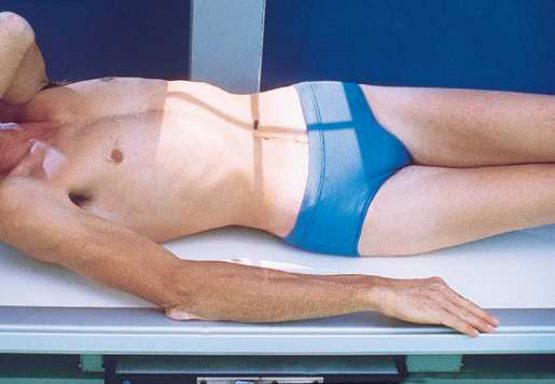
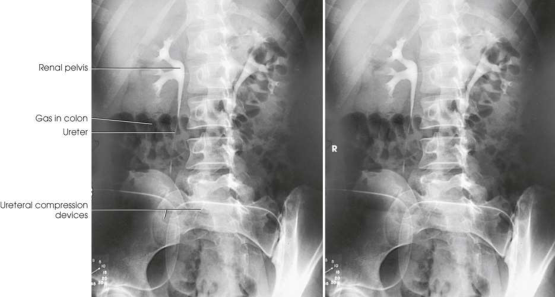

# Rx Aparat Urinar — Oblică Antero-Posterioară (AP) — RPO și Oblică Posterioară Stângă (OPS / LPO) (Merrill)

  📷 Radiografie Convențională (Rx)
  <strong>Actualizat:</strong> 2026-09-16
  <strong>Autor:</strong> Referință Merrill

---

-   __1. Rezumat Clinic & Indicații__

    ---

    === "Indicații Clinice"

        - Conform reperelor anatomice standard din tratat

    === "Ghid Național IRIS"

        !!! info "Referință Primară: Ghidul Național IRIS (Ordinul MS 1342/2012)"
            - **Capitol Ghid IRIS:** *Aparat digestiv & Abdomen*
            - **Grad de Recomandare:** **Grad B**
            - **Nivel de Iradiere Estimată:** `Clasa 2 (Foarte mică ~ 0.7 - 1.2 mSv)`

            [:octicons-search-16: Deschide Ghidul IRIS](../../iris.md){ .md-button .md-button--primary } [:material-open-in-new: Aplicația Oficială PWA](https://radiologie-pediatrica.ro/iris/){ .md-button target="_blank" rel="noopener" }

-   __2. Poziționare & Centrare Fascicul__

    ---

    - **Poziție Pacient:** se poziționează pacientul în decubit dorsal pe masa radiologică pentru incidențele oblice ale aparatului urinar. Rinichii sunt situați oblic, înclinați anterior în plan transversal. La efectuarea incidențelor oblice AP, rețineți că rinichiul mai apropiat de receptorul de imagine este perpendicular pe planul receptorului de imagine, iar rinichiul mai îndepărtat de receptorul de imagine este paralel cu acest plan. se rotește pacientul astfel încât planul mediocoronal să formeze un unghi de 30 grade cu planul receptorului de imagine. se ajustează poziția umerilor și șoldurilor pacientului astfel încât să fie în același plan și se așază suporturi adecvate sub partea ridicată, după necesitate. se așază brațele astfel încât să nu se suprapună peste aparatul urinar. se centrează coloana vertebrală la grilă (Fig. 16.45). se centrează receptorul de imagine la nivelul crestelor iliace. se efectuează ecranarea gonadelor cu șorț plumbat.
    - **Punct de Centrare Fascicul:** perpendicular pe centrul receptorului de imagine, la nivelul crestelor iliace, cu punctul de intrare la aproximativ 2 țoli (5 cm) lateral de linia mediană, pe partea ridicată
    - **Distanță Focar-Film (DFF / SID):** Nespecificat în fragmentul extras; de verificat în sursă
    - **Comandă Respiratorie:** Apnee la sfârșitul expirului complet.

-   __3. Parametri Tehnici Expunere__

    ---

    | Parametru Tehnic | Valoare Configurare Generator / Tub |
    |:-----------------|:-------------------------------------|
    | **Tensiune Tub (kV)** | DE CONFIGURAT PE APARAT |
    | **Sarcină / Produs Curent-Timp (mAs)** | DE CONFIGURAT PE APARAT |
    | **Distanță Focar-Film (DFF / SID)** | Nespecificat în fragmentul extras; de verificat în sursă |
    | **Grilă Antidifuzoare (Bucky)** | DE CONFIGURAT PE APARAT |
    | **Dimensiune Focar** | DE CONFIGURAT PE APARAT |
    | **Camere de Ionizare AEC** | DE CONFIGURAT PE APARAT |
    | **Colimare Fascicul** | se ajustează câmpul de iradiere astfel încât să nu depășească 14 × 17 țoli (35 × 43 cm), orientat longitudinal. pentru pacienții de talie mai mică, se colimează la cel mult 1 țol (2.5 cm) de conturul flancurilor abdominale. se plasează markerul de lateralitate (D/S) corect în câmpul de expunere colimat. |
    | **Filtrare Tub** | DE CONFIGURAT PE APARAT |

-   __4. Criterii de Calitate & Reușită Imagine__

    ---

    - Criterii radiologice de calitate a imaginii:
    - Colimare adecvată vizibilă și prezența markerului de lateralitate (D/S) plasat în afara structurilor anatomice de interes
    - pacient rotit cu aproximativ 30 grade
    - fără suprapunerea rinichiului mai îndepărtat de receptorul de imagine peste vertebre
    - Rinichiul de pe partea de dedesubt în întregime
    - Vezica urinară și porțiunile inferioare ale ureterelor în câmpul de expunere de 14 × 17 țoli (35 × 43 cm), dacă dimensiunile pacientului permit
    - Substanță de contrast în rinichi, uretere și vezica urinară
    - Structurile anatomice învecinate
    - Marker de timp

-   __5. Protecție Radiologică (ALARA)__

    ---

    - Nespecificat în fragmentul extras; de verificat în sursă

!!! note "Observații Clinice & Tehnice"
    Conform reperelor anatomice standard din tratat

### 🖼️ Imagini

<figure class="protocol-image-card" markdown>

<figcaption><strong>Merrill — pagina 1249, imaginea 1</strong> — Imagine din fragmentul sursă; asocierea necesită revizie.</figcaption>

</figure>

<figure class="protocol-image-card" markdown>

<figcaption><strong>Merrill — pagina 1250, imaginea 2</strong> — Imagine din fragmentul sursă; asocierea necesită revizie.</figcaption>

</figure>

=== "Ghid Rapid de Execuție"

    1. **Identificarea și verificarea pacientului:** verificare identitate, zonă de examinat, consimțământ conform procedurii și evaluarea posibilității unei sarcini, când este relevantă.
    2. **Pregătire:** îndepărtarea oricăror obiecte radiopace (bijuterii, agrafe, fermoare, proteze, pansamente dense).
    3. **Poziționare precisă:** alinierea receptorului de imagine și a tubului la distanța prescrisă (Nespecificat în fragmentul extras; de verificat în sursă).
    4. **Colimare strictă:** adaptarea fasciculului strict la regiunea de diagnostic pentru scăderea iradierii și reducerea radiației difuze.
    5. **Radioprotecție:** verificarea [politicii RX](../radioprotectie.md), cu măsuri distincte pentru pacient, personal și însoțitor.

## Surse de documentare

- [Merrill’s Atlas, 16. Urinary System and Venipuncture, pagini 1248–1250](https://books.google.com/books/about/Merrill_s_Atlas_of_Radiographic_Position.html?id=BM0lEQAAQBAJ)
