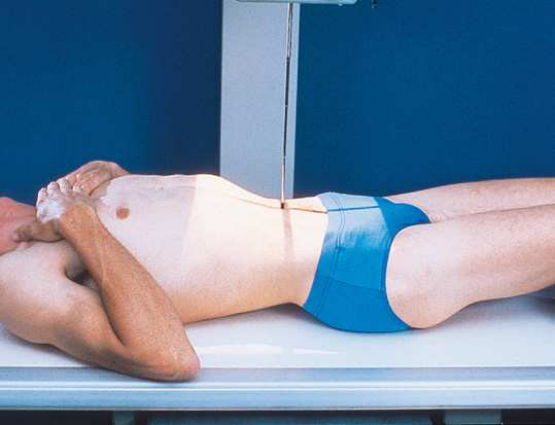
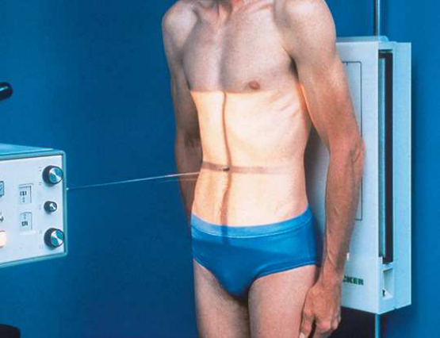

# Rx Urinary System — Incidență Antero-Posterioară (AP) (Merrill)

  📷 Radiografie Convențională (Rx)
  <strong>Actualizat:</strong> 2026-09-16
  <strong>Autor:</strong> Referință Merrill

---

-   __1. Rezumat Clinic & Indicații__

    ---

    === "Indicații Clinice"

        - Conform reperelor anatomice standard din tratat

    === "Ghid Național IRIS"

        !!! info "Referință Primară: Ghidul Național IRIS (Ordinul MS 1342/2012)"
            - **Capitol Ghid IRIS:** *Ghidul Național IRIS*
            - **Grad de Recomandare:** **De verificat pe indicație; fără grad atribuit automat**
            - **Nivel de Iradiere Estimată:** `De verificat pentru examinarea și populația selectate`

            [:octicons-search-16: Deschide Ghidul IRIS](../../iris.md){ .md-button .md-button--primary } [:material-open-in-new: Aplicația Oficială PWA](https://radiologie-pediatrica.ro/iris/){ .md-button target="_blank" rel="noopener" }
-   __2. Poziționare & Centrare Fascicul__

    ---

    - **Poziție Pacient:** se poziționează pacientul Decubit dorsal pe masa radiologică pentru Incidență Antero-Posterioară (AP) de urinary system. Preliminary (scout) și postinjection imagini sunt most commonly obtained cu pacientul Decubit dorsal (Fig. 16.40). Place support under pacientul’s genunchi la relieve strain pe back. se așază pacientul în ortostatism sau semiupright poziție pentru Incidență Antero-Posterioară (AP) la show opacified bladder și mobility de rinichi (Fig. 16.41). la show lower ends de ureters, it poate fie helpful la use Trendelenburg poziție și Incidență Antero-Posterioară (AP) cu capul de masa de examinare lowered 15 la 20 grade și raza centrală orientat perpendicular pe receptorul de imagine (RI). în this înclinat poziție, weight de contained lichid stretches bladder fundus superiorly, providing unobstructed imagine de lower ureters și vesicoureteral orifice areas. If needed, apply ureteral compression (see Fig. 16.32).; se centrează MSP de pacientul’s corp la linia mediană grilă device. se poziționează pacientul’s brațe out de câmp colimat. se centrează receptorul de imagine la nivelul crestele iliace. If pacientul este too tall pentru include entire urinary system, take second expunere pe a 10 × 12-inch (24 × 30-cm) câmp de iradiere (raza centrală plate) centrat pe bladder. 10 × 12-inch (24 × 30-cm) expunere field sau raza centrală plate este transversal și centrat 2 la 3 inches (5 la 7.6 cm) above upper margine de simfiză pubiană. se efectuează ecranarea gonadelor cu șorț plumbat.
    - **Punct de Centrare Fascicul:** perpendicular pe receptorul de imagine (RI) la nivelul crestele iliace
    - **Distanță Focar-Film (DFF / SID):** Nespecificat în fragmentul extras; de verificat în sursă
    - **Comandă Respiratorie:** Apnee la sfârșitul expirului complet.

-   __3. Parametri Tehnici Expunere__

    ---

    | Parametru Tehnic | Valoare Configurare Generator / Tub |
    |:-----------------|:-------------------------------------|
    | **Tensiune Tub (kV)** | DE CONFIGURAT PE APARAT |
    | **Sarcină / Produs Curent-Timp (mAs)** | DE CONFIGURAT PE APARAT |
    | **Distanță Focar-Film (DFF / SID)** | Nespecificat în fragmentul extras; de verificat în sursă |
    | **Grilă Antidifuzoare (Bucky)** | DE CONFIGURAT PE APARAT |
    | **Dimensiune Focar** | DE CONFIGURAT PE APARAT |
    | **Camere de Ionizare AEC** | DE CONFIGURAT PE APARAT |
    | **Colimare Fascicul** | se ajustează câmp de iradiere la fără larger than 14 × 17 inches (35 × 43 cm) longitudinal sau 10 × 12 inches (24 × 30 cm) transversal pentru additional bladder imagine (if needed). pentru smaller pacienți, collimate la within 1 inch (2.5 cm) de shadow de abdomenul flanks. Place correct marker de lateralitate (D/S) în collimated expunere field. |
    | **Filtrare Tub** | DE CONFIGURAT PE APARAT |

-   __4. Criterii de Calitate & Reușită Imagine__

    ---

    - Criterii radiologice de calitate imaginii:
    - Colimare adecvată vizibilă și prezența markerului de lateralitate (D/S) plasat clear de anatomy de interest

-   __5. Protecție Radiologică (ALARA)__

    ---

    - Nespecificat în fragmentul extras; de verificat în sursă

!!! note "Observații Clinice & Tehnice"
    Decubit ventral poziție poate fie recommended la show ureteropelvic region și la fill obstructed ureter în presence de hydronephrosis. ureters fill better în Decubit ventral poziție, which reverses curve de their inferior course. rinichi sunt situated obliquely, slanting anteriorly în plan transversal, so opacified urine tends la collect în și distend dependent part de pelvicaliceal system. Decubit dorsal poziție allows more posteriorly plasat upper calyces la fill more readily, și anterior și inferior parts de pelvicaliceal system fill more easily în Decubit ventral poziție.

### 🖼️ Imagini

<figure class="protocol-image-card" markdown>

<figcaption><strong>Merrill — pagina PDF 1245, imaginea 1</strong> — Imagine din fragmentul sursă; asocierea necesită revizie.</figcaption>

</figure>

<figure class="protocol-image-card" markdown>

<figcaption><strong>Merrill — pagina PDF 1246, imaginea 2</strong> — Imagine din fragmentul sursă; asocierea necesită revizie.</figcaption>

</figure>

=== "Ghid Rapid de Execuție"

    1. **Identificarea și verificarea pacientului:** verificare identitate, zonă de examinat, consimțământ conform procedurii și evaluarea posibilității unei sarcini, când este relevantă.
    2. **Pregătire:** îndepărtarea oricăror obiecte radiopace (bijuterii, agrafe, fermoare, proteze, pansamente dense).
    3. **Poziționare precisă:** alinierea receptorului de imagine și a tubului la distanța prescrisă (Nespecificat în fragmentul extras; de verificat în sursă).
    4. **Colimare strictă:** adaptarea fasciculului strict la regiunea de diagnostic pentru scăderea iradierii și reducerea radiației difuze.
    5. **Radioprotecție:** verificarea [politicii RX](../radioprotectie.md), cu măsuri distincte pentru pacient, personal și însoțitor.

## Surse de documentare

- [Merrill’s Atlas, 16. Urinary System and Venipuncture, pagini PDF 1244–1246](../../assets/protocols/sources/a56d45c16829_Merrills_Atlas_of_Radiographic_Positioning__Procedures_3Vol_Set.pdf#page=1244)

## Fragmente sursă traduse (referință tehnică)

### anatomy

AP incidență de urinary system shows rinichi, ureters, și bladder filled cu contrast medium (Figs. 16.42 through 16.44).

### collimation

• se ajustează câmp de iradiere la fără larger than 14 × 17 inches (35 × 43 cm) longitudinal sau 10 × 12 inches (24 × 30 cm) transversal pentru additional bladder imagine (if needed). pentru smaller pacienți, collimate la within 1 inch (2.5 cm) de shadow de abdomenul flanks.
Place correct marker de lateralitate (D/S) în collimated expunere field.

### cr

• perpendicular pe receptorul de imagine (RI) la nivelul crestele iliace

### criteria

Criterii radiologice de calitate imaginii:
• Colimare adecvată vizibilă și prezența markerului de lateralitate (D/S) plasat clear de anatomy de interest

### notes

decubit ventral poate fie recommended la show ureteropelvic region și la fill obstructed ureter în presence de
hydronephrosis. ureters fill better în decubit ventral, which reverses curve de their inferior course. rinichi sunt situated obliquely,
slanting anteriorly în plan transversal, so opacified urine tends la collect în și distend dependent part de pelvicaliceal system.
decubit dorsal allows more posteriorly plasat upper calyces la fill more readily, și anterior și inferior parts de pelvicaliceal
system fill more easily în decubit ventral.

### part_pos

• se centrează MSP de pacientul’s corp la linia mediană grilă device.
• se poziționează pacientul’s brațe out de câmp colimat.
• se centrează receptorul de imagine la nivelul crestele iliace. If pacientul este too tall pentru include entire urinary system, take second expunere pe a 10
× 12-inch (24 × 30-cm) câmp de iradiere (raza centrală plate) centrat pe bladder. 10 × 12-inch (24 × 30-cm) expunere field sau raza centrală plate este
transversal și centrat 2 la 3 inches (5 la 7.6 cm) above upper margine de simfiză pubiană.
• se efectuează ecranarea gonadelor cu șorț plumbat.

### patient_pos

• se poziționează pacientul în decubit dorsal pe masa radiologică pentru AP incidență de urinary system. Preliminary (scout) și postinjection
imagini sunt most commonly obtained cu pacientul în decubit dorsal (Fig. 16.40).
• Place support under pacientul’s genunchi la relieve strain pe back.
• se așază pacientul în ortostatism sau semiupright poziție pentru AP incidență la show opacified bladder și mobility de rinichi (Fig. 16.41).
• la show lower ends de ureters, it poate fie helpful la use Trendelenburg poziție și AP incidență cu capul de table lowered 15 la 20 grade și raza centrală orientat perpendicular pe receptorul de imagine (RI). în this înclinat poziție, weight de contained
lichid stretches bladder fundus superiorly, providing unobstructed imagine de lower ureters și vesicoureteral orifice
areas.
• If needed, apply ureteral compression (see Fig. 16.32).

### respiration

Apnee la sfârșitul expirului complet.

### tech

poziționat prin manufacturer sau department protocol pentru corect anatomy display orientation; raza centrală plate: 14 × 17 inches (35 ×
43 cm) longitudinal.

