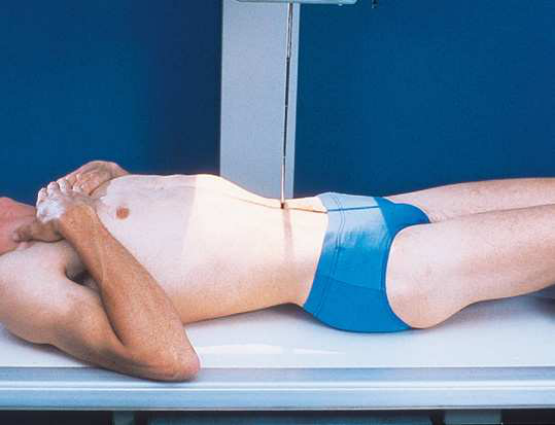
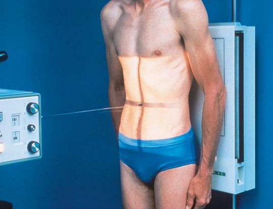

# Rx Aparat Urinar — Incidență Antero-Posterioară (AP) (Merrill)

  📷 Radiografie Convențională (Rx)
  <strong>Actualizat:</strong> 2026-09-16
  <strong>Autor:</strong> Referință Merrill

---

-   __1. Rezumat Clinic & Indicații__

    ---

    === "Indicații Clinice"

        - Conform reperelor anatomice standard din tratat

    === "Ghid Național IRIS"

        !!! info "Referință Primară: Ghidul Național IRIS (Ordinul MS 1342/2012)"
            - **Capitol Ghid IRIS:** *Aparat digestiv & Abdomen*
            - **Grad de Recomandare:** **Grad B**
            - **Nivel de Iradiere Estimată:** `Clasa 2 (Foarte mică ~ 0.7 - 1.2 mSv)`

            [:octicons-search-16: Deschide Ghidul IRIS](../../iris.md){ .md-button .md-button--primary } [:material-open-in-new: Aplicația Oficială PWA](https://radiologie-pediatrica.ro/iris/){ .md-button target="_blank" rel="noopener" }

-   __2. Poziționare & Centrare Fascicul__

    ---

    - **Poziție Pacient:** se poziționează pacientul în decubit dorsal pe masa radiologică pentru incidența antero-posterioară (AP) a aparatului urinar. Imaginile preliminare (de orientare) și cele după injectare se obțin cel mai frecvent cu pacientul în decubit dorsal (Fig. 16.40). se așază un suport sub genunchii pacientului pentru a reduce solicitarea spatelui. se așază pacientul în ortostatism sau în poziție semiverticală pentru incidența antero-posterioară (AP), pentru a evidenția vezica urinară opacifiată și mobilitatea rinichilor (Fig. 16.41). pentru evidențierea extremităților inferioare ale ureterelor, poate fi utilă folosirea poziției Trendelenburg și a incidenței antero-posterioare (AP), cu capătul mesei de examinare dinspre cap coborât cu 15 la 20 grade și raza centrală orientată perpendicular pe receptorul de imagine (RI). în această poziție înclinată, greutatea lichidului conținut destinde fundul vezicii urinare în direcție superioară, oferind o imagine neobstrucționată a porțiunilor inferioare ale ureterelor și a regiunilor orificiilor vezicoureterale. Dacă este necesar, se aplică compresie ureterală (vezi Fig. 16.32). se centrează MSP al corpului pacientului pe linia mediană a dispozitivului cu grilă. se poziționează brațele pacientului în afara câmpului colimat. se centrează receptorul de imagine la nivelul crestelor iliace. Dacă pacientul este prea înalt pentru a include întregul aparat urinar, se efectuează o a doua expunere cu un câmp de iradiere de 10 × 12 țoli (24 × 30 cm) (placă pentru raza centrală), centrat pe vezica urinară. Câmpul de expunere de 10 × 12 țoli (24 × 30 cm) sau placa pentru raza centrală se orientează transversal și se centrează la 2 la 3 țoli (5 la 7.6 cm) deasupra marginii superioare a simfizei pubiene. se efectuează ecranarea gonadelor cu șorț plumbat.
    - **Punct de Centrare Fascicul:** perpendicular pe receptorul de imagine (RI) la nivelul crestelor iliace
    - **Distanță Focar-Film (DFF / SID):** Nespecificat în fragmentul extras; de verificat în sursă
    - **Comandă Respiratorie:** Apnee la sfârșitul expirului complet.

-   __3. Parametri Tehnici Expunere__

    ---

    | Parametru Tehnic | Valoare Configurare Generator / Tub |
    |:-----------------|:-------------------------------------|
    | **Tensiune Tub (kV)** | DE CONFIGURAT PE APARAT |
    | **Sarcină / Produs Curent-Timp (mAs)** | DE CONFIGURAT PE APARAT |
    | **Distanță Focar-Film (DFF / SID)** | Nespecificat în fragmentul extras; de verificat în sursă |
    | **Grilă Antidifuzoare (Bucky)** | DE CONFIGURAT PE APARAT |
    | **Dimensiune Focar** | DE CONFIGURAT PE APARAT |
    | **Camere de Ionizare AEC** | DE CONFIGURAT PE APARAT |
    | **Colimare Fascicul** | se ajustează câmpul de iradiere astfel încât să nu depășească 14 × 17 țoli (35 × 43 cm), orientat longitudinal, sau 10 × 12 țoli (24 × 30 cm), orientat transversal, pentru imaginea suplimentară a vezicii urinare (dacă este necesară). pentru pacienții de talie mai mică, se colimează la cel mult 1 țol (2.5 cm) de conturul flancurilor abdominale. se plasează markerul de lateralitate (D/S) corect în câmpul de expunere colimat. |
    | **Filtrare Tub** | DE CONFIGURAT PE APARAT |

-   __4. Criterii de Calitate & Reușită Imagine__

    ---

    - Criterii radiologice de calitate a imaginii:
    - Colimare adecvată vizibilă și prezența markerului de lateralitate (D/S) plasat în afara structurilor anatomice de interes

-   __5. Protecție Radiologică (ALARA)__

    ---

    - Nespecificat în fragmentul extras; de verificat în sursă

!!! note "Observații Clinice & Tehnice"
    Poziția de decubit ventral poate fi recomandată pentru evidențierea regiunii pieloureterale și pentru umplerea ureterului obstruat în prezența hidronefrozei. Ureterele se umplu mai bine în decubit ventral, poziție care inversează curbura traiectului lor inferior. Rinichii sunt situați oblic, înclinați anterior în plan transversal, astfel încât urina opacifiată tinde să se acumuleze în porțiunea declivă a sistemului pielocaliceal și să o destindă. Poziția de decubit dorsal permite umplerea mai ușoară a calicelor superioare situate mai posterior, iar porțiunile anterioare și inferioare ale sistemului pielocaliceal se umplu mai ușor în decubit ventral.

### 🖼️ Imagini

<figure class="protocol-image-card" markdown>

<figcaption><strong>Merrill — pagina 1245, imaginea 1</strong> — Imagine din fragmentul sursă; asocierea necesită revizie.</figcaption>

</figure>

<figure class="protocol-image-card" markdown>

<figcaption><strong>Merrill — pagina 1246, imaginea 2</strong> — Imagine din fragmentul sursă; asocierea necesită revizie.</figcaption>

</figure>

=== "Ghid Rapid de Execuție"

    1. **Identificarea și verificarea pacientului:** verificare identitate, zonă de examinat, consimțământ conform procedurii și evaluarea posibilității unei sarcini, când este relevantă.
    2. **Pregătire:** îndepărtarea oricăror obiecte radiopace (bijuterii, agrafe, fermoare, proteze, pansamente dense).
    3. **Poziționare precisă:** alinierea receptorului de imagine și a tubului la distanța prescrisă (Nespecificat în fragmentul extras; de verificat în sursă).
    4. **Colimare strictă:** adaptarea fasciculului strict la regiunea de diagnostic pentru scăderea iradierii și reducerea radiației difuze.
    5. **Radioprotecție:** verificarea [politicii RX](../radioprotectie.md), cu măsuri distincte pentru pacient, personal și însoțitor.

## Surse de documentare

- [Merrill’s Atlas, 16. Urinary System and Venipuncture, pagini 1244–1246](https://books.google.com/books/about/Merrill_s_Atlas_of_Radiographic_Position.html?id=BM0lEQAAQBAJ)
