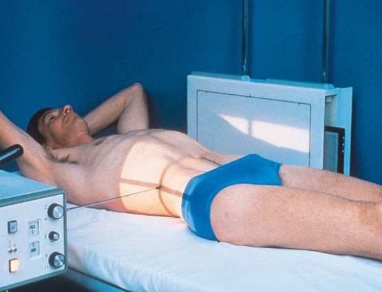

# Rx Urinary System — Incidență de Profil (Lateral) — Incidență Decubit Dorsal (Merrill)

  📷 Radiografie Convențională (Rx)
  <strong>Actualizat:</strong> 2026-09-16
  <strong>Autor:</strong> Referință Merrill

---

-   __1. Rezumat Clinic & Indicații__

    ---

    === "Indicații Clinice"

        - Conform reperelor anatomice standard din tratat

    === "Ghid Național IRIS"

        !!! info "Referință Primară: Ghidul Național IRIS (Ordinul MS 1342/2012)"
            - **Capitol Ghid IRIS:** *Ghidul Național IRIS*
            - **Grad de Recomandare:** **De verificat pe indicație; fără grad atribuit automat**
            - **Nivel de Iradiere Estimată:** `De verificat pentru examinarea și populația selectate`

            [:octicons-search-16: Deschide Ghidul IRIS](../../iris.md){ .md-button .md-button--primary } [:material-open-in-new: Aplicația Oficială PWA](https://radiologie-pediatrica.ro/iris/){ .md-button target="_blank" rel="noopener" }
-   __2. Poziționare & Centrare Fascicul__

    ---

    - **Poziție Pacient:** se așază pacientul în Decubit dorsal poziție pe radiographic cart cu side în question în contact cu stativ vertical Bucky. Ensure that wheels sunt locked. se poziționează pacientul’s brațe across upper Torace la ensure that they sunt nu projected over orice abdominal contents, sau place them behind capul. se flectează pacient’s genunchi slightly la relieve strain pe back.; se ajustează height de stativ vertical Bucky astfel încât axa longitudinală de receptorul de imagine este centrat pe planul mediocoronal de pacientul’s corp. se poziționează pacientul so that point approximately la nivelul crestele iliace este centrat pe receptorul de imagine (Fig. 16.49). se ajustează pacient la ensure that Absența rotației anatomice (simetrie bilaterală perfectă) de la Decubit dorsal sau Decubit ventral poziție este present. se efectuează ecranarea gonadelor cu șorț plumbat.
    - **Punct de Centrare Fascicul:** Horizon̍ al și perpendicular pe centrul receptorului de imagine, entering planul mediocoronal la nivelul crestele iliace
    - **Distanță Focar-Film (DFF / SID):** Nespecificat în fragmentul extras; de verificat în sursă
    - **Comandă Respiratorie:** Apnee la sfârșitul expirului complet.

-   __3. Parametri Tehnici Expunere__

    ---

    | Parametru Tehnic | Valoare Configurare Generator / Tub |
    |:-----------------|:-------------------------------------|
    | **Tensiune Tub (kV)** | DE CONFIGURAT PE APARAT |
    | **Sarcină / Produs Curent-Timp (mAs)** | DE CONFIGURAT PE APARAT |
    | **Distanță Focar-Film (DFF / SID)** | Nespecificat în fragmentul extras; de verificat în sursă |
    | **Grilă Antidifuzoare (Bucky)** | DE CONFIGURAT PE APARAT |
    | **Dimensiune Focar** | DE CONFIGURAT PE APARAT |
    | **Camere de Ionizare AEC** | DE CONFIGURAT PE APARAT |
    | **Colimare Fascicul** | se ajustează câmp de iradiere la fără larger than 14 × 17 inches (35 × 43 cm) longitudinal. pentru smaller pacienți, collimate la within 1 inch (2.5 cm) de skin shadow. Place correct marker de lateralitate (D/S) în collimated expunere field. |
    | **Filtrare Tub** | DE CONFIGURAT PE APARAT |

-   __4. Criterii de Calitate & Reușită Imagine__

    ---

    - Criterii radiologice de calitate imaginii:
    - Colimare adecvată vizibilă și prezența markerului de lateralitate (D/S) plasat clear de anatomy de interest
    - Entire urinary system
    - Bladder și simfiză pubiană
    - Contrast medium în renal area, ureters, și bladder
    - Surrounding anatomy
    - Absența rotației anatomice (simetrie bilaterală perfectă) de pacientul (check Bazin (bazin (pelvis)) și coloană lombară)
    - Time marker
    - pacient ridicat so that entire Abdomen este vizibil

-   __5. Protecție Radiologică (ALARA)__

    ---

    - Nespecificat în fragmentul extras; de verificat în sursă

!!! note "Observații Clinice & Tehnice"
    Conform reperelor anatomice standard din tratat

### 🖼️ Imagini

<figure class="protocol-image-card" markdown>

<figcaption><strong>Merrill — pagina PDF 1253, imaginea 1</strong> — Imagine din fragmentul sursă; asocierea necesită revizie.</figcaption>

</figure>

=== "Ghid Rapid de Execuție"

    1. **Identificarea și verificarea pacientului:** verificare identitate, zonă de examinat, consimțământ conform procedurii și evaluarea posibilității unei sarcini, când este relevantă.
    2. **Pregătire:** îndepărtarea oricăror obiecte radiopace (bijuterii, agrafe, fermoare, proteze, pansamente dense).
    3. **Poziționare precisă:** alinierea receptorului de imagine și a tubului la distanța prescrisă (Nespecificat în fragmentul extras; de verificat în sursă).
    4. **Colimare strictă:** adaptarea fasciculului strict la regiunea de diagnostic pentru scăderea iradierii și reducerea radiației difuze.
    5. **Radioprotecție:** verificarea [politicii RX](../radioprotectie.md), cu măsuri distincte pentru pacient, personal și însoțitor.

## Surse de documentare

- [Merrill’s Atlas, 16. Urinary System and Venipuncture, pagini PDF 1252–1253](../../assets/protocols/sources/a56d45c16829_Merrills_Atlas_of_Radiographic_Positioning__Procedures_3Vol_Set.pdf#page=1252)

## Fragmente sursă traduse (referință tehnică)

### anatomy

Rolleston și Reay 8 recommended ventral decubit poziție la show UPī în presence de hydronephrosis. Cook et al. 9 advocated
this poziție la determine whether extrarenal mass în flank este intraperitoneal sau extraperitoneal, și they stated that poziție makes it
easy la screen rinichi și ureters pentru abnormal anterior displacement (Fig. 16.50).

### collimation

• se ajustează câmp de iradiere la fără larger than 14 × 17 inches (35 × 43 cm) longitudinal. pentru smaller pacienți, collimate la within 1 inch (2.5
cm) de skin shadow. Place correct marker de lateralitate (D/S) în collimated expunere field.

### cr

• Horizon̍ al și perpendicular pe centrul receptorului de imagine, entering planul mediocoronal la nivelul crestele iliace

### criteria

Criterii radiologice de calitate imaginii:
• Colimare adecvată vizibilă și prezența markerului de lateralitate (D/S) plasat clear de anatomy de interest
• Entire urinary system
• Bladder și simfiză pubiană
• Contrast medium în renal area, ureters, și bladder
• Surrounding anatomy
• Absența rotației anatomice (simetrie bilaterală perfectă) de pacientul (check bazin (pelvis) și coloană lombară)
• Time marker
• pacient ridicat so that entire abdomen este vizibil

### part_pos

• se ajustează height de stativ vertical Bucky astfel încât axa longitudinală de receptorul de imagine este centrat pe planul mediocoronal de pacientul’s corp.
• se poziționează pacientul so that point approximately la nivelul crestele iliace este centrat pe receptorul de imagine (Fig. 16.49).
• se ajustează pacient la ensure that Absența rotației anatomice (simetrie bilaterală perfectă) de la în decubit dorsal sau decubit ventral este present.
• se efectuează ecranarea gonadelor cu șorț plumbat.

### patient_pos

• se așază pacientul în decubit dorsal pe radiographic cart cu side în question în contact cu stativ vertical Bucky. Ensure
that wheels sunt locked.
• se poziționează pacientul’s brațe across upper chest la ensure that they sunt nu projected over orice abdominal contents, sau place them behind
capul.
• se flectează pacient’s genunchi slightly la relieve strain pe back.

### respiration

Apnee la sfârșitul expirului complet.

### tech

poziționat prin manufacturer sau department protocol pentru corect anatomy display orientation; raza centrală plate: 14 × 17 inches (35 ×
43 cm) longitudinal.

