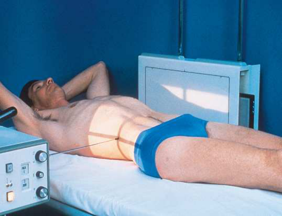

# Rx aparat urinar — Incidență de profil (laterală) — Incidență în decubit dorsal (Merrill)

  📷 Radiografie Convențională (Rx)
  <strong>Actualizat:</strong> 2026-09-16
  <strong>Autor:</strong> Referință Merrill

---

-   __1. Rezumat Clinic & Indicații__

    ---

    === "Indicații Clinice"

        - Conform reperelor anatomice standard din tratat

    === "Ghid Național IRIS"

        !!! info "Referință Primară: Ghidul Național IRIS (Ordinul MS 1342/2012)"
            - **Capitol Ghid IRIS:** *Ghidul Național IRIS*
            - **Grad de Recomandare:** **De verificat pe indicație; fără grad atribuit automat**
            - **Nivel de Iradiere Estimată:** `De verificat pentru examinarea și populația selectate`

            [:octicons-search-16: Deschide Ghidul IRIS](../../iris.md){ .md-button .md-button--primary } [:material-open-in-new: Aplicația Oficială PWA](https://radiologie-pediatrica.ro/iris/){ .md-button target="_blank" rel="noopener" }
-   __2. Poziționare & Centrare Fascicul__

    ---

    - **Poziție Pacient:** Se așază pacientul în decubit dorsal pe targa radiologică, cu partea de examinat în contact cu stativul vertical Bucky. Se verifică dacă roțile sunt blocate. Se poziționează brațele pacientului peste partea superioară a toracelui, astfel încât să nu se proiecteze peste conținutul abdominal, sau se așază în spatele capului. Se flectează ușor genunchii pacientului pentru a reduce tensiunea asupra spatelui.; Se ajustează înălțimea stativului vertical Bucky astfel încât axa longitudinală a receptorului de imagine să fie centrată pe planul mediocoronal al corpului pacientului. Se poziționează pacientul astfel încât un punct situat aproximativ la nivelul crestelor iliace să fie centrat pe receptorul de imagine (Fig. 16.49). Se ajustează poziția pacientului pentru a asigura absența rotației anatomice (simetrie bilaterală perfectă) în decubit dorsal sau în decubit ventral. Se efectuează ecranarea gonadelor cu șorț plumbat.
    - **Punct de Centrare Fascicul:** Orizontal și perpendicular pe centrul receptorului de imagine, cu punctul de intrare în planul mediocoronal, la nivelul crestelor iliace
    - **Distanță Focar-Film (DFF / SID):** Nespecificat în fragmentul extras; de verificat în sursă
    - **Comandă Respiratorie:** Apnee la sfârșitul expirului complet.

-   __3. Parametri Tehnici Expunere__

    ---

    | Parametru Tehnic | Valoare Configurare Generator / Tub |
    |:-----------------|:-------------------------------------|
    | **Tensiune Tub (kV)** | DE CONFIGURAT PE APARAT |
    | **Sarcină / Produs Curent-Timp (mAs)** | DE CONFIGURAT PE APARAT |
    | **Distanță Focar-Film (DFF / SID)** | Nespecificat în fragmentul extras; de verificat în sursă |
    | **Grilă Antidifuzoare (Bucky)** | DE CONFIGURAT PE APARAT |
    | **Dimensiune Focar** | DE CONFIGURAT PE APARAT |
    | **Camere de Ionizare AEC** | DE CONFIGURAT PE APARAT |
    | **Colimare Fascicul** | Se ajustează câmpul de iradiere astfel încât să nu depășească 14 × 17 țoli (35 × 43 cm), în orientare longitudinală. Pentru pacienții de talie mai mică, se colimează la cel mult 1 țol (2.5 cm) de conturul cutanat. Se plasează markerul de lateralitate (D/S) corect în câmpul de expunere colimat. |
    | **Filtrare Tub** | DE CONFIGURAT PE APARAT |

-   __4. Criterii de Calitate & Reușită Imagine__

    ---

    - Criterii radiologice de calitate a imaginii:
    - Colimare adecvată vizibilă și prezența markerului de lateralitate (D/S) plasat în afara structurilor anatomice de interes
    - Întregul aparat urinar
    - Vezica urinară și simfiza pubiană
    - Substanță de contrast în regiunea renală, uretere și vezica urinară
    - Structurile anatomice învecinate
    - Absența rotației anatomice a pacientului (simetrie bilaterală perfectă) (se verifică bazinul (pelvisul) și coloana lombară)
    - Marker de timp
    - Pacientul este ridicat astfel încât întregul abdomen să fie vizibil

-   __5. Protecție Radiologică (ALARA)__

    ---

    - Nespecificat în fragmentul extras; de verificat în sursă

!!! note "Observații Clinice & Tehnice"
    Conform reperelor anatomice standard din tratat

### 🖼️ Imagini

<figure class="protocol-image-card" markdown>

<figcaption><strong>Merrill — pagina 1253, imaginea 1</strong> — Imagine din fragmentul sursă; asocierea necesită revizie.</figcaption>

</figure>

=== "Ghid Rapid de Execuție"

    1. **Identificarea și verificarea pacientului:** verificare identitate, zonă de examinat, consimțământ conform procedurii și evaluarea posibilității unei sarcini, când este relevantă.
    2. **Pregătire:** îndepărtarea oricăror obiecte radiopace (bijuterii, agrafe, fermoare, proteze, pansamente dense).
    3. **Poziționare precisă:** alinierea receptorului de imagine și a tubului la distanța prescrisă (Nespecificat în fragmentul extras; de verificat în sursă).
    4. **Colimare strictă:** adaptarea fasciculului strict la regiunea de diagnostic pentru scăderea iradierii și reducerea radiației difuze.
    5. **Radioprotecție:** verificarea [politicii RX](../radioprotectie.md), cu măsuri distincte pentru pacient, personal și însoțitor.

## Surse de documentare

- [Merrill’s Atlas, 16. Urinary System and Venipuncture, pagini 1252–1253](https://books.google.com/books/about/Merrill_s_Atlas_of_Radiographic_Position.html?id=BM0lEQAAQBAJ)

## Fragmente sursă traduse (referință tehnică)

### anatomie

Rolleston și Reay 8 au recomandat poziția de decubit ventral pentru a evidenția UPī în prezența hidronefrozei. Cook și colab. 9 au susținut utilizarea
acestei poziții pentru a determina dacă o masă extrarenală din flanc este intraperitoneală sau extraperitoneală și au afirmat că poziția facilitează
examinarea rinichilor și ureterelor pentru depistarea unei deplasări anterioare anormale (Fig. 16.50).

### colimare

• Se ajustează câmpul de iradiere astfel încât să nu depășească 14 × 17 țoli (35 × 43 cm), în orientare longitudinală. Pentru pacienții de talie mai mică, se colimează la cel mult 1 țol (2.5
cm) de conturul cutanat. Se plasează markerul de lateralitate (D/S) corect în câmpul de expunere colimat.

### raza centrală

• Orizontală și perpendiculară pe centrul receptorului de imagine, pătrunzând în planul mediocoronal la nivelul crestelor iliace

### criterii

Criterii radiologice de calitate a imaginii:
• Colimare adecvată vizibilă și prezența markerului de lateralitate (D/S) plasat fără a se suprapune peste structurile anatomice de interes
• Întregul aparat urinar
• Vezica urinară și simfiza pubiană
• Substanță de contrast în regiunea renală, uretere și vezica urinară
• Structurile anatomice învecinate
• Absența rotației anatomice a pacientului (simetrie bilaterală perfectă) (se verifică bazinul (pelvisul) și coloana lombară)
• Marker temporal
• Pacientul este ridicat astfel încât întregul abdomen să fie vizibil

### part_pos

• Se ajustează înălțimea stativului vertical Bucky astfel încât axa longitudinală a receptorului de imagine să fie centrată pe planul mediocoronal al corpului pacientului.
• Se poziționează pacientul astfel încât un punct situat aproximativ la nivelul crestelor iliace să fie centrat pe receptorul de imagine (Fig. 16.49).
• Se ajustează poziția pacientului pentru a asigura absența rotației anatomice (simetrie bilaterală perfectă) în decubit dorsal sau în decubit ventral.
• Se efectuează ecranarea gonadelor cu șorț plumbat.

### patient_pos

• Se așază pacientul în decubit dorsal pe targa radiologică, cu partea de examinat în contact cu stativul vertical Bucky. Se verifică
dacă roțile sunt blocate.
• Se poziționează brațele pacientului peste partea superioară a toracelui, astfel încât să nu se proiecteze peste conținutul abdominal, sau se așază în spatele
capului.
• Se flectează ușor genunchii pacientului pentru a reduce tensiunea asupra spatelui.

### respirație

Apnee la sfârșitul expirului complet.

### tehnică

Poziționat conform indicațiilor producătorului sau protocolului departamentului pentru orientarea corectă a afișării structurilor anatomice; raza centrală, placă: 14 × 17 țoli (35 ×
43 cm), longitudinal.

