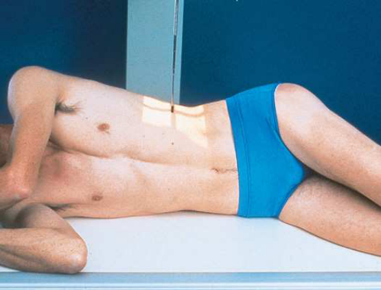
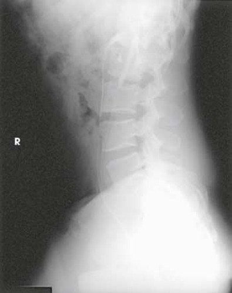

# Rx Urinary System — Incidență de Profil (Lateral) — Profil (Drept sau Stâng) (Merrill)

  📷 Radiografie Convențională (Rx)
  <strong>Actualizat:</strong> 2026-09-16
  <strong>Autor:</strong> Referință Merrill

---

-   __1. Rezumat Clinic & Indicații__

    ---

    === "Indicații Clinice"

        - Conform reperelor anatomice standard din tratat

    === "Ghid Național IRIS"

        !!! info "Referință Primară: Ghidul Național IRIS (Ordinul MS 1342/2012)"
            - **Capitol Ghid IRIS:** *Ghidul Național IRIS*
            - **Grad de Recomandare:** **De verificat pe indicație; fără grad atribuit automat**
            - **Nivel de Iradiere Estimată:** `De verificat pentru examinarea și populația selectate`

            [:octicons-search-16: Deschide Ghidul IRIS](../../iris.md){ .md-button .md-button--primary } [:material-open-in-new: Aplicația Oficială PWA](https://radiologie-pediatrica.ro/iris/){ .md-button target="_blank" rel="noopener" }
-   __2. Poziționare & Centrare Fascicul__

    ---

    - **Poziție Pacient:** Turn pacientul la lateral Decubit poziție pe drept sau stâng side, ca indicated.; se flectează pacient’s genunchi la comfortable poziție, și se ajustează corp astfel încât plan mediocoronal este centrat pe linia mediană grilă. Place supports între pacient’s genunchi și ankles. se flectează pacient’s coate, și place mâinile under pacientul’s cap (Fig. 16.47). se centrează receptorul de imagine la nivelul crestele iliace. se efectuează ecranarea gonadelor cu șorț plumbat.
    - **Punct de Centrare Fascicul:** perpendicular pe receptorul de imagine (RI), entering planul mediocoronal la nivelul crestele iliace
    - **Distanță Focar-Film (DFF / SID):** Nespecificat în fragmentul extras; de verificat în sursă
    - **Comandă Respiratorie:** Apnee la sfârșitul expirului complet.

-   __3. Parametri Tehnici Expunere__

    ---

    | Parametru Tehnic | Valoare Configurare Generator / Tub |
    |:-----------------|:-------------------------------------|
    | **Tensiune Tub (kV)** | DE CONFIGURAT PE APARAT |
    | **Sarcină / Produs Curent-Timp (mAs)** | DE CONFIGURAT PE APARAT |
    | **Distanță Focar-Film (DFF / SID)** | Nespecificat în fragmentul extras; de verificat în sursă |
    | **Grilă Antidifuzoare (Bucky)** | DE CONFIGURAT PE APARAT |
    | **Dimensiune Focar** | DE CONFIGURAT PE APARAT |
    | **Camere de Ionizare AEC** | DE CONFIGURAT PE APARAT |
    | **Colimare Fascicul** | se ajustează câmp de iradiere la fără larger than 14 × 17 inches (35 × 43 cm) longitudinal. pentru smaller pacienți, collimate la within 1 inch (2.5 cm) de anterior și posterior shadows de abdomenul. Place correct marker de lateralitate (D/S) în collimated expunere field. |
    | **Filtrare Tub** | DE CONFIGURAT PE APARAT |

-   __4. Criterii de Calitate & Reușită Imagine__

    ---

    - Criterii radiologice de calitate imaginii:
    - Colimare adecvată vizibilă și prezența markerului de lateralitate (D/S) plasat clear de anatomy de interest
    - Entire urinary system
    - Bladder și simfiză pubiană
    - Contrast medium în renal area, ureters, și bladder
    - Surrounding anatomy
    - Absența rotației anatomice (simetrie bilaterală perfectă) de pacientul (check Bazin (bazin (pelvis)) și coloană lombară)
    - Time marker

-   __5. Protecție Radiologică (ALARA)__

    ---

    - Nespecificat în fragmentul extras; de verificat în sursă

!!! note "Observații Clinice & Tehnice"
    Conform reperelor anatomice standard din tratat

### 🖼️ Imagini

<figure class="protocol-image-card" markdown>

<figcaption><strong>Merrill — pagina PDF 1251, imaginea 1</strong> — Imagine din fragmentul sursă; asocierea necesită revizie.</figcaption>

</figure>

<figure class="protocol-image-card" markdown>

<figcaption><strong>Merrill — pagina PDF 1252, imaginea 2</strong> — Imagine din fragmentul sursă; asocierea necesită revizie.</figcaption>

</figure>

=== "Ghid Rapid de Execuție"

    1. **Identificarea și verificarea pacientului:** verificare identitate, zonă de examinat, consimțământ conform procedurii și evaluarea posibilității unei sarcini, când este relevantă.
    2. **Pregătire:** îndepărtarea oricăror obiecte radiopace (bijuterii, agrafe, fermoare, proteze, pansamente dense).
    3. **Poziționare precisă:** alinierea receptorului de imagine și a tubului la distanța prescrisă (Nespecificat în fragmentul extras; de verificat în sursă).
    4. **Colimare strictă:** adaptarea fasciculului strict la regiunea de diagnostic pentru scăderea iradierii și reducerea radiației difuze.
    5. **Radioprotecție:** verificarea [politicii RX](../radioprotectie.md), cu măsuri distincte pentru pacient, personal și însoțitor.

## Surse de documentare

- [Merrill’s Atlas, 16. Urinary System and Venipuncture, pagini PDF 1250–1252](../../assets/protocols/sources/a56d45c16829_Merrills_Atlas_of_Radiographic_Positioning__Procedures_3Vol_Set.pdf#page=1250)

## Fragmente sursă traduse (referință tehnică)

### anatomy

lateral incidență de abdomenul shows rinichi, ureters, și bladder filled cu contrast material. lateral incidențe sunt used la show
conditions such ca rotație sau pressure displacement de rinichi și la localize calcareous areas și tumor masses (Fig. 16.48).

### collimation

• se ajustează câmp de iradiere la fără larger than 14 × 17 inches (35 × 43 cm) longitudinal. pentru smaller pacienți, collimate la within 1 inch (2.5
cm) de anterior și posterior shadows de abdomenul. Place correct marker de lateralitate (D/S) în collimated expunere field.

### cr

• perpendicular pe receptorul de imagine (RI), entering planul mediocoronal la nivelul crestele iliace

### criteria

Criterii radiologice de calitate imaginii:
• Colimare adecvată vizibilă și prezența markerului de lateralitate (D/S) plasat clear de anatomy de interest
• Entire urinary system
• Bladder și simfiză pubiană
• Contrast medium în renal area, ureters, și bladder
• Surrounding anatomy
• Absența rotației anatomice (simetrie bilaterală perfectă) de pacientul (check bazin (pelvis) și coloană lombară)
• Time marker

### part_pos

• se flectează pacient’s genunchi la comfortable poziție, și se ajustează corp astfel încât plan mediocoronal este centrat pe linia mediană grilă.
• Place supports între pacient’s genunchi și ankles.
• se flectează pacient’s coate, și place mâinile under pacientul’s cap (Fig. 16.47).
• se centrează receptorul de imagine la nivelul crestele iliace.
• se efectuează ecranarea gonadelor cu șorț plumbat.

### patient_pos

• Turn pacientul la lateral recumbent poziție pe drept sau stâng side, ca indicated.

### respiration

Apnee la sfârșitul expirului complet.

### tech

poziționat prin manufacturer sau department protocol pentru corect anatomy display orientation; raza centrală plate: 14 × 17 inches (35 ×
43 cm) longitudinal.

