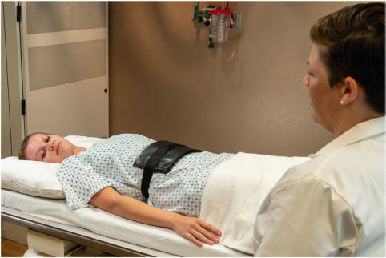
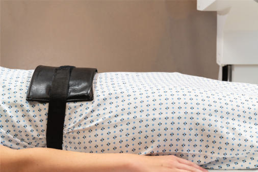
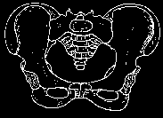
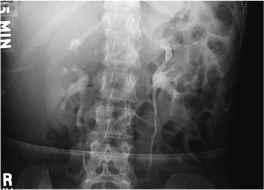

# Rx Urografie Intravenoasă (UIV) AP (Antero-Posterior) (Compresie Ureterală)

  📷 Radiografie Convențională (Rx)
  <strong>Actualizat:</strong> 2026-09-15
  <strong>Autor:</strong> Departamentul de Radiologie / Referință Bontrager

---

-   __1. Rezumat Clinic & Indicații__

    ---

    === "Indicații Clinice"

        - Pyelonephritis și other conditions involving collecting system de rinichi

    === "Ghid Național IRIS"

        !!! info "Referință Primară: Ghidul Național IRIS (Ordinul MS 1342/2012)"
            - **Capitol Ghid IRIS:** *Ghidul Național IRIS*
            - **Grad de Recomandare:** **De verificat pe indicație; fără grad atribuit automat**
            - **Nivel de Iradiere Estimată:** `De verificat pentru examinarea și populația selectate`

            [:octicons-search-16: Deschide Ghidul IRIS](../../iris.md){ .md-button .md-button--primary } [:material-open-in-new: Aplicația Oficială PWA](https://radiologie-pediatrica.ro/iris/){ .md-button target="_blank" rel="noopener" }
-   __2. Poziționare & Centrare Fascicul__

    ---

    - **Poziție Pacient:** Pacient: se poziționează pacientul Decubit dorsal, cu compression device în place (Figs. 14.82 și 14.83).; Regiune anatomică: Align plan mediosagital la centerline de table sau physical grilă și la raza centrală. Flex și support genunchi. poziție brațe away de la corp. Place upper edge de compression paddles la level de creasta iliacă (corespunzător L4-L5). Inner edges de paddles trebuie să almost touch, just lateral la vertebral coloană vertebrală pe fiecare side. (This places maximum pressure over area de ureters, which sunt just lateral la Coloană Lombară și medial la sacroiliac [SI] articulații.)
    - **Punct de Centrare Fascicul:** este perpendicular pe receptorul de imagine. Center la midway între apendice xifoid și creasta iliacă (corespunzător L4-L5)s.
    - **Distanță Focar-Film (DFF / SID):** 100 cm
    - **Comandă Respiratorie:** Apnee pe durata expunerii after expiration și expose.

-   __3. Parametri Tehnici Expunere__

    ---

    | Parametru Tehnic | Valoare Configurare Generator / Tub |
    |:-----------------|:-------------------------------------|
    | **Tensiune Tub (kV)** | 80-85 kV |
    | **Sarcină / Produs Curent-Timp (mAs)** | DE CONFIGURAT PE APARAT |
    | **Distanță Focar-Film (DFF / SID)** | 100 cm |
    | **Grilă Antidifuzoare (Bucky)** | Cu grilă antidifuzoare Bucky |
    | **Dimensiune Focar** | Focar Mic (0.6 mm) |
    | **Camere de Ionizare AEC** | Camerele laterale (sau camera centrală funcție de regiune) |
    | **Colimare Fascicul** | Collimate pe four sides la anatomy de interest. |
    | **Filtrare Tub** | Totală ≥ 2.5 mm Al echivalent |

-   __4. Criterii de Calitate & Reușită Imagine__

    ---

    - Entire urinary system este visualized, cu enhanced pelvic calyceal filling (Fig. 14.84). poziție:
    - Absența rotației anatomice: clavicule echidistante față de linia apofizelor spinoase, ca evident prin symmetry de iliac wings și/sau Coloană Lombară.
    - corect collimation applied. expunere:
    - fără mișcare due la respirație sau movement este evident.
    - optim receptorul de imagine expunere și contrast la visualize urinary system. Fig. 14.82 AP—Compresie Ureterală being applied. spină iliacă antero-superioară (SIAS) spină iliacă antero-superioară (SIAS) Fig. 14.83 Compresie Ureterală, cu inflated paddles plasat correctly. Inset, Paddles la medial la spină iliacă antero-superioară (SIAS). Fig. 14.84 AP, Compresie Ureterală, 5minute imagine. Urografie Intravenoasă (UIV)—IVU SPECIAL
    - AP Compresie Ureterală

-   __5. Protecție Radiologică (ALARA)__

    ---

    - Ecranare gonadică și a organelor radiosensibile conform procedurilor locale de radioprotecție ALARA.
    - Colimare strictă la aria de interes pentru limitarea radiației difuze.
    - Verificarea posibilității unei sarcini la pacientele de vârstă fertilă înainte de expunere.

!!! note "Observații Clinice & Tehnice"
    Immediately after injection de contrast medium, paddles sunt inflated și remain în place until radiologist indicates that they trebuie să fie released. imaging sequence este la fie determined prin department protocol sau prin radiologist.

### 🖼️ Imagini

<figure class="protocol-image-card" markdown>

<figcaption><strong>Fig. 14.82 AP—Compresie Ureterală being applied.</strong> — Poziționare pacient conform Ghidului Bontrager (Fig. 14.82 AP—ureteric compression being applied.)</figcaption>

</figure>

<figure class="protocol-image-card" markdown>

<figcaption><strong>Fig. 14.83 Compresie Ureterală, cu inflated paddles plasat</strong> — Aspect radiografic de referință conform Ghidului Bontrager (Fig. 14.83 Ureteric compression, cu inflated paddles plasat)</figcaption>

</figure>

<figure class="protocol-image-card" markdown>

<figcaption><strong>Fig. 14.84 AP, Compresie Ureterală, 5-</strong> — Aspect radiografic de referință conform Ghidului Bontrager (Fig. 14.84 AP, ureteric compression, 5-)</figcaption>

</figure>

<figure class="protocol-image-card" markdown>

<figcaption><strong>Figura 4</strong> — Aspect radiografic de referință conform Ghidului Bontrager (Figura 4)</figcaption>

</figure>

=== "Ghid Rapid de Execuție"

    1. **Identificarea și verificarea pacientului:** verificare identitate, zonă de examinat, consimțământ conform procedurii și evaluarea posibilității unei sarcini, când este relevantă.
    2. **Pregătire:** îndepărtarea oricăror obiecte radiopace (bijuterii, agrafe, fermoare, proteze, pansamente dense).
    3. **Poziționare precisă:** alinierea receptorului de imagine și a tubului la distanța prescrisă (100 cm).
    4. **Colimare strictă:** adaptarea fasciculului strict la regiunea de diagnostic pentru scăderea iradierii și reducerea radiației difuze.
    5. **Radioprotecție:** verificarea [politicii RX](../radioprotectie.md), cu măsuri distincte pentru pacient, personal și însoțitor.

## Surse de documentare

- [Bontrager's Textbook of Radiographic Positioning (Ed. 9/10), Pagina 584](https://www.elsevier.com/books/textbook-of-radiographic-positioning-and-related-anatomy/lampignano/978-0-323-65367-1)
