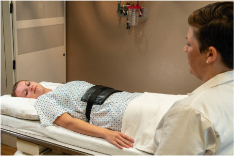
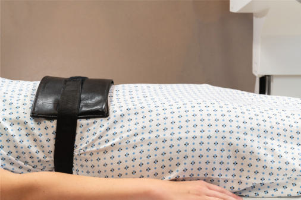
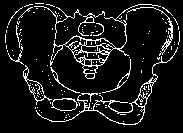
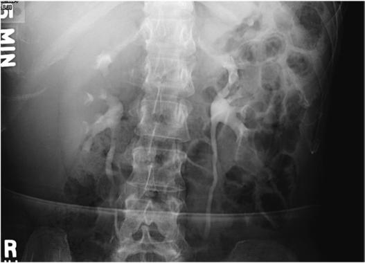

# Rx Urografie Intravenoasă (UIV) AP (Antero-Posterior) (Compresie Ureterală)

  📷 Radiografie Convențională (Rx)
  <strong>Actualizat:</strong> 2026-09-15
  <strong>Autor:</strong> Departamentul de Radiologie / Referință Bontrager

---

-   __1. Rezumat Clinic & Indicații__

    ---

    === "Indicații Clinice"

        - Pielonefrită și alte afecțiuni care implică sistemul colector renal

    === "Ghid Național IRIS"

        !!! info "Referință Primară: Ghidul Național IRIS (Ordinul MS 1342/2012)"
            - **Capitol Ghid IRIS:** *Aparat digestiv & Abdomen*
            - **Grad de Recomandare:** **Grad B**
            - **Nivel de Iradiere Estimată:** `Clasa 2 (Foarte mică ~ 0.7 - 1.2 mSv)`

            [:octicons-search-16: Deschide Ghidul IRIS](../../iris.md){ .md-button .md-button--primary } [:material-open-in-new: Aplicația Oficială PWA](https://radiologie-pediatrica.ro/iris/){ .md-button target="_blank" rel="noopener" }

-   __2. Poziționare & Centrare Fascicul__

    ---

    - **Poziție Pacient:** Pacient: se poziționează pacientul în decubit dorsal, cu dispozitivul de compresie montat (Fig. 14.82 și 14.83).; Regiune anatomică: se aliniază planul mediosagital cu linia mediană a mesei sau a grilei fizice și cu raza centrală. Se flectează și se sprijină genunchii. Se poziționează brațele la distanță de corp. Se așază marginea superioară a pelotelor de compresie la nivelul crestei iliace (corespunzător L4-L5). Marginile interne ale pelotelor trebuie aproape să se atingă, imediat lateral de coloana vertebrală, de fiecare parte. (Astfel, presiunea maximă se exercită asupra regiunii ureterelor, situate imediat lateral de coloana lombară și medial de articulațiile sacroiliace [SI].)
    - **Punct de Centrare Fascicul:** Este perpendiculară pe receptorul de imagine. Se centrează la jumătatea distanței dintre apendicele xifoid și creasta iliacă (corespunzător L4-L5).
    - **Distanță Focar-Film (DFF / SID):** 100 cm
    - **Comandă Respiratorie:** Apnee pe durata expunerii, după expir, și efectuați expunerea.

-   __3. Parametri Tehnici Expunere__

    ---

    | Parametru Tehnic | Valoare Configurare Generator / Tub |
    |:-----------------|:-------------------------------------|
    | **Tensiune Tub (kV)** | 80-85 kV |
    | **Sarcină / Produs Curent-Timp (mAs)** | DE CONFIGURAT PE APARAT |
    | **Distanță Focar-Film (DFF / SID)** | 100 cm |
    | **Grilă Antidifuzoare (Bucky)** | Cu grilă antidifuzoare Bucky |
    | **Dimensiune Focar** | Focar Mic (0.6 mm) |
    | **Camere de Ionizare AEC** | Camerele laterale (sau camera centrală, în funcție de regiune) |
    | **Colimare Fascicul** | Colimați pe cele patru laturi la anatomia de interes. |
    | **Filtrare Tub** | Totală ≥ 2.5 mm Al echivalent |

-   __4. Criterii de Calitate & Reușită Imagine__

    ---

    - Se vizualizează întregul aparat urinar, cu umplere pielocaliceală accentuată (Fig. 14.84). Poziție:
    - Absența rotației anatomice: clavicule echidistante față de linia apofizelor spinoase, evidențiată prin simetria aripilor iliace și/sau a coloanei lombare.
    - Colimare corectă. Expunere:
    - Nu se evidențiază mișcare datorată respirației sau deplasării pacientului.
    - Expunere optimă a receptorului de imagine și contrast optim pentru vizualizarea aparatului urinar. Fig. 14.82 AP—Aplicarea compresiei ureterale. spină iliacă antero-superioară (SIAS) spină iliacă antero-superioară (SIAS) Fig. 14.83 Compresie ureterală, cu pelotele umflate poziționate corect. Imagine inserată, pelotele situate medial de spina iliacă antero-superioară (SIAS). Fig. 14.84 AP, compresie ureterală, imagine la 5 minute. Urografie Intravenoasă (UIV)—IVU SPECIALĂ
    - AP Compresie Ureterală

-   __5. Protecție Radiologică (ALARA)__

    ---

    - Ecranare gonadică și a organelor radiosensibile conform procedurilor locale de radioprotecție ALARA.
    - Colimare strictă la aria de interes pentru limitarea radiației difuze.
    - Verificarea posibilității unei sarcini la pacientele de vârstă fertilă înainte de expunere.

!!! note "Observații Clinice & Tehnice"
    Imediat după injectarea substanței de contrast, pelotele se umflă și rămân pe poziție până când radiologul indică eliberarea lor. Succesiunea imaginilor se stabilește conform protocolului departamentului sau de către radiolog.

### 🖼️ Imagini

<figure class="protocol-image-card" markdown>

<figcaption><strong>Fig. 14.82 AP—Aplicarea compresiei ureterale.</strong> — Poziționare pacient conform Ghidului Bontrager (Fig. 14.82 AP—Aplicarea compresiei ureterale.)</figcaption>

</figure>

<figure class="protocol-image-card" markdown>

<figcaption><strong>Fig. 14.83 Compresie ureterală, cu pelotele umflate poziționate</strong> — Aspect radiografic de referință conform Ghidului Bontrager (Fig. 14.83 Compresie ureterală, cu pelotele umflate poziționate)</figcaption>

</figure>

<figure class="protocol-image-card" markdown>

<figcaption><strong>Fig. 14.84 AP, Compresie Ureterală, 5-</strong> — Aspect radiografic de referință conform Ghidului Bontrager (Fig. 14.84 AP, compresie ureterală, 5-)</figcaption>

</figure>

<figure class="protocol-image-card" markdown>

<figcaption><strong>Figura 4</strong> — Aspect radiografic de referință conform Ghidului Bontrager (Figura 4)</figcaption>

</figure>

=== "Ghid Rapid de Execuție"

    1. **Identificarea și verificarea pacientului:** verificare identitate, zonă de examinat, consimțământ conform procedurii și evaluarea posibilității unei sarcini, când este relevantă.
    2. **Pregătire:** îndepărtarea oricăror obiecte radiopace (bijuterii, agrafe, fermoare, proteze, pansamente dense).
    3. **Poziționare precisă:** alinierea receptorului de imagine și a tubului la distanța prescrisă (100 cm).
    4. **Colimare strictă:** adaptarea fasciculului strict la regiunea de diagnostic pentru scăderea iradierii și reducerea radiației difuze.
    5. **Radioprotecție:** verificarea [politicii RX](../radioprotectie.md), cu măsuri distincte pentru pacient, personal și însoțitor.

## Surse de documentare

- [Bontrager's Textbook of Radiographic Positioning (Ed. 9/10), Pagina 584](https://www.elsevier.com/books/textbook-of-radiographic-positioning-and-related-anatomy/lampignano/978-0-323-65367-1)
