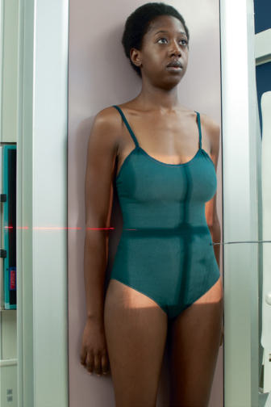
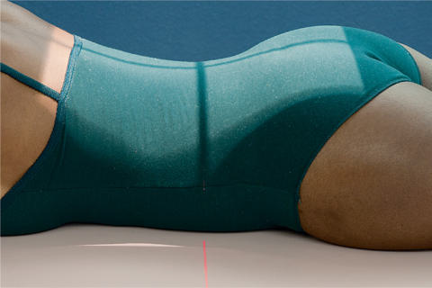
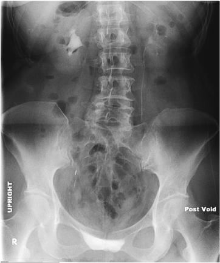

# Rx Urografie Intravenoasă (UIV) AP (Antero-Posterior) (Post-Micțional)

  📷 Radiografie Convențională (Rx)
  <strong>Actualizat:</strong> 2026-09-15
  <strong>Autor:</strong> Departamentul de Radiologie / Referință Bontrager

---

-   __1. Rezumat Clinic & Indicații__

    ---

    === "Indicații Clinice"

        - Position may demonstrate enlarged prostate (possible BPH) or prolapse of the bladder. The Ortostatism position demonstrates nephroptosis (abnormal positional change of kidneys).

    === "Ghid Național IRIS"

        !!! info "Referință Primară: Ghidul Național IRIS (Ordinul MS 1342/2012)"
            - **Capitol Ghid IRIS:** *Ghidul Național IRIS*
            - **Grad de Recomandare:** **De verificat pe indicație; fără grad atribuit automat**
            - **Nivel de Iradiere Estimată:** `De verificat pentru examinarea și populația selectate`

            [:octicons-search-16: Deschide Ghidul IRIS](../../iris.md){ .md-button .md-button--primary } [:material-open-in-new: Aplicația Oficială PWA](https://radiologie-pediatrica.ro/iris/){ .md-button target="_blank" rel="noopener" }
-   __2. Poziționare & Centrare Fascicul__

    ---

    - **Poziție Pacient:** Pacient: Patient is Ortostatism, with back against the table, or in Decubit Ventral position (Figs. 14.79 and 14.80).; Regiune anatomică: Align midsagittal plane to center of table, physical grid, or IR, with Absența rotației anatomice: clavicule echidistante față de linia apofizelor spinoase. Position arms away from the body. Ensure that the simfiza pubiană is included on bottom of the IR. Center low enough to include the prostate area, especially on older men.
    - **Punct de Centrare Fascicul:** Direct Raza centrală (RC) perpendiculară pe receptorul de imagine. Center to level of creasta iliacă (corespunzător L4-L5) and midsagittal plane or, for bariatric patients, 1 inch (2.5 cm) lower to ensure that the bladder area is included.
    - **Distanță Focar-Film (DFF / SID):** 100 cm
    - **Comandă Respiratorie:** Suspend respiration after expiration and expose. Alternative PA or AP Decubit This image also may be taken as a PA or Incidență Antero-Posterioară (AP) in the Decubit position, with centering similar to that described earlier. Post-voi d Urografie Intravenoasă (UIV)—IVU ROUTINE AP (scout and series) Nephrogram RPO and LPO (30°) AP—Post-Micțional Ortostatism or Decubit Fig. 14.79 AP Ortostatism (Post-Micțional). Center at creasta iliacă (corespunzător L4-L5) to include the simfiza pubiană. Fig. 14.80 Alternative—PA Decubit Ventral (Post-Micțional).

-   __3. Parametri Tehnici Expunere__

    ---

    | Parametru Tehnic | Valoare Configurare Generator / Tub |
    |:-----------------|:-------------------------------------|
    | **Tensiune Tub (kV)** | 80-85 kV |
    | **Sarcină / Produs Curent-Timp (mAs)** | DE CONFIGURAT PE APARAT |
    | **Distanță Focar-Film (DFF / SID)** | 100 cm |
    | **Grilă Antidifuzoare (Bucky)** | Cu grilă antidifuzoare Bucky |
    | **Dimensiune Focar** | Focar Mic (0.6 mm) |
    | **Camere de Ionizare AEC** | Camerele laterale (sau camera centrală funcție de regiune) |
    | **Colimare Fascicul** | Collimate on four sides to anatomy of interest. |
    | **Filtrare Tub** | Totală ≥ 2.5 mm Al echivalent |

-   __4. Criterii de Calitate & Reușită Imagine__

    ---

    - Entire urinary system is included, with only residual contrast medium visible (Fig. 14.81).
    - All of simfiza pubiană (including prostate area on males) is included on radiograph. Position:
    - Absența rotației anatomice: clavicule echidistante față de linia apofizelor spinoase is evident by symmetry of iliac wings.
    - Proper collimation applied. Exposure:
    - no motion due to respiration or motion is evident.
    - Optimal image receptor exposure and contrast to demonstrate residual contrast medium in the urinary system. Markers:
    - Ortostatism and/or Post-Micțional markers and R or L markers are visible. Fig. 14.81 AP Ortostatism (Post-Micțional)—prolapse of bladder.

-   __5. Protecție Radiologică (ALARA)__

    ---

    - Ecranare gonadică și a organelor radiosensibile conform procedurilor locale de radioprotecție ALARA.
    - Colimare strictă la aria de interes pentru limitarea radiației difuze.
    - Verificarea posibilității unei sarcini la pacientele de vârstă fertilă înainte de expunere.

### 🖼️ Imagini

<figure class="protocol-image-card" markdown>

<figcaption><strong>Fig. 14.79 AP Ortostatism (Post-Micțional). Center at creasta iliacă (corespunzător L4-L5) to include the</strong> — Poziționare pacient conform Ghidului Bontrager (Fig. 14.79 AP erect (postvoid). Center at iliac crest to include the)</figcaption>

</figure>

<figure class="protocol-image-card" markdown>

<figcaption><strong>Fig. 14.80 Alternative—PA Decubit Ventral (Post-Micțional).</strong> — Aspect radiografic de referință conform Ghidului Bontrager (Fig. 14.80 Alternative—PA prone (postvoid).)</figcaption>

</figure>

<figure class="protocol-image-card" markdown>

<figcaption><strong>Fig. 14.81 AP Ortostatism (Post-Micțional)—prolapse of bladder.</strong> — Aspect radiografic de referință conform Ghidului Bontrager (Fig. 14.81 AP erect (postvoid)—prolapse of bladder.)</figcaption>

</figure>

=== "Ghid Rapid de Execuție"

    1. **Identificarea și verificarea pacientului:** verificare identitate, zonă de examinat, consimțământ conform procedurii și evaluarea posibilității unei sarcini, când este relevantă.
    2. **Pregătire:** îndepărtarea oricăror obiecte radiopace (bijuterii, agrafe, fermoare, proteze, pansamente dense).
    3. **Poziționare precisă:** alinierea receptorului de imagine și a tubului la distanța prescrisă (100 cm).
    4. **Colimare strictă:** adaptarea fasciculului strict la regiunea de diagnostic pentru scăderea iradierii și reducerea radiației difuze.
    5. **Radioprotecție:** verificarea [politicii RX](../radioprotectie.md), cu măsuri distincte pentru pacient, personal și însoțitor.

## Surse de documentare

- [Bontrager's Textbook of Radiographic Positioning (Ed. 9/10), Pagina 583](https://www.elsevier.com/books/textbook-of-radiographic-positioning-and-related-anatomy/lampignano/978-0-323-65367-1)
