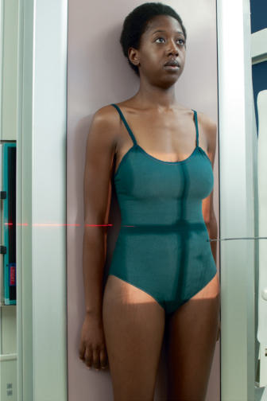
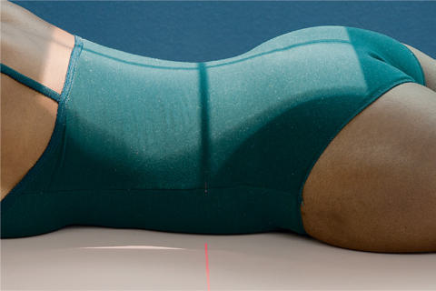
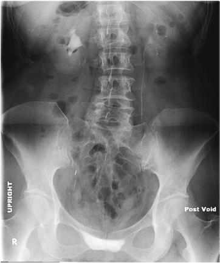

# Rx Urografie Intravenoasă (UIV) AP (Antero-Posterior) (Post-Micțional)

  📷 Radiografie Convențională (Rx)
  <strong>Actualizat:</strong> 2026-09-15
  <strong>Autor:</strong> Departamentul de Radiologie / Referință Bontrager

---

-   __1. Rezumat Clinic & Indicații__

    ---

    === "Indicații Clinice"

        - Poziția poate evidenția o prostată mărită (posibilă BPH) sau prolapsul vezicii urinare. Poziția în ortostatism evidențiază nefroptoza (modificare anormală a poziției rinichilor).

    === "Ghid Național IRIS"

        !!! info "Referință Primară: Ghidul Național IRIS (Ordinul MS 1342/2012)"
            - **Capitol Ghid IRIS:** *Ghidul Național IRIS*
            - **Grad de Recomandare:** **De verificat pe indicație; fără grad atribuit automat**
            - **Nivel de Iradiere Estimată:** `De verificat pentru examinarea și populația selectate`

            [:octicons-search-16: Deschide Ghidul IRIS](../../iris.md){ .md-button .md-button--primary } [:material-open-in-new: Aplicația Oficială PWA](https://radiologie-pediatrica.ro/iris/){ .md-button target="_blank" rel="noopener" }
-   __2. Poziționare & Centrare Fascicul__

    ---

    - **Poziție Pacient:** Pacient: pacientul este în ortostatism, cu spatele la / sprijinit de masă, sau în decubit ventral (Fig. 14.79 și 14.80).; Regiune anatomică: se aliniază planul mediosagital cu centrul mesei, al grilei fizice sau al receptorului de imagine, cu absența rotației anatomice: clavicule echidistante față de linia apofizelor spinoase. Se poziționează brațele la distanță de corp. Se verifică includerea simfizei pubiene la partea inferioară a receptorului de imagine. Se centrează suficient de jos pentru a include regiunea prostatei, în special la bărbații vârstnici.
    - **Punct de Centrare Fascicul:** Se direcționează raza centrală (RC) perpendicular pe receptorul de imagine. Se centrează la nivelul crestei iliace (corespunzător L4-L5) și al planului mediosagital sau, pentru pacienții bariatrici, cu 1 țol (2.5 cm) mai jos, pentru a asigura includerea regiunii vezicii urinare.
    - **Distanță Focar-Film (DFF / SID):** 100 cm
    - **Comandă Respiratorie:** Apnee pe durata expunerii, după expir, și se efectuează expunerea. Alternativă PA sau AP în decubit. Această imagine poate fi obținută și în incidență PA sau antero-posterioară (AP), în decubit, cu o centrare similară celei descrise anterior. Postmicțional. Urografie Intravenoasă (UIV)—IVU DE RUTINĂ AP (imagine preliminară și serie) Nefrogramă RPO și LPO (30°) AP—Postmicțional în ortostatism sau în decubit. Fig. 14.79 AP în ortostatism (postmicțional). Se centrează la nivelul crestei iliace (corespunzător L4-L5) pentru a include simfiza pubiană. Fig. 14.80 Alternativă—PA în decubit ventral (postmicțional).

-   __3. Parametri Tehnici Expunere__

    ---

    | Parametru Tehnic | Valoare Configurare Generator / Tub |
    |:-----------------|:-------------------------------------|
    | **Tensiune Tub (kV)** | 80-85 kV |
    | **Sarcină / Produs Curent-Timp (mAs)** | DE CONFIGURAT PE APARAT |
    | **Distanță Focar-Film (DFF / SID)** | 100 cm |
    | **Grilă Antidifuzoare (Bucky)** | Cu grilă antidifuzoare Bucky |
    | **Dimensiune Focar** | Focar Mic (0.6 mm) |
    | **Camere de Ionizare AEC** | Camerele laterale (sau camera centrală, în funcție de regiune) |
    | **Colimare Fascicul** | Colimați pe cele patru laturi la anatomia de interes. |
    | **Filtrare Tub** | Totală ≥ 2.5 mm Al echivalent |

-   __4. Criterii de Calitate & Reușită Imagine__

    ---

    - Este inclus întregul aparat urinar, fiind vizibilă numai substanța de contrast reziduală (Fig. 14.81).
    - Întreaga simfiză pubiană (inclusiv regiunea prostatei la bărbați) este inclusă pe radiografie. Poziție:
    - Absența rotației anatomice: clavicule echidistante față de linia apofizelor spinoase, evidențiată prin simetria aripilor iliace.
    - Colimare corectă. Expunere:
    - Nu se evidențiază mișcare datorată respirației sau deplasării pacientului.
    - Expunere optimă a receptorului de imagine și contrast optim pentru evidențierea substanței de contrast reziduale în aparatul urinar. Markeri:
    - Sunt vizibili markerii de ortostatism și/sau postmicțional și markerii R sau L. Fig. 14.81 AP în ortostatism (postmicțional)—prolaps al vezicii urinare.

-   __5. Protecție Radiologică (ALARA)__

    ---

    - Ecranare gonadică și a organelor radiosensibile conform procedurilor locale de radioprotecție ALARA.
    - Colimare strictă la aria de interes pentru limitarea radiației difuze.
    - Verificarea posibilității unei sarcini la pacientele de vârstă fertilă înainte de expunere.

### 🖼️ Imagini

<figure class="protocol-image-card" markdown>

<figcaption><strong>Fig. 14.79 AP în ortostatism (postmicțional). Se centrează la nivelul crestei iliace (corespunzător L4-L5) pentru a include</strong> — Poziționare pacient conform Ghidului Bontrager (Fig. 14.79 AP în ortostatism (postmicțional). Se centrează la nivelul crestelor iliace pentru a include)</figcaption>

</figure>

<figure class="protocol-image-card" markdown>

<figcaption><strong>Fig. 14.80 Alternativă—PA în decubit ventral (postmicțional).</strong> — Aspect radiografic de referință conform Ghidului Bontrager (Fig. 14.80 Alternativă—PA în decubit ventral (postmicțional).)</figcaption>

</figure>

<figure class="protocol-image-card" markdown>

<figcaption><strong>Fig. 14.81 AP în ortostatism (postmicțional)—prolaps al vezicii urinare.</strong> — Aspect radiografic de referință conform Ghidului Bontrager (Fig. 14.81 AP în ortostatism (postmicțional)—prolaps al vezicii urinare.)</figcaption>

</figure>

=== "Ghid Rapid de Execuție"

    1. **Identificarea și verificarea pacientului:** verificare identitate, zonă de examinat, consimțământ conform procedurii și evaluarea posibilității unei sarcini, când este relevantă.
    2. **Pregătire:** îndepărtarea oricăror obiecte radiopace (bijuterii, agrafe, fermoare, proteze, pansamente dense).
    3. **Poziționare precisă:** alinierea receptorului de imagine și a tubului la distanța prescrisă (100 cm).
    4. **Colimare strictă:** adaptarea fasciculului strict la regiunea de diagnostic pentru scăderea iradierii și reducerea radiației difuze.
    5. **Radioprotecție:** verificarea [politicii RX](../radioprotectie.md), cu măsuri distincte pentru pacient, personal și însoțitor.

## Surse de documentare

- [Bontrager's Textbook of Radiographic Positioning (Ed. 9/10), Pagina 583](https://www.elsevier.com/books/textbook-of-radiographic-positioning-and-related-anatomy/lampignano/978-0-323-65367-1)
