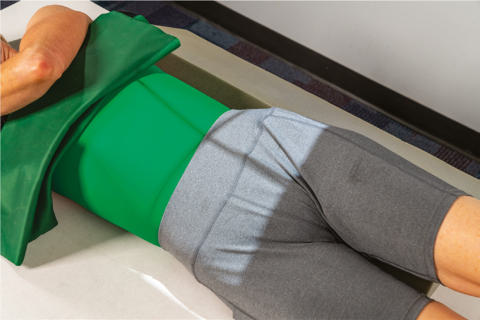
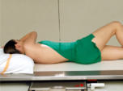
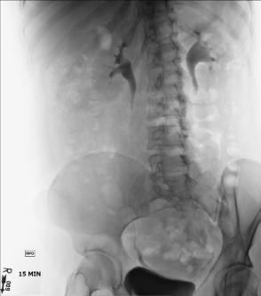
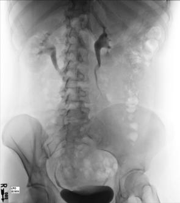

# Rx Urografie Intravenoasă (UIV) RPO AND LPO POSITIONS

  📷 Radiografie Convențională (Rx)
  <strong>Actualizat:</strong> 2026-09-15
  <strong>Autor:</strong> Departamentul de Radiologie / Referință Bontrager

---

-   __1. Rezumat Clinic & Indicații__

    ---

    === "Indicații Clinice"

        - semne de infecție respiratorie (pneumonie, bronhopneumonie), traumatism acuttism / Regim Urgență, and obstruction of the elevated kidney are manifested.
        - traumatism acuttism / Regim Urgență or obstruction of the downside ureter.

    === "Ghid Național IRIS"

        !!! info "Referință Primară: Ghidul Național IRIS (Ordinul MS 1342/2012)"
            - **Capitol Ghid IRIS:** *Ghidul Național IRIS*
            - **Grad de Recomandare:** **De verificat pe indicație; fără grad atribuit automat**
            - **Nivel de Iradiere Estimată:** `De verificat pentru examinarea și populația selectate`

            [:octicons-search-16: Deschide Ghidul IRIS](../../iris.md){ .md-button .md-button--primary } [:material-open-in-new: Aplicația Oficială PWA](https://radiologie-pediatrica.ro/iris/){ .md-button target="_blank" rel="noopener" }
-   __2. Poziționare & Centrare Fascicul__

    ---

    - **Poziție Pacient:** Pacient: The patient is Decubit Dorsal and is partially rotated toward the right or left side.; Regiune anatomică: Rotate body 30° for both R and L posterior oblique positions (Fig. 14.76). Flex elevatedside Genunchi for support of lower body. Raise arm on elevated side and place across upper Torace. Center vertebral column to midline of table or physical grid and to CR.
    - **Punct de Centrare Fascicul:** is perpendicular to IR. Center CR and IR to level of creasta iliacă (corespunzător L4-L5) and vertebral column.
    - **Distanță Focar-Film (DFF / SID):** 100 cm
    - **Comandă Respiratorie:** Suspend respiration after expiration and expose.

-   __3. Parametri Tehnici Expunere__

    ---

    | Parametru Tehnic | Valoare Configurare Generator / Tub |
    |:-----------------|:-------------------------------------|
    | **Tensiune Tub (kV)** | 80-85 kV |
    | **Sarcină / Produs Curent-Timp (mAs)** | DE CONFIGURAT PE APARAT |
    | **Distanță Focar-Film (DFF / SID)** | 100 cm |
    | **Grilă Antidifuzoare (Bucky)** | Cu grilă antidifuzoare Bucky |
    | **Dimensiune Focar** | Focar Mic (0.6 mm) |
    | **Camere de Ionizare AEC** | Camerele laterale (sau camera centrală funcție de regiune) |
    | **Colimare Fascicul** | applied. Exposure: no motion due to respiration or movement is evident. Optimal image receptor exposure and contrast to visualize the urinary system. Markers: Minute markers and R or L markers should be visible. Right ureter (best demonstrated) Right kidney Left kidney (elevated side) Left ureter Fig. 14.77 RPO IVU. Right ureter Right kidney (elevated side) Left kidney Left ureter (best demonstrated) Fig. 14.78 LPO IVU. Urografie Intravenoasă (UIV)—IVU BASIC AP (scout and series) Nephrogram RPO and LPO (30°) AP—Post-Micțional Ortostatism or Decubit |
    | **Filtrare Tub** | Totală ≥ 2.5 mm Al echivalent |

-   __4. Criterii de Calitate & Reușită Imagine__

    ---

    - The kidney on elevated side is placed in profile or parallel to the IR and is best demonstrated with each oblique.
    - The downside ureter is projected away from the spine, providing an unobstructed view of this ureter (Figs. 14.77 and 14.78). Position:
    - No excessive obliquity is evident.
    - The elevated kidney is parallel to the plane of IR and is not projected into the vertebral bodies of the Coloană Lombară.
    - Complete arch of simfiza pubiană is visible on bottom margin of radiograph and the kidneys are included at the upper margin.
    - Proper

-   __5. Protecție Radiologică (ALARA)__

    ---

    - Ecranare gonadică și a organelor radiosensibile conform procedurilor locale de radioprotecție ALARA.
    - Colimare strictă la aria de interes pentru limitarea radiației difuze.
    - Verificarea posibilității unei sarcini la pacientele de vârstă fertilă înainte de expunere.

!!! note "Observații Clinice & Tehnice"
    Some department routines include a smaller IR placed landscape to include the kidneys and proximal ureters. Centering then would be midway between the xiphoid process and creasta iliacă (corespunzător L4-L5)s. Fig. 14.76 RPO, 30°. Inset, 30° LPO.

### 🖼️ Imagini

<figure class="protocol-image-card" markdown>

<figcaption><strong>Fig. 14.76 RPO, 30°. Inset, 30° LPO.</strong> — Poziționare pacient conform Ghidului Bontrager (Fig. 14.76 RPO, 30°. Inset, 30° LPO.)</figcaption>

</figure>

<figure class="protocol-image-card" markdown>

<figcaption><strong>Fig. 14.77 RPO IVU.</strong> — Aspect radiografic de referință conform Ghidului Bontrager (Fig. 14.77 RPO IVU.)</figcaption>

</figure>

<figure class="protocol-image-card" markdown>

<figcaption><strong>Fig. 14.78 LPO IVU.</strong> — Aspect radiografic de referință conform Ghidului Bontrager (Fig. 14.78 LPO IVU.)</figcaption>

</figure>

<figure class="protocol-image-card" markdown>

<figcaption><strong>Figura 4</strong> — Aspect radiografic de referință conform Ghidului Bontrager (Figura 4)</figcaption>

</figure>

=== "Ghid Rapid de Execuție"

    1. **Identificarea și verificarea pacientului:** verificare identitate, zonă de examinat, consimțământ conform procedurii și evaluarea posibilității unei sarcini, când este relevantă.
    2. **Pregătire:** îndepărtarea oricăror obiecte radiopace (bijuterii, agrafe, fermoare, proteze, pansamente dense).
    3. **Poziționare precisă:** alinierea receptorului de imagine și a tubului la distanța prescrisă (100 cm).
    4. **Colimare strictă:** adaptarea fasciculului strict la regiunea de diagnostic pentru scăderea iradierii și reducerea radiației difuze.
    5. **Radioprotecție:** verificarea [politicii RX](../radioprotectie.md), cu măsuri distincte pentru pacient, personal și însoțitor.

## Surse de documentare

- [Bontrager's Textbook of Radiographic Positioning (Ed. 9/10), Pagina 582](https://www.elsevier.com/books/textbook-of-radiographic-positioning-and-related-anatomy/lampignano/978-0-323-65367-1)
