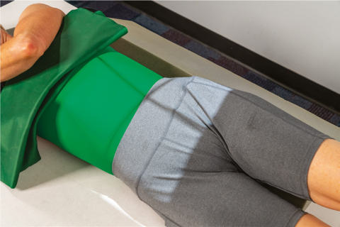
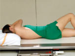
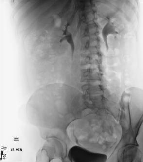
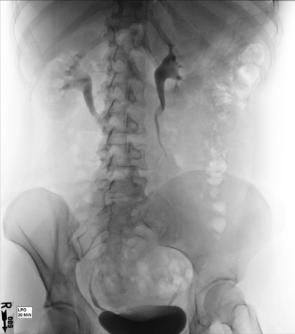

# Rx Urografie Intravenoasă (UIV) RPO ȘI Oblică Posterioară Stângă (OPS / LPO)S

  📷 Radiografie Convențională (Rx)
  <strong>Actualizat:</strong> 2026-09-15
  <strong>Autor:</strong> Departamentul de Radiologie / Referință Bontrager

---

-   __1. Rezumat Clinic & Indicații__

    ---

    === "Indicații Clinice"

        - Sunt evidențiate semne de infecție respiratorie (pneumonie, bronhopneumonie), traumatism acut / regim de urgență și obstrucția rinichiului de pe partea ridicată.
        - Traumatism acut / regim de urgență sau obstrucția ureterului de pe partea declivă.

    === "Ghid Național IRIS"

        !!! info "Referință Primară: Ghidul Național IRIS (Ordinul MS 1342/2012)"
            - **Capitol Ghid IRIS:** *Ghidul Național IRIS*
            - **Grad de Recomandare:** **De verificat pe indicație; fără grad atribuit automat**
            - **Nivel de Iradiere Estimată:** `De verificat pentru examinarea și populația selectate`

            [:octicons-search-16: Deschide Ghidul IRIS](../../iris.md){ .md-button .md-button--primary } [:material-open-in-new: Aplicația Oficială PWA](https://radiologie-pediatrica.ro/iris/){ .md-button target="_blank" rel="noopener" }
-   __2. Poziționare & Centrare Fascicul__

    ---

    - **Poziție Pacient:** Pacient: pacientul este în decubit dorsal și este rotit parțial spre partea dreaptă sau stângă.; Regiune anatomică: Rotiți corpul la 30° pentru ambele poziții oblice posterioare R și L (Fig. 14.76). Flectați genunchiul de pe partea ridicată pentru a susține partea inferioară a corpului. Ridicați brațul de pe partea ridicată și așezați-l peste partea superioară a toracelui. Centrați coloana vertebrală pe linia mediană a mesei sau a grilei fizice și pe raza centrală.
    - **Punct de Centrare Fascicul:** este perpendicular pe receptorul de imagine. Centrați raza centrală și receptorul de imagine la nivelul crestei iliace (corespunzător L4-L5) și al coloanei vertebrale.
    - **Distanță Focar-Film (DFF / SID):** 100 cm
    - **Comandă Respiratorie:** Apnee pe durata expunerii, după expir, și efectuați expunerea.

-   __3. Parametri Tehnici Expunere__

    ---

    | Parametru Tehnic | Valoare Configurare Generator / Tub |
    |:-----------------|:-------------------------------------|
    | **Tensiune Tub (kV)** | 80-85 kV |
    | **Sarcină / Produs Curent-Timp (mAs)** | DE CONFIGURAT PE APARAT |
    | **Distanță Focar-Film (DFF / SID)** | 100 cm |
    | **Grilă Antidifuzoare (Bucky)** | Cu grilă antidifuzoare Bucky |
    | **Dimensiune Focar** | Focar Mic (0.6 mm) |
    | **Camere de Ionizare AEC** | Camerele laterale (sau camera centrală, în funcție de regiune) |
    | **Colimare Fascicul** | aplicat. Expunere: nu se evidențiază mișcare cauzată de respirație sau de deplasare. Expunere optimă a receptorului de imagine și contrast optim pentru vizualizarea sistemului urinar. Markeri: markerii de minute și markerii R sau L trebuie să fie vizibili. Ureter drept (cel mai bine evidențiat) Rinichi drept Rinichi stâng (partea ridicată) Ureter stâng Fig. 14.77 RPO IVU. Ureter drept Rinichi drept (partea ridicată) Rinichi stâng Ureter stâng (cel mai bine evidențiat) Fig. 14.78 LPO IVU. Urografie Intravenoasă (UIV)—IVU DE BAZĂ AP (radiografie preliminară și serie) Nefrogramă RPO și LPO (30°) AP—Postmicțional în ortostatism sau decubit |
    | **Filtrare Tub** | Totală ≥ 2.5 mm Al echivalent |

-   __4. Criterii de Calitate & Reușită Imagine__

    ---

    - Rinichiul de pe partea ridicată este poziționat în profil sau paralel cu receptorul de imagine (RI) și este cel mai bine evidențiat în fiecare incidență oblică.
    - Ureterul de pe partea declivă se proiectează la distanță de coloana vertebrală, permițând vizualizarea acestuia fără suprapuneri (Fig. 14.77 și 14.78). Poziție:
    - Nu se evidențiază o oblicitate excesivă.
    - Rinichiul de pe partea ridicată este paralel cu planul receptorului de imagine și nu se proiectează peste corpurile vertebrale ale coloanei lombare.
    - Întregul arc al simfizei pubiene este vizibil la marginea inferioară a radiografiei, iar rinichii sunt incluși la marginea superioară.
    - corect

-   __5. Protecție Radiologică (ALARA)__

    ---

    - Ecranare gonadică și a organelor radiosensibile conform procedurilor locale de radioprotecție ALARA.
    - Colimare strictă la aria de interes pentru limitarea radiației difuze.
    - Verificarea posibilității unei sarcini la pacientele de vârstă fertilă înainte de expunere.

!!! note "Observații Clinice & Tehnice"
    Unele protocoale ale departamentului includ un receptor de imagine mai mic, plasat transversal pentru a include rinichii și porțiunile proximale ale ureterelor. Centrarea se face atunci la jumătatea distanței dintre apendicele xifoid și crestele iliace (corespunzător L4-L5). Fig. 14.76 RPO, 30°. Imagine inserată, 30° LPO.

### 🖼️ Imagini

<figure class="protocol-image-card" markdown>

<figcaption><strong>Fig. 14.76 RPO, 30°. Imagine inserată, 30° LPO.</strong> — Poziționare pacient conform Ghidului Bontrager (Fig. 14.76 RPO, 30°. Imagine inserată, 30° LPO.)</figcaption>

</figure>

<figure class="protocol-image-card" markdown>

<figcaption><strong>Fig. 14.77 RPO IVU.</strong> — Aspect radiografic de referință conform Ghidului Bontrager (Fig. 14.77 RPO IVU.)</figcaption>

</figure>

<figure class="protocol-image-card" markdown>

<figcaption><strong>Fig. 14.78 LPO IVU.</strong> — Aspect radiografic de referință conform Ghidului Bontrager (Fig. 14.78 LPO IVU.)</figcaption>

</figure>

<figure class="protocol-image-card" markdown>

<figcaption><strong>Figura 4</strong> — Aspect radiografic de referință conform Ghidului Bontrager (Figura 4)</figcaption>

</figure>

=== "Ghid Rapid de Execuție"

    1. **Identificarea și verificarea pacientului:** verificare identitate, zonă de examinat, consimțământ conform procedurii și evaluarea posibilității unei sarcini, când este relevantă.
    2. **Pregătire:** îndepărtarea oricăror obiecte radiopace (bijuterii, agrafe, fermoare, proteze, pansamente dense).
    3. **Poziționare precisă:** alinierea receptorului de imagine și a tubului la distanța prescrisă (100 cm).
    4. **Colimare strictă:** adaptarea fasciculului strict la regiunea de diagnostic pentru scăderea iradierii și reducerea radiației difuze.
    5. **Radioprotecție:** verificarea [politicii RX](../radioprotectie.md), cu măsuri distincte pentru pacient, personal și însoțitor.

## Surse de documentare

- [Bontrager's Textbook of Radiographic Positioning (Ed. 9/10), Pagina 582](https://www.elsevier.com/books/textbook-of-radiographic-positioning-and-related-anatomy/lampignano/978-0-323-65367-1)
